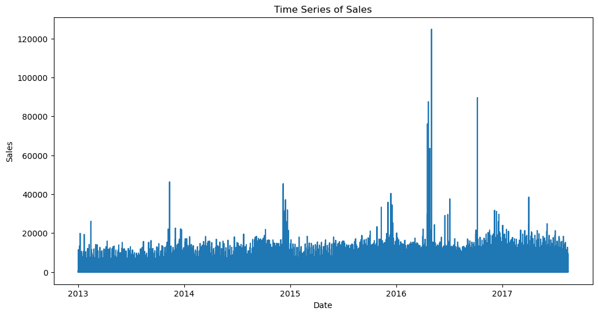
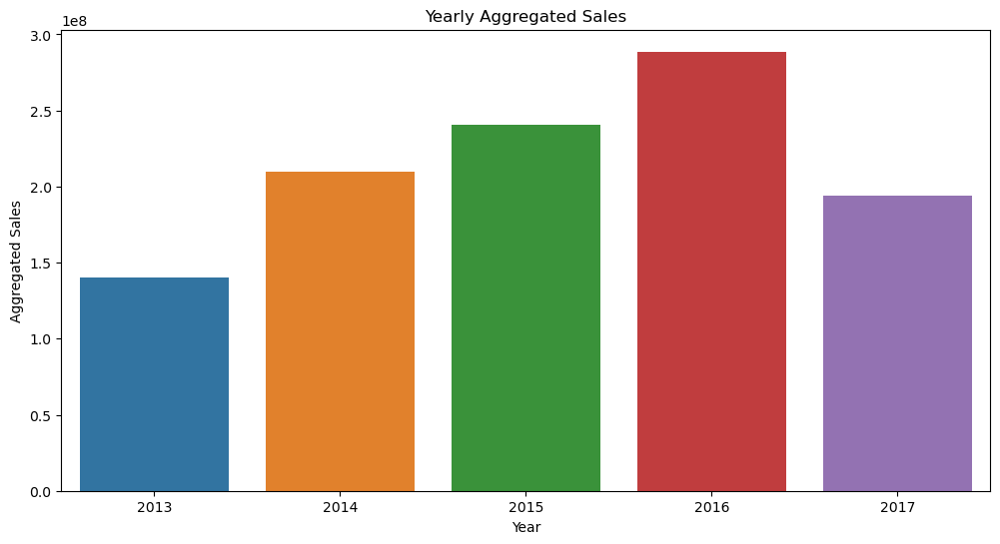
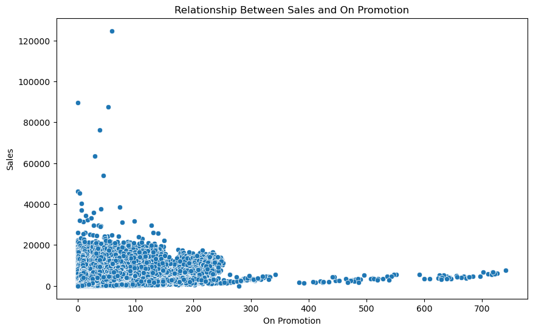
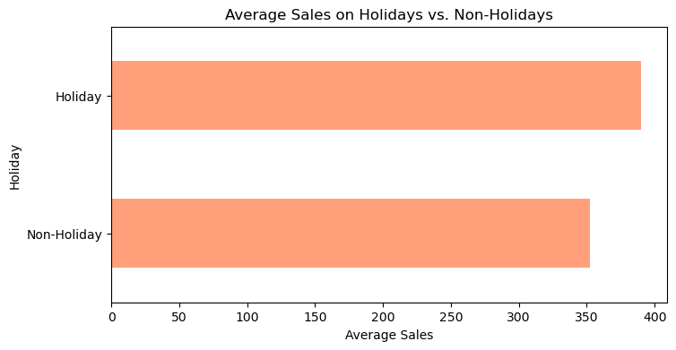
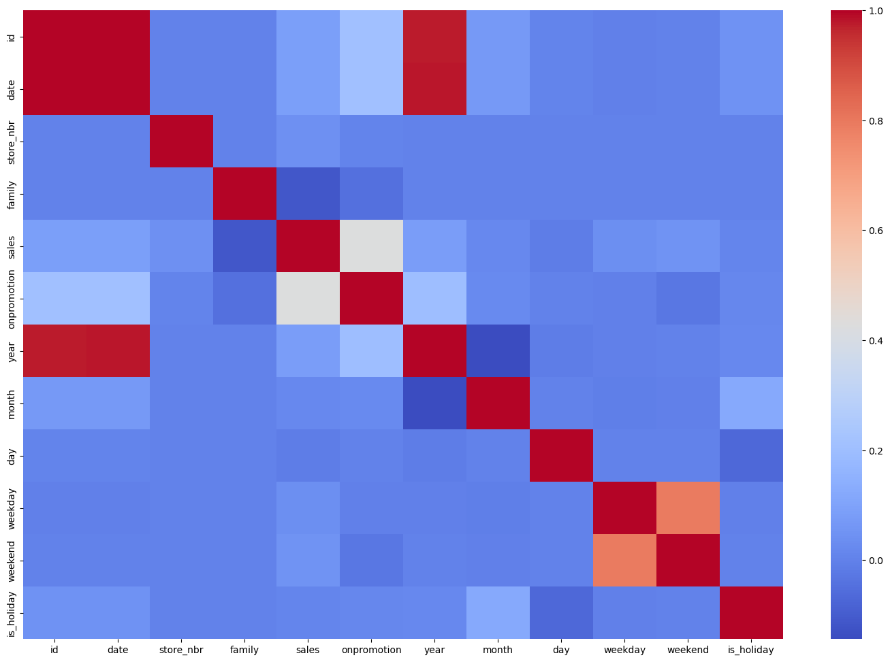

```python
import numpy as np
import pandas as pd
```


```python
df_train = pd.read_csv('/Users/linhnguyen/Downloads/store-sales-time-series-forecasting/train.csv')
df_test = pd.read_csv('/Users/linhnguyen/Downloads/store-sales-time-series-forecasting/test.csv')
df_stores = pd.read_csv('/Users/linhnguyen/Downloads/store-sales-time-series-forecasting/stores.csv')
df_oil = pd.read_csv('/Users/linhnguyen/Downloads/store-sales-time-series-forecasting/oil.csv')
df_holidays = pd.read_csv('/Users/linhnguyen/Downloads/store-sales-time-series-forecasting/holidays_events.csv')
df_transactions = pd.read_csv('/Users/linhnguyen/Downloads/store-sales-time-series-forecasting/transactions.csv')
results = pd.read_csv('/Users/linhnguyen/Downloads/store-sales-time-series-forecasting/sample_submission.csv')
```


```python
df_train.head()
```


<div>
<style scoped>
    .dataframe tbody tr th:only-of-type {
        vertical-align: middle;
    }

    .dataframe tbody tr th {
        vertical-align: top;
    }

    .dataframe thead th {
        text-align: right;
    }
</style>
<table border="1" class="dataframe">
  <thead>
    <tr style="text-align: right;">
      <th></th>
      <th>id</th>
      <th>date</th>
      <th>store_nbr</th>
      <th>family</th>
      <th>sales</th>
      <th>onpromotion</th>
    </tr>
  </thead>
  <tbody>
    <tr>
      <th>0</th>
      <td>0</td>
      <td>2013-01-01</td>
      <td>1</td>
      <td>AUTOMOTIVE</td>
      <td>0.0</td>
      <td>0</td>
    </tr>
    <tr>
      <th>1</th>
      <td>1</td>
      <td>2013-01-01</td>
      <td>1</td>
      <td>BABY CARE</td>
      <td>0.0</td>
      <td>0</td>
    </tr>
    <tr>
      <th>2</th>
      <td>2</td>
      <td>2013-01-01</td>
      <td>1</td>
      <td>BEAUTY</td>
      <td>0.0</td>
      <td>0</td>
    </tr>
    <tr>
      <th>3</th>
      <td>3</td>
      <td>2013-01-01</td>
      <td>1</td>
      <td>BEVERAGES</td>
      <td>0.0</td>
      <td>0</td>
    </tr>
    <tr>
      <th>4</th>
      <td>4</td>
      <td>2013-01-01</td>
      <td>1</td>
      <td>BOOKS</td>
      <td>0.0</td>
      <td>0</td>
    </tr>
  </tbody>
</table>
</div>


```python
df_test.head()
```


<div>
<style scoped>
    .dataframe tbody tr th:only-of-type {
        vertical-align: middle;
    }

    .dataframe tbody tr th {
        vertical-align: top;
    }

    .dataframe thead th {
        text-align: right;
    }
</style>
<table border="1" class="dataframe">
  <thead>
    <tr style="text-align: right;">
      <th></th>
      <th>id</th>
      <th>date</th>
      <th>store_nbr</th>
      <th>family</th>
      <th>onpromotion</th>
    </tr>
  </thead>
  <tbody>
    <tr>
      <th>0</th>
      <td>3000888</td>
      <td>2017-08-16</td>
      <td>1</td>
      <td>AUTOMOTIVE</td>
      <td>0</td>
    </tr>
    <tr>
      <th>1</th>
      <td>3000889</td>
      <td>2017-08-16</td>
      <td>1</td>
      <td>BABY CARE</td>
      <td>0</td>
    </tr>
    <tr>
      <th>2</th>
      <td>3000890</td>
      <td>2017-08-16</td>
      <td>1</td>
      <td>BEAUTY</td>
      <td>2</td>
    </tr>
    <tr>
      <th>3</th>
      <td>3000891</td>
      <td>2017-08-16</td>
      <td>1</td>
      <td>BEVERAGES</td>
      <td>20</td>
    </tr>
    <tr>
      <th>4</th>
      <td>3000892</td>
      <td>2017-08-16</td>
      <td>1</td>
      <td>BOOKS</td>
      <td>0</td>
    </tr>
  </tbody>
</table>
</div>


```python
df_train.isnull().sum()
```


    id             0
    date           0
    store_nbr      0
    family         0
    sales          0
    onpromotion    0
    dtype: int64


```python
df_train.shape
```


    (3000888, 6)


```python
df_test.shape
```


    (28512, 5)


```python
df_train.info()
```

    <class 'pandas.core.frame.DataFrame'>
    RangeIndex: 3000888 entries, 0 to 3000887
    Data columns (total 6 columns):
     #   Column       Dtype  
    ---  ------       -----  
     0   id           int64  
     1   date         object 
     2   store_nbr    int64  
     3   family       object 
     4   sales        float64
     5   onpromotion  int64  
    dtypes: float64(1), int64(3), object(2)
    memory usage: 137.4+ MB


```python
df_train['date']=pd.to_datetime(df_train['date'])
df_test['date']=pd.to_datetime(df_test['date'])
```


```python
df_train['year']=df_train['date'].dt.year
df_train['month']=df_train['date'].dt.month
df_train['day']=df_train['date'].dt.day
df_train['weekday']=df_train['date'].dt.dayofweek
df_train['weekend']=df_train['weekday'].isin([5,6]).astype(int)

df_test['year']=df_test['date'].dt.year
df_test['month']=df_test['date'].dt.month
df_test['day']=df_test['date'].dt.day
df_test['weekday']=df_test['date'].dt.dayofweek
df_test['weekend']=df_test['weekday'].isin([5,6]).astype(int)
```


```python
import matplotlib.pyplot as plt
import seaborn as sns

# Plot the time series of sales
plt.figure(figsize=(12, 6))
plt.plot(df_train['date'], df_train['sales'])
plt.title('Time Series of Sales')
plt.xlabel('Date')
plt.ylabel('Sales')
plt.show()
```


    

    


```python
# Group the data by year and visualize aggregated sales
df_yearly = df_train.groupby(df_train['date'].dt.year)['sales'].sum().reset_index()

plt.figure(figsize=(12, 6))
sns.barplot(x='date', y='sales', data=df_yearly)
plt.title('Yearly Aggregated Sales')
plt.xlabel('Year')
plt.ylabel('Aggregated Sales')
plt.show()
```


    

    


```python
# Explore the relationship between sales and 'onpromotion'
plt.figure(figsize=(10, 6))
sns.scatterplot(x='onpromotion', y='sales', data=df_train)
plt.title('Relationship Between Sales and On Promotion')
plt.xlabel('On Promotion')
plt.ylabel('Sales')
plt.show()
```


    

    


```python
# Visualize the impact of holidays on sales
plt.figure(figsize=(8, 4))

# Create 'is_holiday' column
df_train['is_holiday'] = df_train['date'].isin(df_holidays['date']).astype(int)
df_test['is_holiday'] = df_t['date'].isin(df_holidays['date']).astype(int)

df_train.groupby('is_holiday')['sales'].mean().plot(kind='barh', color='lightsalmon')
plt.title('Average Sales on Holidays vs. Non-Holidays')
plt.yticks([0, 1], ['Non-Holiday', 'Holiday'], rotation=0)
plt.ylabel('Holiday')
plt.xlabel('Average Sales')
plt.show()
```


    

    


```python
from sklearn.preprocessing import LabelEncoder
labelencoder = LabelEncoder()
for col in df_train.columns:
    if df_train[col].dtypes=='object':
        df_train[col]=labelencoder.fit_transform(df_train[col])
        
for col_name in df_test.columns:
    if df_test[col_name].dtypes=='object':
        df_test[col_name]=labelencoder.fit_transform(df_test[col_name])
```


```python
df_train.head()
```


<div>
<style scoped>
    .dataframe tbody tr th:only-of-type {
        vertical-align: middle;
    }

    .dataframe tbody tr th {
        vertical-align: top;
    }

    .dataframe thead th {
        text-align: right;
    }
</style>
<table border="1" class="dataframe">
  <thead>
    <tr style="text-align: right;">
      <th></th>
      <th>id</th>
      <th>date</th>
      <th>store_nbr</th>
      <th>family</th>
      <th>sales</th>
      <th>onpromotion</th>
      <th>year</th>
      <th>month</th>
      <th>day</th>
      <th>weekday</th>
      <th>weekend</th>
      <th>is_holiday</th>
    </tr>
  </thead>
  <tbody>
    <tr>
      <th>0</th>
      <td>0</td>
      <td>2013-01-01</td>
      <td>1</td>
      <td>0</td>
      <td>0.0</td>
      <td>0</td>
      <td>2013</td>
      <td>1</td>
      <td>1</td>
      <td>1</td>
      <td>0</td>
      <td>1</td>
    </tr>
    <tr>
      <th>1</th>
      <td>1</td>
      <td>2013-01-01</td>
      <td>1</td>
      <td>1</td>
      <td>0.0</td>
      <td>0</td>
      <td>2013</td>
      <td>1</td>
      <td>1</td>
      <td>1</td>
      <td>0</td>
      <td>1</td>
    </tr>
    <tr>
      <th>2</th>
      <td>2</td>
      <td>2013-01-01</td>
      <td>1</td>
      <td>2</td>
      <td>0.0</td>
      <td>0</td>
      <td>2013</td>
      <td>1</td>
      <td>1</td>
      <td>1</td>
      <td>0</td>
      <td>1</td>
    </tr>
    <tr>
      <th>3</th>
      <td>3</td>
      <td>2013-01-01</td>
      <td>1</td>
      <td>3</td>
      <td>0.0</td>
      <td>0</td>
      <td>2013</td>
      <td>1</td>
      <td>1</td>
      <td>1</td>
      <td>0</td>
      <td>1</td>
    </tr>
    <tr>
      <th>4</th>
      <td>4</td>
      <td>2013-01-01</td>
      <td>1</td>
      <td>4</td>
      <td>0.0</td>
      <td>0</td>
      <td>2013</td>
      <td>1</td>
      <td>1</td>
      <td>1</td>
      <td>0</td>
      <td>1</td>
    </tr>
  </tbody>
</table>
</div>


```python
df_test.head()
```


<div>
<style scoped>
    .dataframe tbody tr th:only-of-type {
        vertical-align: middle;
    }

    .dataframe tbody tr th {
        vertical-align: top;
    }

    .dataframe thead th {
        text-align: right;
    }
</style>
<table border="1" class="dataframe">
  <thead>
    <tr style="text-align: right;">
      <th></th>
      <th>id</th>
      <th>date</th>
      <th>store_nbr</th>
      <th>family</th>
      <th>onpromotion</th>
      <th>year</th>
      <th>month</th>
      <th>day</th>
      <th>weekday</th>
      <th>weekend</th>
      <th>is_holiday</th>
    </tr>
  </thead>
  <tbody>
    <tr>
      <th>0</th>
      <td>3000888</td>
      <td>2017-08-16</td>
      <td>1</td>
      <td>0</td>
      <td>0</td>
      <td>2017</td>
      <td>8</td>
      <td>16</td>
      <td>2</td>
      <td>0</td>
      <td>0</td>
    </tr>
    <tr>
      <th>1</th>
      <td>3000889</td>
      <td>2017-08-16</td>
      <td>1</td>
      <td>1</td>
      <td>0</td>
      <td>2017</td>
      <td>8</td>
      <td>16</td>
      <td>2</td>
      <td>0</td>
      <td>0</td>
    </tr>
    <tr>
      <th>2</th>
      <td>3000890</td>
      <td>2017-08-16</td>
      <td>1</td>
      <td>2</td>
      <td>2</td>
      <td>2017</td>
      <td>8</td>
      <td>16</td>
      <td>2</td>
      <td>0</td>
      <td>0</td>
    </tr>
    <tr>
      <th>3</th>
      <td>3000891</td>
      <td>2017-08-16</td>
      <td>1</td>
      <td>3</td>
      <td>20</td>
      <td>2017</td>
      <td>8</td>
      <td>16</td>
      <td>2</td>
      <td>0</td>
      <td>0</td>
    </tr>
    <tr>
      <th>4</th>
      <td>3000892</td>
      <td>2017-08-16</td>
      <td>1</td>
      <td>4</td>
      <td>0</td>
      <td>2017</td>
      <td>8</td>
      <td>16</td>
      <td>2</td>
      <td>0</td>
      <td>0</td>
    </tr>
  </tbody>
</table>
</div>


```python
plt.figure(figsize=(18,12))
sns.heatmap(df_train.corr(),cmap='coolwarm')
```


    <Axes: >


    

    


```python
X_train = df_train.drop(['id','sales','date'],axis=1)
y_train = df_train['sales']

X_test = df_test.drop(['id','date'],axis=1)
y_test = results['sales']
print(X_train.shape)
print(y_train.shape)
print(X_test.shape)
print(y_test.shape)
```

    (3000888, 9)
    (3000888,)
    (28512, 9)
    (28512,)


```python
from sklearn.preprocessing import StandardScaler
sc = StandardScaler()
X_train = sc.fit_transform(X_train)
X_test = sc.transform(X_test)
print(X_train.shape)
print(X_test.shape)
```

    (3000888, 9)
    (28512, 9)


```python
import lightgbm as lgb
from sklearn.model_selection import train_test_split, GridSearchCV
from sklearn.metrics import mean_squared_error  # Import mean_squared_error

param_grid = {
    'n_estimators': [50, 100, 200],
    'learning_rate': [0.05, 0.1, 0.2],
    'num_leaves': [31, 50, 100],
    'subsample': [0.8, 1.0],
    'colsample_bytree': [0.8, 1.0],
    'min_child_samples': [20, 40, 60]
}

lgbr = lgb.LGBMRegressor()

# Use mean_squared_error as the scoring metric
grid_search = GridSearchCV(estimator=lgbr, param_grid=param_grid, cv=3, scoring='neg_mean_squared_error')

grid_search.fit(X_train, y_train)

print("Best Parameters:", grid_search.best_params_)
```

    /Users/linhnguyen/anaconda3/lib/python3.11/site-packages/dask/dataframe/_pyarrow_compat.py:23: UserWarning: You are using pyarrow version 11.0.0 which is known to be insecure. See https://www.cve.org/CVERecord?id=CVE-2023-47248 for further details. Please upgrade to pyarrow>=14.0.1 or install pyarrow-hotfix to patch your current version.
      warnings.warn(


    [LightGBM] [Info] Auto-choosing row-wise multi-threading, the overhead of testing was 0.023033 seconds.
    You can set `force_row_wise=true` to remove the overhead.
    And if memory is not enough, you can set `force_col_wise=true`.
    [LightGBM] [Info] Total Bins 389
    [LightGBM] [Info] Number of data points in the train set: 2000592, number of used features: 9
    [LightGBM] [Info] Start training from score 415.778624
    [LightGBM] [Info] Auto-choosing row-wise multi-threading, the overhead of testing was 0.027155 seconds.
    You can set `force_row_wise=true` to remove the overhead.
    And if memory is not enough, you can set `force_col_wise=true`.
    [LightGBM] [Info] Total Bins 355
    [LightGBM] [Info] Number of data points in the train set: 2000592, number of used features: 9
    [LightGBM] [Info] Start training from score 350.547691
    [LightGBM] [Info] Auto-choosing row-wise multi-threading, the overhead of testing was 0.026943 seconds.
    You can set `force_row_wise=true` to remove the overhead.
    And if memory is not enough, you can set `force_col_wise=true`.
    [LightGBM] [Info] Total Bins 304
    [LightGBM] [Info] Number of data points in the train set: 2000592, number of used features: 9
    [LightGBM] [Info] Start training from score 307.000932
    [LightGBM] [Info] Auto-choosing row-wise multi-threading, the overhead of testing was 0.026996 seconds.
    You can set `force_row_wise=true` to remove the overhead.
    And if memory is not enough, you can set `force_col_wise=true`.
    [LightGBM] [Info] Total Bins 389
    [LightGBM] [Info] Number of data points in the train set: 2000592, number of used features: 9
    [LightGBM] [Info] Start training from score 415.778624
    [LightGBM] [Info] Auto-choosing row-wise multi-threading, the overhead of testing was 0.027623 seconds.
    You can set `force_row_wise=true` to remove the overhead.
    And if memory is not enough, you can set `force_col_wise=true`.
    [LightGBM] [Info] Total Bins 355
    [LightGBM] [Info] Number of data points in the train set: 2000592, number of used features: 9
    [LightGBM] [Info] Start training from score 350.547691
    [LightGBM] [Info] Auto-choosing row-wise multi-threading, the overhead of testing was 0.027159 seconds.
    You can set `force_row_wise=true` to remove the overhead.
    And if memory is not enough, you can set `force_col_wise=true`.
    [LightGBM] [Info] Total Bins 304
    [LightGBM] [Info] Number of data points in the train set: 2000592, number of used features: 9
    [LightGBM] [Info] Start training from score 307.000932
    [LightGBM] [Info] Auto-choosing row-wise multi-threading, the overhead of testing was 0.022104 seconds.
    You can set `force_row_wise=true` to remove the overhead.
    And if memory is not enough, you can set `force_col_wise=true`.
    [LightGBM] [Info] Total Bins 389
    [LightGBM] [Info] Number of data points in the train set: 2000592, number of used features: 9
    [LightGBM] [Info] Start training from score 415.778624
    [LightGBM] [Info] Auto-choosing row-wise multi-threading, the overhead of testing was 0.029632 seconds.
    You can set `force_row_wise=true` to remove the overhead.
    And if memory is not enough, you can set `force_col_wise=true`.
    [LightGBM] [Info] Total Bins 355
    [LightGBM] [Info] Number of data points in the train set: 2000592, number of used features: 9
    [LightGBM] [Info] Start training from score 350.547691
    [LightGBM] [Info] Auto-choosing row-wise multi-threading, the overhead of testing was 0.026979 seconds.
    You can set `force_row_wise=true` to remove the overhead.
    And if memory is not enough, you can set `force_col_wise=true`.
    [LightGBM] [Info] Total Bins 304
    [LightGBM] [Info] Number of data points in the train set: 2000592, number of used features: 9
    [LightGBM] [Info] Start training from score 307.000932
    [LightGBM] [Info] Auto-choosing row-wise multi-threading, the overhead of testing was 0.022595 seconds.
    You can set `force_row_wise=true` to remove the overhead.
    And if memory is not enough, you can set `force_col_wise=true`.
    [LightGBM] [Info] Total Bins 389
    [LightGBM] [Info] Number of data points in the train set: 2000592, number of used features: 9
    [LightGBM] [Info] Start training from score 415.778624
    [LightGBM] [Info] Auto-choosing row-wise multi-threading, the overhead of testing was 0.025499 seconds.
    You can set `force_row_wise=true` to remove the overhead.
    And if memory is not enough, you can set `force_col_wise=true`.
    [LightGBM] [Info] Total Bins 355
    [LightGBM] [Info] Number of data points in the train set: 2000592, number of used features: 9
    [LightGBM] [Info] Start training from score 350.547691
    [LightGBM] [Info] Auto-choosing row-wise multi-threading, the overhead of testing was 0.025028 seconds.
    You can set `force_row_wise=true` to remove the overhead.
    And if memory is not enough, you can set `force_col_wise=true`.
    [LightGBM] [Info] Total Bins 304
    [LightGBM] [Info] Number of data points in the train set: 2000592, number of used features: 9
    [LightGBM] [Info] Start training from score 307.000932
    [LightGBM] [Info] Auto-choosing row-wise multi-threading, the overhead of testing was 0.021773 seconds.
    You can set `force_row_wise=true` to remove the overhead.
    And if memory is not enough, you can set `force_col_wise=true`.
    [LightGBM] [Info] Total Bins 389
    [LightGBM] [Info] Number of data points in the train set: 2000592, number of used features: 9
    [LightGBM] [Info] Start training from score 415.778624
    [LightGBM] [Info] Auto-choosing row-wise multi-threading, the overhead of testing was 0.026212 seconds.
    You can set `force_row_wise=true` to remove the overhead.
    And if memory is not enough, you can set `force_col_wise=true`.
    [LightGBM] [Info] Total Bins 355
    [LightGBM] [Info] Number of data points in the train set: 2000592, number of used features: 9
    [LightGBM] [Info] Start training from score 350.547691
    [LightGBM] [Info] Auto-choosing row-wise multi-threading, the overhead of testing was 0.025660 seconds.
    You can set `force_row_wise=true` to remove the overhead.
    And if memory is not enough, you can set `force_col_wise=true`.
    [LightGBM] [Info] Total Bins 304
    [LightGBM] [Info] Number of data points in the train set: 2000592, number of used features: 9
    [LightGBM] [Info] Start training from score 307.000932
    [LightGBM] [Info] Auto-choosing row-wise multi-threading, the overhead of testing was 0.023302 seconds.
    You can set `force_row_wise=true` to remove the overhead.
    And if memory is not enough, you can set `force_col_wise=true`.
    [LightGBM] [Info] Total Bins 389
    [LightGBM] [Info] Number of data points in the train set: 2000592, number of used features: 9
    [LightGBM] [Info] Start training from score 415.778624
    [LightGBM] [Info] Auto-choosing row-wise multi-threading, the overhead of testing was 0.027881 seconds.
    You can set `force_row_wise=true` to remove the overhead.
    And if memory is not enough, you can set `force_col_wise=true`.
    [LightGBM] [Info] Total Bins 355
    [LightGBM] [Info] Number of data points in the train set: 2000592, number of used features: 9
    [LightGBM] [Info] Start training from score 350.547691
    [LightGBM] [Info] Auto-choosing row-wise multi-threading, the overhead of testing was 0.025757 seconds.
    You can set `force_row_wise=true` to remove the overhead.
    And if memory is not enough, you can set `force_col_wise=true`.
    [LightGBM] [Info] Total Bins 304
    [LightGBM] [Info] Number of data points in the train set: 2000592, number of used features: 9
    [LightGBM] [Info] Start training from score 307.000932
    [LightGBM] [Info] Auto-choosing row-wise multi-threading, the overhead of testing was 0.030201 seconds.
    You can set `force_row_wise=true` to remove the overhead.
    And if memory is not enough, you can set `force_col_wise=true`.
    [LightGBM] [Info] Total Bins 389
    [LightGBM] [Info] Number of data points in the train set: 2000592, number of used features: 9
    [LightGBM] [Info] Start training from score 415.778624
    [LightGBM] [Info] Auto-choosing row-wise multi-threading, the overhead of testing was 0.026220 seconds.
    You can set `force_row_wise=true` to remove the overhead.
    And if memory is not enough, you can set `force_col_wise=true`.
    [LightGBM] [Info] Total Bins 355
    [LightGBM] [Info] Number of data points in the train set: 2000592, number of used features: 9
    [LightGBM] [Info] Start training from score 350.547691
    [LightGBM] [Info] Auto-choosing row-wise multi-threading, the overhead of testing was 0.026465 seconds.
    You can set `force_row_wise=true` to remove the overhead.
    And if memory is not enough, you can set `force_col_wise=true`.
    [LightGBM] [Info] Total Bins 304
    [LightGBM] [Info] Number of data points in the train set: 2000592, number of used features: 9
    [LightGBM] [Info] Start training from score 307.000932
    [LightGBM] [Info] Auto-choosing row-wise multi-threading, the overhead of testing was 0.024751 seconds.
    You can set `force_row_wise=true` to remove the overhead.
    And if memory is not enough, you can set `force_col_wise=true`.
    [LightGBM] [Info] Total Bins 389
    [LightGBM] [Info] Number of data points in the train set: 2000592, number of used features: 9
    [LightGBM] [Info] Start training from score 415.778624
    [LightGBM] [Info] Auto-choosing row-wise multi-threading, the overhead of testing was 0.027889 seconds.
    You can set `force_row_wise=true` to remove the overhead.
    And if memory is not enough, you can set `force_col_wise=true`.
    [LightGBM] [Info] Total Bins 355
    [LightGBM] [Info] Number of data points in the train set: 2000592, number of used features: 9
    [LightGBM] [Info] Start training from score 350.547691
    [LightGBM] [Info] Auto-choosing row-wise multi-threading, the overhead of testing was 0.022348 seconds.
    You can set `force_row_wise=true` to remove the overhead.
    And if memory is not enough, you can set `force_col_wise=true`.
    [LightGBM] [Info] Total Bins 304
    [LightGBM] [Info] Number of data points in the train set: 2000592, number of used features: 9
    [LightGBM] [Info] Start training from score 307.000932
    [LightGBM] [Info] Auto-choosing row-wise multi-threading, the overhead of testing was 0.029760 seconds.
    You can set `force_row_wise=true` to remove the overhead.
    And if memory is not enough, you can set `force_col_wise=true`.
    [LightGBM] [Info] Total Bins 389
    [LightGBM] [Info] Number of data points in the train set: 2000592, number of used features: 9
    [LightGBM] [Info] Start training from score 415.778624
    [LightGBM] [Info] Auto-choosing row-wise multi-threading, the overhead of testing was 0.026418 seconds.
    You can set `force_row_wise=true` to remove the overhead.
    And if memory is not enough, you can set `force_col_wise=true`.
    [LightGBM] [Info] Total Bins 355
    [LightGBM] [Info] Number of data points in the train set: 2000592, number of used features: 9
    [LightGBM] [Info] Start training from score 350.547691
    [LightGBM] [Info] Auto-choosing row-wise multi-threading, the overhead of testing was 0.024926 seconds.
    You can set `force_row_wise=true` to remove the overhead.
    And if memory is not enough, you can set `force_col_wise=true`.
    [LightGBM] [Info] Total Bins 304
    [LightGBM] [Info] Number of data points in the train set: 2000592, number of used features: 9
    [LightGBM] [Info] Start training from score 307.000932
    [LightGBM] [Info] Auto-choosing row-wise multi-threading, the overhead of testing was 0.025251 seconds.
    You can set `force_row_wise=true` to remove the overhead.
    And if memory is not enough, you can set `force_col_wise=true`.
    [LightGBM] [Info] Total Bins 389
    [LightGBM] [Info] Number of data points in the train set: 2000592, number of used features: 9
    [LightGBM] [Info] Start training from score 415.778624
    [LightGBM] [Info] Auto-choosing row-wise multi-threading, the overhead of testing was 0.026727 seconds.
    You can set `force_row_wise=true` to remove the overhead.
    And if memory is not enough, you can set `force_col_wise=true`.
    [LightGBM] [Info] Total Bins 355
    [LightGBM] [Info] Number of data points in the train set: 2000592, number of used features: 9
    [LightGBM] [Info] Start training from score 350.547691
    [LightGBM] [Info] Auto-choosing row-wise multi-threading, the overhead of testing was 0.028483 seconds.
    You can set `force_row_wise=true` to remove the overhead.
    And if memory is not enough, you can set `force_col_wise=true`.
    [LightGBM] [Info] Total Bins 304
    [LightGBM] [Info] Number of data points in the train set: 2000592, number of used features: 9
    [LightGBM] [Info] Start training from score 307.000932
    [LightGBM] [Info] Auto-choosing row-wise multi-threading, the overhead of testing was 0.022143 seconds.
    You can set `force_row_wise=true` to remove the overhead.
    And if memory is not enough, you can set `force_col_wise=true`.
    [LightGBM] [Info] Total Bins 389
    [LightGBM] [Info] Number of data points in the train set: 2000592, number of used features: 9
    [LightGBM] [Info] Start training from score 415.778624
    [LightGBM] [Info] Auto-choosing row-wise multi-threading, the overhead of testing was 0.025961 seconds.
    You can set `force_row_wise=true` to remove the overhead.
    And if memory is not enough, you can set `force_col_wise=true`.
    [LightGBM] [Info] Total Bins 355
    [LightGBM] [Info] Number of data points in the train set: 2000592, number of used features: 9
    [LightGBM] [Info] Start training from score 350.547691
    [LightGBM] [Info] Auto-choosing row-wise multi-threading, the overhead of testing was 0.025981 seconds.
    You can set `force_row_wise=true` to remove the overhead.
    And if memory is not enough, you can set `force_col_wise=true`.
    [LightGBM] [Info] Total Bins 304
    [LightGBM] [Info] Number of data points in the train set: 2000592, number of used features: 9
    [LightGBM] [Info] Start training from score 307.000932
    [LightGBM] [Info] Auto-choosing row-wise multi-threading, the overhead of testing was 0.024098 seconds.
    You can set `force_row_wise=true` to remove the overhead.
    And if memory is not enough, you can set `force_col_wise=true`.
    [LightGBM] [Info] Total Bins 389
    [LightGBM] [Info] Number of data points in the train set: 2000592, number of used features: 9
    [LightGBM] [Info] Start training from score 415.778624
    [LightGBM] [Info] Auto-choosing row-wise multi-threading, the overhead of testing was 0.026670 seconds.
    You can set `force_row_wise=true` to remove the overhead.
    And if memory is not enough, you can set `force_col_wise=true`.
    [LightGBM] [Info] Total Bins 355
    [LightGBM] [Info] Number of data points in the train set: 2000592, number of used features: 9
    [LightGBM] [Info] Start training from score 350.547691
    [LightGBM] [Info] Auto-choosing row-wise multi-threading, the overhead of testing was 0.026225 seconds.
    You can set `force_row_wise=true` to remove the overhead.
    And if memory is not enough, you can set `force_col_wise=true`.
    [LightGBM] [Info] Total Bins 304
    [LightGBM] [Info] Number of data points in the train set: 2000592, number of used features: 9
    [LightGBM] [Info] Start training from score 307.000932
    [LightGBM] [Info] Auto-choosing row-wise multi-threading, the overhead of testing was 0.026506 seconds.
    You can set `force_row_wise=true` to remove the overhead.
    And if memory is not enough, you can set `force_col_wise=true`.
    [LightGBM] [Info] Total Bins 389
    [LightGBM] [Info] Number of data points in the train set: 2000592, number of used features: 9
    [LightGBM] [Info] Start training from score 415.778624
    [LightGBM] [Info] Auto-choosing row-wise multi-threading, the overhead of testing was 0.027104 seconds.
    You can set `force_row_wise=true` to remove the overhead.
    And if memory is not enough, you can set `force_col_wise=true`.
    [LightGBM] [Info] Total Bins 355
    [LightGBM] [Info] Number of data points in the train set: 2000592, number of used features: 9
    [LightGBM] [Info] Start training from score 350.547691
    [LightGBM] [Info] Auto-choosing row-wise multi-threading, the overhead of testing was 0.023939 seconds.
    You can set `force_row_wise=true` to remove the overhead.
    And if memory is not enough, you can set `force_col_wise=true`.
    [LightGBM] [Info] Total Bins 304
    [LightGBM] [Info] Number of data points in the train set: 2000592, number of used features: 9
    [LightGBM] [Info] Start training from score 307.000932
    [LightGBM] [Info] Auto-choosing row-wise multi-threading, the overhead of testing was 0.025463 seconds.
    You can set `force_row_wise=true` to remove the overhead.
    And if memory is not enough, you can set `force_col_wise=true`.
    [LightGBM] [Info] Total Bins 389
    [LightGBM] [Info] Number of data points in the train set: 2000592, number of used features: 9
    [LightGBM] [Info] Start training from score 415.778624
    [LightGBM] [Info] Auto-choosing row-wise multi-threading, the overhead of testing was 0.027898 seconds.
    You can set `force_row_wise=true` to remove the overhead.
    And if memory is not enough, you can set `force_col_wise=true`.
    [LightGBM] [Info] Total Bins 355
    [LightGBM] [Info] Number of data points in the train set: 2000592, number of used features: 9
    [LightGBM] [Info] Start training from score 350.547691
    [LightGBM] [Info] Auto-choosing row-wise multi-threading, the overhead of testing was 0.027389 seconds.
    You can set `force_row_wise=true` to remove the overhead.
    And if memory is not enough, you can set `force_col_wise=true`.
    [LightGBM] [Info] Total Bins 304
    [LightGBM] [Info] Number of data points in the train set: 2000592, number of used features: 9
    [LightGBM] [Info] Start training from score 307.000932
    [LightGBM] [Info] Auto-choosing row-wise multi-threading, the overhead of testing was 0.024325 seconds.
    You can set `force_row_wise=true` to remove the overhead.
    And if memory is not enough, you can set `force_col_wise=true`.
    [LightGBM] [Info] Total Bins 389
    [LightGBM] [Info] Number of data points in the train set: 2000592, number of used features: 9
    [LightGBM] [Info] Start training from score 415.778624
    [LightGBM] [Info] Auto-choosing row-wise multi-threading, the overhead of testing was 0.028913 seconds.
    You can set `force_row_wise=true` to remove the overhead.
    And if memory is not enough, you can set `force_col_wise=true`.
    [LightGBM] [Info] Total Bins 355
    [LightGBM] [Info] Number of data points in the train set: 2000592, number of used features: 9
    [LightGBM] [Info] Start training from score 350.547691
    [LightGBM] [Info] Auto-choosing row-wise multi-threading, the overhead of testing was 0.026006 seconds.
    You can set `force_row_wise=true` to remove the overhead.
    And if memory is not enough, you can set `force_col_wise=true`.
    [LightGBM] [Info] Total Bins 304
    [LightGBM] [Info] Number of data points in the train set: 2000592, number of used features: 9
    [LightGBM] [Info] Start training from score 307.000932
    [LightGBM] [Info] Auto-choosing row-wise multi-threading, the overhead of testing was 0.028840 seconds.
    You can set `force_row_wise=true` to remove the overhead.
    And if memory is not enough, you can set `force_col_wise=true`.
    [LightGBM] [Info] Total Bins 389
    [LightGBM] [Info] Number of data points in the train set: 2000592, number of used features: 9
    [LightGBM] [Info] Start training from score 415.778624
    [LightGBM] [Info] Auto-choosing row-wise multi-threading, the overhead of testing was 0.033316 seconds.
    You can set `force_row_wise=true` to remove the overhead.
    And if memory is not enough, you can set `force_col_wise=true`.
    [LightGBM] [Info] Total Bins 355
    [LightGBM] [Info] Number of data points in the train set: 2000592, number of used features: 9
    [LightGBM] [Info] Start training from score 350.547691
    [LightGBM] [Info] Auto-choosing row-wise multi-threading, the overhead of testing was 0.027587 seconds.
    You can set `force_row_wise=true` to remove the overhead.
    And if memory is not enough, you can set `force_col_wise=true`.
    [LightGBM] [Info] Total Bins 304
    [LightGBM] [Info] Number of data points in the train set: 2000592, number of used features: 9
    [LightGBM] [Info] Start training from score 307.000932
    [LightGBM] [Info] Auto-choosing row-wise multi-threading, the overhead of testing was 0.025220 seconds.
    You can set `force_row_wise=true` to remove the overhead.
    And if memory is not enough, you can set `force_col_wise=true`.
    [LightGBM] [Info] Total Bins 389
    [LightGBM] [Info] Number of data points in the train set: 2000592, number of used features: 9
    [LightGBM] [Info] Start training from score 415.778624
    [LightGBM] [Info] Auto-choosing row-wise multi-threading, the overhead of testing was 0.030697 seconds.
    You can set `force_row_wise=true` to remove the overhead.
    And if memory is not enough, you can set `force_col_wise=true`.
    [LightGBM] [Info] Total Bins 355
    [LightGBM] [Info] Number of data points in the train set: 2000592, number of used features: 9
    [LightGBM] [Info] Start training from score 350.547691
    [LightGBM] [Info] Auto-choosing row-wise multi-threading, the overhead of testing was 0.029955 seconds.
    You can set `force_row_wise=true` to remove the overhead.
    And if memory is not enough, you can set `force_col_wise=true`.
    [LightGBM] [Info] Total Bins 304
    [LightGBM] [Info] Number of data points in the train set: 2000592, number of used features: 9
    [LightGBM] [Info] Start training from score 307.000932
    [LightGBM] [Info] Auto-choosing row-wise multi-threading, the overhead of testing was 0.024078 seconds.
    You can set `force_row_wise=true` to remove the overhead.
    And if memory is not enough, you can set `force_col_wise=true`.
    [LightGBM] [Info] Total Bins 389
    [LightGBM] [Info] Number of data points in the train set: 2000592, number of used features: 9
    [LightGBM] [Info] Start training from score 415.778624
    [LightGBM] [Info] Auto-choosing row-wise multi-threading, the overhead of testing was 0.029057 seconds.
    You can set `force_row_wise=true` to remove the overhead.
    And if memory is not enough, you can set `force_col_wise=true`.
    [LightGBM] [Info] Total Bins 355
    [LightGBM] [Info] Number of data points in the train set: 2000592, number of used features: 9
    [LightGBM] [Info] Start training from score 350.547691
    [LightGBM] [Info] Auto-choosing row-wise multi-threading, the overhead of testing was 0.027216 seconds.
    You can set `force_row_wise=true` to remove the overhead.
    And if memory is not enough, you can set `force_col_wise=true`.
    [LightGBM] [Info] Total Bins 304
    [LightGBM] [Info] Number of data points in the train set: 2000592, number of used features: 9
    [LightGBM] [Info] Start training from score 307.000932
    [LightGBM] [Info] Auto-choosing row-wise multi-threading, the overhead of testing was 0.023206 seconds.
    You can set `force_row_wise=true` to remove the overhead.
    And if memory is not enough, you can set `force_col_wise=true`.
    [LightGBM] [Info] Total Bins 389
    [LightGBM] [Info] Number of data points in the train set: 2000592, number of used features: 9
    [LightGBM] [Info] Start training from score 415.778624
    [LightGBM] [Info] Auto-choosing row-wise multi-threading, the overhead of testing was 0.028321 seconds.
    You can set `force_row_wise=true` to remove the overhead.
    And if memory is not enough, you can set `force_col_wise=true`.
    [LightGBM] [Info] Total Bins 355
    [LightGBM] [Info] Number of data points in the train set: 2000592, number of used features: 9
    [LightGBM] [Info] Start training from score 350.547691
    [LightGBM] [Info] Auto-choosing row-wise multi-threading, the overhead of testing was 0.025083 seconds.
    You can set `force_row_wise=true` to remove the overhead.
    And if memory is not enough, you can set `force_col_wise=true`.
    [LightGBM] [Info] Total Bins 304
    [LightGBM] [Info] Number of data points in the train set: 2000592, number of used features: 9
    [LightGBM] [Info] Start training from score 307.000932
    [LightGBM] [Info] Auto-choosing row-wise multi-threading, the overhead of testing was 0.024387 seconds.
    You can set `force_row_wise=true` to remove the overhead.
    And if memory is not enough, you can set `force_col_wise=true`.
    [LightGBM] [Info] Total Bins 389
    [LightGBM] [Info] Number of data points in the train set: 2000592, number of used features: 9
    [LightGBM] [Info] Start training from score 415.778624
    [LightGBM] [Info] Auto-choosing row-wise multi-threading, the overhead of testing was 0.027832 seconds.
    You can set `force_row_wise=true` to remove the overhead.
    And if memory is not enough, you can set `force_col_wise=true`.
    [LightGBM] [Info] Total Bins 355
    [LightGBM] [Info] Number of data points in the train set: 2000592, number of used features: 9
    [LightGBM] [Info] Start training from score 350.547691
    [LightGBM] [Info] Auto-choosing row-wise multi-threading, the overhead of testing was 0.026559 seconds.
    You can set `force_row_wise=true` to remove the overhead.
    And if memory is not enough, you can set `force_col_wise=true`.
    [LightGBM] [Info] Total Bins 304
    [LightGBM] [Info] Number of data points in the train set: 2000592, number of used features: 9
    [LightGBM] [Info] Start training from score 307.000932
    [LightGBM] [Info] Auto-choosing row-wise multi-threading, the overhead of testing was 0.024015 seconds.
    You can set `force_row_wise=true` to remove the overhead.
    And if memory is not enough, you can set `force_col_wise=true`.
    [LightGBM] [Info] Total Bins 389
    [LightGBM] [Info] Number of data points in the train set: 2000592, number of used features: 9
    [LightGBM] [Info] Start training from score 415.778624
    [LightGBM] [Info] Auto-choosing row-wise multi-threading, the overhead of testing was 0.026544 seconds.
    You can set `force_row_wise=true` to remove the overhead.
    And if memory is not enough, you can set `force_col_wise=true`.
    [LightGBM] [Info] Total Bins 355
    [LightGBM] [Info] Number of data points in the train set: 2000592, number of used features: 9
    [LightGBM] [Info] Start training from score 350.547691
    [LightGBM] [Info] Auto-choosing row-wise multi-threading, the overhead of testing was 0.029407 seconds.
    You can set `force_row_wise=true` to remove the overhead.
    And if memory is not enough, you can set `force_col_wise=true`.
    [LightGBM] [Info] Total Bins 304
    [LightGBM] [Info] Number of data points in the train set: 2000592, number of used features: 9
    [LightGBM] [Info] Start training from score 307.000932
    [LightGBM] [Info] Auto-choosing row-wise multi-threading, the overhead of testing was 0.023814 seconds.
    You can set `force_row_wise=true` to remove the overhead.
    And if memory is not enough, you can set `force_col_wise=true`.
    [LightGBM] [Info] Total Bins 389
    [LightGBM] [Info] Number of data points in the train set: 2000592, number of used features: 9
    [LightGBM] [Info] Start training from score 415.778624
    [LightGBM] [Info] Auto-choosing row-wise multi-threading, the overhead of testing was 0.029914 seconds.
    You can set `force_row_wise=true` to remove the overhead.
    And if memory is not enough, you can set `force_col_wise=true`.
    [LightGBM] [Info] Total Bins 355
    [LightGBM] [Info] Number of data points in the train set: 2000592, number of used features: 9
    [LightGBM] [Info] Start training from score 350.547691
    [LightGBM] [Info] Auto-choosing row-wise multi-threading, the overhead of testing was 0.025613 seconds.
    You can set `force_row_wise=true` to remove the overhead.
    And if memory is not enough, you can set `force_col_wise=true`.
    [LightGBM] [Info] Total Bins 304
    [LightGBM] [Info] Number of data points in the train set: 2000592, number of used features: 9
    [LightGBM] [Info] Start training from score 307.000932
    [LightGBM] [Info] Auto-choosing row-wise multi-threading, the overhead of testing was 0.026970 seconds.
    You can set `force_row_wise=true` to remove the overhead.
    And if memory is not enough, you can set `force_col_wise=true`.
    [LightGBM] [Info] Total Bins 389
    [LightGBM] [Info] Number of data points in the train set: 2000592, number of used features: 9
    [LightGBM] [Info] Start training from score 415.778624
    [LightGBM] [Info] Auto-choosing row-wise multi-threading, the overhead of testing was 0.029516 seconds.
    You can set `force_row_wise=true` to remove the overhead.
    And if memory is not enough, you can set `force_col_wise=true`.
    [LightGBM] [Info] Total Bins 355
    [LightGBM] [Info] Number of data points in the train set: 2000592, number of used features: 9
    [LightGBM] [Info] Start training from score 350.547691
    [LightGBM] [Info] Auto-choosing row-wise multi-threading, the overhead of testing was 0.027233 seconds.
    You can set `force_row_wise=true` to remove the overhead.
    And if memory is not enough, you can set `force_col_wise=true`.
    [LightGBM] [Info] Total Bins 304
    [LightGBM] [Info] Number of data points in the train set: 2000592, number of used features: 9
    [LightGBM] [Info] Start training from score 307.000932
    [LightGBM] [Info] Auto-choosing row-wise multi-threading, the overhead of testing was 0.027102 seconds.
    You can set `force_row_wise=true` to remove the overhead.
    And if memory is not enough, you can set `force_col_wise=true`.
    [LightGBM] [Info] Total Bins 389
    [LightGBM] [Info] Number of data points in the train set: 2000592, number of used features: 9
    [LightGBM] [Info] Start training from score 415.778624
    [LightGBM] [Info] Auto-choosing row-wise multi-threading, the overhead of testing was 0.031316 seconds.
    You can set `force_row_wise=true` to remove the overhead.
    And if memory is not enough, you can set `force_col_wise=true`.
    [LightGBM] [Info] Total Bins 355
    [LightGBM] [Info] Number of data points in the train set: 2000592, number of used features: 9
    [LightGBM] [Info] Start training from score 350.547691
    [LightGBM] [Info] Auto-choosing row-wise multi-threading, the overhead of testing was 0.032350 seconds.
    You can set `force_row_wise=true` to remove the overhead.
    And if memory is not enough, you can set `force_col_wise=true`.
    [LightGBM] [Info] Total Bins 304
    [LightGBM] [Info] Number of data points in the train set: 2000592, number of used features: 9
    [LightGBM] [Info] Start training from score 307.000932
    [LightGBM] [Info] Auto-choosing row-wise multi-threading, the overhead of testing was 0.025967 seconds.
    You can set `force_row_wise=true` to remove the overhead.
    And if memory is not enough, you can set `force_col_wise=true`.
    [LightGBM] [Info] Total Bins 389
    [LightGBM] [Info] Number of data points in the train set: 2000592, number of used features: 9
    [LightGBM] [Info] Start training from score 415.778624
    [LightGBM] [Info] Auto-choosing row-wise multi-threading, the overhead of testing was 0.032260 seconds.
    You can set `force_row_wise=true` to remove the overhead.
    And if memory is not enough, you can set `force_col_wise=true`.
    [LightGBM] [Info] Total Bins 355
    [LightGBM] [Info] Number of data points in the train set: 2000592, number of used features: 9
    [LightGBM] [Info] Start training from score 350.547691
    [LightGBM] [Info] Auto-choosing row-wise multi-threading, the overhead of testing was 0.025087 seconds.
    You can set `force_row_wise=true` to remove the overhead.
    And if memory is not enough, you can set `force_col_wise=true`.
    [LightGBM] [Info] Total Bins 304
    [LightGBM] [Info] Number of data points in the train set: 2000592, number of used features: 9
    [LightGBM] [Info] Start training from score 307.000932
    [LightGBM] [Info] Auto-choosing row-wise multi-threading, the overhead of testing was 0.028037 seconds.
    You can set `force_row_wise=true` to remove the overhead.
    And if memory is not enough, you can set `force_col_wise=true`.
    [LightGBM] [Info] Total Bins 389
    [LightGBM] [Info] Number of data points in the train set: 2000592, number of used features: 9
    [LightGBM] [Info] Start training from score 415.778624
    [LightGBM] [Info] Auto-choosing row-wise multi-threading, the overhead of testing was 0.039281 seconds.
    You can set `force_row_wise=true` to remove the overhead.
    And if memory is not enough, you can set `force_col_wise=true`.
    [LightGBM] [Info] Total Bins 355
    [LightGBM] [Info] Number of data points in the train set: 2000592, number of used features: 9
    [LightGBM] [Info] Start training from score 350.547691
    [LightGBM] [Info] Auto-choosing row-wise multi-threading, the overhead of testing was 0.027270 seconds.
    You can set `force_row_wise=true` to remove the overhead.
    And if memory is not enough, you can set `force_col_wise=true`.
    [LightGBM] [Info] Total Bins 304
    [LightGBM] [Info] Number of data points in the train set: 2000592, number of used features: 9
    [LightGBM] [Info] Start training from score 307.000932
    [LightGBM] [Info] Auto-choosing row-wise multi-threading, the overhead of testing was 0.024357 seconds.
    You can set `force_row_wise=true` to remove the overhead.
    And if memory is not enough, you can set `force_col_wise=true`.
    [LightGBM] [Info] Total Bins 389
    [LightGBM] [Info] Number of data points in the train set: 2000592, number of used features: 9
    [LightGBM] [Info] Start training from score 415.778624
    [LightGBM] [Info] Auto-choosing row-wise multi-threading, the overhead of testing was 0.030057 seconds.
    You can set `force_row_wise=true` to remove the overhead.
    And if memory is not enough, you can set `force_col_wise=true`.
    [LightGBM] [Info] Total Bins 355
    [LightGBM] [Info] Number of data points in the train set: 2000592, number of used features: 9
    [LightGBM] [Info] Start training from score 350.547691
    [LightGBM] [Info] Auto-choosing row-wise multi-threading, the overhead of testing was 0.034012 seconds.
    You can set `force_row_wise=true` to remove the overhead.
    And if memory is not enough, you can set `force_col_wise=true`.
    [LightGBM] [Info] Total Bins 304
    [LightGBM] [Info] Number of data points in the train set: 2000592, number of used features: 9
    [LightGBM] [Info] Start training from score 307.000932
    [LightGBM] [Info] Auto-choosing row-wise multi-threading, the overhead of testing was 0.022762 seconds.
    You can set `force_row_wise=true` to remove the overhead.
    And if memory is not enough, you can set `force_col_wise=true`.
    [LightGBM] [Info] Total Bins 389
    [LightGBM] [Info] Number of data points in the train set: 2000592, number of used features: 9
    [LightGBM] [Info] Start training from score 415.778624
    [LightGBM] [Info] Auto-choosing row-wise multi-threading, the overhead of testing was 0.026685 seconds.
    You can set `force_row_wise=true` to remove the overhead.
    And if memory is not enough, you can set `force_col_wise=true`.
    [LightGBM] [Info] Total Bins 355
    [LightGBM] [Info] Number of data points in the train set: 2000592, number of used features: 9
    [LightGBM] [Info] Start training from score 350.547691
    [LightGBM] [Info] Auto-choosing row-wise multi-threading, the overhead of testing was 0.025796 seconds.
    You can set `force_row_wise=true` to remove the overhead.
    And if memory is not enough, you can set `force_col_wise=true`.
    [LightGBM] [Info] Total Bins 304
    [LightGBM] [Info] Number of data points in the train set: 2000592, number of used features: 9
    [LightGBM] [Info] Start training from score 307.000932
    [LightGBM] [Info] Auto-choosing row-wise multi-threading, the overhead of testing was 0.028303 seconds.
    You can set `force_row_wise=true` to remove the overhead.
    And if memory is not enough, you can set `force_col_wise=true`.
    [LightGBM] [Info] Total Bins 389
    [LightGBM] [Info] Number of data points in the train set: 2000592, number of used features: 9
    [LightGBM] [Info] Start training from score 415.778624
    [LightGBM] [Info] Auto-choosing row-wise multi-threading, the overhead of testing was 0.035247 seconds.
    You can set `force_row_wise=true` to remove the overhead.
    And if memory is not enough, you can set `force_col_wise=true`.
    [LightGBM] [Info] Total Bins 355
    [LightGBM] [Info] Number of data points in the train set: 2000592, number of used features: 9
    [LightGBM] [Info] Start training from score 350.547691
    [LightGBM] [Info] Auto-choosing row-wise multi-threading, the overhead of testing was 0.026355 seconds.
    You can set `force_row_wise=true` to remove the overhead.
    And if memory is not enough, you can set `force_col_wise=true`.
    [LightGBM] [Info] Total Bins 304
    [LightGBM] [Info] Number of data points in the train set: 2000592, number of used features: 9
    [LightGBM] [Info] Start training from score 307.000932
    [LightGBM] [Info] Auto-choosing row-wise multi-threading, the overhead of testing was 0.037278 seconds.
    You can set `force_row_wise=true` to remove the overhead.
    And if memory is not enough, you can set `force_col_wise=true`.
    [LightGBM] [Info] Total Bins 389
    [LightGBM] [Info] Number of data points in the train set: 2000592, number of used features: 9
    [LightGBM] [Info] Start training from score 415.778624
    [LightGBM] [Info] Auto-choosing row-wise multi-threading, the overhead of testing was 0.032668 seconds.
    You can set `force_row_wise=true` to remove the overhead.
    And if memory is not enough, you can set `force_col_wise=true`.
    [LightGBM] [Info] Total Bins 355
    [LightGBM] [Info] Number of data points in the train set: 2000592, number of used features: 9
    [LightGBM] [Info] Start training from score 350.547691
    [LightGBM] [Info] Auto-choosing row-wise multi-threading, the overhead of testing was 0.025677 seconds.
    You can set `force_row_wise=true` to remove the overhead.
    And if memory is not enough, you can set `force_col_wise=true`.
    [LightGBM] [Info] Total Bins 304
    [LightGBM] [Info] Number of data points in the train set: 2000592, number of used features: 9
    [LightGBM] [Info] Start training from score 307.000932
    [LightGBM] [Info] Auto-choosing row-wise multi-threading, the overhead of testing was 0.028690 seconds.
    You can set `force_row_wise=true` to remove the overhead.
    And if memory is not enough, you can set `force_col_wise=true`.
    [LightGBM] [Info] Total Bins 389
    [LightGBM] [Info] Number of data points in the train set: 2000592, number of used features: 9
    [LightGBM] [Info] Start training from score 415.778624
    [LightGBM] [Info] Auto-choosing row-wise multi-threading, the overhead of testing was 0.029669 seconds.
    You can set `force_row_wise=true` to remove the overhead.
    And if memory is not enough, you can set `force_col_wise=true`.
    [LightGBM] [Info] Total Bins 355
    [LightGBM] [Info] Number of data points in the train set: 2000592, number of used features: 9
    [LightGBM] [Info] Start training from score 350.547691
    [LightGBM] [Info] Auto-choosing row-wise multi-threading, the overhead of testing was 0.027682 seconds.
    You can set `force_row_wise=true` to remove the overhead.
    And if memory is not enough, you can set `force_col_wise=true`.
    [LightGBM] [Info] Total Bins 304
    [LightGBM] [Info] Number of data points in the train set: 2000592, number of used features: 9
    [LightGBM] [Info] Start training from score 307.000932
    [LightGBM] [Info] Auto-choosing row-wise multi-threading, the overhead of testing was 0.026258 seconds.
    You can set `force_row_wise=true` to remove the overhead.
    And if memory is not enough, you can set `force_col_wise=true`.
    [LightGBM] [Info] Total Bins 389
    [LightGBM] [Info] Number of data points in the train set: 2000592, number of used features: 9
    [LightGBM] [Info] Start training from score 415.778624
    [LightGBM] [Info] Auto-choosing row-wise multi-threading, the overhead of testing was 0.028731 seconds.
    You can set `force_row_wise=true` to remove the overhead.
    And if memory is not enough, you can set `force_col_wise=true`.
    [LightGBM] [Info] Total Bins 355
    [LightGBM] [Info] Number of data points in the train set: 2000592, number of used features: 9
    [LightGBM] [Info] Start training from score 350.547691
    [LightGBM] [Info] Auto-choosing row-wise multi-threading, the overhead of testing was 0.027403 seconds.
    You can set `force_row_wise=true` to remove the overhead.
    And if memory is not enough, you can set `force_col_wise=true`.
    [LightGBM] [Info] Total Bins 304
    [LightGBM] [Info] Number of data points in the train set: 2000592, number of used features: 9
    [LightGBM] [Info] Start training from score 307.000932
    [LightGBM] [Info] Auto-choosing row-wise multi-threading, the overhead of testing was 0.027347 seconds.
    You can set `force_row_wise=true` to remove the overhead.
    And if memory is not enough, you can set `force_col_wise=true`.
    [LightGBM] [Info] Total Bins 389
    [LightGBM] [Info] Number of data points in the train set: 2000592, number of used features: 9
    [LightGBM] [Info] Start training from score 415.778624
    [LightGBM] [Info] Auto-choosing row-wise multi-threading, the overhead of testing was 0.029185 seconds.
    You can set `force_row_wise=true` to remove the overhead.
    And if memory is not enough, you can set `force_col_wise=true`.
    [LightGBM] [Info] Total Bins 355
    [LightGBM] [Info] Number of data points in the train set: 2000592, number of used features: 9
    [LightGBM] [Info] Start training from score 350.547691
    [LightGBM] [Info] Auto-choosing row-wise multi-threading, the overhead of testing was 0.030625 seconds.
    You can set `force_row_wise=true` to remove the overhead.
    And if memory is not enough, you can set `force_col_wise=true`.
    [LightGBM] [Info] Total Bins 304
    [LightGBM] [Info] Number of data points in the train set: 2000592, number of used features: 9
    [LightGBM] [Info] Start training from score 307.000932
    [LightGBM] [Info] Auto-choosing row-wise multi-threading, the overhead of testing was 0.023507 seconds.
    You can set `force_row_wise=true` to remove the overhead.
    And if memory is not enough, you can set `force_col_wise=true`.
    [LightGBM] [Info] Total Bins 389
    [LightGBM] [Info] Number of data points in the train set: 2000592, number of used features: 9
    [LightGBM] [Info] Start training from score 415.778624
    [LightGBM] [Info] Auto-choosing row-wise multi-threading, the overhead of testing was 0.033218 seconds.
    You can set `force_row_wise=true` to remove the overhead.
    And if memory is not enough, you can set `force_col_wise=true`.
    [LightGBM] [Info] Total Bins 355
    [LightGBM] [Info] Number of data points in the train set: 2000592, number of used features: 9
    [LightGBM] [Info] Start training from score 350.547691
    [LightGBM] [Info] Auto-choosing row-wise multi-threading, the overhead of testing was 0.026950 seconds.
    You can set `force_row_wise=true` to remove the overhead.
    And if memory is not enough, you can set `force_col_wise=true`.
    [LightGBM] [Info] Total Bins 304
    [LightGBM] [Info] Number of data points in the train set: 2000592, number of used features: 9
    [LightGBM] [Info] Start training from score 307.000932
    [LightGBM] [Info] Auto-choosing row-wise multi-threading, the overhead of testing was 0.023317 seconds.
    You can set `force_row_wise=true` to remove the overhead.
    And if memory is not enough, you can set `force_col_wise=true`.
    [LightGBM] [Info] Total Bins 389
    [LightGBM] [Info] Number of data points in the train set: 2000592, number of used features: 9
    [LightGBM] [Info] Start training from score 415.778624
    [LightGBM] [Info] Auto-choosing row-wise multi-threading, the overhead of testing was 0.037737 seconds.
    You can set `force_row_wise=true` to remove the overhead.
    And if memory is not enough, you can set `force_col_wise=true`.
    [LightGBM] [Info] Total Bins 355
    [LightGBM] [Info] Number of data points in the train set: 2000592, number of used features: 9
    [LightGBM] [Info] Start training from score 350.547691
    [LightGBM] [Info] Auto-choosing row-wise multi-threading, the overhead of testing was 0.038017 seconds.
    You can set `force_row_wise=true` to remove the overhead.
    And if memory is not enough, you can set `force_col_wise=true`.
    [LightGBM] [Info] Total Bins 304
    [LightGBM] [Info] Number of data points in the train set: 2000592, number of used features: 9
    [LightGBM] [Info] Start training from score 307.000932
    [LightGBM] [Info] Auto-choosing row-wise multi-threading, the overhead of testing was 0.025965 seconds.
    You can set `force_row_wise=true` to remove the overhead.
    And if memory is not enough, you can set `force_col_wise=true`.
    [LightGBM] [Info] Total Bins 389
    [LightGBM] [Info] Number of data points in the train set: 2000592, number of used features: 9
    [LightGBM] [Info] Start training from score 415.778624
    [LightGBM] [Info] Auto-choosing row-wise multi-threading, the overhead of testing was 0.031925 seconds.
    You can set `force_row_wise=true` to remove the overhead.
    And if memory is not enough, you can set `force_col_wise=true`.
    [LightGBM] [Info] Total Bins 355
    [LightGBM] [Info] Number of data points in the train set: 2000592, number of used features: 9
    [LightGBM] [Info] Start training from score 350.547691
    [LightGBM] [Info] Auto-choosing row-wise multi-threading, the overhead of testing was 0.033884 seconds.
    You can set `force_row_wise=true` to remove the overhead.
    And if memory is not enough, you can set `force_col_wise=true`.
    [LightGBM] [Info] Total Bins 304
    [LightGBM] [Info] Number of data points in the train set: 2000592, number of used features: 9
    [LightGBM] [Info] Start training from score 307.000932
    [LightGBM] [Info] Auto-choosing row-wise multi-threading, the overhead of testing was 0.030400 seconds.
    You can set `force_row_wise=true` to remove the overhead.
    And if memory is not enough, you can set `force_col_wise=true`.
    [LightGBM] [Info] Total Bins 389
    [LightGBM] [Info] Number of data points in the train set: 2000592, number of used features: 9
    [LightGBM] [Info] Start training from score 415.778624
    [LightGBM] [Info] Auto-choosing row-wise multi-threading, the overhead of testing was 0.032050 seconds.
    You can set `force_row_wise=true` to remove the overhead.
    And if memory is not enough, you can set `force_col_wise=true`.
    [LightGBM] [Info] Total Bins 355
    [LightGBM] [Info] Number of data points in the train set: 2000592, number of used features: 9
    [LightGBM] [Info] Start training from score 350.547691
    [LightGBM] [Info] Auto-choosing row-wise multi-threading, the overhead of testing was 0.029325 seconds.
    You can set `force_row_wise=true` to remove the overhead.
    And if memory is not enough, you can set `force_col_wise=true`.
    [LightGBM] [Info] Total Bins 304
    [LightGBM] [Info] Number of data points in the train set: 2000592, number of used features: 9
    [LightGBM] [Info] Start training from score 307.000932
    [LightGBM] [Info] Auto-choosing row-wise multi-threading, the overhead of testing was 0.027877 seconds.
    You can set `force_row_wise=true` to remove the overhead.
    And if memory is not enough, you can set `force_col_wise=true`.
    [LightGBM] [Info] Total Bins 389
    [LightGBM] [Info] Number of data points in the train set: 2000592, number of used features: 9
    [LightGBM] [Info] Start training from score 415.778624
    [LightGBM] [Info] Auto-choosing row-wise multi-threading, the overhead of testing was 0.033928 seconds.
    You can set `force_row_wise=true` to remove the overhead.
    And if memory is not enough, you can set `force_col_wise=true`.
    [LightGBM] [Info] Total Bins 355
    [LightGBM] [Info] Number of data points in the train set: 2000592, number of used features: 9
    [LightGBM] [Info] Start training from score 350.547691
    [LightGBM] [Info] Auto-choosing row-wise multi-threading, the overhead of testing was 0.028295 seconds.
    You can set `force_row_wise=true` to remove the overhead.
    And if memory is not enough, you can set `force_col_wise=true`.
    [LightGBM] [Info] Total Bins 304
    [LightGBM] [Info] Number of data points in the train set: 2000592, number of used features: 9
    [LightGBM] [Info] Start training from score 307.000932
    [LightGBM] [Info] Auto-choosing row-wise multi-threading, the overhead of testing was 0.027921 seconds.
    You can set `force_row_wise=true` to remove the overhead.
    And if memory is not enough, you can set `force_col_wise=true`.
    [LightGBM] [Info] Total Bins 389
    [LightGBM] [Info] Number of data points in the train set: 2000592, number of used features: 9
    [LightGBM] [Info] Start training from score 415.778624
    [LightGBM] [Info] Auto-choosing row-wise multi-threading, the overhead of testing was 0.029178 seconds.
    You can set `force_row_wise=true` to remove the overhead.
    And if memory is not enough, you can set `force_col_wise=true`.
    [LightGBM] [Info] Total Bins 355
    [LightGBM] [Info] Number of data points in the train set: 2000592, number of used features: 9
    [LightGBM] [Info] Start training from score 350.547691
    [LightGBM] [Info] Auto-choosing row-wise multi-threading, the overhead of testing was 0.034192 seconds.
    You can set `force_row_wise=true` to remove the overhead.
    And if memory is not enough, you can set `force_col_wise=true`.
    [LightGBM] [Info] Total Bins 304
    [LightGBM] [Info] Number of data points in the train set: 2000592, number of used features: 9
    [LightGBM] [Info] Start training from score 307.000932
    [LightGBM] [Info] Auto-choosing row-wise multi-threading, the overhead of testing was 0.029472 seconds.
    You can set `force_row_wise=true` to remove the overhead.
    And if memory is not enough, you can set `force_col_wise=true`.
    [LightGBM] [Info] Total Bins 389
    [LightGBM] [Info] Number of data points in the train set: 2000592, number of used features: 9
    [LightGBM] [Info] Start training from score 415.778624
    [LightGBM] [Info] Auto-choosing row-wise multi-threading, the overhead of testing was 0.037058 seconds.
    You can set `force_row_wise=true` to remove the overhead.
    And if memory is not enough, you can set `force_col_wise=true`.
    [LightGBM] [Info] Total Bins 355
    [LightGBM] [Info] Number of data points in the train set: 2000592, number of used features: 9
    [LightGBM] [Info] Start training from score 350.547691
    [LightGBM] [Info] Auto-choosing row-wise multi-threading, the overhead of testing was 0.033550 seconds.
    You can set `force_row_wise=true` to remove the overhead.
    And if memory is not enough, you can set `force_col_wise=true`.
    [LightGBM] [Info] Total Bins 304
    [LightGBM] [Info] Number of data points in the train set: 2000592, number of used features: 9
    [LightGBM] [Info] Start training from score 307.000932
    [LightGBM] [Info] Auto-choosing row-wise multi-threading, the overhead of testing was 0.029478 seconds.
    You can set `force_row_wise=true` to remove the overhead.
    And if memory is not enough, you can set `force_col_wise=true`.
    [LightGBM] [Info] Total Bins 389
    [LightGBM] [Info] Number of data points in the train set: 2000592, number of used features: 9
    [LightGBM] [Info] Start training from score 415.778624
    [LightGBM] [Info] Auto-choosing row-wise multi-threading, the overhead of testing was 0.034515 seconds.
    You can set `force_row_wise=true` to remove the overhead.
    And if memory is not enough, you can set `force_col_wise=true`.
    [LightGBM] [Info] Total Bins 355
    [LightGBM] [Info] Number of data points in the train set: 2000592, number of used features: 9
    [LightGBM] [Info] Start training from score 350.547691
    [LightGBM] [Info] Auto-choosing row-wise multi-threading, the overhead of testing was 0.036772 seconds.
    You can set `force_row_wise=true` to remove the overhead.
    And if memory is not enough, you can set `force_col_wise=true`.
    [LightGBM] [Info] Total Bins 304
    [LightGBM] [Info] Number of data points in the train set: 2000592, number of used features: 9
    [LightGBM] [Info] Start training from score 307.000932
    [LightGBM] [Info] Auto-choosing row-wise multi-threading, the overhead of testing was 0.030943 seconds.
    You can set `force_row_wise=true` to remove the overhead.
    And if memory is not enough, you can set `force_col_wise=true`.
    [LightGBM] [Info] Total Bins 389
    [LightGBM] [Info] Number of data points in the train set: 2000592, number of used features: 9
    [LightGBM] [Info] Start training from score 415.778624
    [LightGBM] [Info] Auto-choosing row-wise multi-threading, the overhead of testing was 0.034741 seconds.
    You can set `force_row_wise=true` to remove the overhead.
    And if memory is not enough, you can set `force_col_wise=true`.
    [LightGBM] [Info] Total Bins 355
    [LightGBM] [Info] Number of data points in the train set: 2000592, number of used features: 9
    [LightGBM] [Info] Start training from score 350.547691
    [LightGBM] [Info] Auto-choosing row-wise multi-threading, the overhead of testing was 0.037886 seconds.
    You can set `force_row_wise=true` to remove the overhead.
    And if memory is not enough, you can set `force_col_wise=true`.
    [LightGBM] [Info] Total Bins 304
    [LightGBM] [Info] Number of data points in the train set: 2000592, number of used features: 9
    [LightGBM] [Info] Start training from score 307.000932
    [LightGBM] [Info] Auto-choosing row-wise multi-threading, the overhead of testing was 0.030477 seconds.
    You can set `force_row_wise=true` to remove the overhead.
    And if memory is not enough, you can set `force_col_wise=true`.
    [LightGBM] [Info] Total Bins 389
    [LightGBM] [Info] Number of data points in the train set: 2000592, number of used features: 9
    [LightGBM] [Info] Start training from score 415.778624
    [LightGBM] [Info] Auto-choosing row-wise multi-threading, the overhead of testing was 0.037506 seconds.
    You can set `force_row_wise=true` to remove the overhead.
    And if memory is not enough, you can set `force_col_wise=true`.
    [LightGBM] [Info] Total Bins 355
    [LightGBM] [Info] Number of data points in the train set: 2000592, number of used features: 9
    [LightGBM] [Info] Start training from score 350.547691
    [LightGBM] [Info] Auto-choosing row-wise multi-threading, the overhead of testing was 0.029484 seconds.
    You can set `force_row_wise=true` to remove the overhead.
    And if memory is not enough, you can set `force_col_wise=true`.
    [LightGBM] [Info] Total Bins 304
    [LightGBM] [Info] Number of data points in the train set: 2000592, number of used features: 9
    [LightGBM] [Info] Start training from score 307.000932
    [LightGBM] [Info] Auto-choosing row-wise multi-threading, the overhead of testing was 0.027994 seconds.
    You can set `force_row_wise=true` to remove the overhead.
    And if memory is not enough, you can set `force_col_wise=true`.
    [LightGBM] [Info] Total Bins 389
    [LightGBM] [Info] Number of data points in the train set: 2000592, number of used features: 9
    [LightGBM] [Info] Start training from score 415.778624
    [LightGBM] [Info] Auto-choosing row-wise multi-threading, the overhead of testing was 0.034419 seconds.
    You can set `force_row_wise=true` to remove the overhead.
    And if memory is not enough, you can set `force_col_wise=true`.
    [LightGBM] [Info] Total Bins 355
    [LightGBM] [Info] Number of data points in the train set: 2000592, number of used features: 9
    [LightGBM] [Info] Start training from score 350.547691
    [LightGBM] [Info] Auto-choosing row-wise multi-threading, the overhead of testing was 0.030465 seconds.
    You can set `force_row_wise=true` to remove the overhead.
    And if memory is not enough, you can set `force_col_wise=true`.
    [LightGBM] [Info] Total Bins 304
    [LightGBM] [Info] Number of data points in the train set: 2000592, number of used features: 9
    [LightGBM] [Info] Start training from score 307.000932
    [LightGBM] [Info] Auto-choosing row-wise multi-threading, the overhead of testing was 0.030030 seconds.
    You can set `force_row_wise=true` to remove the overhead.
    And if memory is not enough, you can set `force_col_wise=true`.
    [LightGBM] [Info] Total Bins 389
    [LightGBM] [Info] Number of data points in the train set: 2000592, number of used features: 9
    [LightGBM] [Info] Start training from score 415.778624
    [LightGBM] [Info] Auto-choosing row-wise multi-threading, the overhead of testing was 0.033599 seconds.
    You can set `force_row_wise=true` to remove the overhead.
    And if memory is not enough, you can set `force_col_wise=true`.
    [LightGBM] [Info] Total Bins 355
    [LightGBM] [Info] Number of data points in the train set: 2000592, number of used features: 9
    [LightGBM] [Info] Start training from score 350.547691
    [LightGBM] [Info] Auto-choosing row-wise multi-threading, the overhead of testing was 0.040135 seconds.
    You can set `force_row_wise=true` to remove the overhead.
    And if memory is not enough, you can set `force_col_wise=true`.
    [LightGBM] [Info] Total Bins 304
    [LightGBM] [Info] Number of data points in the train set: 2000592, number of used features: 9
    [LightGBM] [Info] Start training from score 307.000932
    [LightGBM] [Info] Auto-choosing row-wise multi-threading, the overhead of testing was 0.044370 seconds.
    You can set `force_row_wise=true` to remove the overhead.
    And if memory is not enough, you can set `force_col_wise=true`.
    [LightGBM] [Info] Total Bins 389
    [LightGBM] [Info] Number of data points in the train set: 2000592, number of used features: 9
    [LightGBM] [Info] Start training from score 415.778624
    [LightGBM] [Info] Auto-choosing row-wise multi-threading, the overhead of testing was 0.032522 seconds.
    You can set `force_row_wise=true` to remove the overhead.
    And if memory is not enough, you can set `force_col_wise=true`.
    [LightGBM] [Info] Total Bins 355
    [LightGBM] [Info] Number of data points in the train set: 2000592, number of used features: 9
    [LightGBM] [Info] Start training from score 350.547691
    [LightGBM] [Info] Auto-choosing row-wise multi-threading, the overhead of testing was 0.040976 seconds.
    You can set `force_row_wise=true` to remove the overhead.
    And if memory is not enough, you can set `force_col_wise=true`.
    [LightGBM] [Info] Total Bins 304
    [LightGBM] [Info] Number of data points in the train set: 2000592, number of used features: 9
    [LightGBM] [Info] Start training from score 307.000932
    [LightGBM] [Info] Auto-choosing row-wise multi-threading, the overhead of testing was 0.028624 seconds.
    You can set `force_row_wise=true` to remove the overhead.
    And if memory is not enough, you can set `force_col_wise=true`.
    [LightGBM] [Info] Total Bins 389
    [LightGBM] [Info] Number of data points in the train set: 2000592, number of used features: 9
    [LightGBM] [Info] Start training from score 415.778624
    [LightGBM] [Info] Auto-choosing row-wise multi-threading, the overhead of testing was 0.032626 seconds.
    You can set `force_row_wise=true` to remove the overhead.
    And if memory is not enough, you can set `force_col_wise=true`.
    [LightGBM] [Info] Total Bins 355
    [LightGBM] [Info] Number of data points in the train set: 2000592, number of used features: 9
    [LightGBM] [Info] Start training from score 350.547691
    [LightGBM] [Info] Auto-choosing row-wise multi-threading, the overhead of testing was 0.030387 seconds.
    You can set `force_row_wise=true` to remove the overhead.
    And if memory is not enough, you can set `force_col_wise=true`.
    [LightGBM] [Info] Total Bins 304
    [LightGBM] [Info] Number of data points in the train set: 2000592, number of used features: 9
    [LightGBM] [Info] Start training from score 307.000932
    [LightGBM] [Info] Auto-choosing row-wise multi-threading, the overhead of testing was 0.063488 seconds.
    You can set `force_row_wise=true` to remove the overhead.
    And if memory is not enough, you can set `force_col_wise=true`.
    [LightGBM] [Info] Total Bins 389
    [LightGBM] [Info] Number of data points in the train set: 2000592, number of used features: 9
    [LightGBM] [Info] Start training from score 415.778624
    [LightGBM] [Info] Auto-choosing row-wise multi-threading, the overhead of testing was 0.030974 seconds.
    You can set `force_row_wise=true` to remove the overhead.
    And if memory is not enough, you can set `force_col_wise=true`.
    [LightGBM] [Info] Total Bins 355
    [LightGBM] [Info] Number of data points in the train set: 2000592, number of used features: 9
    [LightGBM] [Info] Start training from score 350.547691
    [LightGBM] [Info] Auto-choosing row-wise multi-threading, the overhead of testing was 0.034686 seconds.
    You can set `force_row_wise=true` to remove the overhead.
    And if memory is not enough, you can set `force_col_wise=true`.
    [LightGBM] [Info] Total Bins 304
    [LightGBM] [Info] Number of data points in the train set: 2000592, number of used features: 9
    [LightGBM] [Info] Start training from score 307.000932
    [LightGBM] [Info] Auto-choosing row-wise multi-threading, the overhead of testing was 0.032135 seconds.
    You can set `force_row_wise=true` to remove the overhead.
    And if memory is not enough, you can set `force_col_wise=true`.
    [LightGBM] [Info] Total Bins 389
    [LightGBM] [Info] Number of data points in the train set: 2000592, number of used features: 9
    [LightGBM] [Info] Start training from score 415.778624
    [LightGBM] [Info] Auto-choosing row-wise multi-threading, the overhead of testing was 0.030192 seconds.
    You can set `force_row_wise=true` to remove the overhead.
    And if memory is not enough, you can set `force_col_wise=true`.
    [LightGBM] [Info] Total Bins 355
    [LightGBM] [Info] Number of data points in the train set: 2000592, number of used features: 9
    [LightGBM] [Info] Start training from score 350.547691
    [LightGBM] [Info] Auto-choosing row-wise multi-threading, the overhead of testing was 0.033716 seconds.
    You can set `force_row_wise=true` to remove the overhead.
    And if memory is not enough, you can set `force_col_wise=true`.
    [LightGBM] [Info] Total Bins 304
    [LightGBM] [Info] Number of data points in the train set: 2000592, number of used features: 9
    [LightGBM] [Info] Start training from score 307.000932
    [LightGBM] [Info] Auto-choosing row-wise multi-threading, the overhead of testing was 0.028090 seconds.
    You can set `force_row_wise=true` to remove the overhead.
    And if memory is not enough, you can set `force_col_wise=true`.
    [LightGBM] [Info] Total Bins 389
    [LightGBM] [Info] Number of data points in the train set: 2000592, number of used features: 9
    [LightGBM] [Info] Start training from score 415.778624
    [LightGBM] [Info] Auto-choosing row-wise multi-threading, the overhead of testing was 0.032492 seconds.
    You can set `force_row_wise=true` to remove the overhead.
    And if memory is not enough, you can set `force_col_wise=true`.
    [LightGBM] [Info] Total Bins 355
    [LightGBM] [Info] Number of data points in the train set: 2000592, number of used features: 9
    [LightGBM] [Info] Start training from score 350.547691
    [LightGBM] [Info] Auto-choosing row-wise multi-threading, the overhead of testing was 0.032660 seconds.
    You can set `force_row_wise=true` to remove the overhead.
    And if memory is not enough, you can set `force_col_wise=true`.
    [LightGBM] [Info] Total Bins 304
    [LightGBM] [Info] Number of data points in the train set: 2000592, number of used features: 9
    [LightGBM] [Info] Start training from score 307.000932
    [LightGBM] [Info] Auto-choosing row-wise multi-threading, the overhead of testing was 0.037383 seconds.
    You can set `force_row_wise=true` to remove the overhead.
    And if memory is not enough, you can set `force_col_wise=true`.
    [LightGBM] [Info] Total Bins 389
    [LightGBM] [Info] Number of data points in the train set: 2000592, number of used features: 9
    [LightGBM] [Info] Start training from score 415.778624
    [LightGBM] [Info] Auto-choosing row-wise multi-threading, the overhead of testing was 0.031875 seconds.
    You can set `force_row_wise=true` to remove the overhead.
    And if memory is not enough, you can set `force_col_wise=true`.
    [LightGBM] [Info] Total Bins 355
    [LightGBM] [Info] Number of data points in the train set: 2000592, number of used features: 9
    [LightGBM] [Info] Start training from score 350.547691
    [LightGBM] [Info] Auto-choosing row-wise multi-threading, the overhead of testing was 0.037894 seconds.
    You can set `force_row_wise=true` to remove the overhead.
    And if memory is not enough, you can set `force_col_wise=true`.
    [LightGBM] [Info] Total Bins 304
    [LightGBM] [Info] Number of data points in the train set: 2000592, number of used features: 9
    [LightGBM] [Info] Start training from score 307.000932
    [LightGBM] [Info] Auto-choosing row-wise multi-threading, the overhead of testing was 0.037716 seconds.
    You can set `force_row_wise=true` to remove the overhead.
    And if memory is not enough, you can set `force_col_wise=true`.
    [LightGBM] [Info] Total Bins 389
    [LightGBM] [Info] Number of data points in the train set: 2000592, number of used features: 9
    [LightGBM] [Info] Start training from score 415.778624
    [LightGBM] [Info] Auto-choosing row-wise multi-threading, the overhead of testing was 0.038333 seconds.
    You can set `force_row_wise=true` to remove the overhead.
    And if memory is not enough, you can set `force_col_wise=true`.
    [LightGBM] [Info] Total Bins 355
    [LightGBM] [Info] Number of data points in the train set: 2000592, number of used features: 9
    [LightGBM] [Info] Start training from score 350.547691
    [LightGBM] [Info] Auto-choosing row-wise multi-threading, the overhead of testing was 0.032619 seconds.
    You can set `force_row_wise=true` to remove the overhead.
    And if memory is not enough, you can set `force_col_wise=true`.
    [LightGBM] [Info] Total Bins 304
    [LightGBM] [Info] Number of data points in the train set: 2000592, number of used features: 9
    [LightGBM] [Info] Start training from score 307.000932
    [LightGBM] [Info] Auto-choosing row-wise multi-threading, the overhead of testing was 0.030644 seconds.
    You can set `force_row_wise=true` to remove the overhead.
    And if memory is not enough, you can set `force_col_wise=true`.
    [LightGBM] [Info] Total Bins 389
    [LightGBM] [Info] Number of data points in the train set: 2000592, number of used features: 9
    [LightGBM] [Info] Start training from score 415.778624
    [LightGBM] [Info] Auto-choosing row-wise multi-threading, the overhead of testing was 0.035895 seconds.
    You can set `force_row_wise=true` to remove the overhead.
    And if memory is not enough, you can set `force_col_wise=true`.
    [LightGBM] [Info] Total Bins 355
    [LightGBM] [Info] Number of data points in the train set: 2000592, number of used features: 9
    [LightGBM] [Info] Start training from score 350.547691
    [LightGBM] [Info] Auto-choosing row-wise multi-threading, the overhead of testing was 0.038210 seconds.
    You can set `force_row_wise=true` to remove the overhead.
    And if memory is not enough, you can set `force_col_wise=true`.
    [LightGBM] [Info] Total Bins 304
    [LightGBM] [Info] Number of data points in the train set: 2000592, number of used features: 9
    [LightGBM] [Info] Start training from score 307.000932
    [LightGBM] [Info] Auto-choosing row-wise multi-threading, the overhead of testing was 0.030022 seconds.
    You can set `force_row_wise=true` to remove the overhead.
    And if memory is not enough, you can set `force_col_wise=true`.
    [LightGBM] [Info] Total Bins 389
    [LightGBM] [Info] Number of data points in the train set: 2000592, number of used features: 9
    [LightGBM] [Info] Start training from score 415.778624
    [LightGBM] [Info] Auto-choosing row-wise multi-threading, the overhead of testing was 0.033374 seconds.
    You can set `force_row_wise=true` to remove the overhead.
    And if memory is not enough, you can set `force_col_wise=true`.
    [LightGBM] [Info] Total Bins 355
    [LightGBM] [Info] Number of data points in the train set: 2000592, number of used features: 9
    [LightGBM] [Info] Start training from score 350.547691
    [LightGBM] [Info] Auto-choosing row-wise multi-threading, the overhead of testing was 0.030922 seconds.
    You can set `force_row_wise=true` to remove the overhead.
    And if memory is not enough, you can set `force_col_wise=true`.
    [LightGBM] [Info] Total Bins 304
    [LightGBM] [Info] Number of data points in the train set: 2000592, number of used features: 9
    [LightGBM] [Info] Start training from score 307.000932
    [LightGBM] [Info] Auto-choosing row-wise multi-threading, the overhead of testing was 0.027765 seconds.
    You can set `force_row_wise=true` to remove the overhead.
    And if memory is not enough, you can set `force_col_wise=true`.
    [LightGBM] [Info] Total Bins 389
    [LightGBM] [Info] Number of data points in the train set: 2000592, number of used features: 9
    [LightGBM] [Info] Start training from score 415.778624
    [LightGBM] [Info] Auto-choosing row-wise multi-threading, the overhead of testing was 0.030461 seconds.
    You can set `force_row_wise=true` to remove the overhead.
    And if memory is not enough, you can set `force_col_wise=true`.
    [LightGBM] [Info] Total Bins 355
    [LightGBM] [Info] Number of data points in the train set: 2000592, number of used features: 9
    [LightGBM] [Info] Start training from score 350.547691
    [LightGBM] [Info] Auto-choosing row-wise multi-threading, the overhead of testing was 0.031367 seconds.
    You can set `force_row_wise=true` to remove the overhead.
    And if memory is not enough, you can set `force_col_wise=true`.
    [LightGBM] [Info] Total Bins 304
    [LightGBM] [Info] Number of data points in the train set: 2000592, number of used features: 9
    [LightGBM] [Info] Start training from score 307.000932
    [LightGBM] [Info] Auto-choosing row-wise multi-threading, the overhead of testing was 0.027917 seconds.
    You can set `force_row_wise=true` to remove the overhead.
    And if memory is not enough, you can set `force_col_wise=true`.
    [LightGBM] [Info] Total Bins 389
    [LightGBM] [Info] Number of data points in the train set: 2000592, number of used features: 9
    [LightGBM] [Info] Start training from score 415.778624
    [LightGBM] [Info] Auto-choosing row-wise multi-threading, the overhead of testing was 0.029320 seconds.
    You can set `force_row_wise=true` to remove the overhead.
    And if memory is not enough, you can set `force_col_wise=true`.
    [LightGBM] [Info] Total Bins 355
    [LightGBM] [Info] Number of data points in the train set: 2000592, number of used features: 9
    [LightGBM] [Info] Start training from score 350.547691
    [LightGBM] [Info] Auto-choosing row-wise multi-threading, the overhead of testing was 0.040496 seconds.
    You can set `force_row_wise=true` to remove the overhead.
    And if memory is not enough, you can set `force_col_wise=true`.
    [LightGBM] [Info] Total Bins 304
    [LightGBM] [Info] Number of data points in the train set: 2000592, number of used features: 9
    [LightGBM] [Info] Start training from score 307.000932
    [LightGBM] [Info] Auto-choosing row-wise multi-threading, the overhead of testing was 0.027238 seconds.
    You can set `force_row_wise=true` to remove the overhead.
    And if memory is not enough, you can set `force_col_wise=true`.
    [LightGBM] [Info] Total Bins 389
    [LightGBM] [Info] Number of data points in the train set: 2000592, number of used features: 9
    [LightGBM] [Info] Start training from score 415.778624
    [LightGBM] [Info] Auto-choosing row-wise multi-threading, the overhead of testing was 0.034965 seconds.
    You can set `force_row_wise=true` to remove the overhead.
    And if memory is not enough, you can set `force_col_wise=true`.
    [LightGBM] [Info] Total Bins 355
    [LightGBM] [Info] Number of data points in the train set: 2000592, number of used features: 9
    [LightGBM] [Info] Start training from score 350.547691
    [LightGBM] [Info] Auto-choosing row-wise multi-threading, the overhead of testing was 0.029667 seconds.
    You can set `force_row_wise=true` to remove the overhead.
    And if memory is not enough, you can set `force_col_wise=true`.
    [LightGBM] [Info] Total Bins 304
    [LightGBM] [Info] Number of data points in the train set: 2000592, number of used features: 9
    [LightGBM] [Info] Start training from score 307.000932
    [LightGBM] [Info] Auto-choosing row-wise multi-threading, the overhead of testing was 0.025614 seconds.
    You can set `force_row_wise=true` to remove the overhead.
    And if memory is not enough, you can set `force_col_wise=true`.
    [LightGBM] [Info] Total Bins 389
    [LightGBM] [Info] Number of data points in the train set: 2000592, number of used features: 9
    [LightGBM] [Info] Start training from score 415.778624
    [LightGBM] [Info] Auto-choosing row-wise multi-threading, the overhead of testing was 0.036753 seconds.
    You can set `force_row_wise=true` to remove the overhead.
    And if memory is not enough, you can set `force_col_wise=true`.
    [LightGBM] [Info] Total Bins 355
    [LightGBM] [Info] Number of data points in the train set: 2000592, number of used features: 9
    [LightGBM] [Info] Start training from score 350.547691
    [LightGBM] [Info] Auto-choosing row-wise multi-threading, the overhead of testing was 0.029251 seconds.
    You can set `force_row_wise=true` to remove the overhead.
    And if memory is not enough, you can set `force_col_wise=true`.
    [LightGBM] [Info] Total Bins 304
    [LightGBM] [Info] Number of data points in the train set: 2000592, number of used features: 9
    [LightGBM] [Info] Start training from score 307.000932
    [LightGBM] [Info] Auto-choosing row-wise multi-threading, the overhead of testing was 0.027956 seconds.
    You can set `force_row_wise=true` to remove the overhead.
    And if memory is not enough, you can set `force_col_wise=true`.
    [LightGBM] [Info] Total Bins 389
    [LightGBM] [Info] Number of data points in the train set: 2000592, number of used features: 9
    [LightGBM] [Info] Start training from score 415.778624
    [LightGBM] [Info] Auto-choosing row-wise multi-threading, the overhead of testing was 0.031606 seconds.
    You can set `force_row_wise=true` to remove the overhead.
    And if memory is not enough, you can set `force_col_wise=true`.
    [LightGBM] [Info] Total Bins 355
    [LightGBM] [Info] Number of data points in the train set: 2000592, number of used features: 9
    [LightGBM] [Info] Start training from score 350.547691
    [LightGBM] [Info] Auto-choosing row-wise multi-threading, the overhead of testing was 0.028200 seconds.
    You can set `force_row_wise=true` to remove the overhead.
    And if memory is not enough, you can set `force_col_wise=true`.
    [LightGBM] [Info] Total Bins 304
    [LightGBM] [Info] Number of data points in the train set: 2000592, number of used features: 9
    [LightGBM] [Info] Start training from score 307.000932
    [LightGBM] [Info] Auto-choosing row-wise multi-threading, the overhead of testing was 0.037901 seconds.
    You can set `force_row_wise=true` to remove the overhead.
    And if memory is not enough, you can set `force_col_wise=true`.
    [LightGBM] [Info] Total Bins 389
    [LightGBM] [Info] Number of data points in the train set: 2000592, number of used features: 9
    [LightGBM] [Info] Start training from score 415.778624
    [LightGBM] [Info] Auto-choosing row-wise multi-threading, the overhead of testing was 0.033485 seconds.
    You can set `force_row_wise=true` to remove the overhead.
    And if memory is not enough, you can set `force_col_wise=true`.
    [LightGBM] [Info] Total Bins 355
    [LightGBM] [Info] Number of data points in the train set: 2000592, number of used features: 9
    [LightGBM] [Info] Start training from score 350.547691
    [LightGBM] [Info] Auto-choosing row-wise multi-threading, the overhead of testing was 0.034407 seconds.
    You can set `force_row_wise=true` to remove the overhead.
    And if memory is not enough, you can set `force_col_wise=true`.
    [LightGBM] [Info] Total Bins 304
    [LightGBM] [Info] Number of data points in the train set: 2000592, number of used features: 9
    [LightGBM] [Info] Start training from score 307.000932
    [LightGBM] [Info] Auto-choosing row-wise multi-threading, the overhead of testing was 0.026063 seconds.
    You can set `force_row_wise=true` to remove the overhead.
    And if memory is not enough, you can set `force_col_wise=true`.
    [LightGBM] [Info] Total Bins 389
    [LightGBM] [Info] Number of data points in the train set: 2000592, number of used features: 9
    [LightGBM] [Info] Start training from score 415.778624
    [LightGBM] [Info] Auto-choosing row-wise multi-threading, the overhead of testing was 0.033872 seconds.
    You can set `force_row_wise=true` to remove the overhead.
    And if memory is not enough, you can set `force_col_wise=true`.
    [LightGBM] [Info] Total Bins 355
    [LightGBM] [Info] Number of data points in the train set: 2000592, number of used features: 9
    [LightGBM] [Info] Start training from score 350.547691
    [LightGBM] [Info] Auto-choosing row-wise multi-threading, the overhead of testing was 0.047652 seconds.
    You can set `force_row_wise=true` to remove the overhead.
    And if memory is not enough, you can set `force_col_wise=true`.
    [LightGBM] [Info] Total Bins 304
    [LightGBM] [Info] Number of data points in the train set: 2000592, number of used features: 9
    [LightGBM] [Info] Start training from score 307.000932
    [LightGBM] [Info] Auto-choosing row-wise multi-threading, the overhead of testing was 0.027651 seconds.
    You can set `force_row_wise=true` to remove the overhead.
    And if memory is not enough, you can set `force_col_wise=true`.
    [LightGBM] [Info] Total Bins 389
    [LightGBM] [Info] Number of data points in the train set: 2000592, number of used features: 9
    [LightGBM] [Info] Start training from score 415.778624
    [LightGBM] [Info] Auto-choosing row-wise multi-threading, the overhead of testing was 0.037745 seconds.
    You can set `force_row_wise=true` to remove the overhead.
    And if memory is not enough, you can set `force_col_wise=true`.
    [LightGBM] [Info] Total Bins 355
    [LightGBM] [Info] Number of data points in the train set: 2000592, number of used features: 9
    [LightGBM] [Info] Start training from score 350.547691
    [LightGBM] [Info] Auto-choosing row-wise multi-threading, the overhead of testing was 0.030922 seconds.
    You can set `force_row_wise=true` to remove the overhead.
    And if memory is not enough, you can set `force_col_wise=true`.
    [LightGBM] [Info] Total Bins 304
    [LightGBM] [Info] Number of data points in the train set: 2000592, number of used features: 9
    [LightGBM] [Info] Start training from score 307.000932
    [LightGBM] [Info] Auto-choosing row-wise multi-threading, the overhead of testing was 0.028441 seconds.
    You can set `force_row_wise=true` to remove the overhead.
    And if memory is not enough, you can set `force_col_wise=true`.
    [LightGBM] [Info] Total Bins 389
    [LightGBM] [Info] Number of data points in the train set: 2000592, number of used features: 9
    [LightGBM] [Info] Start training from score 415.778624
    [LightGBM] [Info] Auto-choosing row-wise multi-threading, the overhead of testing was 0.034843 seconds.
    You can set `force_row_wise=true` to remove the overhead.
    And if memory is not enough, you can set `force_col_wise=true`.
    [LightGBM] [Info] Total Bins 355
    [LightGBM] [Info] Number of data points in the train set: 2000592, number of used features: 9
    [LightGBM] [Info] Start training from score 350.547691
    [LightGBM] [Info] Auto-choosing row-wise multi-threading, the overhead of testing was 0.030164 seconds.
    You can set `force_row_wise=true` to remove the overhead.
    And if memory is not enough, you can set `force_col_wise=true`.
    [LightGBM] [Info] Total Bins 304
    [LightGBM] [Info] Number of data points in the train set: 2000592, number of used features: 9
    [LightGBM] [Info] Start training from score 307.000932
    [LightGBM] [Info] Auto-choosing row-wise multi-threading, the overhead of testing was 0.028920 seconds.
    You can set `force_row_wise=true` to remove the overhead.
    And if memory is not enough, you can set `force_col_wise=true`.
    [LightGBM] [Info] Total Bins 389
    [LightGBM] [Info] Number of data points in the train set: 2000592, number of used features: 9
    [LightGBM] [Info] Start training from score 415.778624
    [LightGBM] [Info] Auto-choosing row-wise multi-threading, the overhead of testing was 0.033152 seconds.
    You can set `force_row_wise=true` to remove the overhead.
    And if memory is not enough, you can set `force_col_wise=true`.
    [LightGBM] [Info] Total Bins 355
    [LightGBM] [Info] Number of data points in the train set: 2000592, number of used features: 9
    [LightGBM] [Info] Start training from score 350.547691
    [LightGBM] [Info] Auto-choosing row-wise multi-threading, the overhead of testing was 0.032413 seconds.
    You can set `force_row_wise=true` to remove the overhead.
    And if memory is not enough, you can set `force_col_wise=true`.
    [LightGBM] [Info] Total Bins 304
    [LightGBM] [Info] Number of data points in the train set: 2000592, number of used features: 9
    [LightGBM] [Info] Start training from score 307.000932
    [LightGBM] [Info] Auto-choosing row-wise multi-threading, the overhead of testing was 0.029383 seconds.
    You can set `force_row_wise=true` to remove the overhead.
    And if memory is not enough, you can set `force_col_wise=true`.
    [LightGBM] [Info] Total Bins 389
    [LightGBM] [Info] Number of data points in the train set: 2000592, number of used features: 9
    [LightGBM] [Info] Start training from score 415.778624
    [LightGBM] [Info] Auto-choosing row-wise multi-threading, the overhead of testing was 0.052685 seconds.
    You can set `force_row_wise=true` to remove the overhead.
    And if memory is not enough, you can set `force_col_wise=true`.
    [LightGBM] [Info] Total Bins 355
    [LightGBM] [Info] Number of data points in the train set: 2000592, number of used features: 9
    [LightGBM] [Info] Start training from score 350.547691
    [LightGBM] [Info] Auto-choosing row-wise multi-threading, the overhead of testing was 0.032619 seconds.
    You can set `force_row_wise=true` to remove the overhead.
    And if memory is not enough, you can set `force_col_wise=true`.
    [LightGBM] [Info] Total Bins 304
    [LightGBM] [Info] Number of data points in the train set: 2000592, number of used features: 9
    [LightGBM] [Info] Start training from score 307.000932
    [LightGBM] [Info] Auto-choosing row-wise multi-threading, the overhead of testing was 0.031782 seconds.
    You can set `force_row_wise=true` to remove the overhead.
    And if memory is not enough, you can set `force_col_wise=true`.
    [LightGBM] [Info] Total Bins 389
    [LightGBM] [Info] Number of data points in the train set: 2000592, number of used features: 9
    [LightGBM] [Info] Start training from score 415.778624
    [LightGBM] [Info] Auto-choosing row-wise multi-threading, the overhead of testing was 0.064773 seconds.
    You can set `force_row_wise=true` to remove the overhead.
    And if memory is not enough, you can set `force_col_wise=true`.
    [LightGBM] [Info] Total Bins 355
    [LightGBM] [Info] Number of data points in the train set: 2000592, number of used features: 9
    [LightGBM] [Info] Start training from score 350.547691
    [LightGBM] [Info] Auto-choosing row-wise multi-threading, the overhead of testing was 0.036063 seconds.
    You can set `force_row_wise=true` to remove the overhead.
    And if memory is not enough, you can set `force_col_wise=true`.
    [LightGBM] [Info] Total Bins 304
    [LightGBM] [Info] Number of data points in the train set: 2000592, number of used features: 9
    [LightGBM] [Info] Start training from score 307.000932
    [LightGBM] [Info] Auto-choosing row-wise multi-threading, the overhead of testing was 0.030389 seconds.
    You can set `force_row_wise=true` to remove the overhead.
    And if memory is not enough, you can set `force_col_wise=true`.
    [LightGBM] [Info] Total Bins 389
    [LightGBM] [Info] Number of data points in the train set: 2000592, number of used features: 9
    [LightGBM] [Info] Start training from score 415.778624
    [LightGBM] [Info] Auto-choosing row-wise multi-threading, the overhead of testing was 0.035332 seconds.
    You can set `force_row_wise=true` to remove the overhead.
    And if memory is not enough, you can set `force_col_wise=true`.
    [LightGBM] [Info] Total Bins 355
    [LightGBM] [Info] Number of data points in the train set: 2000592, number of used features: 9
    [LightGBM] [Info] Start training from score 350.547691
    [LightGBM] [Info] Auto-choosing row-wise multi-threading, the overhead of testing was 0.035083 seconds.
    You can set `force_row_wise=true` to remove the overhead.
    And if memory is not enough, you can set `force_col_wise=true`.
    [LightGBM] [Info] Total Bins 304
    [LightGBM] [Info] Number of data points in the train set: 2000592, number of used features: 9
    [LightGBM] [Info] Start training from score 307.000932
    [LightGBM] [Info] Auto-choosing row-wise multi-threading, the overhead of testing was 0.041783 seconds.
    You can set `force_row_wise=true` to remove the overhead.
    And if memory is not enough, you can set `force_col_wise=true`.
    [LightGBM] [Info] Total Bins 389
    [LightGBM] [Info] Number of data points in the train set: 2000592, number of used features: 9
    [LightGBM] [Info] Start training from score 415.778624
    [LightGBM] [Info] Auto-choosing row-wise multi-threading, the overhead of testing was 0.054027 seconds.
    You can set `force_row_wise=true` to remove the overhead.
    And if memory is not enough, you can set `force_col_wise=true`.
    [LightGBM] [Info] Total Bins 355
    [LightGBM] [Info] Number of data points in the train set: 2000592, number of used features: 9
    [LightGBM] [Info] Start training from score 350.547691
    [LightGBM] [Info] Auto-choosing row-wise multi-threading, the overhead of testing was 0.033675 seconds.
    You can set `force_row_wise=true` to remove the overhead.
    And if memory is not enough, you can set `force_col_wise=true`.
    [LightGBM] [Info] Total Bins 304
    [LightGBM] [Info] Number of data points in the train set: 2000592, number of used features: 9
    [LightGBM] [Info] Start training from score 307.000932
    [LightGBM] [Info] Auto-choosing row-wise multi-threading, the overhead of testing was 0.033857 seconds.
    You can set `force_row_wise=true` to remove the overhead.
    And if memory is not enough, you can set `force_col_wise=true`.
    [LightGBM] [Info] Total Bins 389
    [LightGBM] [Info] Number of data points in the train set: 2000592, number of used features: 9
    [LightGBM] [Info] Start training from score 415.778624
    [LightGBM] [Info] Auto-choosing row-wise multi-threading, the overhead of testing was 0.038117 seconds.
    You can set `force_row_wise=true` to remove the overhead.
    And if memory is not enough, you can set `force_col_wise=true`.
    [LightGBM] [Info] Total Bins 355
    [LightGBM] [Info] Number of data points in the train set: 2000592, number of used features: 9
    [LightGBM] [Info] Start training from score 350.547691
    [LightGBM] [Info] Auto-choosing row-wise multi-threading, the overhead of testing was 0.034587 seconds.
    You can set `force_row_wise=true` to remove the overhead.
    And if memory is not enough, you can set `force_col_wise=true`.
    [LightGBM] [Info] Total Bins 304
    [LightGBM] [Info] Number of data points in the train set: 2000592, number of used features: 9
    [LightGBM] [Info] Start training from score 307.000932
    [LightGBM] [Info] Auto-choosing row-wise multi-threading, the overhead of testing was 0.051279 seconds.
    You can set `force_row_wise=true` to remove the overhead.
    And if memory is not enough, you can set `force_col_wise=true`.
    [LightGBM] [Info] Total Bins 389
    [LightGBM] [Info] Number of data points in the train set: 2000592, number of used features: 9
    [LightGBM] [Info] Start training from score 415.778624
    [LightGBM] [Info] Auto-choosing row-wise multi-threading, the overhead of testing was 0.041189 seconds.
    You can set `force_row_wise=true` to remove the overhead.
    And if memory is not enough, you can set `force_col_wise=true`.
    [LightGBM] [Info] Total Bins 355
    [LightGBM] [Info] Number of data points in the train set: 2000592, number of used features: 9
    [LightGBM] [Info] Start training from score 350.547691
    [LightGBM] [Info] Auto-choosing row-wise multi-threading, the overhead of testing was 0.037173 seconds.
    You can set `force_row_wise=true` to remove the overhead.
    And if memory is not enough, you can set `force_col_wise=true`.
    [LightGBM] [Info] Total Bins 304
    [LightGBM] [Info] Number of data points in the train set: 2000592, number of used features: 9
    [LightGBM] [Info] Start training from score 307.000932
    [LightGBM] [Info] Auto-choosing row-wise multi-threading, the overhead of testing was 0.035792 seconds.
    You can set `force_row_wise=true` to remove the overhead.
    And if memory is not enough, you can set `force_col_wise=true`.
    [LightGBM] [Info] Total Bins 389
    [LightGBM] [Info] Number of data points in the train set: 2000592, number of used features: 9
    [LightGBM] [Info] Start training from score 415.778624
    [LightGBM] [Info] Auto-choosing row-wise multi-threading, the overhead of testing was 0.037085 seconds.
    You can set `force_row_wise=true` to remove the overhead.
    And if memory is not enough, you can set `force_col_wise=true`.
    [LightGBM] [Info] Total Bins 355
    [LightGBM] [Info] Number of data points in the train set: 2000592, number of used features: 9
    [LightGBM] [Info] Start training from score 350.547691
    [LightGBM] [Info] Auto-choosing row-wise multi-threading, the overhead of testing was 0.034618 seconds.
    You can set `force_row_wise=true` to remove the overhead.
    And if memory is not enough, you can set `force_col_wise=true`.
    [LightGBM] [Info] Total Bins 304
    [LightGBM] [Info] Number of data points in the train set: 2000592, number of used features: 9
    [LightGBM] [Info] Start training from score 307.000932
    [LightGBM] [Info] Auto-choosing row-wise multi-threading, the overhead of testing was 0.033844 seconds.
    You can set `force_row_wise=true` to remove the overhead.
    And if memory is not enough, you can set `force_col_wise=true`.
    [LightGBM] [Info] Total Bins 389
    [LightGBM] [Info] Number of data points in the train set: 2000592, number of used features: 9
    [LightGBM] [Info] Start training from score 415.778624
    [LightGBM] [Info] Auto-choosing row-wise multi-threading, the overhead of testing was 0.051312 seconds.
    You can set `force_row_wise=true` to remove the overhead.
    And if memory is not enough, you can set `force_col_wise=true`.
    [LightGBM] [Info] Total Bins 355
    [LightGBM] [Info] Number of data points in the train set: 2000592, number of used features: 9
    [LightGBM] [Info] Start training from score 350.547691
    [LightGBM] [Info] Auto-choosing row-wise multi-threading, the overhead of testing was 0.041277 seconds.
    You can set `force_row_wise=true` to remove the overhead.
    And if memory is not enough, you can set `force_col_wise=true`.
    [LightGBM] [Info] Total Bins 304
    [LightGBM] [Info] Number of data points in the train set: 2000592, number of used features: 9
    [LightGBM] [Info] Start training from score 307.000932
    [LightGBM] [Info] Auto-choosing row-wise multi-threading, the overhead of testing was 0.045448 seconds.
    You can set `force_row_wise=true` to remove the overhead.
    And if memory is not enough, you can set `force_col_wise=true`.
    [LightGBM] [Info] Total Bins 389
    [LightGBM] [Info] Number of data points in the train set: 2000592, number of used features: 9
    [LightGBM] [Info] Start training from score 415.778624
    [LightGBM] [Info] Auto-choosing row-wise multi-threading, the overhead of testing was 0.046746 seconds.
    You can set `force_row_wise=true` to remove the overhead.
    And if memory is not enough, you can set `force_col_wise=true`.
    [LightGBM] [Info] Total Bins 355
    [LightGBM] [Info] Number of data points in the train set: 2000592, number of used features: 9
    [LightGBM] [Info] Start training from score 350.547691
    [LightGBM] [Info] Auto-choosing row-wise multi-threading, the overhead of testing was 0.040963 seconds.
    You can set `force_row_wise=true` to remove the overhead.
    And if memory is not enough, you can set `force_col_wise=true`.
    [LightGBM] [Info] Total Bins 304
    [LightGBM] [Info] Number of data points in the train set: 2000592, number of used features: 9
    [LightGBM] [Info] Start training from score 307.000932
    [LightGBM] [Info] Auto-choosing row-wise multi-threading, the overhead of testing was 0.038176 seconds.
    You can set `force_row_wise=true` to remove the overhead.
    And if memory is not enough, you can set `force_col_wise=true`.
    [LightGBM] [Info] Total Bins 389
    [LightGBM] [Info] Number of data points in the train set: 2000592, number of used features: 9
    [LightGBM] [Info] Start training from score 415.778624
    [LightGBM] [Info] Auto-choosing row-wise multi-threading, the overhead of testing was 0.046802 seconds.
    You can set `force_row_wise=true` to remove the overhead.
    And if memory is not enough, you can set `force_col_wise=true`.
    [LightGBM] [Info] Total Bins 355
    [LightGBM] [Info] Number of data points in the train set: 2000592, number of used features: 9
    [LightGBM] [Info] Start training from score 350.547691
    [LightGBM] [Info] Auto-choosing row-wise multi-threading, the overhead of testing was 0.043365 seconds.
    You can set `force_row_wise=true` to remove the overhead.
    And if memory is not enough, you can set `force_col_wise=true`.
    [LightGBM] [Info] Total Bins 304
    [LightGBM] [Info] Number of data points in the train set: 2000592, number of used features: 9
    [LightGBM] [Info] Start training from score 307.000932
    [LightGBM] [Info] Auto-choosing row-wise multi-threading, the overhead of testing was 0.033043 seconds.
    You can set `force_row_wise=true` to remove the overhead.
    And if memory is not enough, you can set `force_col_wise=true`.
    [LightGBM] [Info] Total Bins 389
    [LightGBM] [Info] Number of data points in the train set: 2000592, number of used features: 9
    [LightGBM] [Info] Start training from score 415.778624
    [LightGBM] [Info] Auto-choosing row-wise multi-threading, the overhead of testing was 0.044930 seconds.
    You can set `force_row_wise=true` to remove the overhead.
    And if memory is not enough, you can set `force_col_wise=true`.
    [LightGBM] [Info] Total Bins 355
    [LightGBM] [Info] Number of data points in the train set: 2000592, number of used features: 9
    [LightGBM] [Info] Start training from score 350.547691
    [LightGBM] [Info] Auto-choosing row-wise multi-threading, the overhead of testing was 0.042635 seconds.
    You can set `force_row_wise=true` to remove the overhead.
    And if memory is not enough, you can set `force_col_wise=true`.
    [LightGBM] [Info] Total Bins 304
    [LightGBM] [Info] Number of data points in the train set: 2000592, number of used features: 9
    [LightGBM] [Info] Start training from score 307.000932
    [LightGBM] [Info] Auto-choosing row-wise multi-threading, the overhead of testing was 0.034661 seconds.
    You can set `force_row_wise=true` to remove the overhead.
    And if memory is not enough, you can set `force_col_wise=true`.
    [LightGBM] [Info] Total Bins 389
    [LightGBM] [Info] Number of data points in the train set: 2000592, number of used features: 9
    [LightGBM] [Info] Start training from score 415.778624
    [LightGBM] [Info] Auto-choosing row-wise multi-threading, the overhead of testing was 0.070206 seconds.
    You can set `force_row_wise=true` to remove the overhead.
    And if memory is not enough, you can set `force_col_wise=true`.
    [LightGBM] [Info] Total Bins 355
    [LightGBM] [Info] Number of data points in the train set: 2000592, number of used features: 9
    [LightGBM] [Info] Start training from score 350.547691
    [LightGBM] [Info] Auto-choosing row-wise multi-threading, the overhead of testing was 0.037972 seconds.
    You can set `force_row_wise=true` to remove the overhead.
    And if memory is not enough, you can set `force_col_wise=true`.
    [LightGBM] [Info] Total Bins 304
    [LightGBM] [Info] Number of data points in the train set: 2000592, number of used features: 9
    [LightGBM] [Info] Start training from score 307.000932
    [LightGBM] [Info] Auto-choosing row-wise multi-threading, the overhead of testing was 0.032839 seconds.
    You can set `force_row_wise=true` to remove the overhead.
    And if memory is not enough, you can set `force_col_wise=true`.
    [LightGBM] [Info] Total Bins 389
    [LightGBM] [Info] Number of data points in the train set: 2000592, number of used features: 9
    [LightGBM] [Info] Start training from score 415.778624
    [LightGBM] [Info] Auto-choosing row-wise multi-threading, the overhead of testing was 0.033894 seconds.
    You can set `force_row_wise=true` to remove the overhead.
    And if memory is not enough, you can set `force_col_wise=true`.
    [LightGBM] [Info] Total Bins 355
    [LightGBM] [Info] Number of data points in the train set: 2000592, number of used features: 9
    [LightGBM] [Info] Start training from score 350.547691
    [LightGBM] [Info] Auto-choosing row-wise multi-threading, the overhead of testing was 0.033288 seconds.
    You can set `force_row_wise=true` to remove the overhead.
    And if memory is not enough, you can set `force_col_wise=true`.
    [LightGBM] [Info] Total Bins 304
    [LightGBM] [Info] Number of data points in the train set: 2000592, number of used features: 9
    [LightGBM] [Info] Start training from score 307.000932
    [LightGBM] [Info] Auto-choosing row-wise multi-threading, the overhead of testing was 0.030398 seconds.
    You can set `force_row_wise=true` to remove the overhead.
    And if memory is not enough, you can set `force_col_wise=true`.
    [LightGBM] [Info] Total Bins 389
    [LightGBM] [Info] Number of data points in the train set: 2000592, number of used features: 9
    [LightGBM] [Info] Start training from score 415.778624
    [LightGBM] [Info] Auto-choosing row-wise multi-threading, the overhead of testing was 0.034905 seconds.
    You can set `force_row_wise=true` to remove the overhead.
    And if memory is not enough, you can set `force_col_wise=true`.
    [LightGBM] [Info] Total Bins 355
    [LightGBM] [Info] Number of data points in the train set: 2000592, number of used features: 9
    [LightGBM] [Info] Start training from score 350.547691
    [LightGBM] [Info] Auto-choosing row-wise multi-threading, the overhead of testing was 0.041828 seconds.
    You can set `force_row_wise=true` to remove the overhead.
    And if memory is not enough, you can set `force_col_wise=true`.
    [LightGBM] [Info] Total Bins 304
    [LightGBM] [Info] Number of data points in the train set: 2000592, number of used features: 9
    [LightGBM] [Info] Start training from score 307.000932
    [LightGBM] [Info] Auto-choosing row-wise multi-threading, the overhead of testing was 0.030125 seconds.
    You can set `force_row_wise=true` to remove the overhead.
    And if memory is not enough, you can set `force_col_wise=true`.
    [LightGBM] [Info] Total Bins 389
    [LightGBM] [Info] Number of data points in the train set: 2000592, number of used features: 9
    [LightGBM] [Info] Start training from score 415.778624
    [LightGBM] [Info] Auto-choosing row-wise multi-threading, the overhead of testing was 0.038763 seconds.
    You can set `force_row_wise=true` to remove the overhead.
    And if memory is not enough, you can set `force_col_wise=true`.
    [LightGBM] [Info] Total Bins 355
    [LightGBM] [Info] Number of data points in the train set: 2000592, number of used features: 9
    [LightGBM] [Info] Start training from score 350.547691
    [LightGBM] [Info] Auto-choosing row-wise multi-threading, the overhead of testing was 0.038410 seconds.
    You can set `force_row_wise=true` to remove the overhead.
    And if memory is not enough, you can set `force_col_wise=true`.
    [LightGBM] [Info] Total Bins 304
    [LightGBM] [Info] Number of data points in the train set: 2000592, number of used features: 9
    [LightGBM] [Info] Start training from score 307.000932
    [LightGBM] [Info] Auto-choosing row-wise multi-threading, the overhead of testing was 0.031703 seconds.
    You can set `force_row_wise=true` to remove the overhead.
    And if memory is not enough, you can set `force_col_wise=true`.
    [LightGBM] [Info] Total Bins 389
    [LightGBM] [Info] Number of data points in the train set: 2000592, number of used features: 9
    [LightGBM] [Info] Start training from score 415.778624
    [LightGBM] [Info] Auto-choosing row-wise multi-threading, the overhead of testing was 0.035474 seconds.
    You can set `force_row_wise=true` to remove the overhead.
    And if memory is not enough, you can set `force_col_wise=true`.
    [LightGBM] [Info] Total Bins 355
    [LightGBM] [Info] Number of data points in the train set: 2000592, number of used features: 9
    [LightGBM] [Info] Start training from score 350.547691
    [LightGBM] [Info] Auto-choosing row-wise multi-threading, the overhead of testing was 0.043888 seconds.
    You can set `force_row_wise=true` to remove the overhead.
    And if memory is not enough, you can set `force_col_wise=true`.
    [LightGBM] [Info] Total Bins 304
    [LightGBM] [Info] Number of data points in the train set: 2000592, number of used features: 9
    [LightGBM] [Info] Start training from score 307.000932
    [LightGBM] [Info] Auto-choosing row-wise multi-threading, the overhead of testing was 0.033519 seconds.
    You can set `force_row_wise=true` to remove the overhead.
    And if memory is not enough, you can set `force_col_wise=true`.
    [LightGBM] [Info] Total Bins 389
    [LightGBM] [Info] Number of data points in the train set: 2000592, number of used features: 9
    [LightGBM] [Info] Start training from score 415.778624
    [LightGBM] [Info] Auto-choosing row-wise multi-threading, the overhead of testing was 0.034733 seconds.
    You can set `force_row_wise=true` to remove the overhead.
    And if memory is not enough, you can set `force_col_wise=true`.
    [LightGBM] [Info] Total Bins 355
    [LightGBM] [Info] Number of data points in the train set: 2000592, number of used features: 9
    [LightGBM] [Info] Start training from score 350.547691
    [LightGBM] [Info] Auto-choosing row-wise multi-threading, the overhead of testing was 0.040195 seconds.
    You can set `force_row_wise=true` to remove the overhead.
    And if memory is not enough, you can set `force_col_wise=true`.
    [LightGBM] [Info] Total Bins 304
    [LightGBM] [Info] Number of data points in the train set: 2000592, number of used features: 9
    [LightGBM] [Info] Start training from score 307.000932
    [LightGBM] [Info] Auto-choosing row-wise multi-threading, the overhead of testing was 0.032210 seconds.
    You can set `force_row_wise=true` to remove the overhead.
    And if memory is not enough, you can set `force_col_wise=true`.
    [LightGBM] [Info] Total Bins 389
    [LightGBM] [Info] Number of data points in the train set: 2000592, number of used features: 9
    [LightGBM] [Info] Start training from score 415.778624
    [LightGBM] [Info] Auto-choosing row-wise multi-threading, the overhead of testing was 0.037920 seconds.
    You can set `force_row_wise=true` to remove the overhead.
    And if memory is not enough, you can set `force_col_wise=true`.
    [LightGBM] [Info] Total Bins 355
    [LightGBM] [Info] Number of data points in the train set: 2000592, number of used features: 9
    [LightGBM] [Info] Start training from score 350.547691
    [LightGBM] [Info] Auto-choosing row-wise multi-threading, the overhead of testing was 0.038575 seconds.
    You can set `force_row_wise=true` to remove the overhead.
    And if memory is not enough, you can set `force_col_wise=true`.
    [LightGBM] [Info] Total Bins 304
    [LightGBM] [Info] Number of data points in the train set: 2000592, number of used features: 9
    [LightGBM] [Info] Start training from score 307.000932
    [LightGBM] [Info] Auto-choosing row-wise multi-threading, the overhead of testing was 0.029277 seconds.
    You can set `force_row_wise=true` to remove the overhead.
    And if memory is not enough, you can set `force_col_wise=true`.
    [LightGBM] [Info] Total Bins 389
    [LightGBM] [Info] Number of data points in the train set: 2000592, number of used features: 9
    [LightGBM] [Info] Start training from score 415.778624
    [LightGBM] [Info] Auto-choosing row-wise multi-threading, the overhead of testing was 0.036260 seconds.
    You can set `force_row_wise=true` to remove the overhead.
    And if memory is not enough, you can set `force_col_wise=true`.
    [LightGBM] [Info] Total Bins 355
    [LightGBM] [Info] Number of data points in the train set: 2000592, number of used features: 9
    [LightGBM] [Info] Start training from score 350.547691
    [LightGBM] [Info] Auto-choosing row-wise multi-threading, the overhead of testing was 0.037054 seconds.
    You can set `force_row_wise=true` to remove the overhead.
    And if memory is not enough, you can set `force_col_wise=true`.
    [LightGBM] [Info] Total Bins 304
    [LightGBM] [Info] Number of data points in the train set: 2000592, number of used features: 9
    [LightGBM] [Info] Start training from score 307.000932
    [LightGBM] [Info] Auto-choosing row-wise multi-threading, the overhead of testing was 0.031881 seconds.
    You can set `force_row_wise=true` to remove the overhead.
    And if memory is not enough, you can set `force_col_wise=true`.
    [LightGBM] [Info] Total Bins 389
    [LightGBM] [Info] Number of data points in the train set: 2000592, number of used features: 9
    [LightGBM] [Info] Start training from score 415.778624
    [LightGBM] [Info] Auto-choosing row-wise multi-threading, the overhead of testing was 0.032500 seconds.
    You can set `force_row_wise=true` to remove the overhead.
    And if memory is not enough, you can set `force_col_wise=true`.
    [LightGBM] [Info] Total Bins 355
    [LightGBM] [Info] Number of data points in the train set: 2000592, number of used features: 9
    [LightGBM] [Info] Start training from score 350.547691
    [LightGBM] [Info] Auto-choosing row-wise multi-threading, the overhead of testing was 0.096114 seconds.
    You can set `force_row_wise=true` to remove the overhead.
    And if memory is not enough, you can set `force_col_wise=true`.
    [LightGBM] [Info] Total Bins 304
    [LightGBM] [Info] Number of data points in the train set: 2000592, number of used features: 9
    [LightGBM] [Info] Start training from score 307.000932
    [LightGBM] [Info] Auto-choosing row-wise multi-threading, the overhead of testing was 0.030168 seconds.
    You can set `force_row_wise=true` to remove the overhead.
    And if memory is not enough, you can set `force_col_wise=true`.
    [LightGBM] [Info] Total Bins 389
    [LightGBM] [Info] Number of data points in the train set: 2000592, number of used features: 9
    [LightGBM] [Info] Start training from score 415.778624
    [LightGBM] [Info] Auto-choosing row-wise multi-threading, the overhead of testing was 0.032418 seconds.
    You can set `force_row_wise=true` to remove the overhead.
    And if memory is not enough, you can set `force_col_wise=true`.
    [LightGBM] [Info] Total Bins 355
    [LightGBM] [Info] Number of data points in the train set: 2000592, number of used features: 9
    [LightGBM] [Info] Start training from score 350.547691
    [LightGBM] [Info] Auto-choosing row-wise multi-threading, the overhead of testing was 0.036311 seconds.
    You can set `force_row_wise=true` to remove the overhead.
    And if memory is not enough, you can set `force_col_wise=true`.
    [LightGBM] [Info] Total Bins 304
    [LightGBM] [Info] Number of data points in the train set: 2000592, number of used features: 9
    [LightGBM] [Info] Start training from score 307.000932
    [LightGBM] [Info] Auto-choosing row-wise multi-threading, the overhead of testing was 0.034463 seconds.
    You can set `force_row_wise=true` to remove the overhead.
    And if memory is not enough, you can set `force_col_wise=true`.
    [LightGBM] [Info] Total Bins 389
    [LightGBM] [Info] Number of data points in the train set: 2000592, number of used features: 9
    [LightGBM] [Info] Start training from score 415.778624
    [LightGBM] [Info] Auto-choosing row-wise multi-threading, the overhead of testing was 0.038791 seconds.
    You can set `force_row_wise=true` to remove the overhead.
    And if memory is not enough, you can set `force_col_wise=true`.
    [LightGBM] [Info] Total Bins 355
    [LightGBM] [Info] Number of data points in the train set: 2000592, number of used features: 9
    [LightGBM] [Info] Start training from score 350.547691
    [LightGBM] [Info] Auto-choosing row-wise multi-threading, the overhead of testing was 0.032059 seconds.
    You can set `force_row_wise=true` to remove the overhead.
    And if memory is not enough, you can set `force_col_wise=true`.
    [LightGBM] [Info] Total Bins 304
    [LightGBM] [Info] Number of data points in the train set: 2000592, number of used features: 9
    [LightGBM] [Info] Start training from score 307.000932
    [LightGBM] [Info] Auto-choosing row-wise multi-threading, the overhead of testing was 0.041282 seconds.
    You can set `force_row_wise=true` to remove the overhead.
    And if memory is not enough, you can set `force_col_wise=true`.
    [LightGBM] [Info] Total Bins 389
    [LightGBM] [Info] Number of data points in the train set: 2000592, number of used features: 9
    [LightGBM] [Info] Start training from score 415.778624
    [LightGBM] [Info] Auto-choosing row-wise multi-threading, the overhead of testing was 0.039813 seconds.
    You can set `force_row_wise=true` to remove the overhead.
    And if memory is not enough, you can set `force_col_wise=true`.
    [LightGBM] [Info] Total Bins 355
    [LightGBM] [Info] Number of data points in the train set: 2000592, number of used features: 9
    [LightGBM] [Info] Start training from score 350.547691
    [LightGBM] [Info] Auto-choosing row-wise multi-threading, the overhead of testing was 0.033700 seconds.
    You can set `force_row_wise=true` to remove the overhead.
    And if memory is not enough, you can set `force_col_wise=true`.
    [LightGBM] [Info] Total Bins 304
    [LightGBM] [Info] Number of data points in the train set: 2000592, number of used features: 9
    [LightGBM] [Info] Start training from score 307.000932
    [LightGBM] [Info] Auto-choosing row-wise multi-threading, the overhead of testing was 0.030030 seconds.
    You can set `force_row_wise=true` to remove the overhead.
    And if memory is not enough, you can set `force_col_wise=true`.
    [LightGBM] [Info] Total Bins 389
    [LightGBM] [Info] Number of data points in the train set: 2000592, number of used features: 9
    [LightGBM] [Info] Start training from score 415.778624
    [LightGBM] [Info] Auto-choosing row-wise multi-threading, the overhead of testing was 0.035827 seconds.
    You can set `force_row_wise=true` to remove the overhead.
    And if memory is not enough, you can set `force_col_wise=true`.
    [LightGBM] [Info] Total Bins 355
    [LightGBM] [Info] Number of data points in the train set: 2000592, number of used features: 9
    [LightGBM] [Info] Start training from score 350.547691
    [LightGBM] [Info] Auto-choosing row-wise multi-threading, the overhead of testing was 0.032260 seconds.
    You can set `force_row_wise=true` to remove the overhead.
    And if memory is not enough, you can set `force_col_wise=true`.
    [LightGBM] [Info] Total Bins 304
    [LightGBM] [Info] Number of data points in the train set: 2000592, number of used features: 9
    [LightGBM] [Info] Start training from score 307.000932
    [LightGBM] [Info] Auto-choosing row-wise multi-threading, the overhead of testing was 0.030828 seconds.
    You can set `force_row_wise=true` to remove the overhead.
    And if memory is not enough, you can set `force_col_wise=true`.
    [LightGBM] [Info] Total Bins 389
    [LightGBM] [Info] Number of data points in the train set: 2000592, number of used features: 9
    [LightGBM] [Info] Start training from score 415.778624
    [LightGBM] [Info] Auto-choosing row-wise multi-threading, the overhead of testing was 0.032274 seconds.
    You can set `force_row_wise=true` to remove the overhead.
    And if memory is not enough, you can set `force_col_wise=true`.
    [LightGBM] [Info] Total Bins 355
    [LightGBM] [Info] Number of data points in the train set: 2000592, number of used features: 9
    [LightGBM] [Info] Start training from score 350.547691
    [LightGBM] [Info] Auto-choosing row-wise multi-threading, the overhead of testing was 0.033270 seconds.
    You can set `force_row_wise=true` to remove the overhead.
    And if memory is not enough, you can set `force_col_wise=true`.
    [LightGBM] [Info] Total Bins 304
    [LightGBM] [Info] Number of data points in the train set: 2000592, number of used features: 9
    [LightGBM] [Info] Start training from score 307.000932
    [LightGBM] [Info] Auto-choosing row-wise multi-threading, the overhead of testing was 0.028919 seconds.
    You can set `force_row_wise=true` to remove the overhead.
    And if memory is not enough, you can set `force_col_wise=true`.
    [LightGBM] [Info] Total Bins 389
    [LightGBM] [Info] Number of data points in the train set: 2000592, number of used features: 9
    [LightGBM] [Info] Start training from score 415.778624
    [LightGBM] [Info] Auto-choosing row-wise multi-threading, the overhead of testing was 0.035571 seconds.
    You can set `force_row_wise=true` to remove the overhead.
    And if memory is not enough, you can set `force_col_wise=true`.
    [LightGBM] [Info] Total Bins 355
    [LightGBM] [Info] Number of data points in the train set: 2000592, number of used features: 9
    [LightGBM] [Info] Start training from score 350.547691
    [LightGBM] [Info] Auto-choosing row-wise multi-threading, the overhead of testing was 0.035155 seconds.
    You can set `force_row_wise=true` to remove the overhead.
    And if memory is not enough, you can set `force_col_wise=true`.
    [LightGBM] [Info] Total Bins 304
    [LightGBM] [Info] Number of data points in the train set: 2000592, number of used features: 9
    [LightGBM] [Info] Start training from score 307.000932
    [LightGBM] [Info] Auto-choosing row-wise multi-threading, the overhead of testing was 0.028798 seconds.
    You can set `force_row_wise=true` to remove the overhead.
    And if memory is not enough, you can set `force_col_wise=true`.
    [LightGBM] [Info] Total Bins 389
    [LightGBM] [Info] Number of data points in the train set: 2000592, number of used features: 9
    [LightGBM] [Info] Start training from score 415.778624
    [LightGBM] [Info] Auto-choosing row-wise multi-threading, the overhead of testing was 0.055051 seconds.
    You can set `force_row_wise=true` to remove the overhead.
    And if memory is not enough, you can set `force_col_wise=true`.
    [LightGBM] [Info] Total Bins 355
    [LightGBM] [Info] Number of data points in the train set: 2000592, number of used features: 9
    [LightGBM] [Info] Start training from score 350.547691
    [LightGBM] [Info] Auto-choosing row-wise multi-threading, the overhead of testing was 0.035179 seconds.
    You can set `force_row_wise=true` to remove the overhead.
    And if memory is not enough, you can set `force_col_wise=true`.
    [LightGBM] [Info] Total Bins 304
    [LightGBM] [Info] Number of data points in the train set: 2000592, number of used features: 9
    [LightGBM] [Info] Start training from score 307.000932
    [LightGBM] [Info] Auto-choosing row-wise multi-threading, the overhead of testing was 0.032363 seconds.
    You can set `force_row_wise=true` to remove the overhead.
    And if memory is not enough, you can set `force_col_wise=true`.
    [LightGBM] [Info] Total Bins 389
    [LightGBM] [Info] Number of data points in the train set: 2000592, number of used features: 9
    [LightGBM] [Info] Start training from score 415.778624
    [LightGBM] [Info] Auto-choosing row-wise multi-threading, the overhead of testing was 0.037819 seconds.
    You can set `force_row_wise=true` to remove the overhead.
    And if memory is not enough, you can set `force_col_wise=true`.
    [LightGBM] [Info] Total Bins 355
    [LightGBM] [Info] Number of data points in the train set: 2000592, number of used features: 9
    [LightGBM] [Info] Start training from score 350.547691
    [LightGBM] [Info] Auto-choosing row-wise multi-threading, the overhead of testing was 0.029076 seconds.
    You can set `force_row_wise=true` to remove the overhead.
    And if memory is not enough, you can set `force_col_wise=true`.
    [LightGBM] [Info] Total Bins 304
    [LightGBM] [Info] Number of data points in the train set: 2000592, number of used features: 9
    [LightGBM] [Info] Start training from score 307.000932
    [LightGBM] [Info] Auto-choosing row-wise multi-threading, the overhead of testing was 0.028095 seconds.
    You can set `force_row_wise=true` to remove the overhead.
    And if memory is not enough, you can set `force_col_wise=true`.
    [LightGBM] [Info] Total Bins 389
    [LightGBM] [Info] Number of data points in the train set: 2000592, number of used features: 9
    [LightGBM] [Info] Start training from score 415.778624
    [LightGBM] [Info] Auto-choosing row-wise multi-threading, the overhead of testing was 0.035107 seconds.
    You can set `force_row_wise=true` to remove the overhead.
    And if memory is not enough, you can set `force_col_wise=true`.
    [LightGBM] [Info] Total Bins 355
    [LightGBM] [Info] Number of data points in the train set: 2000592, number of used features: 9
    [LightGBM] [Info] Start training from score 350.547691
    [LightGBM] [Info] Auto-choosing row-wise multi-threading, the overhead of testing was 0.031219 seconds.
    You can set `force_row_wise=true` to remove the overhead.
    And if memory is not enough, you can set `force_col_wise=true`.
    [LightGBM] [Info] Total Bins 304
    [LightGBM] [Info] Number of data points in the train set: 2000592, number of used features: 9
    [LightGBM] [Info] Start training from score 307.000932
    [LightGBM] [Info] Auto-choosing row-wise multi-threading, the overhead of testing was 0.031439 seconds.
    You can set `force_row_wise=true` to remove the overhead.
    And if memory is not enough, you can set `force_col_wise=true`.
    [LightGBM] [Info] Total Bins 389
    [LightGBM] [Info] Number of data points in the train set: 2000592, number of used features: 9
    [LightGBM] [Info] Start training from score 415.778624
    [LightGBM] [Info] Auto-choosing row-wise multi-threading, the overhead of testing was 0.033594 seconds.
    You can set `force_row_wise=true` to remove the overhead.
    And if memory is not enough, you can set `force_col_wise=true`.
    [LightGBM] [Info] Total Bins 355
    [LightGBM] [Info] Number of data points in the train set: 2000592, number of used features: 9
    [LightGBM] [Info] Start training from score 350.547691
    [LightGBM] [Info] Auto-choosing row-wise multi-threading, the overhead of testing was 0.033490 seconds.
    You can set `force_row_wise=true` to remove the overhead.
    And if memory is not enough, you can set `force_col_wise=true`.
    [LightGBM] [Info] Total Bins 304
    [LightGBM] [Info] Number of data points in the train set: 2000592, number of used features: 9
    [LightGBM] [Info] Start training from score 307.000932
    [LightGBM] [Info] Auto-choosing row-wise multi-threading, the overhead of testing was 0.034918 seconds.
    You can set `force_row_wise=true` to remove the overhead.
    And if memory is not enough, you can set `force_col_wise=true`.
    [LightGBM] [Info] Total Bins 389
    [LightGBM] [Info] Number of data points in the train set: 2000592, number of used features: 9
    [LightGBM] [Info] Start training from score 415.778624
    [LightGBM] [Info] Auto-choosing row-wise multi-threading, the overhead of testing was 0.034024 seconds.
    You can set `force_row_wise=true` to remove the overhead.
    And if memory is not enough, you can set `force_col_wise=true`.
    [LightGBM] [Info] Total Bins 355
    [LightGBM] [Info] Number of data points in the train set: 2000592, number of used features: 9
    [LightGBM] [Info] Start training from score 350.547691
    [LightGBM] [Info] Auto-choosing row-wise multi-threading, the overhead of testing was 0.044915 seconds.
    You can set `force_row_wise=true` to remove the overhead.
    And if memory is not enough, you can set `force_col_wise=true`.
    [LightGBM] [Info] Total Bins 304
    [LightGBM] [Info] Number of data points in the train set: 2000592, number of used features: 9
    [LightGBM] [Info] Start training from score 307.000932
    [LightGBM] [Info] Auto-choosing row-wise multi-threading, the overhead of testing was 0.034443 seconds.
    You can set `force_row_wise=true` to remove the overhead.
    And if memory is not enough, you can set `force_col_wise=true`.
    [LightGBM] [Info] Total Bins 389
    [LightGBM] [Info] Number of data points in the train set: 2000592, number of used features: 9
    [LightGBM] [Info] Start training from score 415.778624
    [LightGBM] [Info] Auto-choosing row-wise multi-threading, the overhead of testing was 0.043251 seconds.
    You can set `force_row_wise=true` to remove the overhead.
    And if memory is not enough, you can set `force_col_wise=true`.
    [LightGBM] [Info] Total Bins 355
    [LightGBM] [Info] Number of data points in the train set: 2000592, number of used features: 9
    [LightGBM] [Info] Start training from score 350.547691
    [LightGBM] [Info] Auto-choosing row-wise multi-threading, the overhead of testing was 0.040293 seconds.
    You can set `force_row_wise=true` to remove the overhead.
    And if memory is not enough, you can set `force_col_wise=true`.
    [LightGBM] [Info] Total Bins 304
    [LightGBM] [Info] Number of data points in the train set: 2000592, number of used features: 9
    [LightGBM] [Info] Start training from score 307.000932
    [LightGBM] [Info] Auto-choosing row-wise multi-threading, the overhead of testing was 0.032280 seconds.
    You can set `force_row_wise=true` to remove the overhead.
    And if memory is not enough, you can set `force_col_wise=true`.
    [LightGBM] [Info] Total Bins 389
    [LightGBM] [Info] Number of data points in the train set: 2000592, number of used features: 9
    [LightGBM] [Info] Start training from score 415.778624
    [LightGBM] [Info] Auto-choosing row-wise multi-threading, the overhead of testing was 0.035372 seconds.
    You can set `force_row_wise=true` to remove the overhead.
    And if memory is not enough, you can set `force_col_wise=true`.
    [LightGBM] [Info] Total Bins 355
    [LightGBM] [Info] Number of data points in the train set: 2000592, number of used features: 9
    [LightGBM] [Info] Start training from score 350.547691
    [LightGBM] [Info] Auto-choosing row-wise multi-threading, the overhead of testing was 0.042164 seconds.
    You can set `force_row_wise=true` to remove the overhead.
    And if memory is not enough, you can set `force_col_wise=true`.
    [LightGBM] [Info] Total Bins 304
    [LightGBM] [Info] Number of data points in the train set: 2000592, number of used features: 9
    [LightGBM] [Info] Start training from score 307.000932
    [LightGBM] [Info] Auto-choosing row-wise multi-threading, the overhead of testing was 0.029555 seconds.
    You can set `force_row_wise=true` to remove the overhead.
    And if memory is not enough, you can set `force_col_wise=true`.
    [LightGBM] [Info] Total Bins 389
    [LightGBM] [Info] Number of data points in the train set: 2000592, number of used features: 9
    [LightGBM] [Info] Start training from score 415.778624
    [LightGBM] [Info] Auto-choosing row-wise multi-threading, the overhead of testing was 0.039092 seconds.
    You can set `force_row_wise=true` to remove the overhead.
    And if memory is not enough, you can set `force_col_wise=true`.
    [LightGBM] [Info] Total Bins 355
    [LightGBM] [Info] Number of data points in the train set: 2000592, number of used features: 9
    [LightGBM] [Info] Start training from score 350.547691
    [LightGBM] [Info] Auto-choosing row-wise multi-threading, the overhead of testing was 0.034915 seconds.
    You can set `force_row_wise=true` to remove the overhead.
    And if memory is not enough, you can set `force_col_wise=true`.
    [LightGBM] [Info] Total Bins 304
    [LightGBM] [Info] Number of data points in the train set: 2000592, number of used features: 9
    [LightGBM] [Info] Start training from score 307.000932
    [LightGBM] [Info] Auto-choosing row-wise multi-threading, the overhead of testing was 0.032842 seconds.
    You can set `force_row_wise=true` to remove the overhead.
    And if memory is not enough, you can set `force_col_wise=true`.
    [LightGBM] [Info] Total Bins 389
    [LightGBM] [Info] Number of data points in the train set: 2000592, number of used features: 9
    [LightGBM] [Info] Start training from score 415.778624
    [LightGBM] [Info] Auto-choosing row-wise multi-threading, the overhead of testing was 0.045791 seconds.
    You can set `force_row_wise=true` to remove the overhead.
    And if memory is not enough, you can set `force_col_wise=true`.
    [LightGBM] [Info] Total Bins 355
    [LightGBM] [Info] Number of data points in the train set: 2000592, number of used features: 9
    [LightGBM] [Info] Start training from score 350.547691
    [LightGBM] [Info] Auto-choosing row-wise multi-threading, the overhead of testing was 0.032835 seconds.
    You can set `force_row_wise=true` to remove the overhead.
    And if memory is not enough, you can set `force_col_wise=true`.
    [LightGBM] [Info] Total Bins 304
    [LightGBM] [Info] Number of data points in the train set: 2000592, number of used features: 9
    [LightGBM] [Info] Start training from score 307.000932
    [LightGBM] [Info] Auto-choosing row-wise multi-threading, the overhead of testing was 0.031622 seconds.
    You can set `force_row_wise=true` to remove the overhead.
    And if memory is not enough, you can set `force_col_wise=true`.
    [LightGBM] [Info] Total Bins 389
    [LightGBM] [Info] Number of data points in the train set: 2000592, number of used features: 9
    [LightGBM] [Info] Start training from score 415.778624
    [LightGBM] [Info] Auto-choosing row-wise multi-threading, the overhead of testing was 0.037151 seconds.
    You can set `force_row_wise=true` to remove the overhead.
    And if memory is not enough, you can set `force_col_wise=true`.
    [LightGBM] [Info] Total Bins 355
    [LightGBM] [Info] Number of data points in the train set: 2000592, number of used features: 9
    [LightGBM] [Info] Start training from score 350.547691
    [LightGBM] [Info] Auto-choosing row-wise multi-threading, the overhead of testing was 0.039302 seconds.
    You can set `force_row_wise=true` to remove the overhead.
    And if memory is not enough, you can set `force_col_wise=true`.
    [LightGBM] [Info] Total Bins 304
    [LightGBM] [Info] Number of data points in the train set: 2000592, number of used features: 9
    [LightGBM] [Info] Start training from score 307.000932
    [LightGBM] [Info] Auto-choosing row-wise multi-threading, the overhead of testing was 0.027887 seconds.
    You can set `force_row_wise=true` to remove the overhead.
    And if memory is not enough, you can set `force_col_wise=true`.
    [LightGBM] [Info] Total Bins 389
    [LightGBM] [Info] Number of data points in the train set: 2000592, number of used features: 9
    [LightGBM] [Info] Start training from score 415.778624
    [LightGBM] [Info] Auto-choosing row-wise multi-threading, the overhead of testing was 0.039310 seconds.
    You can set `force_row_wise=true` to remove the overhead.
    And if memory is not enough, you can set `force_col_wise=true`.
    [LightGBM] [Info] Total Bins 355
    [LightGBM] [Info] Number of data points in the train set: 2000592, number of used features: 9
    [LightGBM] [Info] Start training from score 350.547691
    [LightGBM] [Info] Auto-choosing row-wise multi-threading, the overhead of testing was 0.048496 seconds.
    You can set `force_row_wise=true` to remove the overhead.
    And if memory is not enough, you can set `force_col_wise=true`.
    [LightGBM] [Info] Total Bins 304
    [LightGBM] [Info] Number of data points in the train set: 2000592, number of used features: 9
    [LightGBM] [Info] Start training from score 307.000932
    [LightGBM] [Info] Auto-choosing row-wise multi-threading, the overhead of testing was 0.031622 seconds.
    You can set `force_row_wise=true` to remove the overhead.
    And if memory is not enough, you can set `force_col_wise=true`.
    [LightGBM] [Info] Total Bins 389
    [LightGBM] [Info] Number of data points in the train set: 2000592, number of used features: 9
    [LightGBM] [Info] Start training from score 415.778624
    [LightGBM] [Info] Auto-choosing row-wise multi-threading, the overhead of testing was 0.036937 seconds.
    You can set `force_row_wise=true` to remove the overhead.
    And if memory is not enough, you can set `force_col_wise=true`.
    [LightGBM] [Info] Total Bins 355
    [LightGBM] [Info] Number of data points in the train set: 2000592, number of used features: 9
    [LightGBM] [Info] Start training from score 350.547691
    [LightGBM] [Info] Auto-choosing row-wise multi-threading, the overhead of testing was 0.031926 seconds.
    You can set `force_row_wise=true` to remove the overhead.
    And if memory is not enough, you can set `force_col_wise=true`.
    [LightGBM] [Info] Total Bins 304
    [LightGBM] [Info] Number of data points in the train set: 2000592, number of used features: 9
    [LightGBM] [Info] Start training from score 307.000932
    [LightGBM] [Info] Auto-choosing row-wise multi-threading, the overhead of testing was 0.031111 seconds.
    You can set `force_row_wise=true` to remove the overhead.
    And if memory is not enough, you can set `force_col_wise=true`.
    [LightGBM] [Info] Total Bins 389
    [LightGBM] [Info] Number of data points in the train set: 2000592, number of used features: 9
    [LightGBM] [Info] Start training from score 415.778624
    [LightGBM] [Info] Auto-choosing row-wise multi-threading, the overhead of testing was 0.043509 seconds.
    You can set `force_row_wise=true` to remove the overhead.
    And if memory is not enough, you can set `force_col_wise=true`.
    [LightGBM] [Info] Total Bins 355
    [LightGBM] [Info] Number of data points in the train set: 2000592, number of used features: 9
    [LightGBM] [Info] Start training from score 350.547691
    [LightGBM] [Info] Auto-choosing row-wise multi-threading, the overhead of testing was 0.037039 seconds.
    You can set `force_row_wise=true` to remove the overhead.
    And if memory is not enough, you can set `force_col_wise=true`.
    [LightGBM] [Info] Total Bins 304
    [LightGBM] [Info] Number of data points in the train set: 2000592, number of used features: 9
    [LightGBM] [Info] Start training from score 307.000932
    [LightGBM] [Info] Auto-choosing row-wise multi-threading, the overhead of testing was 0.028438 seconds.
    You can set `force_row_wise=true` to remove the overhead.
    And if memory is not enough, you can set `force_col_wise=true`.
    [LightGBM] [Info] Total Bins 389
    [LightGBM] [Info] Number of data points in the train set: 2000592, number of used features: 9
    [LightGBM] [Info] Start training from score 415.778624
    [LightGBM] [Info] Auto-choosing row-wise multi-threading, the overhead of testing was 0.038215 seconds.
    You can set `force_row_wise=true` to remove the overhead.
    And if memory is not enough, you can set `force_col_wise=true`.
    [LightGBM] [Info] Total Bins 355
    [LightGBM] [Info] Number of data points in the train set: 2000592, number of used features: 9
    [LightGBM] [Info] Start training from score 350.547691
    [LightGBM] [Info] Auto-choosing row-wise multi-threading, the overhead of testing was 0.033146 seconds.
    You can set `force_row_wise=true` to remove the overhead.
    And if memory is not enough, you can set `force_col_wise=true`.
    [LightGBM] [Info] Total Bins 304
    [LightGBM] [Info] Number of data points in the train set: 2000592, number of used features: 9
    [LightGBM] [Info] Start training from score 307.000932
    [LightGBM] [Info] Auto-choosing row-wise multi-threading, the overhead of testing was 0.033494 seconds.
    You can set `force_row_wise=true` to remove the overhead.
    And if memory is not enough, you can set `force_col_wise=true`.
    [LightGBM] [Info] Total Bins 389
    [LightGBM] [Info] Number of data points in the train set: 2000592, number of used features: 9
    [LightGBM] [Info] Start training from score 415.778624
    [LightGBM] [Info] Auto-choosing row-wise multi-threading, the overhead of testing was 0.039672 seconds.
    You can set `force_row_wise=true` to remove the overhead.
    And if memory is not enough, you can set `force_col_wise=true`.
    [LightGBM] [Info] Total Bins 355
    [LightGBM] [Info] Number of data points in the train set: 2000592, number of used features: 9
    [LightGBM] [Info] Start training from score 350.547691
    [LightGBM] [Info] Auto-choosing row-wise multi-threading, the overhead of testing was 0.034426 seconds.
    You can set `force_row_wise=true` to remove the overhead.
    And if memory is not enough, you can set `force_col_wise=true`.
    [LightGBM] [Info] Total Bins 304
    [LightGBM] [Info] Number of data points in the train set: 2000592, number of used features: 9
    [LightGBM] [Info] Start training from score 307.000932
    [LightGBM] [Info] Auto-choosing row-wise multi-threading, the overhead of testing was 0.050490 seconds.
    You can set `force_row_wise=true` to remove the overhead.
    And if memory is not enough, you can set `force_col_wise=true`.
    [LightGBM] [Info] Total Bins 389
    [LightGBM] [Info] Number of data points in the train set: 2000592, number of used features: 9
    [LightGBM] [Info] Start training from score 415.778624
    [LightGBM] [Info] Auto-choosing row-wise multi-threading, the overhead of testing was 0.036681 seconds.
    You can set `force_row_wise=true` to remove the overhead.
    And if memory is not enough, you can set `force_col_wise=true`.
    [LightGBM] [Info] Total Bins 355
    [LightGBM] [Info] Number of data points in the train set: 2000592, number of used features: 9
    [LightGBM] [Info] Start training from score 350.547691
    [LightGBM] [Info] Auto-choosing row-wise multi-threading, the overhead of testing was 0.031024 seconds.
    You can set `force_row_wise=true` to remove the overhead.
    And if memory is not enough, you can set `force_col_wise=true`.
    [LightGBM] [Info] Total Bins 304
    [LightGBM] [Info] Number of data points in the train set: 2000592, number of used features: 9
    [LightGBM] [Info] Start training from score 307.000932
    [LightGBM] [Info] Auto-choosing row-wise multi-threading, the overhead of testing was 0.030765 seconds.
    You can set `force_row_wise=true` to remove the overhead.
    And if memory is not enough, you can set `force_col_wise=true`.
    [LightGBM] [Info] Total Bins 389
    [LightGBM] [Info] Number of data points in the train set: 2000592, number of used features: 9
    [LightGBM] [Info] Start training from score 415.778624
    [LightGBM] [Info] Auto-choosing row-wise multi-threading, the overhead of testing was 0.036341 seconds.
    You can set `force_row_wise=true` to remove the overhead.
    And if memory is not enough, you can set `force_col_wise=true`.
    [LightGBM] [Info] Total Bins 355
    [LightGBM] [Info] Number of data points in the train set: 2000592, number of used features: 9
    [LightGBM] [Info] Start training from score 350.547691
    [LightGBM] [Info] Auto-choosing row-wise multi-threading, the overhead of testing was 0.036899 seconds.
    You can set `force_row_wise=true` to remove the overhead.
    And if memory is not enough, you can set `force_col_wise=true`.
    [LightGBM] [Info] Total Bins 304
    [LightGBM] [Info] Number of data points in the train set: 2000592, number of used features: 9
    [LightGBM] [Info] Start training from score 307.000932
    [LightGBM] [Info] Auto-choosing row-wise multi-threading, the overhead of testing was 0.036458 seconds.
    You can set `force_row_wise=true` to remove the overhead.
    And if memory is not enough, you can set `force_col_wise=true`.
    [LightGBM] [Info] Total Bins 389
    [LightGBM] [Info] Number of data points in the train set: 2000592, number of used features: 9
    [LightGBM] [Info] Start training from score 415.778624
    [LightGBM] [Info] Auto-choosing row-wise multi-threading, the overhead of testing was 0.035151 seconds.
    You can set `force_row_wise=true` to remove the overhead.
    And if memory is not enough, you can set `force_col_wise=true`.
    [LightGBM] [Info] Total Bins 355
    [LightGBM] [Info] Number of data points in the train set: 2000592, number of used features: 9
    [LightGBM] [Info] Start training from score 350.547691
    [LightGBM] [Info] Auto-choosing row-wise multi-threading, the overhead of testing was 0.049672 seconds.
    You can set `force_row_wise=true` to remove the overhead.
    And if memory is not enough, you can set `force_col_wise=true`.
    [LightGBM] [Info] Total Bins 304
    [LightGBM] [Info] Number of data points in the train set: 2000592, number of used features: 9
    [LightGBM] [Info] Start training from score 307.000932
    [LightGBM] [Info] Auto-choosing row-wise multi-threading, the overhead of testing was 0.036033 seconds.
    You can set `force_row_wise=true` to remove the overhead.
    And if memory is not enough, you can set `force_col_wise=true`.
    [LightGBM] [Info] Total Bins 389
    [LightGBM] [Info] Number of data points in the train set: 2000592, number of used features: 9
    [LightGBM] [Info] Start training from score 415.778624
    [LightGBM] [Info] Auto-choosing row-wise multi-threading, the overhead of testing was 0.039464 seconds.
    You can set `force_row_wise=true` to remove the overhead.
    And if memory is not enough, you can set `force_col_wise=true`.
    [LightGBM] [Info] Total Bins 355
    [LightGBM] [Info] Number of data points in the train set: 2000592, number of used features: 9
    [LightGBM] [Info] Start training from score 350.547691
    [LightGBM] [Info] Auto-choosing row-wise multi-threading, the overhead of testing was 0.044830 seconds.
    You can set `force_row_wise=true` to remove the overhead.
    And if memory is not enough, you can set `force_col_wise=true`.
    [LightGBM] [Info] Total Bins 304
    [LightGBM] [Info] Number of data points in the train set: 2000592, number of used features: 9
    [LightGBM] [Info] Start training from score 307.000932
    [LightGBM] [Info] Auto-choosing row-wise multi-threading, the overhead of testing was 0.034880 seconds.
    You can set `force_row_wise=true` to remove the overhead.
    And if memory is not enough, you can set `force_col_wise=true`.
    [LightGBM] [Info] Total Bins 389
    [LightGBM] [Info] Number of data points in the train set: 2000592, number of used features: 9
    [LightGBM] [Info] Start training from score 415.778624
    [LightGBM] [Info] Auto-choosing row-wise multi-threading, the overhead of testing was 0.037036 seconds.
    You can set `force_row_wise=true` to remove the overhead.
    And if memory is not enough, you can set `force_col_wise=true`.
    [LightGBM] [Info] Total Bins 355
    [LightGBM] [Info] Number of data points in the train set: 2000592, number of used features: 9
    [LightGBM] [Info] Start training from score 350.547691
    [LightGBM] [Info] Auto-choosing row-wise multi-threading, the overhead of testing was 0.056208 seconds.
    You can set `force_row_wise=true` to remove the overhead.
    And if memory is not enough, you can set `force_col_wise=true`.
    [LightGBM] [Info] Total Bins 304
    [LightGBM] [Info] Number of data points in the train set: 2000592, number of used features: 9
    [LightGBM] [Info] Start training from score 307.000932
    [LightGBM] [Info] Auto-choosing row-wise multi-threading, the overhead of testing was 0.029017 seconds.
    You can set `force_row_wise=true` to remove the overhead.
    And if memory is not enough, you can set `force_col_wise=true`.
    [LightGBM] [Info] Total Bins 389
    [LightGBM] [Info] Number of data points in the train set: 2000592, number of used features: 9
    [LightGBM] [Info] Start training from score 415.778624
    [LightGBM] [Info] Auto-choosing row-wise multi-threading, the overhead of testing was 0.033067 seconds.
    You can set `force_row_wise=true` to remove the overhead.
    And if memory is not enough, you can set `force_col_wise=true`.
    [LightGBM] [Info] Total Bins 355
    [LightGBM] [Info] Number of data points in the train set: 2000592, number of used features: 9
    [LightGBM] [Info] Start training from score 350.547691
    [LightGBM] [Info] Auto-choosing row-wise multi-threading, the overhead of testing was 0.033391 seconds.
    You can set `force_row_wise=true` to remove the overhead.
    And if memory is not enough, you can set `force_col_wise=true`.
    [LightGBM] [Info] Total Bins 304
    [LightGBM] [Info] Number of data points in the train set: 2000592, number of used features: 9
    [LightGBM] [Info] Start training from score 307.000932
    [LightGBM] [Info] Auto-choosing row-wise multi-threading, the overhead of testing was 0.046278 seconds.
    You can set `force_row_wise=true` to remove the overhead.
    And if memory is not enough, you can set `force_col_wise=true`.
    [LightGBM] [Info] Total Bins 389
    [LightGBM] [Info] Number of data points in the train set: 2000592, number of used features: 9
    [LightGBM] [Info] Start training from score 415.778624
    [LightGBM] [Info] Auto-choosing row-wise multi-threading, the overhead of testing was 0.037547 seconds.
    You can set `force_row_wise=true` to remove the overhead.
    And if memory is not enough, you can set `force_col_wise=true`.
    [LightGBM] [Info] Total Bins 355
    [LightGBM] [Info] Number of data points in the train set: 2000592, number of used features: 9
    [LightGBM] [Info] Start training from score 350.547691
    [LightGBM] [Info] Auto-choosing row-wise multi-threading, the overhead of testing was 0.031269 seconds.
    You can set `force_row_wise=true` to remove the overhead.
    And if memory is not enough, you can set `force_col_wise=true`.
    [LightGBM] [Info] Total Bins 304
    [LightGBM] [Info] Number of data points in the train set: 2000592, number of used features: 9
    [LightGBM] [Info] Start training from score 307.000932
    [LightGBM] [Info] Auto-choosing row-wise multi-threading, the overhead of testing was 0.031400 seconds.
    You can set `force_row_wise=true` to remove the overhead.
    And if memory is not enough, you can set `force_col_wise=true`.
    [LightGBM] [Info] Total Bins 389
    [LightGBM] [Info] Number of data points in the train set: 2000592, number of used features: 9
    [LightGBM] [Info] Start training from score 415.778624
    [LightGBM] [Info] Auto-choosing row-wise multi-threading, the overhead of testing was 0.035487 seconds.
    You can set `force_row_wise=true` to remove the overhead.
    And if memory is not enough, you can set `force_col_wise=true`.
    [LightGBM] [Info] Total Bins 355
    [LightGBM] [Info] Number of data points in the train set: 2000592, number of used features: 9
    [LightGBM] [Info] Start training from score 350.547691
    [LightGBM] [Info] Auto-choosing row-wise multi-threading, the overhead of testing was 0.032889 seconds.
    You can set `force_row_wise=true` to remove the overhead.
    And if memory is not enough, you can set `force_col_wise=true`.
    [LightGBM] [Info] Total Bins 304
    [LightGBM] [Info] Number of data points in the train set: 2000592, number of used features: 9
    [LightGBM] [Info] Start training from score 307.000932
    [LightGBM] [Info] Auto-choosing row-wise multi-threading, the overhead of testing was 0.031222 seconds.
    You can set `force_row_wise=true` to remove the overhead.
    And if memory is not enough, you can set `force_col_wise=true`.
    [LightGBM] [Info] Total Bins 389
    [LightGBM] [Info] Number of data points in the train set: 2000592, number of used features: 9
    [LightGBM] [Info] Start training from score 415.778624
    [LightGBM] [Info] Auto-choosing row-wise multi-threading, the overhead of testing was 0.034478 seconds.
    You can set `force_row_wise=true` to remove the overhead.
    And if memory is not enough, you can set `force_col_wise=true`.
    [LightGBM] [Info] Total Bins 355
    [LightGBM] [Info] Number of data points in the train set: 2000592, number of used features: 9
    [LightGBM] [Info] Start training from score 350.547691
    [LightGBM] [Info] Auto-choosing row-wise multi-threading, the overhead of testing was 0.029786 seconds.
    You can set `force_row_wise=true` to remove the overhead.
    And if memory is not enough, you can set `force_col_wise=true`.
    [LightGBM] [Info] Total Bins 304
    [LightGBM] [Info] Number of data points in the train set: 2000592, number of used features: 9
    [LightGBM] [Info] Start training from score 307.000932
    [LightGBM] [Info] Auto-choosing row-wise multi-threading, the overhead of testing was 0.038578 seconds.
    You can set `force_row_wise=true` to remove the overhead.
    And if memory is not enough, you can set `force_col_wise=true`.
    [LightGBM] [Info] Total Bins 389
    [LightGBM] [Info] Number of data points in the train set: 2000592, number of used features: 9
    [LightGBM] [Info] Start training from score 415.778624
    [LightGBM] [Info] Auto-choosing row-wise multi-threading, the overhead of testing was 0.032718 seconds.
    You can set `force_row_wise=true` to remove the overhead.
    And if memory is not enough, you can set `force_col_wise=true`.
    [LightGBM] [Info] Total Bins 355
    [LightGBM] [Info] Number of data points in the train set: 2000592, number of used features: 9
    [LightGBM] [Info] Start training from score 350.547691
    [LightGBM] [Info] Auto-choosing row-wise multi-threading, the overhead of testing was 0.033781 seconds.
    You can set `force_row_wise=true` to remove the overhead.
    And if memory is not enough, you can set `force_col_wise=true`.
    [LightGBM] [Info] Total Bins 304
    [LightGBM] [Info] Number of data points in the train set: 2000592, number of used features: 9
    [LightGBM] [Info] Start training from score 307.000932
    [LightGBM] [Info] Auto-choosing row-wise multi-threading, the overhead of testing was 0.030357 seconds.
    You can set `force_row_wise=true` to remove the overhead.
    And if memory is not enough, you can set `force_col_wise=true`.
    [LightGBM] [Info] Total Bins 389
    [LightGBM] [Info] Number of data points in the train set: 2000592, number of used features: 9
    [LightGBM] [Info] Start training from score 415.778624
    [LightGBM] [Info] Auto-choosing row-wise multi-threading, the overhead of testing was 0.034555 seconds.
    You can set `force_row_wise=true` to remove the overhead.
    And if memory is not enough, you can set `force_col_wise=true`.
    [LightGBM] [Info] Total Bins 355
    [LightGBM] [Info] Number of data points in the train set: 2000592, number of used features: 9
    [LightGBM] [Info] Start training from score 350.547691
    [LightGBM] [Info] Auto-choosing row-wise multi-threading, the overhead of testing was 0.036459 seconds.
    You can set `force_row_wise=true` to remove the overhead.
    And if memory is not enough, you can set `force_col_wise=true`.
    [LightGBM] [Info] Total Bins 304
    [LightGBM] [Info] Number of data points in the train set: 2000592, number of used features: 9
    [LightGBM] [Info] Start training from score 307.000932
    [LightGBM] [Info] Auto-choosing row-wise multi-threading, the overhead of testing was 0.029787 seconds.
    You can set `force_row_wise=true` to remove the overhead.
    And if memory is not enough, you can set `force_col_wise=true`.
    [LightGBM] [Info] Total Bins 389
    [LightGBM] [Info] Number of data points in the train set: 2000592, number of used features: 9
    [LightGBM] [Info] Start training from score 415.778624
    [LightGBM] [Info] Auto-choosing row-wise multi-threading, the overhead of testing was 0.034951 seconds.
    You can set `force_row_wise=true` to remove the overhead.
    And if memory is not enough, you can set `force_col_wise=true`.
    [LightGBM] [Info] Total Bins 355
    [LightGBM] [Info] Number of data points in the train set: 2000592, number of used features: 9
    [LightGBM] [Info] Start training from score 350.547691
    [LightGBM] [Info] Auto-choosing row-wise multi-threading, the overhead of testing was 0.034575 seconds.
    You can set `force_row_wise=true` to remove the overhead.
    And if memory is not enough, you can set `force_col_wise=true`.
    [LightGBM] [Info] Total Bins 304
    [LightGBM] [Info] Number of data points in the train set: 2000592, number of used features: 9
    [LightGBM] [Info] Start training from score 307.000932
    [LightGBM] [Info] Auto-choosing row-wise multi-threading, the overhead of testing was 0.028998 seconds.
    You can set `force_row_wise=true` to remove the overhead.
    And if memory is not enough, you can set `force_col_wise=true`.
    [LightGBM] [Info] Total Bins 389
    [LightGBM] [Info] Number of data points in the train set: 2000592, number of used features: 9
    [LightGBM] [Info] Start training from score 415.778624
    [LightGBM] [Info] Auto-choosing row-wise multi-threading, the overhead of testing was 0.036806 seconds.
    You can set `force_row_wise=true` to remove the overhead.
    And if memory is not enough, you can set `force_col_wise=true`.
    [LightGBM] [Info] Total Bins 355
    [LightGBM] [Info] Number of data points in the train set: 2000592, number of used features: 9
    [LightGBM] [Info] Start training from score 350.547691
    [LightGBM] [Info] Auto-choosing row-wise multi-threading, the overhead of testing was 0.035448 seconds.
    You can set `force_row_wise=true` to remove the overhead.
    And if memory is not enough, you can set `force_col_wise=true`.
    [LightGBM] [Info] Total Bins 304
    [LightGBM] [Info] Number of data points in the train set: 2000592, number of used features: 9
    [LightGBM] [Info] Start training from score 307.000932
    [LightGBM] [Info] Auto-choosing row-wise multi-threading, the overhead of testing was 0.031719 seconds.
    You can set `force_row_wise=true` to remove the overhead.
    And if memory is not enough, you can set `force_col_wise=true`.
    [LightGBM] [Info] Total Bins 389
    [LightGBM] [Info] Number of data points in the train set: 2000592, number of used features: 9
    [LightGBM] [Info] Start training from score 415.778624
    [LightGBM] [Info] Auto-choosing row-wise multi-threading, the overhead of testing was 0.034487 seconds.
    You can set `force_row_wise=true` to remove the overhead.
    And if memory is not enough, you can set `force_col_wise=true`.
    [LightGBM] [Info] Total Bins 355
    [LightGBM] [Info] Number of data points in the train set: 2000592, number of used features: 9
    [LightGBM] [Info] Start training from score 350.547691
    [LightGBM] [Info] Auto-choosing row-wise multi-threading, the overhead of testing was 0.030939 seconds.
    You can set `force_row_wise=true` to remove the overhead.
    And if memory is not enough, you can set `force_col_wise=true`.
    [LightGBM] [Info] Total Bins 304
    [LightGBM] [Info] Number of data points in the train set: 2000592, number of used features: 9
    [LightGBM] [Info] Start training from score 307.000932
    [LightGBM] [Info] Auto-choosing row-wise multi-threading, the overhead of testing was 0.030573 seconds.
    You can set `force_row_wise=true` to remove the overhead.
    And if memory is not enough, you can set `force_col_wise=true`.
    [LightGBM] [Info] Total Bins 389
    [LightGBM] [Info] Number of data points in the train set: 2000592, number of used features: 9
    [LightGBM] [Info] Start training from score 415.778624
    [LightGBM] [Info] Auto-choosing row-wise multi-threading, the overhead of testing was 0.039166 seconds.
    You can set `force_row_wise=true` to remove the overhead.
    And if memory is not enough, you can set `force_col_wise=true`.
    [LightGBM] [Info] Total Bins 355
    [LightGBM] [Info] Number of data points in the train set: 2000592, number of used features: 9
    [LightGBM] [Info] Start training from score 350.547691
    [LightGBM] [Info] Auto-choosing row-wise multi-threading, the overhead of testing was 0.041646 seconds.
    You can set `force_row_wise=true` to remove the overhead.
    And if memory is not enough, you can set `force_col_wise=true`.
    [LightGBM] [Info] Total Bins 304
    [LightGBM] [Info] Number of data points in the train set: 2000592, number of used features: 9
    [LightGBM] [Info] Start training from score 307.000932
    [LightGBM] [Info] Auto-choosing row-wise multi-threading, the overhead of testing was 0.026843 seconds.
    You can set `force_row_wise=true` to remove the overhead.
    And if memory is not enough, you can set `force_col_wise=true`.
    [LightGBM] [Info] Total Bins 389
    [LightGBM] [Info] Number of data points in the train set: 2000592, number of used features: 9
    [LightGBM] [Info] Start training from score 415.778624
    [LightGBM] [Info] Auto-choosing row-wise multi-threading, the overhead of testing was 0.043644 seconds.
    You can set `force_row_wise=true` to remove the overhead.
    And if memory is not enough, you can set `force_col_wise=true`.
    [LightGBM] [Info] Total Bins 355
    [LightGBM] [Info] Number of data points in the train set: 2000592, number of used features: 9
    [LightGBM] [Info] Start training from score 350.547691
    [LightGBM] [Info] Auto-choosing row-wise multi-threading, the overhead of testing was 0.039668 seconds.
    You can set `force_row_wise=true` to remove the overhead.
    And if memory is not enough, you can set `force_col_wise=true`.
    [LightGBM] [Info] Total Bins 304
    [LightGBM] [Info] Number of data points in the train set: 2000592, number of used features: 9
    [LightGBM] [Info] Start training from score 307.000932
    [LightGBM] [Info] Auto-choosing row-wise multi-threading, the overhead of testing was 0.033332 seconds.
    You can set `force_row_wise=true` to remove the overhead.
    And if memory is not enough, you can set `force_col_wise=true`.
    [LightGBM] [Info] Total Bins 389
    [LightGBM] [Info] Number of data points in the train set: 2000592, number of used features: 9
    [LightGBM] [Info] Start training from score 415.778624
    [LightGBM] [Info] Auto-choosing row-wise multi-threading, the overhead of testing was 0.040871 seconds.
    You can set `force_row_wise=true` to remove the overhead.
    And if memory is not enough, you can set `force_col_wise=true`.
    [LightGBM] [Info] Total Bins 355
    [LightGBM] [Info] Number of data points in the train set: 2000592, number of used features: 9
    [LightGBM] [Info] Start training from score 350.547691
    [LightGBM] [Info] Auto-choosing row-wise multi-threading, the overhead of testing was 0.037711 seconds.
    You can set `force_row_wise=true` to remove the overhead.
    And if memory is not enough, you can set `force_col_wise=true`.
    [LightGBM] [Info] Total Bins 304
    [LightGBM] [Info] Number of data points in the train set: 2000592, number of used features: 9
    [LightGBM] [Info] Start training from score 307.000932
    [LightGBM] [Info] Auto-choosing row-wise multi-threading, the overhead of testing was 0.030287 seconds.
    You can set `force_row_wise=true` to remove the overhead.
    And if memory is not enough, you can set `force_col_wise=true`.
    [LightGBM] [Info] Total Bins 389
    [LightGBM] [Info] Number of data points in the train set: 2000592, number of used features: 9
    [LightGBM] [Info] Start training from score 415.778624
    [LightGBM] [Info] Auto-choosing row-wise multi-threading, the overhead of testing was 0.040344 seconds.
    You can set `force_row_wise=true` to remove the overhead.
    And if memory is not enough, you can set `force_col_wise=true`.
    [LightGBM] [Info] Total Bins 355
    [LightGBM] [Info] Number of data points in the train set: 2000592, number of used features: 9
    [LightGBM] [Info] Start training from score 350.547691
    [LightGBM] [Info] Auto-choosing row-wise multi-threading, the overhead of testing was 0.039731 seconds.
    You can set `force_row_wise=true` to remove the overhead.
    And if memory is not enough, you can set `force_col_wise=true`.
    [LightGBM] [Info] Total Bins 304
    [LightGBM] [Info] Number of data points in the train set: 2000592, number of used features: 9
    [LightGBM] [Info] Start training from score 307.000932
    [LightGBM] [Info] Auto-choosing row-wise multi-threading, the overhead of testing was 0.034196 seconds.
    You can set `force_row_wise=true` to remove the overhead.
    And if memory is not enough, you can set `force_col_wise=true`.
    [LightGBM] [Info] Total Bins 389
    [LightGBM] [Info] Number of data points in the train set: 2000592, number of used features: 9
    [LightGBM] [Info] Start training from score 415.778624
    [LightGBM] [Info] Auto-choosing row-wise multi-threading, the overhead of testing was 0.033440 seconds.
    You can set `force_row_wise=true` to remove the overhead.
    And if memory is not enough, you can set `force_col_wise=true`.
    [LightGBM] [Info] Total Bins 355
    [LightGBM] [Info] Number of data points in the train set: 2000592, number of used features: 9
    [LightGBM] [Info] Start training from score 350.547691
    [LightGBM] [Info] Auto-choosing row-wise multi-threading, the overhead of testing was 0.037005 seconds.
    You can set `force_row_wise=true` to remove the overhead.
    And if memory is not enough, you can set `force_col_wise=true`.
    [LightGBM] [Info] Total Bins 304
    [LightGBM] [Info] Number of data points in the train set: 2000592, number of used features: 9
    [LightGBM] [Info] Start training from score 307.000932
    [LightGBM] [Info] Auto-choosing row-wise multi-threading, the overhead of testing was 0.044250 seconds.
    You can set `force_row_wise=true` to remove the overhead.
    And if memory is not enough, you can set `force_col_wise=true`.
    [LightGBM] [Info] Total Bins 389
    [LightGBM] [Info] Number of data points in the train set: 2000592, number of used features: 9
    [LightGBM] [Info] Start training from score 415.778624
    [LightGBM] [Info] Auto-choosing row-wise multi-threading, the overhead of testing was 0.034848 seconds.
    You can set `force_row_wise=true` to remove the overhead.
    And if memory is not enough, you can set `force_col_wise=true`.
    [LightGBM] [Info] Total Bins 355
    [LightGBM] [Info] Number of data points in the train set: 2000592, number of used features: 9
    [LightGBM] [Info] Start training from score 350.547691
    [LightGBM] [Info] Auto-choosing row-wise multi-threading, the overhead of testing was 0.042842 seconds.
    You can set `force_row_wise=true` to remove the overhead.
    And if memory is not enough, you can set `force_col_wise=true`.
    [LightGBM] [Info] Total Bins 304
    [LightGBM] [Info] Number of data points in the train set: 2000592, number of used features: 9
    [LightGBM] [Info] Start training from score 307.000932
    [LightGBM] [Info] Auto-choosing row-wise multi-threading, the overhead of testing was 0.031383 seconds.
    You can set `force_row_wise=true` to remove the overhead.
    And if memory is not enough, you can set `force_col_wise=true`.
    [LightGBM] [Info] Total Bins 389
    [LightGBM] [Info] Number of data points in the train set: 2000592, number of used features: 9
    [LightGBM] [Info] Start training from score 415.778624
    [LightGBM] [Info] Auto-choosing row-wise multi-threading, the overhead of testing was 0.037980 seconds.
    You can set `force_row_wise=true` to remove the overhead.
    And if memory is not enough, you can set `force_col_wise=true`.
    [LightGBM] [Info] Total Bins 355
    [LightGBM] [Info] Number of data points in the train set: 2000592, number of used features: 9
    [LightGBM] [Info] Start training from score 350.547691
    [LightGBM] [Info] Auto-choosing row-wise multi-threading, the overhead of testing was 0.035021 seconds.
    You can set `force_row_wise=true` to remove the overhead.
    And if memory is not enough, you can set `force_col_wise=true`.
    [LightGBM] [Info] Total Bins 304
    [LightGBM] [Info] Number of data points in the train set: 2000592, number of used features: 9
    [LightGBM] [Info] Start training from score 307.000932
    [LightGBM] [Info] Auto-choosing row-wise multi-threading, the overhead of testing was 0.028530 seconds.
    You can set `force_row_wise=true` to remove the overhead.
    And if memory is not enough, you can set `force_col_wise=true`.
    [LightGBM] [Info] Total Bins 389
    [LightGBM] [Info] Number of data points in the train set: 2000592, number of used features: 9
    [LightGBM] [Info] Start training from score 415.778624
    [LightGBM] [Info] Auto-choosing row-wise multi-threading, the overhead of testing was 0.044911 seconds.
    You can set `force_row_wise=true` to remove the overhead.
    And if memory is not enough, you can set `force_col_wise=true`.
    [LightGBM] [Info] Total Bins 355
    [LightGBM] [Info] Number of data points in the train set: 2000592, number of used features: 9
    [LightGBM] [Info] Start training from score 350.547691
    [LightGBM] [Info] Auto-choosing row-wise multi-threading, the overhead of testing was 0.036473 seconds.
    You can set `force_row_wise=true` to remove the overhead.
    And if memory is not enough, you can set `force_col_wise=true`.
    [LightGBM] [Info] Total Bins 304
    [LightGBM] [Info] Number of data points in the train set: 2000592, number of used features: 9
    [LightGBM] [Info] Start training from score 307.000932
    [LightGBM] [Info] Auto-choosing row-wise multi-threading, the overhead of testing was 0.029642 seconds.
    You can set `force_row_wise=true` to remove the overhead.
    And if memory is not enough, you can set `force_col_wise=true`.
    [LightGBM] [Info] Total Bins 389
    [LightGBM] [Info] Number of data points in the train set: 2000592, number of used features: 9
    [LightGBM] [Info] Start training from score 415.778624
    [LightGBM] [Info] Auto-choosing row-wise multi-threading, the overhead of testing was 0.045008 seconds.
    You can set `force_row_wise=true` to remove the overhead.
    And if memory is not enough, you can set `force_col_wise=true`.
    [LightGBM] [Info] Total Bins 355
    [LightGBM] [Info] Number of data points in the train set: 2000592, number of used features: 9
    [LightGBM] [Info] Start training from score 350.547691
    [LightGBM] [Info] Auto-choosing row-wise multi-threading, the overhead of testing was 0.050646 seconds.
    You can set `force_row_wise=true` to remove the overhead.
    And if memory is not enough, you can set `force_col_wise=true`.
    [LightGBM] [Info] Total Bins 304
    [LightGBM] [Info] Number of data points in the train set: 2000592, number of used features: 9
    [LightGBM] [Info] Start training from score 307.000932
    [LightGBM] [Info] Auto-choosing row-wise multi-threading, the overhead of testing was 0.029975 seconds.
    You can set `force_row_wise=true` to remove the overhead.
    And if memory is not enough, you can set `force_col_wise=true`.
    [LightGBM] [Info] Total Bins 389
    [LightGBM] [Info] Number of data points in the train set: 2000592, number of used features: 9
    [LightGBM] [Info] Start training from score 415.778624
    [LightGBM] [Info] Auto-choosing row-wise multi-threading, the overhead of testing was 0.035675 seconds.
    You can set `force_row_wise=true` to remove the overhead.
    And if memory is not enough, you can set `force_col_wise=true`.
    [LightGBM] [Info] Total Bins 355
    [LightGBM] [Info] Number of data points in the train set: 2000592, number of used features: 9
    [LightGBM] [Info] Start training from score 350.547691
    [LightGBM] [Info] Auto-choosing row-wise multi-threading, the overhead of testing was 0.032792 seconds.
    You can set `force_row_wise=true` to remove the overhead.
    And if memory is not enough, you can set `force_col_wise=true`.
    [LightGBM] [Info] Total Bins 304
    [LightGBM] [Info] Number of data points in the train set: 2000592, number of used features: 9
    [LightGBM] [Info] Start training from score 307.000932
    [LightGBM] [Info] Auto-choosing row-wise multi-threading, the overhead of testing was 0.039321 seconds.
    You can set `force_row_wise=true` to remove the overhead.
    And if memory is not enough, you can set `force_col_wise=true`.
    [LightGBM] [Info] Total Bins 389
    [LightGBM] [Info] Number of data points in the train set: 2000592, number of used features: 9
    [LightGBM] [Info] Start training from score 415.778624
    [LightGBM] [Info] Auto-choosing row-wise multi-threading, the overhead of testing was 0.034357 seconds.
    You can set `force_row_wise=true` to remove the overhead.
    And if memory is not enough, you can set `force_col_wise=true`.
    [LightGBM] [Info] Total Bins 355
    [LightGBM] [Info] Number of data points in the train set: 2000592, number of used features: 9
    [LightGBM] [Info] Start training from score 350.547691
    [LightGBM] [Info] Auto-choosing row-wise multi-threading, the overhead of testing was 0.037712 seconds.
    You can set `force_row_wise=true` to remove the overhead.
    And if memory is not enough, you can set `force_col_wise=true`.
    [LightGBM] [Info] Total Bins 304
    [LightGBM] [Info] Number of data points in the train set: 2000592, number of used features: 9
    [LightGBM] [Info] Start training from score 307.000932
    [LightGBM] [Info] Auto-choosing row-wise multi-threading, the overhead of testing was 0.029466 seconds.
    You can set `force_row_wise=true` to remove the overhead.
    And if memory is not enough, you can set `force_col_wise=true`.
    [LightGBM] [Info] Total Bins 389
    [LightGBM] [Info] Number of data points in the train set: 2000592, number of used features: 9
    [LightGBM] [Info] Start training from score 415.778624
    [LightGBM] [Info] Auto-choosing row-wise multi-threading, the overhead of testing was 0.040759 seconds.
    You can set `force_row_wise=true` to remove the overhead.
    And if memory is not enough, you can set `force_col_wise=true`.
    [LightGBM] [Info] Total Bins 355
    [LightGBM] [Info] Number of data points in the train set: 2000592, number of used features: 9
    [LightGBM] [Info] Start training from score 350.547691
    [LightGBM] [Info] Auto-choosing row-wise multi-threading, the overhead of testing was 0.043061 seconds.
    You can set `force_row_wise=true` to remove the overhead.
    And if memory is not enough, you can set `force_col_wise=true`.
    [LightGBM] [Info] Total Bins 304
    [LightGBM] [Info] Number of data points in the train set: 2000592, number of used features: 9
    [LightGBM] [Info] Start training from score 307.000932
    [LightGBM] [Info] Auto-choosing row-wise multi-threading, the overhead of testing was 0.028446 seconds.
    You can set `force_row_wise=true` to remove the overhead.
    And if memory is not enough, you can set `force_col_wise=true`.
    [LightGBM] [Info] Total Bins 389
    [LightGBM] [Info] Number of data points in the train set: 2000592, number of used features: 9
    [LightGBM] [Info] Start training from score 415.778624
    [LightGBM] [Info] Auto-choosing row-wise multi-threading, the overhead of testing was 0.037514 seconds.
    You can set `force_row_wise=true` to remove the overhead.
    And if memory is not enough, you can set `force_col_wise=true`.
    [LightGBM] [Info] Total Bins 355
    [LightGBM] [Info] Number of data points in the train set: 2000592, number of used features: 9
    [LightGBM] [Info] Start training from score 350.547691
    [LightGBM] [Info] Auto-choosing row-wise multi-threading, the overhead of testing was 0.032150 seconds.
    You can set `force_row_wise=true` to remove the overhead.
    And if memory is not enough, you can set `force_col_wise=true`.
    [LightGBM] [Info] Total Bins 304
    [LightGBM] [Info] Number of data points in the train set: 2000592, number of used features: 9
    [LightGBM] [Info] Start training from score 307.000932
    [LightGBM] [Info] Auto-choosing row-wise multi-threading, the overhead of testing was 0.029716 seconds.
    You can set `force_row_wise=true` to remove the overhead.
    And if memory is not enough, you can set `force_col_wise=true`.
    [LightGBM] [Info] Total Bins 389
    [LightGBM] [Info] Number of data points in the train set: 2000592, number of used features: 9
    [LightGBM] [Info] Start training from score 415.778624
    [LightGBM] [Info] Auto-choosing row-wise multi-threading, the overhead of testing was 0.036251 seconds.
    You can set `force_row_wise=true` to remove the overhead.
    And if memory is not enough, you can set `force_col_wise=true`.
    [LightGBM] [Info] Total Bins 355
    [LightGBM] [Info] Number of data points in the train set: 2000592, number of used features: 9
    [LightGBM] [Info] Start training from score 350.547691
    [LightGBM] [Info] Auto-choosing row-wise multi-threading, the overhead of testing was 0.033623 seconds.
    You can set `force_row_wise=true` to remove the overhead.
    And if memory is not enough, you can set `force_col_wise=true`.
    [LightGBM] [Info] Total Bins 304
    [LightGBM] [Info] Number of data points in the train set: 2000592, number of used features: 9
    [LightGBM] [Info] Start training from score 307.000932
    [LightGBM] [Info] Auto-choosing row-wise multi-threading, the overhead of testing was 0.028492 seconds.
    You can set `force_row_wise=true` to remove the overhead.
    And if memory is not enough, you can set `force_col_wise=true`.
    [LightGBM] [Info] Total Bins 389
    [LightGBM] [Info] Number of data points in the train set: 2000592, number of used features: 9
    [LightGBM] [Info] Start training from score 415.778624
    [LightGBM] [Info] Auto-choosing row-wise multi-threading, the overhead of testing was 0.033292 seconds.
    You can set `force_row_wise=true` to remove the overhead.
    And if memory is not enough, you can set `force_col_wise=true`.
    [LightGBM] [Info] Total Bins 355
    [LightGBM] [Info] Number of data points in the train set: 2000592, number of used features: 9
    [LightGBM] [Info] Start training from score 350.547691
    [LightGBM] [Info] Auto-choosing row-wise multi-threading, the overhead of testing was 0.030259 seconds.
    You can set `force_row_wise=true` to remove the overhead.
    And if memory is not enough, you can set `force_col_wise=true`.
    [LightGBM] [Info] Total Bins 304
    [LightGBM] [Info] Number of data points in the train set: 2000592, number of used features: 9
    [LightGBM] [Info] Start training from score 307.000932
    [LightGBM] [Info] Auto-choosing row-wise multi-threading, the overhead of testing was 0.030019 seconds.
    You can set `force_row_wise=true` to remove the overhead.
    And if memory is not enough, you can set `force_col_wise=true`.
    [LightGBM] [Info] Total Bins 389
    [LightGBM] [Info] Number of data points in the train set: 2000592, number of used features: 9
    [LightGBM] [Info] Start training from score 415.778624
    [LightGBM] [Info] Auto-choosing row-wise multi-threading, the overhead of testing was 0.038943 seconds.
    You can set `force_row_wise=true` to remove the overhead.
    And if memory is not enough, you can set `force_col_wise=true`.
    [LightGBM] [Info] Total Bins 355
    [LightGBM] [Info] Number of data points in the train set: 2000592, number of used features: 9
    [LightGBM] [Info] Start training from score 350.547691
    [LightGBM] [Info] Auto-choosing row-wise multi-threading, the overhead of testing was 0.038063 seconds.
    You can set `force_row_wise=true` to remove the overhead.
    And if memory is not enough, you can set `force_col_wise=true`.
    [LightGBM] [Info] Total Bins 304
    [LightGBM] [Info] Number of data points in the train set: 2000592, number of used features: 9
    [LightGBM] [Info] Start training from score 307.000932
    [LightGBM] [Info] Auto-choosing row-wise multi-threading, the overhead of testing was 0.030764 seconds.
    You can set `force_row_wise=true` to remove the overhead.
    And if memory is not enough, you can set `force_col_wise=true`.
    [LightGBM] [Info] Total Bins 389
    [LightGBM] [Info] Number of data points in the train set: 2000592, number of used features: 9
    [LightGBM] [Info] Start training from score 415.778624
    [LightGBM] [Info] Auto-choosing row-wise multi-threading, the overhead of testing was 0.042118 seconds.
    You can set `force_row_wise=true` to remove the overhead.
    And if memory is not enough, you can set `force_col_wise=true`.
    [LightGBM] [Info] Total Bins 355
    [LightGBM] [Info] Number of data points in the train set: 2000592, number of used features: 9
    [LightGBM] [Info] Start training from score 350.547691
    [LightGBM] [Info] Auto-choosing row-wise multi-threading, the overhead of testing was 0.035330 seconds.
    You can set `force_row_wise=true` to remove the overhead.
    And if memory is not enough, you can set `force_col_wise=true`.
    [LightGBM] [Info] Total Bins 304
    [LightGBM] [Info] Number of data points in the train set: 2000592, number of used features: 9
    [LightGBM] [Info] Start training from score 307.000932
    [LightGBM] [Info] Auto-choosing row-wise multi-threading, the overhead of testing was 0.029386 seconds.
    You can set `force_row_wise=true` to remove the overhead.
    And if memory is not enough, you can set `force_col_wise=true`.
    [LightGBM] [Info] Total Bins 389
    [LightGBM] [Info] Number of data points in the train set: 2000592, number of used features: 9
    [LightGBM] [Info] Start training from score 415.778624
    [LightGBM] [Info] Auto-choosing row-wise multi-threading, the overhead of testing was 0.033323 seconds.
    You can set `force_row_wise=true` to remove the overhead.
    And if memory is not enough, you can set `force_col_wise=true`.
    [LightGBM] [Info] Total Bins 355
    [LightGBM] [Info] Number of data points in the train set: 2000592, number of used features: 9
    [LightGBM] [Info] Start training from score 350.547691
    [LightGBM] [Info] Auto-choosing row-wise multi-threading, the overhead of testing was 0.033530 seconds.
    You can set `force_row_wise=true` to remove the overhead.
    And if memory is not enough, you can set `force_col_wise=true`.
    [LightGBM] [Info] Total Bins 304
    [LightGBM] [Info] Number of data points in the train set: 2000592, number of used features: 9
    [LightGBM] [Info] Start training from score 307.000932
    [LightGBM] [Info] Auto-choosing row-wise multi-threading, the overhead of testing was 0.029986 seconds.
    You can set `force_row_wise=true` to remove the overhead.
    And if memory is not enough, you can set `force_col_wise=true`.
    [LightGBM] [Info] Total Bins 389
    [LightGBM] [Info] Number of data points in the train set: 2000592, number of used features: 9
    [LightGBM] [Info] Start training from score 415.778624
    [LightGBM] [Info] Auto-choosing row-wise multi-threading, the overhead of testing was 0.032258 seconds.
    You can set `force_row_wise=true` to remove the overhead.
    And if memory is not enough, you can set `force_col_wise=true`.
    [LightGBM] [Info] Total Bins 355
    [LightGBM] [Info] Number of data points in the train set: 2000592, number of used features: 9
    [LightGBM] [Info] Start training from score 350.547691
    [LightGBM] [Info] Auto-choosing row-wise multi-threading, the overhead of testing was 0.031530 seconds.
    You can set `force_row_wise=true` to remove the overhead.
    And if memory is not enough, you can set `force_col_wise=true`.
    [LightGBM] [Info] Total Bins 304
    [LightGBM] [Info] Number of data points in the train set: 2000592, number of used features: 9
    [LightGBM] [Info] Start training from score 307.000932
    [LightGBM] [Info] Auto-choosing row-wise multi-threading, the overhead of testing was 0.029823 seconds.
    You can set `force_row_wise=true` to remove the overhead.
    And if memory is not enough, you can set `force_col_wise=true`.
    [LightGBM] [Info] Total Bins 389
    [LightGBM] [Info] Number of data points in the train set: 2000592, number of used features: 9
    [LightGBM] [Info] Start training from score 415.778624
    [LightGBM] [Info] Auto-choosing row-wise multi-threading, the overhead of testing was 0.044301 seconds.
    You can set `force_row_wise=true` to remove the overhead.
    And if memory is not enough, you can set `force_col_wise=true`.
    [LightGBM] [Info] Total Bins 355
    [LightGBM] [Info] Number of data points in the train set: 2000592, number of used features: 9
    [LightGBM] [Info] Start training from score 350.547691
    [LightGBM] [Info] Auto-choosing row-wise multi-threading, the overhead of testing was 0.033968 seconds.
    You can set `force_row_wise=true` to remove the overhead.
    And if memory is not enough, you can set `force_col_wise=true`.
    [LightGBM] [Info] Total Bins 304
    [LightGBM] [Info] Number of data points in the train set: 2000592, number of used features: 9
    [LightGBM] [Info] Start training from score 307.000932
    [LightGBM] [Info] Auto-choosing row-wise multi-threading, the overhead of testing was 0.026733 seconds.
    You can set `force_row_wise=true` to remove the overhead.
    And if memory is not enough, you can set `force_col_wise=true`.
    [LightGBM] [Info] Total Bins 389
    [LightGBM] [Info] Number of data points in the train set: 2000592, number of used features: 9
    [LightGBM] [Info] Start training from score 415.778624
    [LightGBM] [Info] Auto-choosing row-wise multi-threading, the overhead of testing was 0.033204 seconds.
    You can set `force_row_wise=true` to remove the overhead.
    And if memory is not enough, you can set `force_col_wise=true`.
    [LightGBM] [Info] Total Bins 355
    [LightGBM] [Info] Number of data points in the train set: 2000592, number of used features: 9
    [LightGBM] [Info] Start training from score 350.547691
    [LightGBM] [Info] Auto-choosing row-wise multi-threading, the overhead of testing was 0.034458 seconds.
    You can set `force_row_wise=true` to remove the overhead.
    And if memory is not enough, you can set `force_col_wise=true`.
    [LightGBM] [Info] Total Bins 304
    [LightGBM] [Info] Number of data points in the train set: 2000592, number of used features: 9
    [LightGBM] [Info] Start training from score 307.000932
    [LightGBM] [Info] Auto-choosing row-wise multi-threading, the overhead of testing was 0.025978 seconds.
    You can set `force_row_wise=true` to remove the overhead.
    And if memory is not enough, you can set `force_col_wise=true`.
    [LightGBM] [Info] Total Bins 389
    [LightGBM] [Info] Number of data points in the train set: 2000592, number of used features: 9
    [LightGBM] [Info] Start training from score 415.778624
    [LightGBM] [Info] Auto-choosing row-wise multi-threading, the overhead of testing was 0.034337 seconds.
    You can set `force_row_wise=true` to remove the overhead.
    And if memory is not enough, you can set `force_col_wise=true`.
    [LightGBM] [Info] Total Bins 355
    [LightGBM] [Info] Number of data points in the train set: 2000592, number of used features: 9
    [LightGBM] [Info] Start training from score 350.547691
    [LightGBM] [Info] Auto-choosing row-wise multi-threading, the overhead of testing was 0.030778 seconds.
    You can set `force_row_wise=true` to remove the overhead.
    And if memory is not enough, you can set `force_col_wise=true`.
    [LightGBM] [Info] Total Bins 304
    [LightGBM] [Info] Number of data points in the train set: 2000592, number of used features: 9
    [LightGBM] [Info] Start training from score 307.000932
    [LightGBM] [Info] Auto-choosing row-wise multi-threading, the overhead of testing was 0.029024 seconds.
    You can set `force_row_wise=true` to remove the overhead.
    And if memory is not enough, you can set `force_col_wise=true`.
    [LightGBM] [Info] Total Bins 389
    [LightGBM] [Info] Number of data points in the train set: 2000592, number of used features: 9
    [LightGBM] [Info] Start training from score 415.778624
    [LightGBM] [Info] Auto-choosing row-wise multi-threading, the overhead of testing was 0.035166 seconds.
    You can set `force_row_wise=true` to remove the overhead.
    And if memory is not enough, you can set `force_col_wise=true`.
    [LightGBM] [Info] Total Bins 355
    [LightGBM] [Info] Number of data points in the train set: 2000592, number of used features: 9
    [LightGBM] [Info] Start training from score 350.547691
    [LightGBM] [Info] Auto-choosing row-wise multi-threading, the overhead of testing was 0.029651 seconds.
    You can set `force_row_wise=true` to remove the overhead.
    And if memory is not enough, you can set `force_col_wise=true`.
    [LightGBM] [Info] Total Bins 304
    [LightGBM] [Info] Number of data points in the train set: 2000592, number of used features: 9
    [LightGBM] [Info] Start training from score 307.000932
    [LightGBM] [Info] Auto-choosing row-wise multi-threading, the overhead of testing was 0.029226 seconds.
    You can set `force_row_wise=true` to remove the overhead.
    And if memory is not enough, you can set `force_col_wise=true`.
    [LightGBM] [Info] Total Bins 389
    [LightGBM] [Info] Number of data points in the train set: 2000592, number of used features: 9
    [LightGBM] [Info] Start training from score 415.778624
    [LightGBM] [Info] Auto-choosing row-wise multi-threading, the overhead of testing was 0.034798 seconds.
    You can set `force_row_wise=true` to remove the overhead.
    And if memory is not enough, you can set `force_col_wise=true`.
    [LightGBM] [Info] Total Bins 355
    [LightGBM] [Info] Number of data points in the train set: 2000592, number of used features: 9
    [LightGBM] [Info] Start training from score 350.547691
    [LightGBM] [Info] Auto-choosing row-wise multi-threading, the overhead of testing was 0.030656 seconds.
    You can set `force_row_wise=true` to remove the overhead.
    And if memory is not enough, you can set `force_col_wise=true`.
    [LightGBM] [Info] Total Bins 304
    [LightGBM] [Info] Number of data points in the train set: 2000592, number of used features: 9
    [LightGBM] [Info] Start training from score 307.000932
    [LightGBM] [Info] Auto-choosing row-wise multi-threading, the overhead of testing was 0.033042 seconds.
    You can set `force_row_wise=true` to remove the overhead.
    And if memory is not enough, you can set `force_col_wise=true`.
    [LightGBM] [Info] Total Bins 389
    [LightGBM] [Info] Number of data points in the train set: 2000592, number of used features: 9
    [LightGBM] [Info] Start training from score 415.778624
    [LightGBM] [Info] Auto-choosing row-wise multi-threading, the overhead of testing was 0.031230 seconds.
    You can set `force_row_wise=true` to remove the overhead.
    And if memory is not enough, you can set `force_col_wise=true`.
    [LightGBM] [Info] Total Bins 355
    [LightGBM] [Info] Number of data points in the train set: 2000592, number of used features: 9
    [LightGBM] [Info] Start training from score 350.547691
    [LightGBM] [Info] Auto-choosing row-wise multi-threading, the overhead of testing was 0.039799 seconds.
    You can set `force_row_wise=true` to remove the overhead.
    And if memory is not enough, you can set `force_col_wise=true`.
    [LightGBM] [Info] Total Bins 304
    [LightGBM] [Info] Number of data points in the train set: 2000592, number of used features: 9
    [LightGBM] [Info] Start training from score 307.000932
    [LightGBM] [Info] Auto-choosing row-wise multi-threading, the overhead of testing was 0.030672 seconds.
    You can set `force_row_wise=true` to remove the overhead.
    And if memory is not enough, you can set `force_col_wise=true`.
    [LightGBM] [Info] Total Bins 389
    [LightGBM] [Info] Number of data points in the train set: 2000592, number of used features: 9
    [LightGBM] [Info] Start training from score 415.778624
    [LightGBM] [Info] Auto-choosing row-wise multi-threading, the overhead of testing was 0.037350 seconds.
    You can set `force_row_wise=true` to remove the overhead.
    And if memory is not enough, you can set `force_col_wise=true`.
    [LightGBM] [Info] Total Bins 355
    [LightGBM] [Info] Number of data points in the train set: 2000592, number of used features: 9
    [LightGBM] [Info] Start training from score 350.547691
    [LightGBM] [Info] Auto-choosing row-wise multi-threading, the overhead of testing was 0.032397 seconds.
    You can set `force_row_wise=true` to remove the overhead.
    And if memory is not enough, you can set `force_col_wise=true`.
    [LightGBM] [Info] Total Bins 304
    [LightGBM] [Info] Number of data points in the train set: 2000592, number of used features: 9
    [LightGBM] [Info] Start training from score 307.000932
    [LightGBM] [Info] Auto-choosing row-wise multi-threading, the overhead of testing was 0.029384 seconds.
    You can set `force_row_wise=true` to remove the overhead.
    And if memory is not enough, you can set `force_col_wise=true`.
    [LightGBM] [Info] Total Bins 389
    [LightGBM] [Info] Number of data points in the train set: 2000592, number of used features: 9
    [LightGBM] [Info] Start training from score 415.778624
    [LightGBM] [Info] Auto-choosing row-wise multi-threading, the overhead of testing was 0.031021 seconds.
    You can set `force_row_wise=true` to remove the overhead.
    And if memory is not enough, you can set `force_col_wise=true`.
    [LightGBM] [Info] Total Bins 355
    [LightGBM] [Info] Number of data points in the train set: 2000592, number of used features: 9
    [LightGBM] [Info] Start training from score 350.547691
    [LightGBM] [Info] Auto-choosing row-wise multi-threading, the overhead of testing was 0.035017 seconds.
    You can set `force_row_wise=true` to remove the overhead.
    And if memory is not enough, you can set `force_col_wise=true`.
    [LightGBM] [Info] Total Bins 304
    [LightGBM] [Info] Number of data points in the train set: 2000592, number of used features: 9
    [LightGBM] [Info] Start training from score 307.000932
    [LightGBM] [Info] Auto-choosing row-wise multi-threading, the overhead of testing was 0.027009 seconds.
    You can set `force_row_wise=true` to remove the overhead.
    And if memory is not enough, you can set `force_col_wise=true`.
    [LightGBM] [Info] Total Bins 389
    [LightGBM] [Info] Number of data points in the train set: 2000592, number of used features: 9
    [LightGBM] [Info] Start training from score 415.778624
    [LightGBM] [Info] Auto-choosing row-wise multi-threading, the overhead of testing was 0.042568 seconds.
    You can set `force_row_wise=true` to remove the overhead.
    And if memory is not enough, you can set `force_col_wise=true`.
    [LightGBM] [Info] Total Bins 355
    [LightGBM] [Info] Number of data points in the train set: 2000592, number of used features: 9
    [LightGBM] [Info] Start training from score 350.547691
    [LightGBM] [Info] Auto-choosing row-wise multi-threading, the overhead of testing was 0.029804 seconds.
    You can set `force_row_wise=true` to remove the overhead.
    And if memory is not enough, you can set `force_col_wise=true`.
    [LightGBM] [Info] Total Bins 304
    [LightGBM] [Info] Number of data points in the train set: 2000592, number of used features: 9
    [LightGBM] [Info] Start training from score 307.000932
    [LightGBM] [Info] Auto-choosing row-wise multi-threading, the overhead of testing was 0.026453 seconds.
    You can set `force_row_wise=true` to remove the overhead.
    And if memory is not enough, you can set `force_col_wise=true`.
    [LightGBM] [Info] Total Bins 389
    [LightGBM] [Info] Number of data points in the train set: 2000592, number of used features: 9
    [LightGBM] [Info] Start training from score 415.778624
    [LightGBM] [Info] Auto-choosing row-wise multi-threading, the overhead of testing was 0.033631 seconds.
    You can set `force_row_wise=true` to remove the overhead.
    And if memory is not enough, you can set `force_col_wise=true`.
    [LightGBM] [Info] Total Bins 355
    [LightGBM] [Info] Number of data points in the train set: 2000592, number of used features: 9
    [LightGBM] [Info] Start training from score 350.547691
    [LightGBM] [Info] Auto-choosing row-wise multi-threading, the overhead of testing was 0.030499 seconds.
    You can set `force_row_wise=true` to remove the overhead.
    And if memory is not enough, you can set `force_col_wise=true`.
    [LightGBM] [Info] Total Bins 304
    [LightGBM] [Info] Number of data points in the train set: 2000592, number of used features: 9
    [LightGBM] [Info] Start training from score 307.000932
    [LightGBM] [Info] Auto-choosing row-wise multi-threading, the overhead of testing was 0.026406 seconds.
    You can set `force_row_wise=true` to remove the overhead.
    And if memory is not enough, you can set `force_col_wise=true`.
    [LightGBM] [Info] Total Bins 389
    [LightGBM] [Info] Number of data points in the train set: 2000592, number of used features: 9
    [LightGBM] [Info] Start training from score 415.778624
    [LightGBM] [Info] Auto-choosing row-wise multi-threading, the overhead of testing was 0.034150 seconds.
    You can set `force_row_wise=true` to remove the overhead.
    And if memory is not enough, you can set `force_col_wise=true`.
    [LightGBM] [Info] Total Bins 355
    [LightGBM] [Info] Number of data points in the train set: 2000592, number of used features: 9
    [LightGBM] [Info] Start training from score 350.547691
    [LightGBM] [Info] Auto-choosing row-wise multi-threading, the overhead of testing was 0.030024 seconds.
    You can set `force_row_wise=true` to remove the overhead.
    And if memory is not enough, you can set `force_col_wise=true`.
    [LightGBM] [Info] Total Bins 304
    [LightGBM] [Info] Number of data points in the train set: 2000592, number of used features: 9
    [LightGBM] [Info] Start training from score 307.000932
    [LightGBM] [Info] Auto-choosing row-wise multi-threading, the overhead of testing was 0.027585 seconds.
    You can set `force_row_wise=true` to remove the overhead.
    And if memory is not enough, you can set `force_col_wise=true`.
    [LightGBM] [Info] Total Bins 389
    [LightGBM] [Info] Number of data points in the train set: 2000592, number of used features: 9
    [LightGBM] [Info] Start training from score 415.778624
    [LightGBM] [Info] Auto-choosing row-wise multi-threading, the overhead of testing was 0.033353 seconds.
    You can set `force_row_wise=true` to remove the overhead.
    And if memory is not enough, you can set `force_col_wise=true`.
    [LightGBM] [Info] Total Bins 355
    [LightGBM] [Info] Number of data points in the train set: 2000592, number of used features: 9
    [LightGBM] [Info] Start training from score 350.547691
    [LightGBM] [Info] Auto-choosing row-wise multi-threading, the overhead of testing was 0.035003 seconds.
    You can set `force_row_wise=true` to remove the overhead.
    And if memory is not enough, you can set `force_col_wise=true`.
    [LightGBM] [Info] Total Bins 304
    [LightGBM] [Info] Number of data points in the train set: 2000592, number of used features: 9
    [LightGBM] [Info] Start training from score 307.000932
    [LightGBM] [Info] Auto-choosing row-wise multi-threading, the overhead of testing was 0.029056 seconds.
    You can set `force_row_wise=true` to remove the overhead.
    And if memory is not enough, you can set `force_col_wise=true`.
    [LightGBM] [Info] Total Bins 389
    [LightGBM] [Info] Number of data points in the train set: 2000592, number of used features: 9
    [LightGBM] [Info] Start training from score 415.778624
    [LightGBM] [Info] Auto-choosing row-wise multi-threading, the overhead of testing was 0.038494 seconds.
    You can set `force_row_wise=true` to remove the overhead.
    And if memory is not enough, you can set `force_col_wise=true`.
    [LightGBM] [Info] Total Bins 355
    [LightGBM] [Info] Number of data points in the train set: 2000592, number of used features: 9
    [LightGBM] [Info] Start training from score 350.547691
    [LightGBM] [Info] Auto-choosing row-wise multi-threading, the overhead of testing was 0.030347 seconds.
    You can set `force_row_wise=true` to remove the overhead.
    And if memory is not enough, you can set `force_col_wise=true`.
    [LightGBM] [Info] Total Bins 304
    [LightGBM] [Info] Number of data points in the train set: 2000592, number of used features: 9
    [LightGBM] [Info] Start training from score 307.000932
    [LightGBM] [Info] Auto-choosing row-wise multi-threading, the overhead of testing was 0.028527 seconds.
    You can set `force_row_wise=true` to remove the overhead.
    And if memory is not enough, you can set `force_col_wise=true`.
    [LightGBM] [Info] Total Bins 389
    [LightGBM] [Info] Number of data points in the train set: 2000592, number of used features: 9
    [LightGBM] [Info] Start training from score 415.778624
    [LightGBM] [Info] Auto-choosing row-wise multi-threading, the overhead of testing was 0.031314 seconds.
    You can set `force_row_wise=true` to remove the overhead.
    And if memory is not enough, you can set `force_col_wise=true`.
    [LightGBM] [Info] Total Bins 355
    [LightGBM] [Info] Number of data points in the train set: 2000592, number of used features: 9
    [LightGBM] [Info] Start training from score 350.547691
    [LightGBM] [Info] Auto-choosing row-wise multi-threading, the overhead of testing was 0.036764 seconds.
    You can set `force_row_wise=true` to remove the overhead.
    And if memory is not enough, you can set `force_col_wise=true`.
    [LightGBM] [Info] Total Bins 304
    [LightGBM] [Info] Number of data points in the train set: 2000592, number of used features: 9
    [LightGBM] [Info] Start training from score 307.000932
    [LightGBM] [Info] Auto-choosing row-wise multi-threading, the overhead of testing was 0.026822 seconds.
    You can set `force_row_wise=true` to remove the overhead.
    And if memory is not enough, you can set `force_col_wise=true`.
    [LightGBM] [Info] Total Bins 389
    [LightGBM] [Info] Number of data points in the train set: 2000592, number of used features: 9
    [LightGBM] [Info] Start training from score 415.778624
    [LightGBM] [Info] Auto-choosing row-wise multi-threading, the overhead of testing was 0.032280 seconds.
    You can set `force_row_wise=true` to remove the overhead.
    And if memory is not enough, you can set `force_col_wise=true`.
    [LightGBM] [Info] Total Bins 355
    [LightGBM] [Info] Number of data points in the train set: 2000592, number of used features: 9
    [LightGBM] [Info] Start training from score 350.547691
    [LightGBM] [Info] Auto-choosing row-wise multi-threading, the overhead of testing was 0.031106 seconds.
    You can set `force_row_wise=true` to remove the overhead.
    And if memory is not enough, you can set `force_col_wise=true`.
    [LightGBM] [Info] Total Bins 304
    [LightGBM] [Info] Number of data points in the train set: 2000592, number of used features: 9
    [LightGBM] [Info] Start training from score 307.000932
    [LightGBM] [Info] Auto-choosing row-wise multi-threading, the overhead of testing was 0.026124 seconds.
    You can set `force_row_wise=true` to remove the overhead.
    And if memory is not enough, you can set `force_col_wise=true`.
    [LightGBM] [Info] Total Bins 389
    [LightGBM] [Info] Number of data points in the train set: 2000592, number of used features: 9
    [LightGBM] [Info] Start training from score 415.778624
    [LightGBM] [Info] Auto-choosing row-wise multi-threading, the overhead of testing was 0.032612 seconds.
    You can set `force_row_wise=true` to remove the overhead.
    And if memory is not enough, you can set `force_col_wise=true`.
    [LightGBM] [Info] Total Bins 355
    [LightGBM] [Info] Number of data points in the train set: 2000592, number of used features: 9
    [LightGBM] [Info] Start training from score 350.547691
    [LightGBM] [Info] Auto-choosing row-wise multi-threading, the overhead of testing was 0.030971 seconds.
    You can set `force_row_wise=true` to remove the overhead.
    And if memory is not enough, you can set `force_col_wise=true`.
    [LightGBM] [Info] Total Bins 304
    [LightGBM] [Info] Number of data points in the train set: 2000592, number of used features: 9
    [LightGBM] [Info] Start training from score 307.000932
    [LightGBM] [Info] Auto-choosing row-wise multi-threading, the overhead of testing was 0.027034 seconds.
    You can set `force_row_wise=true` to remove the overhead.
    And if memory is not enough, you can set `force_col_wise=true`.
    [LightGBM] [Info] Total Bins 389
    [LightGBM] [Info] Number of data points in the train set: 2000592, number of used features: 9
    [LightGBM] [Info] Start training from score 415.778624
    [LightGBM] [Info] Auto-choosing row-wise multi-threading, the overhead of testing was 0.041865 seconds.
    You can set `force_row_wise=true` to remove the overhead.
    And if memory is not enough, you can set `force_col_wise=true`.
    [LightGBM] [Info] Total Bins 355
    [LightGBM] [Info] Number of data points in the train set: 2000592, number of used features: 9
    [LightGBM] [Info] Start training from score 350.547691
    [LightGBM] [Info] Auto-choosing row-wise multi-threading, the overhead of testing was 0.034184 seconds.
    You can set `force_row_wise=true` to remove the overhead.
    And if memory is not enough, you can set `force_col_wise=true`.
    [LightGBM] [Info] Total Bins 304
    [LightGBM] [Info] Number of data points in the train set: 2000592, number of used features: 9
    [LightGBM] [Info] Start training from score 307.000932
    [LightGBM] [Info] Auto-choosing row-wise multi-threading, the overhead of testing was 0.030320 seconds.
    You can set `force_row_wise=true` to remove the overhead.
    And if memory is not enough, you can set `force_col_wise=true`.
    [LightGBM] [Info] Total Bins 389
    [LightGBM] [Info] Number of data points in the train set: 2000592, number of used features: 9
    [LightGBM] [Info] Start training from score 415.778624
    [LightGBM] [Info] Auto-choosing row-wise multi-threading, the overhead of testing was 0.029429 seconds.
    You can set `force_row_wise=true` to remove the overhead.
    And if memory is not enough, you can set `force_col_wise=true`.
    [LightGBM] [Info] Total Bins 355
    [LightGBM] [Info] Number of data points in the train set: 2000592, number of used features: 9
    [LightGBM] [Info] Start training from score 350.547691
    [LightGBM] [Info] Auto-choosing row-wise multi-threading, the overhead of testing was 0.047703 seconds.
    You can set `force_row_wise=true` to remove the overhead.
    And if memory is not enough, you can set `force_col_wise=true`.
    [LightGBM] [Info] Total Bins 304
    [LightGBM] [Info] Number of data points in the train set: 2000592, number of used features: 9
    [LightGBM] [Info] Start training from score 307.000932
    [LightGBM] [Info] Auto-choosing row-wise multi-threading, the overhead of testing was 0.032851 seconds.
    You can set `force_row_wise=true` to remove the overhead.
    And if memory is not enough, you can set `force_col_wise=true`.
    [LightGBM] [Info] Total Bins 389
    [LightGBM] [Info] Number of data points in the train set: 2000592, number of used features: 9
    [LightGBM] [Info] Start training from score 415.778624
    [LightGBM] [Info] Auto-choosing row-wise multi-threading, the overhead of testing was 0.034991 seconds.
    You can set `force_row_wise=true` to remove the overhead.
    And if memory is not enough, you can set `force_col_wise=true`.
    [LightGBM] [Info] Total Bins 355
    [LightGBM] [Info] Number of data points in the train set: 2000592, number of used features: 9
    [LightGBM] [Info] Start training from score 350.547691
    [LightGBM] [Info] Auto-choosing row-wise multi-threading, the overhead of testing was 0.031357 seconds.
    You can set `force_row_wise=true` to remove the overhead.
    And if memory is not enough, you can set `force_col_wise=true`.
    [LightGBM] [Info] Total Bins 304
    [LightGBM] [Info] Number of data points in the train set: 2000592, number of used features: 9
    [LightGBM] [Info] Start training from score 307.000932
    [LightGBM] [Info] Auto-choosing row-wise multi-threading, the overhead of testing was 0.031256 seconds.
    You can set `force_row_wise=true` to remove the overhead.
    And if memory is not enough, you can set `force_col_wise=true`.
    [LightGBM] [Info] Total Bins 389
    [LightGBM] [Info] Number of data points in the train set: 2000592, number of used features: 9
    [LightGBM] [Info] Start training from score 415.778624
    [LightGBM] [Info] Auto-choosing row-wise multi-threading, the overhead of testing was 0.031774 seconds.
    You can set `force_row_wise=true` to remove the overhead.
    And if memory is not enough, you can set `force_col_wise=true`.
    [LightGBM] [Info] Total Bins 355
    [LightGBM] [Info] Number of data points in the train set: 2000592, number of used features: 9
    [LightGBM] [Info] Start training from score 350.547691
    [LightGBM] [Info] Auto-choosing row-wise multi-threading, the overhead of testing was 0.033619 seconds.
    You can set `force_row_wise=true` to remove the overhead.
    And if memory is not enough, you can set `force_col_wise=true`.
    [LightGBM] [Info] Total Bins 304
    [LightGBM] [Info] Number of data points in the train set: 2000592, number of used features: 9
    [LightGBM] [Info] Start training from score 307.000932
    [LightGBM] [Info] Auto-choosing row-wise multi-threading, the overhead of testing was 0.026177 seconds.
    You can set `force_row_wise=true` to remove the overhead.
    And if memory is not enough, you can set `force_col_wise=true`.
    [LightGBM] [Info] Total Bins 389
    [LightGBM] [Info] Number of data points in the train set: 2000592, number of used features: 9
    [LightGBM] [Info] Start training from score 415.778624
    [LightGBM] [Info] Auto-choosing row-wise multi-threading, the overhead of testing was 0.036737 seconds.
    You can set `force_row_wise=true` to remove the overhead.
    And if memory is not enough, you can set `force_col_wise=true`.
    [LightGBM] [Info] Total Bins 355
    [LightGBM] [Info] Number of data points in the train set: 2000592, number of used features: 9
    [LightGBM] [Info] Start training from score 350.547691
    [LightGBM] [Info] Auto-choosing row-wise multi-threading, the overhead of testing was 0.121138 seconds.
    You can set `force_row_wise=true` to remove the overhead.
    And if memory is not enough, you can set `force_col_wise=true`.
    [LightGBM] [Info] Total Bins 304
    [LightGBM] [Info] Number of data points in the train set: 2000592, number of used features: 9
    [LightGBM] [Info] Start training from score 307.000932
    [LightGBM] [Info] Auto-choosing row-wise multi-threading, the overhead of testing was 0.029011 seconds.
    You can set `force_row_wise=true` to remove the overhead.
    And if memory is not enough, you can set `force_col_wise=true`.
    [LightGBM] [Info] Total Bins 389
    [LightGBM] [Info] Number of data points in the train set: 2000592, number of used features: 9
    [LightGBM] [Info] Start training from score 415.778624
    [LightGBM] [Info] Auto-choosing row-wise multi-threading, the overhead of testing was 0.038588 seconds.
    You can set `force_row_wise=true` to remove the overhead.
    And if memory is not enough, you can set `force_col_wise=true`.
    [LightGBM] [Info] Total Bins 355
    [LightGBM] [Info] Number of data points in the train set: 2000592, number of used features: 9
    [LightGBM] [Info] Start training from score 350.547691
    [LightGBM] [Info] Auto-choosing row-wise multi-threading, the overhead of testing was 0.035992 seconds.
    You can set `force_row_wise=true` to remove the overhead.
    And if memory is not enough, you can set `force_col_wise=true`.
    [LightGBM] [Info] Total Bins 304
    [LightGBM] [Info] Number of data points in the train set: 2000592, number of used features: 9
    [LightGBM] [Info] Start training from score 307.000932
    [LightGBM] [Info] Auto-choosing row-wise multi-threading, the overhead of testing was 0.033519 seconds.
    You can set `force_row_wise=true` to remove the overhead.
    And if memory is not enough, you can set `force_col_wise=true`.
    [LightGBM] [Info] Total Bins 389
    [LightGBM] [Info] Number of data points in the train set: 2000592, number of used features: 9
    [LightGBM] [Info] Start training from score 415.778624
    [LightGBM] [Info] Auto-choosing row-wise multi-threading, the overhead of testing was 0.037287 seconds.
    You can set `force_row_wise=true` to remove the overhead.
    And if memory is not enough, you can set `force_col_wise=true`.
    [LightGBM] [Info] Total Bins 355
    [LightGBM] [Info] Number of data points in the train set: 2000592, number of used features: 9
    [LightGBM] [Info] Start training from score 350.547691
    [LightGBM] [Info] Auto-choosing row-wise multi-threading, the overhead of testing was 0.036589 seconds.
    You can set `force_row_wise=true` to remove the overhead.
    And if memory is not enough, you can set `force_col_wise=true`.
    [LightGBM] [Info] Total Bins 304
    [LightGBM] [Info] Number of data points in the train set: 2000592, number of used features: 9
    [LightGBM] [Info] Start training from score 307.000932
    [LightGBM] [Info] Auto-choosing row-wise multi-threading, the overhead of testing was 0.026593 seconds.
    You can set `force_row_wise=true` to remove the overhead.
    And if memory is not enough, you can set `force_col_wise=true`.
    [LightGBM] [Info] Total Bins 389
    [LightGBM] [Info] Number of data points in the train set: 2000592, number of used features: 9
    [LightGBM] [Info] Start training from score 415.778624
    [LightGBM] [Info] Auto-choosing row-wise multi-threading, the overhead of testing was 0.033956 seconds.
    You can set `force_row_wise=true` to remove the overhead.
    And if memory is not enough, you can set `force_col_wise=true`.
    [LightGBM] [Info] Total Bins 355
    [LightGBM] [Info] Number of data points in the train set: 2000592, number of used features: 9
    [LightGBM] [Info] Start training from score 350.547691
    [LightGBM] [Info] Auto-choosing row-wise multi-threading, the overhead of testing was 0.042214 seconds.
    You can set `force_row_wise=true` to remove the overhead.
    And if memory is not enough, you can set `force_col_wise=true`.
    [LightGBM] [Info] Total Bins 304
    [LightGBM] [Info] Number of data points in the train set: 2000592, number of used features: 9
    [LightGBM] [Info] Start training from score 307.000932
    [LightGBM] [Info] Auto-choosing row-wise multi-threading, the overhead of testing was 0.031966 seconds.
    You can set `force_row_wise=true` to remove the overhead.
    And if memory is not enough, you can set `force_col_wise=true`.
    [LightGBM] [Info] Total Bins 389
    [LightGBM] [Info] Number of data points in the train set: 2000592, number of used features: 9
    [LightGBM] [Info] Start training from score 415.778624
    [LightGBM] [Info] Auto-choosing row-wise multi-threading, the overhead of testing was 0.036048 seconds.
    You can set `force_row_wise=true` to remove the overhead.
    And if memory is not enough, you can set `force_col_wise=true`.
    [LightGBM] [Info] Total Bins 355
    [LightGBM] [Info] Number of data points in the train set: 2000592, number of used features: 9
    [LightGBM] [Info] Start training from score 350.547691
    [LightGBM] [Info] Auto-choosing row-wise multi-threading, the overhead of testing was 0.033726 seconds.
    You can set `force_row_wise=true` to remove the overhead.
    And if memory is not enough, you can set `force_col_wise=true`.
    [LightGBM] [Info] Total Bins 304
    [LightGBM] [Info] Number of data points in the train set: 2000592, number of used features: 9
    [LightGBM] [Info] Start training from score 307.000932
    [LightGBM] [Info] Auto-choosing row-wise multi-threading, the overhead of testing was 0.028510 seconds.
    You can set `force_row_wise=true` to remove the overhead.
    And if memory is not enough, you can set `force_col_wise=true`.
    [LightGBM] [Info] Total Bins 389
    [LightGBM] [Info] Number of data points in the train set: 2000592, number of used features: 9
    [LightGBM] [Info] Start training from score 415.778624
    [LightGBM] [Info] Auto-choosing row-wise multi-threading, the overhead of testing was 0.030505 seconds.
    You can set `force_row_wise=true` to remove the overhead.
    And if memory is not enough, you can set `force_col_wise=true`.
    [LightGBM] [Info] Total Bins 355
    [LightGBM] [Info] Number of data points in the train set: 2000592, number of used features: 9
    [LightGBM] [Info] Start training from score 350.547691
    [LightGBM] [Info] Auto-choosing row-wise multi-threading, the overhead of testing was 0.031845 seconds.
    You can set `force_row_wise=true` to remove the overhead.
    And if memory is not enough, you can set `force_col_wise=true`.
    [LightGBM] [Info] Total Bins 304
    [LightGBM] [Info] Number of data points in the train set: 2000592, number of used features: 9
    [LightGBM] [Info] Start training from score 307.000932
    [LightGBM] [Info] Auto-choosing row-wise multi-threading, the overhead of testing was 0.029285 seconds.
    You can set `force_row_wise=true` to remove the overhead.
    And if memory is not enough, you can set `force_col_wise=true`.
    [LightGBM] [Info] Total Bins 389
    [LightGBM] [Info] Number of data points in the train set: 2000592, number of used features: 9
    [LightGBM] [Info] Start training from score 415.778624
    [LightGBM] [Info] Auto-choosing row-wise multi-threading, the overhead of testing was 0.039635 seconds.
    You can set `force_row_wise=true` to remove the overhead.
    And if memory is not enough, you can set `force_col_wise=true`.
    [LightGBM] [Info] Total Bins 355
    [LightGBM] [Info] Number of data points in the train set: 2000592, number of used features: 9
    [LightGBM] [Info] Start training from score 350.547691
    [LightGBM] [Info] Auto-choosing row-wise multi-threading, the overhead of testing was 0.063190 seconds.
    You can set `force_row_wise=true` to remove the overhead.
    And if memory is not enough, you can set `force_col_wise=true`.
    [LightGBM] [Info] Total Bins 304
    [LightGBM] [Info] Number of data points in the train set: 2000592, number of used features: 9
    [LightGBM] [Info] Start training from score 307.000932
    [LightGBM] [Info] Auto-choosing row-wise multi-threading, the overhead of testing was 0.028879 seconds.
    You can set `force_row_wise=true` to remove the overhead.
    And if memory is not enough, you can set `force_col_wise=true`.
    [LightGBM] [Info] Total Bins 389
    [LightGBM] [Info] Number of data points in the train set: 2000592, number of used features: 9
    [LightGBM] [Info] Start training from score 415.778624
    [LightGBM] [Info] Auto-choosing row-wise multi-threading, the overhead of testing was 0.038036 seconds.
    You can set `force_row_wise=true` to remove the overhead.
    And if memory is not enough, you can set `force_col_wise=true`.
    [LightGBM] [Info] Total Bins 355
    [LightGBM] [Info] Number of data points in the train set: 2000592, number of used features: 9
    [LightGBM] [Info] Start training from score 350.547691
    [LightGBM] [Info] Auto-choosing row-wise multi-threading, the overhead of testing was 0.033626 seconds.
    You can set `force_row_wise=true` to remove the overhead.
    And if memory is not enough, you can set `force_col_wise=true`.
    [LightGBM] [Info] Total Bins 304
    [LightGBM] [Info] Number of data points in the train set: 2000592, number of used features: 9
    [LightGBM] [Info] Start training from score 307.000932
    [LightGBM] [Info] Auto-choosing row-wise multi-threading, the overhead of testing was 0.028536 seconds.
    You can set `force_row_wise=true` to remove the overhead.
    And if memory is not enough, you can set `force_col_wise=true`.
    [LightGBM] [Info] Total Bins 389
    [LightGBM] [Info] Number of data points in the train set: 2000592, number of used features: 9
    [LightGBM] [Info] Start training from score 415.778624
    [LightGBM] [Info] Auto-choosing row-wise multi-threading, the overhead of testing was 0.034697 seconds.
    You can set `force_row_wise=true` to remove the overhead.
    And if memory is not enough, you can set `force_col_wise=true`.
    [LightGBM] [Info] Total Bins 355
    [LightGBM] [Info] Number of data points in the train set: 2000592, number of used features: 9
    [LightGBM] [Info] Start training from score 350.547691
    [LightGBM] [Info] Auto-choosing row-wise multi-threading, the overhead of testing was 0.036097 seconds.
    You can set `force_row_wise=true` to remove the overhead.
    And if memory is not enough, you can set `force_col_wise=true`.
    [LightGBM] [Info] Total Bins 304
    [LightGBM] [Info] Number of data points in the train set: 2000592, number of used features: 9
    [LightGBM] [Info] Start training from score 307.000932
    [LightGBM] [Info] Auto-choosing row-wise multi-threading, the overhead of testing was 0.028170 seconds.
    You can set `force_row_wise=true` to remove the overhead.
    And if memory is not enough, you can set `force_col_wise=true`.
    [LightGBM] [Info] Total Bins 389
    [LightGBM] [Info] Number of data points in the train set: 2000592, number of used features: 9
    [LightGBM] [Info] Start training from score 415.778624
    [LightGBM] [Info] Auto-choosing row-wise multi-threading, the overhead of testing was 0.033756 seconds.
    You can set `force_row_wise=true` to remove the overhead.
    And if memory is not enough, you can set `force_col_wise=true`.
    [LightGBM] [Info] Total Bins 355
    [LightGBM] [Info] Number of data points in the train set: 2000592, number of used features: 9
    [LightGBM] [Info] Start training from score 350.547691
    [LightGBM] [Info] Auto-choosing row-wise multi-threading, the overhead of testing was 0.030240 seconds.
    You can set `force_row_wise=true` to remove the overhead.
    And if memory is not enough, you can set `force_col_wise=true`.
    [LightGBM] [Info] Total Bins 304
    [LightGBM] [Info] Number of data points in the train set: 2000592, number of used features: 9
    [LightGBM] [Info] Start training from score 307.000932
    [LightGBM] [Info] Auto-choosing row-wise multi-threading, the overhead of testing was 0.028520 seconds.
    You can set `force_row_wise=true` to remove the overhead.
    And if memory is not enough, you can set `force_col_wise=true`.
    [LightGBM] [Info] Total Bins 389
    [LightGBM] [Info] Number of data points in the train set: 2000592, number of used features: 9
    [LightGBM] [Info] Start training from score 415.778624
    [LightGBM] [Info] Auto-choosing row-wise multi-threading, the overhead of testing was 0.035747 seconds.
    You can set `force_row_wise=true` to remove the overhead.
    And if memory is not enough, you can set `force_col_wise=true`.
    [LightGBM] [Info] Total Bins 355
    [LightGBM] [Info] Number of data points in the train set: 2000592, number of used features: 9
    [LightGBM] [Info] Start training from score 350.547691
    [LightGBM] [Info] Auto-choosing row-wise multi-threading, the overhead of testing was 0.032253 seconds.
    You can set `force_row_wise=true` to remove the overhead.
    And if memory is not enough, you can set `force_col_wise=true`.
    [LightGBM] [Info] Total Bins 304
    [LightGBM] [Info] Number of data points in the train set: 2000592, number of used features: 9
    [LightGBM] [Info] Start training from score 307.000932
    [LightGBM] [Info] Auto-choosing row-wise multi-threading, the overhead of testing was 0.029773 seconds.
    You can set `force_row_wise=true` to remove the overhead.
    And if memory is not enough, you can set `force_col_wise=true`.
    [LightGBM] [Info] Total Bins 389
    [LightGBM] [Info] Number of data points in the train set: 2000592, number of used features: 9
    [LightGBM] [Info] Start training from score 415.778624
    [LightGBM] [Info] Auto-choosing row-wise multi-threading, the overhead of testing was 0.045444 seconds.
    You can set `force_row_wise=true` to remove the overhead.
    And if memory is not enough, you can set `force_col_wise=true`.
    [LightGBM] [Info] Total Bins 355
    [LightGBM] [Info] Number of data points in the train set: 2000592, number of used features: 9
    [LightGBM] [Info] Start training from score 350.547691
    [LightGBM] [Info] Auto-choosing row-wise multi-threading, the overhead of testing was 0.031960 seconds.
    You can set `force_row_wise=true` to remove the overhead.
    And if memory is not enough, you can set `force_col_wise=true`.
    [LightGBM] [Info] Total Bins 304
    [LightGBM] [Info] Number of data points in the train set: 2000592, number of used features: 9
    [LightGBM] [Info] Start training from score 307.000932
    [LightGBM] [Info] Auto-choosing row-wise multi-threading, the overhead of testing was 0.028923 seconds.
    You can set `force_row_wise=true` to remove the overhead.
    And if memory is not enough, you can set `force_col_wise=true`.
    [LightGBM] [Info] Total Bins 389
    [LightGBM] [Info] Number of data points in the train set: 2000592, number of used features: 9
    [LightGBM] [Info] Start training from score 415.778624
    [LightGBM] [Info] Auto-choosing row-wise multi-threading, the overhead of testing was 0.036392 seconds.
    You can set `force_row_wise=true` to remove the overhead.
    And if memory is not enough, you can set `force_col_wise=true`.
    [LightGBM] [Info] Total Bins 355
    [LightGBM] [Info] Number of data points in the train set: 2000592, number of used features: 9
    [LightGBM] [Info] Start training from score 350.547691
    [LightGBM] [Info] Auto-choosing row-wise multi-threading, the overhead of testing was 0.035692 seconds.
    You can set `force_row_wise=true` to remove the overhead.
    And if memory is not enough, you can set `force_col_wise=true`.
    [LightGBM] [Info] Total Bins 304
    [LightGBM] [Info] Number of data points in the train set: 2000592, number of used features: 9
    [LightGBM] [Info] Start training from score 307.000932
    [LightGBM] [Info] Auto-choosing row-wise multi-threading, the overhead of testing was 0.030256 seconds.
    You can set `force_row_wise=true` to remove the overhead.
    And if memory is not enough, you can set `force_col_wise=true`.
    [LightGBM] [Info] Total Bins 389
    [LightGBM] [Info] Number of data points in the train set: 2000592, number of used features: 9
    [LightGBM] [Info] Start training from score 415.778624
    [LightGBM] [Info] Auto-choosing row-wise multi-threading, the overhead of testing was 0.035860 seconds.
    You can set `force_row_wise=true` to remove the overhead.
    And if memory is not enough, you can set `force_col_wise=true`.
    [LightGBM] [Info] Total Bins 355
    [LightGBM] [Info] Number of data points in the train set: 2000592, number of used features: 9
    [LightGBM] [Info] Start training from score 350.547691
    [LightGBM] [Info] Auto-choosing row-wise multi-threading, the overhead of testing was 0.034092 seconds.
    You can set `force_row_wise=true` to remove the overhead.
    And if memory is not enough, you can set `force_col_wise=true`.
    [LightGBM] [Info] Total Bins 304
    [LightGBM] [Info] Number of data points in the train set: 2000592, number of used features: 9
    [LightGBM] [Info] Start training from score 307.000932
    [LightGBM] [Info] Auto-choosing row-wise multi-threading, the overhead of testing was 0.029934 seconds.
    You can set `force_row_wise=true` to remove the overhead.
    And if memory is not enough, you can set `force_col_wise=true`.
    [LightGBM] [Info] Total Bins 389
    [LightGBM] [Info] Number of data points in the train set: 2000592, number of used features: 9
    [LightGBM] [Info] Start training from score 415.778624
    [LightGBM] [Info] Auto-choosing row-wise multi-threading, the overhead of testing was 0.045517 seconds.
    You can set `force_row_wise=true` to remove the overhead.
    And if memory is not enough, you can set `force_col_wise=true`.
    [LightGBM] [Info] Total Bins 355
    [LightGBM] [Info] Number of data points in the train set: 2000592, number of used features: 9
    [LightGBM] [Info] Start training from score 350.547691
    [LightGBM] [Info] Auto-choosing row-wise multi-threading, the overhead of testing was 0.034713 seconds.
    You can set `force_row_wise=true` to remove the overhead.
    And if memory is not enough, you can set `force_col_wise=true`.
    [LightGBM] [Info] Total Bins 304
    [LightGBM] [Info] Number of data points in the train set: 2000592, number of used features: 9
    [LightGBM] [Info] Start training from score 307.000932
    [LightGBM] [Info] Auto-choosing row-wise multi-threading, the overhead of testing was 0.032229 seconds.
    You can set `force_row_wise=true` to remove the overhead.
    And if memory is not enough, you can set `force_col_wise=true`.
    [LightGBM] [Info] Total Bins 389
    [LightGBM] [Info] Number of data points in the train set: 2000592, number of used features: 9
    [LightGBM] [Info] Start training from score 415.778624
    [LightGBM] [Info] Auto-choosing row-wise multi-threading, the overhead of testing was 0.038973 seconds.
    You can set `force_row_wise=true` to remove the overhead.
    And if memory is not enough, you can set `force_col_wise=true`.
    [LightGBM] [Info] Total Bins 355
    [LightGBM] [Info] Number of data points in the train set: 2000592, number of used features: 9
    [LightGBM] [Info] Start training from score 350.547691
    [LightGBM] [Info] Auto-choosing row-wise multi-threading, the overhead of testing was 0.069218 seconds.
    You can set `force_row_wise=true` to remove the overhead.
    And if memory is not enough, you can set `force_col_wise=true`.
    [LightGBM] [Info] Total Bins 304
    [LightGBM] [Info] Number of data points in the train set: 2000592, number of used features: 9
    [LightGBM] [Info] Start training from score 307.000932
    [LightGBM] [Info] Auto-choosing row-wise multi-threading, the overhead of testing was 0.029959 seconds.
    You can set `force_row_wise=true` to remove the overhead.
    And if memory is not enough, you can set `force_col_wise=true`.
    [LightGBM] [Info] Total Bins 389
    [LightGBM] [Info] Number of data points in the train set: 2000592, number of used features: 9
    [LightGBM] [Info] Start training from score 415.778624
    [LightGBM] [Info] Auto-choosing row-wise multi-threading, the overhead of testing was 0.033194 seconds.
    You can set `force_row_wise=true` to remove the overhead.
    And if memory is not enough, you can set `force_col_wise=true`.
    [LightGBM] [Info] Total Bins 355
    [LightGBM] [Info] Number of data points in the train set: 2000592, number of used features: 9
    [LightGBM] [Info] Start training from score 350.547691
    [LightGBM] [Info] Auto-choosing row-wise multi-threading, the overhead of testing was 0.037202 seconds.
    You can set `force_row_wise=true` to remove the overhead.
    And if memory is not enough, you can set `force_col_wise=true`.
    [LightGBM] [Info] Total Bins 304
    [LightGBM] [Info] Number of data points in the train set: 2000592, number of used features: 9
    [LightGBM] [Info] Start training from score 307.000932
    [LightGBM] [Info] Auto-choosing row-wise multi-threading, the overhead of testing was 0.046205 seconds.
    You can set `force_row_wise=true` to remove the overhead.
    And if memory is not enough, you can set `force_col_wise=true`.
    [LightGBM] [Info] Total Bins 389
    [LightGBM] [Info] Number of data points in the train set: 2000592, number of used features: 9
    [LightGBM] [Info] Start training from score 415.778624
    [LightGBM] [Info] Auto-choosing row-wise multi-threading, the overhead of testing was 0.040709 seconds.
    You can set `force_row_wise=true` to remove the overhead.
    And if memory is not enough, you can set `force_col_wise=true`.
    [LightGBM] [Info] Total Bins 355
    [LightGBM] [Info] Number of data points in the train set: 2000592, number of used features: 9
    [LightGBM] [Info] Start training from score 350.547691
    [LightGBM] [Info] Auto-choosing row-wise multi-threading, the overhead of testing was 0.035641 seconds.
    You can set `force_row_wise=true` to remove the overhead.
    And if memory is not enough, you can set `force_col_wise=true`.
    [LightGBM] [Info] Total Bins 304
    [LightGBM] [Info] Number of data points in the train set: 2000592, number of used features: 9
    [LightGBM] [Info] Start training from score 307.000932
    [LightGBM] [Info] Auto-choosing row-wise multi-threading, the overhead of testing was 0.031429 seconds.
    You can set `force_row_wise=true` to remove the overhead.
    And if memory is not enough, you can set `force_col_wise=true`.
    [LightGBM] [Info] Total Bins 389
    [LightGBM] [Info] Number of data points in the train set: 2000592, number of used features: 9
    [LightGBM] [Info] Start training from score 415.778624
    [LightGBM] [Info] Auto-choosing row-wise multi-threading, the overhead of testing was 0.035674 seconds.
    You can set `force_row_wise=true` to remove the overhead.
    And if memory is not enough, you can set `force_col_wise=true`.
    [LightGBM] [Info] Total Bins 355
    [LightGBM] [Info] Number of data points in the train set: 2000592, number of used features: 9
    [LightGBM] [Info] Start training from score 350.547691
    [LightGBM] [Info] Auto-choosing row-wise multi-threading, the overhead of testing was 0.049776 seconds.
    You can set `force_row_wise=true` to remove the overhead.
    And if memory is not enough, you can set `force_col_wise=true`.
    [LightGBM] [Info] Total Bins 304
    [LightGBM] [Info] Number of data points in the train set: 2000592, number of used features: 9
    [LightGBM] [Info] Start training from score 307.000932
    [LightGBM] [Info] Auto-choosing row-wise multi-threading, the overhead of testing was 0.037529 seconds.
    You can set `force_row_wise=true` to remove the overhead.
    And if memory is not enough, you can set `force_col_wise=true`.
    [LightGBM] [Info] Total Bins 389
    [LightGBM] [Info] Number of data points in the train set: 2000592, number of used features: 9
    [LightGBM] [Info] Start training from score 415.778624
    [LightGBM] [Info] Auto-choosing row-wise multi-threading, the overhead of testing was 0.034337 seconds.
    You can set `force_row_wise=true` to remove the overhead.
    And if memory is not enough, you can set `force_col_wise=true`.
    [LightGBM] [Info] Total Bins 355
    [LightGBM] [Info] Number of data points in the train set: 2000592, number of used features: 9
    [LightGBM] [Info] Start training from score 350.547691
    [LightGBM] [Info] Auto-choosing row-wise multi-threading, the overhead of testing was 0.033072 seconds.
    You can set `force_row_wise=true` to remove the overhead.
    And if memory is not enough, you can set `force_col_wise=true`.
    [LightGBM] [Info] Total Bins 304
    [LightGBM] [Info] Number of data points in the train set: 2000592, number of used features: 9
    [LightGBM] [Info] Start training from score 307.000932
    [LightGBM] [Info] Auto-choosing row-wise multi-threading, the overhead of testing was 0.030248 seconds.
    You can set `force_row_wise=true` to remove the overhead.
    And if memory is not enough, you can set `force_col_wise=true`.
    [LightGBM] [Info] Total Bins 389
    [LightGBM] [Info] Number of data points in the train set: 2000592, number of used features: 9
    [LightGBM] [Info] Start training from score 415.778624
    [LightGBM] [Info] Auto-choosing row-wise multi-threading, the overhead of testing was 0.036693 seconds.
    You can set `force_row_wise=true` to remove the overhead.
    And if memory is not enough, you can set `force_col_wise=true`.
    [LightGBM] [Info] Total Bins 355
    [LightGBM] [Info] Number of data points in the train set: 2000592, number of used features: 9
    [LightGBM] [Info] Start training from score 350.547691
    [LightGBM] [Info] Auto-choosing row-wise multi-threading, the overhead of testing was 0.032196 seconds.
    You can set `force_row_wise=true` to remove the overhead.
    And if memory is not enough, you can set `force_col_wise=true`.
    [LightGBM] [Info] Total Bins 304
    [LightGBM] [Info] Number of data points in the train set: 2000592, number of used features: 9
    [LightGBM] [Info] Start training from score 307.000932
    [LightGBM] [Info] Auto-choosing row-wise multi-threading, the overhead of testing was 0.031514 seconds.
    You can set `force_row_wise=true` to remove the overhead.
    And if memory is not enough, you can set `force_col_wise=true`.
    [LightGBM] [Info] Total Bins 389
    [LightGBM] [Info] Number of data points in the train set: 2000592, number of used features: 9
    [LightGBM] [Info] Start training from score 415.778624
    [LightGBM] [Info] Auto-choosing row-wise multi-threading, the overhead of testing was 0.039886 seconds.
    You can set `force_row_wise=true` to remove the overhead.
    And if memory is not enough, you can set `force_col_wise=true`.
    [LightGBM] [Info] Total Bins 355
    [LightGBM] [Info] Number of data points in the train set: 2000592, number of used features: 9
    [LightGBM] [Info] Start training from score 350.547691
    [LightGBM] [Info] Auto-choosing row-wise multi-threading, the overhead of testing was 0.046809 seconds.
    You can set `force_row_wise=true` to remove the overhead.
    And if memory is not enough, you can set `force_col_wise=true`.
    [LightGBM] [Info] Total Bins 304
    [LightGBM] [Info] Number of data points in the train set: 2000592, number of used features: 9
    [LightGBM] [Info] Start training from score 307.000932
    [LightGBM] [Info] Auto-choosing row-wise multi-threading, the overhead of testing was 0.026312 seconds.
    You can set `force_row_wise=true` to remove the overhead.
    And if memory is not enough, you can set `force_col_wise=true`.
    [LightGBM] [Info] Total Bins 389
    [LightGBM] [Info] Number of data points in the train set: 2000592, number of used features: 9
    [LightGBM] [Info] Start training from score 415.778624
    [LightGBM] [Info] Auto-choosing row-wise multi-threading, the overhead of testing was 0.040023 seconds.
    You can set `force_row_wise=true` to remove the overhead.
    And if memory is not enough, you can set `force_col_wise=true`.
    [LightGBM] [Info] Total Bins 355
    [LightGBM] [Info] Number of data points in the train set: 2000592, number of used features: 9
    [LightGBM] [Info] Start training from score 350.547691
    [LightGBM] [Info] Auto-choosing row-wise multi-threading, the overhead of testing was 0.031274 seconds.
    You can set `force_row_wise=true` to remove the overhead.
    And if memory is not enough, you can set `force_col_wise=true`.
    [LightGBM] [Info] Total Bins 304
    [LightGBM] [Info] Number of data points in the train set: 2000592, number of used features: 9
    [LightGBM] [Info] Start training from score 307.000932
    [LightGBM] [Info] Auto-choosing row-wise multi-threading, the overhead of testing was 0.031028 seconds.
    You can set `force_row_wise=true` to remove the overhead.
    And if memory is not enough, you can set `force_col_wise=true`.
    [LightGBM] [Info] Total Bins 389
    [LightGBM] [Info] Number of data points in the train set: 2000592, number of used features: 9
    [LightGBM] [Info] Start training from score 415.778624
    [LightGBM] [Info] Auto-choosing row-wise multi-threading, the overhead of testing was 0.037120 seconds.
    You can set `force_row_wise=true` to remove the overhead.
    And if memory is not enough, you can set `force_col_wise=true`.
    [LightGBM] [Info] Total Bins 355
    [LightGBM] [Info] Number of data points in the train set: 2000592, number of used features: 9
    [LightGBM] [Info] Start training from score 350.547691
    [LightGBM] [Info] Auto-choosing row-wise multi-threading, the overhead of testing was 0.038185 seconds.
    You can set `force_row_wise=true` to remove the overhead.
    And if memory is not enough, you can set `force_col_wise=true`.
    [LightGBM] [Info] Total Bins 304
    [LightGBM] [Info] Number of data points in the train set: 2000592, number of used features: 9
    [LightGBM] [Info] Start training from score 307.000932
    [LightGBM] [Info] Auto-choosing row-wise multi-threading, the overhead of testing was 0.030030 seconds.
    You can set `force_row_wise=true` to remove the overhead.
    And if memory is not enough, you can set `force_col_wise=true`.
    [LightGBM] [Info] Total Bins 389
    [LightGBM] [Info] Number of data points in the train set: 2000592, number of used features: 9
    [LightGBM] [Info] Start training from score 415.778624
    [LightGBM] [Info] Auto-choosing row-wise multi-threading, the overhead of testing was 0.054758 seconds.
    You can set `force_row_wise=true` to remove the overhead.
    And if memory is not enough, you can set `force_col_wise=true`.
    [LightGBM] [Info] Total Bins 355
    [LightGBM] [Info] Number of data points in the train set: 2000592, number of used features: 9
    [LightGBM] [Info] Start training from score 350.547691
    [LightGBM] [Info] Auto-choosing row-wise multi-threading, the overhead of testing was 0.035718 seconds.
    You can set `force_row_wise=true` to remove the overhead.
    And if memory is not enough, you can set `force_col_wise=true`.
    [LightGBM] [Info] Total Bins 304
    [LightGBM] [Info] Number of data points in the train set: 2000592, number of used features: 9
    [LightGBM] [Info] Start training from score 307.000932
    [LightGBM] [Info] Auto-choosing row-wise multi-threading, the overhead of testing was 0.031372 seconds.
    You can set `force_row_wise=true` to remove the overhead.
    And if memory is not enough, you can set `force_col_wise=true`.
    [LightGBM] [Info] Total Bins 389
    [LightGBM] [Info] Number of data points in the train set: 2000592, number of used features: 9
    [LightGBM] [Info] Start training from score 415.778624
    [LightGBM] [Info] Auto-choosing row-wise multi-threading, the overhead of testing was 0.043734 seconds.
    You can set `force_row_wise=true` to remove the overhead.
    And if memory is not enough, you can set `force_col_wise=true`.
    [LightGBM] [Info] Total Bins 355
    [LightGBM] [Info] Number of data points in the train set: 2000592, number of used features: 9
    [LightGBM] [Info] Start training from score 350.547691
    [LightGBM] [Info] Auto-choosing row-wise multi-threading, the overhead of testing was 0.036629 seconds.
    You can set `force_row_wise=true` to remove the overhead.
    And if memory is not enough, you can set `force_col_wise=true`.
    [LightGBM] [Info] Total Bins 304
    [LightGBM] [Info] Number of data points in the train set: 2000592, number of used features: 9
    [LightGBM] [Info] Start training from score 307.000932
    [LightGBM] [Info] Auto-choosing row-wise multi-threading, the overhead of testing was 0.030402 seconds.
    You can set `force_row_wise=true` to remove the overhead.
    And if memory is not enough, you can set `force_col_wise=true`.
    [LightGBM] [Info] Total Bins 389
    [LightGBM] [Info] Number of data points in the train set: 2000592, number of used features: 9
    [LightGBM] [Info] Start training from score 415.778624
    [LightGBM] [Info] Auto-choosing row-wise multi-threading, the overhead of testing was 0.039512 seconds.
    You can set `force_row_wise=true` to remove the overhead.
    And if memory is not enough, you can set `force_col_wise=true`.
    [LightGBM] [Info] Total Bins 355
    [LightGBM] [Info] Number of data points in the train set: 2000592, number of used features: 9
    [LightGBM] [Info] Start training from score 350.547691
    [LightGBM] [Info] Auto-choosing row-wise multi-threading, the overhead of testing was 0.033005 seconds.
    You can set `force_row_wise=true` to remove the overhead.
    And if memory is not enough, you can set `force_col_wise=true`.
    [LightGBM] [Info] Total Bins 304
    [LightGBM] [Info] Number of data points in the train set: 2000592, number of used features: 9
    [LightGBM] [Info] Start training from score 307.000932
    [LightGBM] [Info] Auto-choosing row-wise multi-threading, the overhead of testing was 0.030535 seconds.
    You can set `force_row_wise=true` to remove the overhead.
    And if memory is not enough, you can set `force_col_wise=true`.
    [LightGBM] [Info] Total Bins 389
    [LightGBM] [Info] Number of data points in the train set: 2000592, number of used features: 9
    [LightGBM] [Info] Start training from score 415.778624
    [LightGBM] [Info] Auto-choosing row-wise multi-threading, the overhead of testing was 0.049445 seconds.
    You can set `force_row_wise=true` to remove the overhead.
    And if memory is not enough, you can set `force_col_wise=true`.
    [LightGBM] [Info] Total Bins 355
    [LightGBM] [Info] Number of data points in the train set: 2000592, number of used features: 9
    [LightGBM] [Info] Start training from score 350.547691
    [LightGBM] [Info] Auto-choosing row-wise multi-threading, the overhead of testing was 0.037047 seconds.
    You can set `force_row_wise=true` to remove the overhead.
    And if memory is not enough, you can set `force_col_wise=true`.
    [LightGBM] [Info] Total Bins 304
    [LightGBM] [Info] Number of data points in the train set: 2000592, number of used features: 9
    [LightGBM] [Info] Start training from score 307.000932
    [LightGBM] [Info] Auto-choosing row-wise multi-threading, the overhead of testing was 0.038530 seconds.
    You can set `force_row_wise=true` to remove the overhead.
    And if memory is not enough, you can set `force_col_wise=true`.
    [LightGBM] [Info] Total Bins 389
    [LightGBM] [Info] Number of data points in the train set: 2000592, number of used features: 9
    [LightGBM] [Info] Start training from score 415.778624
    [LightGBM] [Info] Auto-choosing row-wise multi-threading, the overhead of testing was 0.034670 seconds.
    You can set `force_row_wise=true` to remove the overhead.
    And if memory is not enough, you can set `force_col_wise=true`.
    [LightGBM] [Info] Total Bins 355
    [LightGBM] [Info] Number of data points in the train set: 2000592, number of used features: 9
    [LightGBM] [Info] Start training from score 350.547691
    [LightGBM] [Info] Auto-choosing row-wise multi-threading, the overhead of testing was 0.031334 seconds.
    You can set `force_row_wise=true` to remove the overhead.
    And if memory is not enough, you can set `force_col_wise=true`.
    [LightGBM] [Info] Total Bins 304
    [LightGBM] [Info] Number of data points in the train set: 2000592, number of used features: 9
    [LightGBM] [Info] Start training from score 307.000932
    [LightGBM] [Info] Auto-choosing row-wise multi-threading, the overhead of testing was 0.031641 seconds.
    You can set `force_row_wise=true` to remove the overhead.
    And if memory is not enough, you can set `force_col_wise=true`.
    [LightGBM] [Info] Total Bins 389
    [LightGBM] [Info] Number of data points in the train set: 2000592, number of used features: 9
    [LightGBM] [Info] Start training from score 415.778624
    [LightGBM] [Info] Auto-choosing row-wise multi-threading, the overhead of testing was 0.036403 seconds.
    You can set `force_row_wise=true` to remove the overhead.
    And if memory is not enough, you can set `force_col_wise=true`.
    [LightGBM] [Info] Total Bins 355
    [LightGBM] [Info] Number of data points in the train set: 2000592, number of used features: 9
    [LightGBM] [Info] Start training from score 350.547691
    [LightGBM] [Info] Auto-choosing row-wise multi-threading, the overhead of testing was 0.035111 seconds.
    You can set `force_row_wise=true` to remove the overhead.
    And if memory is not enough, you can set `force_col_wise=true`.
    [LightGBM] [Info] Total Bins 304
    [LightGBM] [Info] Number of data points in the train set: 2000592, number of used features: 9
    [LightGBM] [Info] Start training from score 307.000932
    [LightGBM] [Info] Auto-choosing row-wise multi-threading, the overhead of testing was 0.029757 seconds.
    You can set `force_row_wise=true` to remove the overhead.
    And if memory is not enough, you can set `force_col_wise=true`.
    [LightGBM] [Info] Total Bins 389
    [LightGBM] [Info] Number of data points in the train set: 2000592, number of used features: 9
    [LightGBM] [Info] Start training from score 415.778624
    [LightGBM] [Info] Auto-choosing row-wise multi-threading, the overhead of testing was 0.045573 seconds.
    You can set `force_row_wise=true` to remove the overhead.
    And if memory is not enough, you can set `force_col_wise=true`.
    [LightGBM] [Info] Total Bins 355
    [LightGBM] [Info] Number of data points in the train set: 2000592, number of used features: 9
    [LightGBM] [Info] Start training from score 350.547691
    [LightGBM] [Info] Auto-choosing row-wise multi-threading, the overhead of testing was 0.041161 seconds.
    You can set `force_row_wise=true` to remove the overhead.
    And if memory is not enough, you can set `force_col_wise=true`.
    [LightGBM] [Info] Total Bins 304
    [LightGBM] [Info] Number of data points in the train set: 2000592, number of used features: 9
    [LightGBM] [Info] Start training from score 307.000932
    [LightGBM] [Info] Auto-choosing row-wise multi-threading, the overhead of testing was 0.030728 seconds.
    You can set `force_row_wise=true` to remove the overhead.
    And if memory is not enough, you can set `force_col_wise=true`.
    [LightGBM] [Info] Total Bins 389
    [LightGBM] [Info] Number of data points in the train set: 2000592, number of used features: 9
    [LightGBM] [Info] Start training from score 415.778624
    [LightGBM] [Info] Auto-choosing row-wise multi-threading, the overhead of testing was 0.037400 seconds.
    You can set `force_row_wise=true` to remove the overhead.
    And if memory is not enough, you can set `force_col_wise=true`.
    [LightGBM] [Info] Total Bins 355
    [LightGBM] [Info] Number of data points in the train set: 2000592, number of used features: 9
    [LightGBM] [Info] Start training from score 350.547691
    [LightGBM] [Info] Auto-choosing row-wise multi-threading, the overhead of testing was 0.039019 seconds.
    You can set `force_row_wise=true` to remove the overhead.
    And if memory is not enough, you can set `force_col_wise=true`.
    [LightGBM] [Info] Total Bins 304
    [LightGBM] [Info] Number of data points in the train set: 2000592, number of used features: 9
    [LightGBM] [Info] Start training from score 307.000932
    [LightGBM] [Info] Auto-choosing row-wise multi-threading, the overhead of testing was 0.033519 seconds.
    You can set `force_row_wise=true` to remove the overhead.
    And if memory is not enough, you can set `force_col_wise=true`.
    [LightGBM] [Info] Total Bins 389
    [LightGBM] [Info] Number of data points in the train set: 2000592, number of used features: 9
    [LightGBM] [Info] Start training from score 415.778624
    [LightGBM] [Info] Auto-choosing row-wise multi-threading, the overhead of testing was 0.047565 seconds.
    You can set `force_row_wise=true` to remove the overhead.
    And if memory is not enough, you can set `force_col_wise=true`.
    [LightGBM] [Info] Total Bins 355
    [LightGBM] [Info] Number of data points in the train set: 2000592, number of used features: 9
    [LightGBM] [Info] Start training from score 350.547691
    [LightGBM] [Info] Auto-choosing col-wise multi-threading, the overhead of testing was 0.083502 seconds.
    You can set `force_col_wise=true` to remove the overhead.
    [LightGBM] [Info] Total Bins 304
    [LightGBM] [Info] Number of data points in the train set: 2000592, number of used features: 9
    [LightGBM] [Info] Start training from score 307.000932
    [LightGBM] [Info] Auto-choosing row-wise multi-threading, the overhead of testing was 0.033198 seconds.
    You can set `force_row_wise=true` to remove the overhead.
    And if memory is not enough, you can set `force_col_wise=true`.
    [LightGBM] [Info] Total Bins 389
    [LightGBM] [Info] Number of data points in the train set: 2000592, number of used features: 9
    [LightGBM] [Info] Start training from score 415.778624
    [LightGBM] [Info] Auto-choosing row-wise multi-threading, the overhead of testing was 0.049501 seconds.
    You can set `force_row_wise=true` to remove the overhead.
    And if memory is not enough, you can set `force_col_wise=true`.
    [LightGBM] [Info] Total Bins 355
    [LightGBM] [Info] Number of data points in the train set: 2000592, number of used features: 9
    [LightGBM] [Info] Start training from score 350.547691
    [LightGBM] [Info] Auto-choosing row-wise multi-threading, the overhead of testing was 0.031711 seconds.
    You can set `force_row_wise=true` to remove the overhead.
    And if memory is not enough, you can set `force_col_wise=true`.
    [LightGBM] [Info] Total Bins 304
    [LightGBM] [Info] Number of data points in the train set: 2000592, number of used features: 9
    [LightGBM] [Info] Start training from score 307.000932
    [LightGBM] [Info] Auto-choosing row-wise multi-threading, the overhead of testing was 0.029301 seconds.
    You can set `force_row_wise=true` to remove the overhead.
    And if memory is not enough, you can set `force_col_wise=true`.
    [LightGBM] [Info] Total Bins 389
    [LightGBM] [Info] Number of data points in the train set: 2000592, number of used features: 9
    [LightGBM] [Info] Start training from score 415.778624
    [LightGBM] [Info] Auto-choosing row-wise multi-threading, the overhead of testing was 0.037385 seconds.
    You can set `force_row_wise=true` to remove the overhead.
    And if memory is not enough, you can set `force_col_wise=true`.
    [LightGBM] [Info] Total Bins 355
    [LightGBM] [Info] Number of data points in the train set: 2000592, number of used features: 9
    [LightGBM] [Info] Start training from score 350.547691
    [LightGBM] [Info] Auto-choosing row-wise multi-threading, the overhead of testing was 0.036178 seconds.
    You can set `force_row_wise=true` to remove the overhead.
    And if memory is not enough, you can set `force_col_wise=true`.
    [LightGBM] [Info] Total Bins 304
    [LightGBM] [Info] Number of data points in the train set: 2000592, number of used features: 9
    [LightGBM] [Info] Start training from score 307.000932
    [LightGBM] [Info] Auto-choosing row-wise multi-threading, the overhead of testing was 0.029500 seconds.
    You can set `force_row_wise=true` to remove the overhead.
    And if memory is not enough, you can set `force_col_wise=true`.
    [LightGBM] [Info] Total Bins 389
    [LightGBM] [Info] Number of data points in the train set: 2000592, number of used features: 9
    [LightGBM] [Info] Start training from score 415.778624
    [LightGBM] [Info] Auto-choosing row-wise multi-threading, the overhead of testing was 0.039080 seconds.
    You can set `force_row_wise=true` to remove the overhead.
    And if memory is not enough, you can set `force_col_wise=true`.
    [LightGBM] [Info] Total Bins 355
    [LightGBM] [Info] Number of data points in the train set: 2000592, number of used features: 9
    [LightGBM] [Info] Start training from score 350.547691
    [LightGBM] [Info] Auto-choosing row-wise multi-threading, the overhead of testing was 0.035518 seconds.
    You can set `force_row_wise=true` to remove the overhead.
    And if memory is not enough, you can set `force_col_wise=true`.
    [LightGBM] [Info] Total Bins 304
    [LightGBM] [Info] Number of data points in the train set: 2000592, number of used features: 9
    [LightGBM] [Info] Start training from score 307.000932
    [LightGBM] [Info] Auto-choosing row-wise multi-threading, the overhead of testing was 0.028117 seconds.
    You can set `force_row_wise=true` to remove the overhead.
    And if memory is not enough, you can set `force_col_wise=true`.
    [LightGBM] [Info] Total Bins 389
    [LightGBM] [Info] Number of data points in the train set: 2000592, number of used features: 9
    [LightGBM] [Info] Start training from score 415.778624
    [LightGBM] [Info] Auto-choosing row-wise multi-threading, the overhead of testing was 0.045943 seconds.
    You can set `force_row_wise=true` to remove the overhead.
    And if memory is not enough, you can set `force_col_wise=true`.
    [LightGBM] [Info] Total Bins 355
    [LightGBM] [Info] Number of data points in the train set: 2000592, number of used features: 9
    [LightGBM] [Info] Start training from score 350.547691
    [LightGBM] [Info] Auto-choosing row-wise multi-threading, the overhead of testing was 0.035170 seconds.
    You can set `force_row_wise=true` to remove the overhead.
    And if memory is not enough, you can set `force_col_wise=true`.
    [LightGBM] [Info] Total Bins 304
    [LightGBM] [Info] Number of data points in the train set: 2000592, number of used features: 9
    [LightGBM] [Info] Start training from score 307.000932
    [LightGBM] [Info] Auto-choosing row-wise multi-threading, the overhead of testing was 0.029295 seconds.
    You can set `force_row_wise=true` to remove the overhead.
    And if memory is not enough, you can set `force_col_wise=true`.
    [LightGBM] [Info] Total Bins 389
    [LightGBM] [Info] Number of data points in the train set: 2000592, number of used features: 9
    [LightGBM] [Info] Start training from score 415.778624
    [LightGBM] [Info] Auto-choosing row-wise multi-threading, the overhead of testing was 0.035236 seconds.
    You can set `force_row_wise=true` to remove the overhead.
    And if memory is not enough, you can set `force_col_wise=true`.
    [LightGBM] [Info] Total Bins 355
    [LightGBM] [Info] Number of data points in the train set: 2000592, number of used features: 9
    [LightGBM] [Info] Start training from score 350.547691
    [LightGBM] [Info] Auto-choosing row-wise multi-threading, the overhead of testing was 0.035006 seconds.
    You can set `force_row_wise=true` to remove the overhead.
    And if memory is not enough, you can set `force_col_wise=true`.
    [LightGBM] [Info] Total Bins 304
    [LightGBM] [Info] Number of data points in the train set: 2000592, number of used features: 9
    [LightGBM] [Info] Start training from score 307.000932
    [LightGBM] [Info] Auto-choosing row-wise multi-threading, the overhead of testing was 0.031343 seconds.
    You can set `force_row_wise=true` to remove the overhead.
    And if memory is not enough, you can set `force_col_wise=true`.
    [LightGBM] [Info] Total Bins 389
    [LightGBM] [Info] Number of data points in the train set: 2000592, number of used features: 9
    [LightGBM] [Info] Start training from score 415.778624
    [LightGBM] [Info] Auto-choosing row-wise multi-threading, the overhead of testing was 0.031850 seconds.
    You can set `force_row_wise=true` to remove the overhead.
    And if memory is not enough, you can set `force_col_wise=true`.
    [LightGBM] [Info] Total Bins 355
    [LightGBM] [Info] Number of data points in the train set: 2000592, number of used features: 9
    [LightGBM] [Info] Start training from score 350.547691
    [LightGBM] [Info] Auto-choosing row-wise multi-threading, the overhead of testing was 0.050288 seconds.
    You can set `force_row_wise=true` to remove the overhead.
    And if memory is not enough, you can set `force_col_wise=true`.
    [LightGBM] [Info] Total Bins 304
    [LightGBM] [Info] Number of data points in the train set: 2000592, number of used features: 9
    [LightGBM] [Info] Start training from score 307.000932
    [LightGBM] [Info] Auto-choosing row-wise multi-threading, the overhead of testing was 0.029861 seconds.
    You can set `force_row_wise=true` to remove the overhead.
    And if memory is not enough, you can set `force_col_wise=true`.
    [LightGBM] [Info] Total Bins 389
    [LightGBM] [Info] Number of data points in the train set: 2000592, number of used features: 9
    [LightGBM] [Info] Start training from score 415.778624
    [LightGBM] [Info] Auto-choosing row-wise multi-threading, the overhead of testing was 0.032475 seconds.
    You can set `force_row_wise=true` to remove the overhead.
    And if memory is not enough, you can set `force_col_wise=true`.
    [LightGBM] [Info] Total Bins 355
    [LightGBM] [Info] Number of data points in the train set: 2000592, number of used features: 9
    [LightGBM] [Info] Start training from score 350.547691
    [LightGBM] [Info] Auto-choosing row-wise multi-threading, the overhead of testing was 0.030809 seconds.
    You can set `force_row_wise=true` to remove the overhead.
    And if memory is not enough, you can set `force_col_wise=true`.
    [LightGBM] [Info] Total Bins 304
    [LightGBM] [Info] Number of data points in the train set: 2000592, number of used features: 9
    [LightGBM] [Info] Start training from score 307.000932
    [LightGBM] [Info] Auto-choosing row-wise multi-threading, the overhead of testing was 0.030992 seconds.
    You can set `force_row_wise=true` to remove the overhead.
    And if memory is not enough, you can set `force_col_wise=true`.
    [LightGBM] [Info] Total Bins 389
    [LightGBM] [Info] Number of data points in the train set: 2000592, number of used features: 9
    [LightGBM] [Info] Start training from score 415.778624
    [LightGBM] [Info] Auto-choosing row-wise multi-threading, the overhead of testing was 0.034816 seconds.
    You can set `force_row_wise=true` to remove the overhead.
    And if memory is not enough, you can set `force_col_wise=true`.
    [LightGBM] [Info] Total Bins 355
    [LightGBM] [Info] Number of data points in the train set: 2000592, number of used features: 9
    [LightGBM] [Info] Start training from score 350.547691
    [LightGBM] [Info] Auto-choosing row-wise multi-threading, the overhead of testing was 0.030949 seconds.
    You can set `force_row_wise=true` to remove the overhead.
    And if memory is not enough, you can set `force_col_wise=true`.
    [LightGBM] [Info] Total Bins 304
    [LightGBM] [Info] Number of data points in the train set: 2000592, number of used features: 9
    [LightGBM] [Info] Start training from score 307.000932
    [LightGBM] [Info] Auto-choosing row-wise multi-threading, the overhead of testing was 0.029383 seconds.
    You can set `force_row_wise=true` to remove the overhead.
    And if memory is not enough, you can set `force_col_wise=true`.
    [LightGBM] [Info] Total Bins 389
    [LightGBM] [Info] Number of data points in the train set: 2000592, number of used features: 9
    [LightGBM] [Info] Start training from score 415.778624
    [LightGBM] [Info] Auto-choosing row-wise multi-threading, the overhead of testing was 0.043350 seconds.
    You can set `force_row_wise=true` to remove the overhead.
    And if memory is not enough, you can set `force_col_wise=true`.
    [LightGBM] [Info] Total Bins 355
    [LightGBM] [Info] Number of data points in the train set: 2000592, number of used features: 9
    [LightGBM] [Info] Start training from score 350.547691
    [LightGBM] [Info] Auto-choosing row-wise multi-threading, the overhead of testing was 0.035595 seconds.
    You can set `force_row_wise=true` to remove the overhead.
    And if memory is not enough, you can set `force_col_wise=true`.
    [LightGBM] [Info] Total Bins 304
    [LightGBM] [Info] Number of data points in the train set: 2000592, number of used features: 9
    [LightGBM] [Info] Start training from score 307.000932
    [LightGBM] [Info] Auto-choosing row-wise multi-threading, the overhead of testing was 0.028138 seconds.
    You can set `force_row_wise=true` to remove the overhead.
    And if memory is not enough, you can set `force_col_wise=true`.
    [LightGBM] [Info] Total Bins 389
    [LightGBM] [Info] Number of data points in the train set: 2000592, number of used features: 9
    [LightGBM] [Info] Start training from score 415.778624
    [LightGBM] [Info] Auto-choosing row-wise multi-threading, the overhead of testing was 0.033733 seconds.
    You can set `force_row_wise=true` to remove the overhead.
    And if memory is not enough, you can set `force_col_wise=true`.
    [LightGBM] [Info] Total Bins 355
    [LightGBM] [Info] Number of data points in the train set: 2000592, number of used features: 9
    [LightGBM] [Info] Start training from score 350.547691
    [LightGBM] [Info] Auto-choosing row-wise multi-threading, the overhead of testing was 0.034733 seconds.
    You can set `force_row_wise=true` to remove the overhead.
    And if memory is not enough, you can set `force_col_wise=true`.
    [LightGBM] [Info] Total Bins 304
    [LightGBM] [Info] Number of data points in the train set: 2000592, number of used features: 9
    [LightGBM] [Info] Start training from score 307.000932
    [LightGBM] [Info] Auto-choosing row-wise multi-threading, the overhead of testing was 0.028934 seconds.
    You can set `force_row_wise=true` to remove the overhead.
    And if memory is not enough, you can set `force_col_wise=true`.
    [LightGBM] [Info] Total Bins 389
    [LightGBM] [Info] Number of data points in the train set: 2000592, number of used features: 9
    [LightGBM] [Info] Start training from score 415.778624
    [LightGBM] [Info] Auto-choosing row-wise multi-threading, the overhead of testing was 0.035317 seconds.
    You can set `force_row_wise=true` to remove the overhead.
    And if memory is not enough, you can set `force_col_wise=true`.
    [LightGBM] [Info] Total Bins 355
    [LightGBM] [Info] Number of data points in the train set: 2000592, number of used features: 9
    [LightGBM] [Info] Start training from score 350.547691
    [LightGBM] [Info] Auto-choosing row-wise multi-threading, the overhead of testing was 0.037805 seconds.
    You can set `force_row_wise=true` to remove the overhead.
    And if memory is not enough, you can set `force_col_wise=true`.
    [LightGBM] [Info] Total Bins 304
    [LightGBM] [Info] Number of data points in the train set: 2000592, number of used features: 9
    [LightGBM] [Info] Start training from score 307.000932
    [LightGBM] [Info] Auto-choosing row-wise multi-threading, the overhead of testing was 0.030544 seconds.
    You can set `force_row_wise=true` to remove the overhead.
    And if memory is not enough, you can set `force_col_wise=true`.
    [LightGBM] [Info] Total Bins 389
    [LightGBM] [Info] Number of data points in the train set: 2000592, number of used features: 9
    [LightGBM] [Info] Start training from score 415.778624
    [LightGBM] [Info] Auto-choosing row-wise multi-threading, the overhead of testing was 0.040602 seconds.
    You can set `force_row_wise=true` to remove the overhead.
    And if memory is not enough, you can set `force_col_wise=true`.
    [LightGBM] [Info] Total Bins 355
    [LightGBM] [Info] Number of data points in the train set: 2000592, number of used features: 9
    [LightGBM] [Info] Start training from score 350.547691
    [LightGBM] [Info] Auto-choosing row-wise multi-threading, the overhead of testing was 0.034633 seconds.
    You can set `force_row_wise=true` to remove the overhead.
    And if memory is not enough, you can set `force_col_wise=true`.
    [LightGBM] [Info] Total Bins 304
    [LightGBM] [Info] Number of data points in the train set: 2000592, number of used features: 9
    [LightGBM] [Info] Start training from score 307.000932
    [LightGBM] [Info] Auto-choosing row-wise multi-threading, the overhead of testing was 0.031206 seconds.
    You can set `force_row_wise=true` to remove the overhead.
    And if memory is not enough, you can set `force_col_wise=true`.
    [LightGBM] [Info] Total Bins 389
    [LightGBM] [Info] Number of data points in the train set: 2000592, number of used features: 9
    [LightGBM] [Info] Start training from score 415.778624
    [LightGBM] [Info] Auto-choosing row-wise multi-threading, the overhead of testing was 0.040409 seconds.
    You can set `force_row_wise=true` to remove the overhead.
    And if memory is not enough, you can set `force_col_wise=true`.
    [LightGBM] [Info] Total Bins 355
    [LightGBM] [Info] Number of data points in the train set: 2000592, number of used features: 9
    [LightGBM] [Info] Start training from score 350.547691
    [LightGBM] [Info] Auto-choosing row-wise multi-threading, the overhead of testing was 0.037327 seconds.
    You can set `force_row_wise=true` to remove the overhead.
    And if memory is not enough, you can set `force_col_wise=true`.
    [LightGBM] [Info] Total Bins 304
    [LightGBM] [Info] Number of data points in the train set: 2000592, number of used features: 9
    [LightGBM] [Info] Start training from score 307.000932
    [LightGBM] [Info] Auto-choosing row-wise multi-threading, the overhead of testing was 0.029276 seconds.
    You can set `force_row_wise=true` to remove the overhead.
    And if memory is not enough, you can set `force_col_wise=true`.
    [LightGBM] [Info] Total Bins 389
    [LightGBM] [Info] Number of data points in the train set: 2000592, number of used features: 9
    [LightGBM] [Info] Start training from score 415.778624
    [LightGBM] [Info] Auto-choosing row-wise multi-threading, the overhead of testing was 0.044053 seconds.
    You can set `force_row_wise=true` to remove the overhead.
    And if memory is not enough, you can set `force_col_wise=true`.
    [LightGBM] [Info] Total Bins 355
    [LightGBM] [Info] Number of data points in the train set: 2000592, number of used features: 9
    [LightGBM] [Info] Start training from score 350.547691
    [LightGBM] [Info] Auto-choosing row-wise multi-threading, the overhead of testing was 0.036185 seconds.
    You can set `force_row_wise=true` to remove the overhead.
    And if memory is not enough, you can set `force_col_wise=true`.
    [LightGBM] [Info] Total Bins 304
    [LightGBM] [Info] Number of data points in the train set: 2000592, number of used features: 9
    [LightGBM] [Info] Start training from score 307.000932
    [LightGBM] [Info] Auto-choosing row-wise multi-threading, the overhead of testing was 0.029386 seconds.
    You can set `force_row_wise=true` to remove the overhead.
    And if memory is not enough, you can set `force_col_wise=true`.
    [LightGBM] [Info] Total Bins 389
    [LightGBM] [Info] Number of data points in the train set: 2000592, number of used features: 9
    [LightGBM] [Info] Start training from score 415.778624
    [LightGBM] [Info] Auto-choosing row-wise multi-threading, the overhead of testing was 0.034625 seconds.
    You can set `force_row_wise=true` to remove the overhead.
    And if memory is not enough, you can set `force_col_wise=true`.
    [LightGBM] [Info] Total Bins 355
    [LightGBM] [Info] Number of data points in the train set: 2000592, number of used features: 9
    [LightGBM] [Info] Start training from score 350.547691
    [LightGBM] [Info] Auto-choosing col-wise multi-threading, the overhead of testing was 0.150241 seconds.
    You can set `force_col_wise=true` to remove the overhead.
    [LightGBM] [Info] Total Bins 304
    [LightGBM] [Info] Number of data points in the train set: 2000592, number of used features: 9
    [LightGBM] [Info] Start training from score 307.000932
    [LightGBM] [Info] Auto-choosing row-wise multi-threading, the overhead of testing was 0.032475 seconds.
    You can set `force_row_wise=true` to remove the overhead.
    And if memory is not enough, you can set `force_col_wise=true`.
    [LightGBM] [Info] Total Bins 389
    [LightGBM] [Info] Number of data points in the train set: 2000592, number of used features: 9
    [LightGBM] [Info] Start training from score 415.778624
    [LightGBM] [Info] Auto-choosing row-wise multi-threading, the overhead of testing was 0.042496 seconds.
    You can set `force_row_wise=true` to remove the overhead.
    And if memory is not enough, you can set `force_col_wise=true`.
    [LightGBM] [Info] Total Bins 355
    [LightGBM] [Info] Number of data points in the train set: 2000592, number of used features: 9
    [LightGBM] [Info] Start training from score 350.547691
    [LightGBM] [Info] Auto-choosing row-wise multi-threading, the overhead of testing was 0.031166 seconds.
    You can set `force_row_wise=true` to remove the overhead.
    And if memory is not enough, you can set `force_col_wise=true`.
    [LightGBM] [Info] Total Bins 304
    [LightGBM] [Info] Number of data points in the train set: 2000592, number of used features: 9
    [LightGBM] [Info] Start training from score 307.000932
    [LightGBM] [Info] Auto-choosing row-wise multi-threading, the overhead of testing was 0.030655 seconds.
    You can set `force_row_wise=true` to remove the overhead.
    And if memory is not enough, you can set `force_col_wise=true`.
    [LightGBM] [Info] Total Bins 389
    [LightGBM] [Info] Number of data points in the train set: 2000592, number of used features: 9
    [LightGBM] [Info] Start training from score 415.778624
    [LightGBM] [Info] Auto-choosing row-wise multi-threading, the overhead of testing was 0.035059 seconds.
    You can set `force_row_wise=true` to remove the overhead.
    And if memory is not enough, you can set `force_col_wise=true`.
    [LightGBM] [Info] Total Bins 355
    [LightGBM] [Info] Number of data points in the train set: 2000592, number of used features: 9
    [LightGBM] [Info] Start training from score 350.547691
    [LightGBM] [Info] Auto-choosing row-wise multi-threading, the overhead of testing was 0.034882 seconds.
    You can set `force_row_wise=true` to remove the overhead.
    And if memory is not enough, you can set `force_col_wise=true`.
    [LightGBM] [Info] Total Bins 304
    [LightGBM] [Info] Number of data points in the train set: 2000592, number of used features: 9
    [LightGBM] [Info] Start training from score 307.000932
    [LightGBM] [Info] Auto-choosing row-wise multi-threading, the overhead of testing was 0.038642 seconds.
    You can set `force_row_wise=true` to remove the overhead.
    And if memory is not enough, you can set `force_col_wise=true`.
    [LightGBM] [Info] Total Bins 389
    [LightGBM] [Info] Number of data points in the train set: 2000592, number of used features: 9
    [LightGBM] [Info] Start training from score 415.778624
    [LightGBM] [Info] Auto-choosing row-wise multi-threading, the overhead of testing was 0.053369 seconds.
    You can set `force_row_wise=true` to remove the overhead.
    And if memory is not enough, you can set `force_col_wise=true`.
    [LightGBM] [Info] Total Bins 355
    [LightGBM] [Info] Number of data points in the train set: 2000592, number of used features: 9
    [LightGBM] [Info] Start training from score 350.547691
    [LightGBM] [Info] Auto-choosing row-wise multi-threading, the overhead of testing was 0.046207 seconds.
    You can set `force_row_wise=true` to remove the overhead.
    And if memory is not enough, you can set `force_col_wise=true`.
    [LightGBM] [Info] Total Bins 304
    [LightGBM] [Info] Number of data points in the train set: 2000592, number of used features: 9
    [LightGBM] [Info] Start training from score 307.000932
    [LightGBM] [Info] Auto-choosing row-wise multi-threading, the overhead of testing was 0.036217 seconds.
    You can set `force_row_wise=true` to remove the overhead.
    And if memory is not enough, you can set `force_col_wise=true`.
    [LightGBM] [Info] Total Bins 389
    [LightGBM] [Info] Number of data points in the train set: 2000592, number of used features: 9
    [LightGBM] [Info] Start training from score 415.778624
    [LightGBM] [Info] Auto-choosing row-wise multi-threading, the overhead of testing was 0.039703 seconds.
    You can set `force_row_wise=true` to remove the overhead.
    And if memory is not enough, you can set `force_col_wise=true`.
    [LightGBM] [Info] Total Bins 355
    [LightGBM] [Info] Number of data points in the train set: 2000592, number of used features: 9
    [LightGBM] [Info] Start training from score 350.547691
    [LightGBM] [Info] Auto-choosing row-wise multi-threading, the overhead of testing was 0.032668 seconds.
    You can set `force_row_wise=true` to remove the overhead.
    And if memory is not enough, you can set `force_col_wise=true`.
    [LightGBM] [Info] Total Bins 304
    [LightGBM] [Info] Number of data points in the train set: 2000592, number of used features: 9
    [LightGBM] [Info] Start training from score 307.000932
    [LightGBM] [Info] Auto-choosing row-wise multi-threading, the overhead of testing was 0.047550 seconds.
    You can set `force_row_wise=true` to remove the overhead.
    And if memory is not enough, you can set `force_col_wise=true`.
    [LightGBM] [Info] Total Bins 389
    [LightGBM] [Info] Number of data points in the train set: 2000592, number of used features: 9
    [LightGBM] [Info] Start training from score 415.778624
    [LightGBM] [Info] Auto-choosing row-wise multi-threading, the overhead of testing was 0.045161 seconds.
    You can set `force_row_wise=true` to remove the overhead.
    And if memory is not enough, you can set `force_col_wise=true`.
    [LightGBM] [Info] Total Bins 355
    [LightGBM] [Info] Number of data points in the train set: 2000592, number of used features: 9
    [LightGBM] [Info] Start training from score 350.547691
    [LightGBM] [Info] Auto-choosing row-wise multi-threading, the overhead of testing was 0.045126 seconds.
    You can set `force_row_wise=true` to remove the overhead.
    And if memory is not enough, you can set `force_col_wise=true`.
    [LightGBM] [Info] Total Bins 304
    [LightGBM] [Info] Number of data points in the train set: 2000592, number of used features: 9
    [LightGBM] [Info] Start training from score 307.000932
    [LightGBM] [Info] Auto-choosing row-wise multi-threading, the overhead of testing was 0.032457 seconds.
    You can set `force_row_wise=true` to remove the overhead.
    And if memory is not enough, you can set `force_col_wise=true`.
    [LightGBM] [Info] Total Bins 389
    [LightGBM] [Info] Number of data points in the train set: 2000592, number of used features: 9
    [LightGBM] [Info] Start training from score 415.778624
    [LightGBM] [Info] Auto-choosing row-wise multi-threading, the overhead of testing was 0.045981 seconds.
    You can set `force_row_wise=true` to remove the overhead.
    And if memory is not enough, you can set `force_col_wise=true`.
    [LightGBM] [Info] Total Bins 355
    [LightGBM] [Info] Number of data points in the train set: 2000592, number of used features: 9
    [LightGBM] [Info] Start training from score 350.547691
    [LightGBM] [Info] Auto-choosing row-wise multi-threading, the overhead of testing was 0.037196 seconds.
    You can set `force_row_wise=true` to remove the overhead.
    And if memory is not enough, you can set `force_col_wise=true`.
    [LightGBM] [Info] Total Bins 304
    [LightGBM] [Info] Number of data points in the train set: 2000592, number of used features: 9
    [LightGBM] [Info] Start training from score 307.000932
    [LightGBM] [Info] Auto-choosing row-wise multi-threading, the overhead of testing was 0.031541 seconds.
    You can set `force_row_wise=true` to remove the overhead.
    And if memory is not enough, you can set `force_col_wise=true`.
    [LightGBM] [Info] Total Bins 389
    [LightGBM] [Info] Number of data points in the train set: 2000592, number of used features: 9
    [LightGBM] [Info] Start training from score 415.778624
    [LightGBM] [Info] Auto-choosing row-wise multi-threading, the overhead of testing was 0.046205 seconds.
    You can set `force_row_wise=true` to remove the overhead.
    And if memory is not enough, you can set `force_col_wise=true`.
    [LightGBM] [Info] Total Bins 355
    [LightGBM] [Info] Number of data points in the train set: 2000592, number of used features: 9
    [LightGBM] [Info] Start training from score 350.547691
    [LightGBM] [Info] Auto-choosing row-wise multi-threading, the overhead of testing was 0.033670 seconds.
    You can set `force_row_wise=true` to remove the overhead.
    And if memory is not enough, you can set `force_col_wise=true`.
    [LightGBM] [Info] Total Bins 304
    [LightGBM] [Info] Number of data points in the train set: 2000592, number of used features: 9
    [LightGBM] [Info] Start training from score 307.000932
    [LightGBM] [Info] Auto-choosing row-wise multi-threading, the overhead of testing was 0.029031 seconds.
    You can set `force_row_wise=true` to remove the overhead.
    And if memory is not enough, you can set `force_col_wise=true`.
    [LightGBM] [Info] Total Bins 389
    [LightGBM] [Info] Number of data points in the train set: 2000592, number of used features: 9
    [LightGBM] [Info] Start training from score 415.778624
    [LightGBM] [Info] Auto-choosing row-wise multi-threading, the overhead of testing was 0.037379 seconds.
    You can set `force_row_wise=true` to remove the overhead.
    And if memory is not enough, you can set `force_col_wise=true`.
    [LightGBM] [Info] Total Bins 355
    [LightGBM] [Info] Number of data points in the train set: 2000592, number of used features: 9
    [LightGBM] [Info] Start training from score 350.547691
    [LightGBM] [Info] Auto-choosing row-wise multi-threading, the overhead of testing was 0.030118 seconds.
    You can set `force_row_wise=true` to remove the overhead.
    And if memory is not enough, you can set `force_col_wise=true`.
    [LightGBM] [Info] Total Bins 304
    [LightGBM] [Info] Number of data points in the train set: 2000592, number of used features: 9
    [LightGBM] [Info] Start training from score 307.000932
    [LightGBM] [Info] Auto-choosing row-wise multi-threading, the overhead of testing was 0.027848 seconds.
    You can set `force_row_wise=true` to remove the overhead.
    And if memory is not enough, you can set `force_col_wise=true`.
    [LightGBM] [Info] Total Bins 389
    [LightGBM] [Info] Number of data points in the train set: 2000592, number of used features: 9
    [LightGBM] [Info] Start training from score 415.778624
    [LightGBM] [Info] Auto-choosing row-wise multi-threading, the overhead of testing was 0.035291 seconds.
    You can set `force_row_wise=true` to remove the overhead.
    And if memory is not enough, you can set `force_col_wise=true`.
    [LightGBM] [Info] Total Bins 355
    [LightGBM] [Info] Number of data points in the train set: 2000592, number of used features: 9
    [LightGBM] [Info] Start training from score 350.547691
    [LightGBM] [Info] Auto-choosing row-wise multi-threading, the overhead of testing was 0.031575 seconds.
    You can set `force_row_wise=true` to remove the overhead.
    And if memory is not enough, you can set `force_col_wise=true`.
    [LightGBM] [Info] Total Bins 304
    [LightGBM] [Info] Number of data points in the train set: 2000592, number of used features: 9
    [LightGBM] [Info] Start training from score 307.000932
    [LightGBM] [Info] Auto-choosing row-wise multi-threading, the overhead of testing was 0.030489 seconds.
    You can set `force_row_wise=true` to remove the overhead.
    And if memory is not enough, you can set `force_col_wise=true`.
    [LightGBM] [Info] Total Bins 389
    [LightGBM] [Info] Number of data points in the train set: 2000592, number of used features: 9
    [LightGBM] [Info] Start training from score 415.778624
    [LightGBM] [Info] Auto-choosing row-wise multi-threading, the overhead of testing was 0.034130 seconds.
    You can set `force_row_wise=true` to remove the overhead.
    And if memory is not enough, you can set `force_col_wise=true`.
    [LightGBM] [Info] Total Bins 355
    [LightGBM] [Info] Number of data points in the train set: 2000592, number of used features: 9
    [LightGBM] [Info] Start training from score 350.547691
    [LightGBM] [Info] Auto-choosing row-wise multi-threading, the overhead of testing was 0.031579 seconds.
    You can set `force_row_wise=true` to remove the overhead.
    And if memory is not enough, you can set `force_col_wise=true`.
    [LightGBM] [Info] Total Bins 304
    [LightGBM] [Info] Number of data points in the train set: 2000592, number of used features: 9
    [LightGBM] [Info] Start training from score 307.000932
    [LightGBM] [Info] Auto-choosing row-wise multi-threading, the overhead of testing was 0.041004 seconds.
    You can set `force_row_wise=true` to remove the overhead.
    And if memory is not enough, you can set `force_col_wise=true`.
    [LightGBM] [Info] Total Bins 389
    [LightGBM] [Info] Number of data points in the train set: 2000592, number of used features: 9
    [LightGBM] [Info] Start training from score 415.778624
    [LightGBM] [Info] Auto-choosing row-wise multi-threading, the overhead of testing was 0.048383 seconds.
    You can set `force_row_wise=true` to remove the overhead.
    And if memory is not enough, you can set `force_col_wise=true`.
    [LightGBM] [Info] Total Bins 355
    [LightGBM] [Info] Number of data points in the train set: 2000592, number of used features: 9
    [LightGBM] [Info] Start training from score 350.547691
    [LightGBM] [Info] Auto-choosing row-wise multi-threading, the overhead of testing was 0.033981 seconds.
    You can set `force_row_wise=true` to remove the overhead.
    And if memory is not enough, you can set `force_col_wise=true`.
    [LightGBM] [Info] Total Bins 304
    [LightGBM] [Info] Number of data points in the train set: 2000592, number of used features: 9
    [LightGBM] [Info] Start training from score 307.000932
    [LightGBM] [Info] Auto-choosing row-wise multi-threading, the overhead of testing was 0.034157 seconds.
    You can set `force_row_wise=true` to remove the overhead.
    And if memory is not enough, you can set `force_col_wise=true`.
    [LightGBM] [Info] Total Bins 389
    [LightGBM] [Info] Number of data points in the train set: 2000592, number of used features: 9
    [LightGBM] [Info] Start training from score 415.778624
    [LightGBM] [Info] Auto-choosing row-wise multi-threading, the overhead of testing was 0.039730 seconds.
    You can set `force_row_wise=true` to remove the overhead.
    And if memory is not enough, you can set `force_col_wise=true`.
    [LightGBM] [Info] Total Bins 355
    [LightGBM] [Info] Number of data points in the train set: 2000592, number of used features: 9
    [LightGBM] [Info] Start training from score 350.547691
    [LightGBM] [Info] Auto-choosing row-wise multi-threading, the overhead of testing was 0.037297 seconds.
    You can set `force_row_wise=true` to remove the overhead.
    And if memory is not enough, you can set `force_col_wise=true`.
    [LightGBM] [Info] Total Bins 304
    [LightGBM] [Info] Number of data points in the train set: 2000592, number of used features: 9
    [LightGBM] [Info] Start training from score 307.000932
    [LightGBM] [Info] Auto-choosing row-wise multi-threading, the overhead of testing was 0.032712 seconds.
    You can set `force_row_wise=true` to remove the overhead.
    And if memory is not enough, you can set `force_col_wise=true`.
    [LightGBM] [Info] Total Bins 389
    [LightGBM] [Info] Number of data points in the train set: 2000592, number of used features: 9
    [LightGBM] [Info] Start training from score 415.778624
    [LightGBM] [Info] Auto-choosing row-wise multi-threading, the overhead of testing was 0.035356 seconds.
    You can set `force_row_wise=true` to remove the overhead.
    And if memory is not enough, you can set `force_col_wise=true`.
    [LightGBM] [Info] Total Bins 355
    [LightGBM] [Info] Number of data points in the train set: 2000592, number of used features: 9
    [LightGBM] [Info] Start training from score 350.547691
    [LightGBM] [Info] Auto-choosing row-wise multi-threading, the overhead of testing was 0.032190 seconds.
    You can set `force_row_wise=true` to remove the overhead.
    And if memory is not enough, you can set `force_col_wise=true`.
    [LightGBM] [Info] Total Bins 304
    [LightGBM] [Info] Number of data points in the train set: 2000592, number of used features: 9
    [LightGBM] [Info] Start training from score 307.000932
    [LightGBM] [Info] Auto-choosing row-wise multi-threading, the overhead of testing was 0.032752 seconds.
    You can set `force_row_wise=true` to remove the overhead.
    And if memory is not enough, you can set `force_col_wise=true`.
    [LightGBM] [Info] Total Bins 389
    [LightGBM] [Info] Number of data points in the train set: 2000592, number of used features: 9
    [LightGBM] [Info] Start training from score 415.778624
    [LightGBM] [Info] Auto-choosing row-wise multi-threading, the overhead of testing was 0.035143 seconds.
    You can set `force_row_wise=true` to remove the overhead.
    And if memory is not enough, you can set `force_col_wise=true`.
    [LightGBM] [Info] Total Bins 355
    [LightGBM] [Info] Number of data points in the train set: 2000592, number of used features: 9
    [LightGBM] [Info] Start training from score 350.547691
    [LightGBM] [Info] Auto-choosing row-wise multi-threading, the overhead of testing was 0.041860 seconds.
    You can set `force_row_wise=true` to remove the overhead.
    And if memory is not enough, you can set `force_col_wise=true`.
    [LightGBM] [Info] Total Bins 304
    [LightGBM] [Info] Number of data points in the train set: 2000592, number of used features: 9
    [LightGBM] [Info] Start training from score 307.000932
    [LightGBM] [Info] Auto-choosing row-wise multi-threading, the overhead of testing was 0.041269 seconds.
    You can set `force_row_wise=true` to remove the overhead.
    And if memory is not enough, you can set `force_col_wise=true`.
    [LightGBM] [Info] Total Bins 389
    [LightGBM] [Info] Number of data points in the train set: 2000592, number of used features: 9
    [LightGBM] [Info] Start training from score 415.778624
    [LightGBM] [Info] Auto-choosing row-wise multi-threading, the overhead of testing was 0.036106 seconds.
    You can set `force_row_wise=true` to remove the overhead.
    And if memory is not enough, you can set `force_col_wise=true`.
    [LightGBM] [Info] Total Bins 355
    [LightGBM] [Info] Number of data points in the train set: 2000592, number of used features: 9
    [LightGBM] [Info] Start training from score 350.547691
    [LightGBM] [Info] Auto-choosing row-wise multi-threading, the overhead of testing was 0.037058 seconds.
    You can set `force_row_wise=true` to remove the overhead.
    And if memory is not enough, you can set `force_col_wise=true`.
    [LightGBM] [Info] Total Bins 304
    [LightGBM] [Info] Number of data points in the train set: 2000592, number of used features: 9
    [LightGBM] [Info] Start training from score 307.000932
    [LightGBM] [Info] Auto-choosing row-wise multi-threading, the overhead of testing was 0.027019 seconds.
    You can set `force_row_wise=true` to remove the overhead.
    And if memory is not enough, you can set `force_col_wise=true`.
    [LightGBM] [Info] Total Bins 389
    [LightGBM] [Info] Number of data points in the train set: 2000592, number of used features: 9
    [LightGBM] [Info] Start training from score 415.778624
    [LightGBM] [Info] Auto-choosing row-wise multi-threading, the overhead of testing was 0.034239 seconds.
    You can set `force_row_wise=true` to remove the overhead.
    And if memory is not enough, you can set `force_col_wise=true`.
    [LightGBM] [Info] Total Bins 355
    [LightGBM] [Info] Number of data points in the train set: 2000592, number of used features: 9
    [LightGBM] [Info] Start training from score 350.547691
    [LightGBM] [Info] Auto-choosing row-wise multi-threading, the overhead of testing was 0.040041 seconds.
    You can set `force_row_wise=true` to remove the overhead.
    And if memory is not enough, you can set `force_col_wise=true`.
    [LightGBM] [Info] Total Bins 304
    [LightGBM] [Info] Number of data points in the train set: 2000592, number of used features: 9
    [LightGBM] [Info] Start training from score 307.000932
    [LightGBM] [Info] Auto-choosing row-wise multi-threading, the overhead of testing was 0.028607 seconds.
    You can set `force_row_wise=true` to remove the overhead.
    And if memory is not enough, you can set `force_col_wise=true`.
    [LightGBM] [Info] Total Bins 389
    [LightGBM] [Info] Number of data points in the train set: 2000592, number of used features: 9
    [LightGBM] [Info] Start training from score 415.778624
    [LightGBM] [Info] Auto-choosing row-wise multi-threading, the overhead of testing was 0.036429 seconds.
    You can set `force_row_wise=true` to remove the overhead.
    And if memory is not enough, you can set `force_col_wise=true`.
    [LightGBM] [Info] Total Bins 355
    [LightGBM] [Info] Number of data points in the train set: 2000592, number of used features: 9
    [LightGBM] [Info] Start training from score 350.547691
    [LightGBM] [Info] Auto-choosing row-wise multi-threading, the overhead of testing was 0.038373 seconds.
    You can set `force_row_wise=true` to remove the overhead.
    And if memory is not enough, you can set `force_col_wise=true`.
    [LightGBM] [Info] Total Bins 304
    [LightGBM] [Info] Number of data points in the train set: 2000592, number of used features: 9
    [LightGBM] [Info] Start training from score 307.000932
    [LightGBM] [Info] Auto-choosing row-wise multi-threading, the overhead of testing was 0.044019 seconds.
    You can set `force_row_wise=true` to remove the overhead.
    And if memory is not enough, you can set `force_col_wise=true`.
    [LightGBM] [Info] Total Bins 389
    [LightGBM] [Info] Number of data points in the train set: 2000592, number of used features: 9
    [LightGBM] [Info] Start training from score 415.778624
    [LightGBM] [Info] Auto-choosing row-wise multi-threading, the overhead of testing was 0.037969 seconds.
    You can set `force_row_wise=true` to remove the overhead.
    And if memory is not enough, you can set `force_col_wise=true`.
    [LightGBM] [Info] Total Bins 355
    [LightGBM] [Info] Number of data points in the train set: 2000592, number of used features: 9
    [LightGBM] [Info] Start training from score 350.547691
    [LightGBM] [Info] Auto-choosing row-wise multi-threading, the overhead of testing was 0.033582 seconds.
    You can set `force_row_wise=true` to remove the overhead.
    And if memory is not enough, you can set `force_col_wise=true`.
    [LightGBM] [Info] Total Bins 304
    [LightGBM] [Info] Number of data points in the train set: 2000592, number of used features: 9
    [LightGBM] [Info] Start training from score 307.000932
    [LightGBM] [Info] Auto-choosing row-wise multi-threading, the overhead of testing was 0.030336 seconds.
    You can set `force_row_wise=true` to remove the overhead.
    And if memory is not enough, you can set `force_col_wise=true`.
    [LightGBM] [Info] Total Bins 389
    [LightGBM] [Info] Number of data points in the train set: 2000592, number of used features: 9
    [LightGBM] [Info] Start training from score 415.778624
    [LightGBM] [Info] Auto-choosing row-wise multi-threading, the overhead of testing was 0.036762 seconds.
    You can set `force_row_wise=true` to remove the overhead.
    And if memory is not enough, you can set `force_col_wise=true`.
    [LightGBM] [Info] Total Bins 355
    [LightGBM] [Info] Number of data points in the train set: 2000592, number of used features: 9
    [LightGBM] [Info] Start training from score 350.547691
    [LightGBM] [Info] Auto-choosing row-wise multi-threading, the overhead of testing was 0.037067 seconds.
    You can set `force_row_wise=true` to remove the overhead.
    And if memory is not enough, you can set `force_col_wise=true`.
    [LightGBM] [Info] Total Bins 304
    [LightGBM] [Info] Number of data points in the train set: 2000592, number of used features: 9
    [LightGBM] [Info] Start training from score 307.000932
    [LightGBM] [Info] Auto-choosing row-wise multi-threading, the overhead of testing was 0.033492 seconds.
    You can set `force_row_wise=true` to remove the overhead.
    And if memory is not enough, you can set `force_col_wise=true`.
    [LightGBM] [Info] Total Bins 389
    [LightGBM] [Info] Number of data points in the train set: 2000592, number of used features: 9
    [LightGBM] [Info] Start training from score 415.778624
    [LightGBM] [Info] Auto-choosing row-wise multi-threading, the overhead of testing was 0.032325 seconds.
    You can set `force_row_wise=true` to remove the overhead.
    And if memory is not enough, you can set `force_col_wise=true`.
    [LightGBM] [Info] Total Bins 355
    [LightGBM] [Info] Number of data points in the train set: 2000592, number of used features: 9
    [LightGBM] [Info] Start training from score 350.547691
    [LightGBM] [Info] Auto-choosing row-wise multi-threading, the overhead of testing was 0.034966 seconds.
    You can set `force_row_wise=true` to remove the overhead.
    And if memory is not enough, you can set `force_col_wise=true`.
    [LightGBM] [Info] Total Bins 304
    [LightGBM] [Info] Number of data points in the train set: 2000592, number of used features: 9
    [LightGBM] [Info] Start training from score 307.000932
    [LightGBM] [Info] Auto-choosing row-wise multi-threading, the overhead of testing was 0.032738 seconds.
    You can set `force_row_wise=true` to remove the overhead.
    And if memory is not enough, you can set `force_col_wise=true`.
    [LightGBM] [Info] Total Bins 389
    [LightGBM] [Info] Number of data points in the train set: 2000592, number of used features: 9
    [LightGBM] [Info] Start training from score 415.778624
    [LightGBM] [Info] Auto-choosing row-wise multi-threading, the overhead of testing was 0.043228 seconds.
    You can set `force_row_wise=true` to remove the overhead.
    And if memory is not enough, you can set `force_col_wise=true`.
    [LightGBM] [Info] Total Bins 355
    [LightGBM] [Info] Number of data points in the train set: 2000592, number of used features: 9
    [LightGBM] [Info] Start training from score 350.547691
    [LightGBM] [Info] Auto-choosing row-wise multi-threading, the overhead of testing was 0.032590 seconds.
    You can set `force_row_wise=true` to remove the overhead.
    And if memory is not enough, you can set `force_col_wise=true`.
    [LightGBM] [Info] Total Bins 304
    [LightGBM] [Info] Number of data points in the train set: 2000592, number of used features: 9
    [LightGBM] [Info] Start training from score 307.000932
    [LightGBM] [Info] Auto-choosing row-wise multi-threading, the overhead of testing was 0.032847 seconds.
    You can set `force_row_wise=true` to remove the overhead.
    And if memory is not enough, you can set `force_col_wise=true`.
    [LightGBM] [Info] Total Bins 389
    [LightGBM] [Info] Number of data points in the train set: 2000592, number of used features: 9
    [LightGBM] [Info] Start training from score 415.778624
    [LightGBM] [Info] Auto-choosing row-wise multi-threading, the overhead of testing was 0.035185 seconds.
    You can set `force_row_wise=true` to remove the overhead.
    And if memory is not enough, you can set `force_col_wise=true`.
    [LightGBM] [Info] Total Bins 355
    [LightGBM] [Info] Number of data points in the train set: 2000592, number of used features: 9
    [LightGBM] [Info] Start training from score 350.547691
    [LightGBM] [Info] Auto-choosing row-wise multi-threading, the overhead of testing was 0.037693 seconds.
    You can set `force_row_wise=true` to remove the overhead.
    And if memory is not enough, you can set `force_col_wise=true`.
    [LightGBM] [Info] Total Bins 304
    [LightGBM] [Info] Number of data points in the train set: 2000592, number of used features: 9
    [LightGBM] [Info] Start training from score 307.000932
    [LightGBM] [Info] Auto-choosing row-wise multi-threading, the overhead of testing was 0.028069 seconds.
    You can set `force_row_wise=true` to remove the overhead.
    And if memory is not enough, you can set `force_col_wise=true`.
    [LightGBM] [Info] Total Bins 389
    [LightGBM] [Info] Number of data points in the train set: 2000592, number of used features: 9
    [LightGBM] [Info] Start training from score 415.778624
    [LightGBM] [Info] Auto-choosing row-wise multi-threading, the overhead of testing was 0.043916 seconds.
    You can set `force_row_wise=true` to remove the overhead.
    And if memory is not enough, you can set `force_col_wise=true`.
    [LightGBM] [Info] Total Bins 355
    [LightGBM] [Info] Number of data points in the train set: 2000592, number of used features: 9
    [LightGBM] [Info] Start training from score 350.547691
    [LightGBM] [Info] Auto-choosing row-wise multi-threading, the overhead of testing was 0.036078 seconds.
    You can set `force_row_wise=true` to remove the overhead.
    And if memory is not enough, you can set `force_col_wise=true`.
    [LightGBM] [Info] Total Bins 304
    [LightGBM] [Info] Number of data points in the train set: 2000592, number of used features: 9
    [LightGBM] [Info] Start training from score 307.000932
    [LightGBM] [Info] Auto-choosing row-wise multi-threading, the overhead of testing was 0.033864 seconds.
    You can set `force_row_wise=true` to remove the overhead.
    And if memory is not enough, you can set `force_col_wise=true`.
    [LightGBM] [Info] Total Bins 389
    [LightGBM] [Info] Number of data points in the train set: 2000592, number of used features: 9
    [LightGBM] [Info] Start training from score 415.778624
    [LightGBM] [Info] Auto-choosing row-wise multi-threading, the overhead of testing was 0.035192 seconds.
    You can set `force_row_wise=true` to remove the overhead.
    And if memory is not enough, you can set `force_col_wise=true`.
    [LightGBM] [Info] Total Bins 355
    [LightGBM] [Info] Number of data points in the train set: 2000592, number of used features: 9
    [LightGBM] [Info] Start training from score 350.547691
    [LightGBM] [Info] Auto-choosing row-wise multi-threading, the overhead of testing was 0.033117 seconds.
    You can set `force_row_wise=true` to remove the overhead.
    And if memory is not enough, you can set `force_col_wise=true`.
    [LightGBM] [Info] Total Bins 304
    [LightGBM] [Info] Number of data points in the train set: 2000592, number of used features: 9
    [LightGBM] [Info] Start training from score 307.000932
    [LightGBM] [Info] Auto-choosing row-wise multi-threading, the overhead of testing was 0.028442 seconds.
    You can set `force_row_wise=true` to remove the overhead.
    And if memory is not enough, you can set `force_col_wise=true`.
    [LightGBM] [Info] Total Bins 389
    [LightGBM] [Info] Number of data points in the train set: 2000592, number of used features: 9
    [LightGBM] [Info] Start training from score 415.778624
    [LightGBM] [Info] Auto-choosing row-wise multi-threading, the overhead of testing was 0.031943 seconds.
    You can set `force_row_wise=true` to remove the overhead.
    And if memory is not enough, you can set `force_col_wise=true`.
    [LightGBM] [Info] Total Bins 355
    [LightGBM] [Info] Number of data points in the train set: 2000592, number of used features: 9
    [LightGBM] [Info] Start training from score 350.547691
    [LightGBM] [Info] Auto-choosing row-wise multi-threading, the overhead of testing was 0.035307 seconds.
    You can set `force_row_wise=true` to remove the overhead.
    And if memory is not enough, you can set `force_col_wise=true`.
    [LightGBM] [Info] Total Bins 304
    [LightGBM] [Info] Number of data points in the train set: 2000592, number of used features: 9
    [LightGBM] [Info] Start training from score 307.000932
    [LightGBM] [Info] Auto-choosing row-wise multi-threading, the overhead of testing was 0.029123 seconds.
    You can set `force_row_wise=true` to remove the overhead.
    And if memory is not enough, you can set `force_col_wise=true`.
    [LightGBM] [Info] Total Bins 389
    [LightGBM] [Info] Number of data points in the train set: 2000592, number of used features: 9
    [LightGBM] [Info] Start training from score 415.778624
    [LightGBM] [Info] Auto-choosing row-wise multi-threading, the overhead of testing was 0.036854 seconds.
    You can set `force_row_wise=true` to remove the overhead.
    And if memory is not enough, you can set `force_col_wise=true`.
    [LightGBM] [Info] Total Bins 355
    [LightGBM] [Info] Number of data points in the train set: 2000592, number of used features: 9
    [LightGBM] [Info] Start training from score 350.547691
    [LightGBM] [Info] Auto-choosing row-wise multi-threading, the overhead of testing was 0.033799 seconds.
    You can set `force_row_wise=true` to remove the overhead.
    And if memory is not enough, you can set `force_col_wise=true`.
    [LightGBM] [Info] Total Bins 304
    [LightGBM] [Info] Number of data points in the train set: 2000592, number of used features: 9
    [LightGBM] [Info] Start training from score 307.000932
    [LightGBM] [Info] Auto-choosing row-wise multi-threading, the overhead of testing was 0.032847 seconds.
    You can set `force_row_wise=true` to remove the overhead.
    And if memory is not enough, you can set `force_col_wise=true`.
    [LightGBM] [Info] Total Bins 389
    [LightGBM] [Info] Number of data points in the train set: 2000592, number of used features: 9
    [LightGBM] [Info] Start training from score 415.778624
    [LightGBM] [Info] Auto-choosing row-wise multi-threading, the overhead of testing was 0.034701 seconds.
    You can set `force_row_wise=true` to remove the overhead.
    And if memory is not enough, you can set `force_col_wise=true`.
    [LightGBM] [Info] Total Bins 355
    [LightGBM] [Info] Number of data points in the train set: 2000592, number of used features: 9
    [LightGBM] [Info] Start training from score 350.547691
    [LightGBM] [Info] Auto-choosing row-wise multi-threading, the overhead of testing was 0.032748 seconds.
    You can set `force_row_wise=true` to remove the overhead.
    And if memory is not enough, you can set `force_col_wise=true`.
    [LightGBM] [Info] Total Bins 304
    [LightGBM] [Info] Number of data points in the train set: 2000592, number of used features: 9
    [LightGBM] [Info] Start training from score 307.000932
    [LightGBM] [Info] Auto-choosing row-wise multi-threading, the overhead of testing was 0.025965 seconds.
    You can set `force_row_wise=true` to remove the overhead.
    And if memory is not enough, you can set `force_col_wise=true`.
    [LightGBM] [Info] Total Bins 389
    [LightGBM] [Info] Number of data points in the train set: 2000592, number of used features: 9
    [LightGBM] [Info] Start training from score 415.778624
    [LightGBM] [Info] Auto-choosing row-wise multi-threading, the overhead of testing was 0.035294 seconds.
    You can set `force_row_wise=true` to remove the overhead.
    And if memory is not enough, you can set `force_col_wise=true`.
    [LightGBM] [Info] Total Bins 355
    [LightGBM] [Info] Number of data points in the train set: 2000592, number of used features: 9
    [LightGBM] [Info] Start training from score 350.547691
    [LightGBM] [Info] Auto-choosing row-wise multi-threading, the overhead of testing was 0.036175 seconds.
    You can set `force_row_wise=true` to remove the overhead.
    And if memory is not enough, you can set `force_col_wise=true`.
    [LightGBM] [Info] Total Bins 304
    [LightGBM] [Info] Number of data points in the train set: 2000592, number of used features: 9
    [LightGBM] [Info] Start training from score 307.000932
    [LightGBM] [Info] Auto-choosing row-wise multi-threading, the overhead of testing was 0.029516 seconds.
    You can set `force_row_wise=true` to remove the overhead.
    And if memory is not enough, you can set `force_col_wise=true`.
    [LightGBM] [Info] Total Bins 389
    [LightGBM] [Info] Number of data points in the train set: 2000592, number of used features: 9
    [LightGBM] [Info] Start training from score 415.778624
    [LightGBM] [Info] Auto-choosing row-wise multi-threading, the overhead of testing was 0.032302 seconds.
    You can set `force_row_wise=true` to remove the overhead.
    And if memory is not enough, you can set `force_col_wise=true`.
    [LightGBM] [Info] Total Bins 355
    [LightGBM] [Info] Number of data points in the train set: 2000592, number of used features: 9
    [LightGBM] [Info] Start training from score 350.547691
    [LightGBM] [Info] Auto-choosing row-wise multi-threading, the overhead of testing was 0.030301 seconds.
    You can set `force_row_wise=true` to remove the overhead.
    And if memory is not enough, you can set `force_col_wise=true`.
    [LightGBM] [Info] Total Bins 304
    [LightGBM] [Info] Number of data points in the train set: 2000592, number of used features: 9
    [LightGBM] [Info] Start training from score 307.000932
    [LightGBM] [Info] Auto-choosing row-wise multi-threading, the overhead of testing was 0.029584 seconds.
    You can set `force_row_wise=true` to remove the overhead.
    And if memory is not enough, you can set `force_col_wise=true`.
    [LightGBM] [Info] Total Bins 389
    [LightGBM] [Info] Number of data points in the train set: 2000592, number of used features: 9
    [LightGBM] [Info] Start training from score 415.778624
    [LightGBM] [Info] Auto-choosing row-wise multi-threading, the overhead of testing was 0.034763 seconds.
    You can set `force_row_wise=true` to remove the overhead.
    And if memory is not enough, you can set `force_col_wise=true`.
    [LightGBM] [Info] Total Bins 355
    [LightGBM] [Info] Number of data points in the train set: 2000592, number of used features: 9
    [LightGBM] [Info] Start training from score 350.547691
    [LightGBM] [Info] Auto-choosing row-wise multi-threading, the overhead of testing was 0.042288 seconds.
    You can set `force_row_wise=true` to remove the overhead.
    And if memory is not enough, you can set `force_col_wise=true`.
    [LightGBM] [Info] Total Bins 304
    [LightGBM] [Info] Number of data points in the train set: 2000592, number of used features: 9
    [LightGBM] [Info] Start training from score 307.000932
    [LightGBM] [Info] Auto-choosing row-wise multi-threading, the overhead of testing was 0.029684 seconds.
    You can set `force_row_wise=true` to remove the overhead.
    And if memory is not enough, you can set `force_col_wise=true`.
    [LightGBM] [Info] Total Bins 389
    [LightGBM] [Info] Number of data points in the train set: 2000592, number of used features: 9
    [LightGBM] [Info] Start training from score 415.778624
    [LightGBM] [Info] Auto-choosing row-wise multi-threading, the overhead of testing was 0.036949 seconds.
    You can set `force_row_wise=true` to remove the overhead.
    And if memory is not enough, you can set `force_col_wise=true`.
    [LightGBM] [Info] Total Bins 355
    [LightGBM] [Info] Number of data points in the train set: 2000592, number of used features: 9
    [LightGBM] [Info] Start training from score 350.547691
    [LightGBM] [Info] Auto-choosing row-wise multi-threading, the overhead of testing was 0.030613 seconds.
    You can set `force_row_wise=true` to remove the overhead.
    And if memory is not enough, you can set `force_col_wise=true`.
    [LightGBM] [Info] Total Bins 304
    [LightGBM] [Info] Number of data points in the train set: 2000592, number of used features: 9
    [LightGBM] [Info] Start training from score 307.000932
    [LightGBM] [Info] Auto-choosing row-wise multi-threading, the overhead of testing was 0.028430 seconds.
    You can set `force_row_wise=true` to remove the overhead.
    And if memory is not enough, you can set `force_col_wise=true`.
    [LightGBM] [Info] Total Bins 389
    [LightGBM] [Info] Number of data points in the train set: 2000592, number of used features: 9
    [LightGBM] [Info] Start training from score 415.778624
    [LightGBM] [Info] Auto-choosing row-wise multi-threading, the overhead of testing was 0.033050 seconds.
    You can set `force_row_wise=true` to remove the overhead.
    And if memory is not enough, you can set `force_col_wise=true`.
    [LightGBM] [Info] Total Bins 355
    [LightGBM] [Info] Number of data points in the train set: 2000592, number of used features: 9
    [LightGBM] [Info] Start training from score 350.547691
    [LightGBM] [Info] Auto-choosing row-wise multi-threading, the overhead of testing was 0.029618 seconds.
    You can set `force_row_wise=true` to remove the overhead.
    And if memory is not enough, you can set `force_col_wise=true`.
    [LightGBM] [Info] Total Bins 304
    [LightGBM] [Info] Number of data points in the train set: 2000592, number of used features: 9
    [LightGBM] [Info] Start training from score 307.000932
    [LightGBM] [Info] Auto-choosing row-wise multi-threading, the overhead of testing was 0.028676 seconds.
    You can set `force_row_wise=true` to remove the overhead.
    And if memory is not enough, you can set `force_col_wise=true`.
    [LightGBM] [Info] Total Bins 389
    [LightGBM] [Info] Number of data points in the train set: 2000592, number of used features: 9
    [LightGBM] [Info] Start training from score 415.778624
    [LightGBM] [Info] Auto-choosing row-wise multi-threading, the overhead of testing was 0.032562 seconds.
    You can set `force_row_wise=true` to remove the overhead.
    And if memory is not enough, you can set `force_col_wise=true`.
    [LightGBM] [Info] Total Bins 355
    [LightGBM] [Info] Number of data points in the train set: 2000592, number of used features: 9
    [LightGBM] [Info] Start training from score 350.547691
    [LightGBM] [Info] Auto-choosing row-wise multi-threading, the overhead of testing was 0.031228 seconds.
    You can set `force_row_wise=true` to remove the overhead.
    And if memory is not enough, you can set `force_col_wise=true`.
    [LightGBM] [Info] Total Bins 304
    [LightGBM] [Info] Number of data points in the train set: 2000592, number of used features: 9
    [LightGBM] [Info] Start training from score 307.000932
    [LightGBM] [Info] Auto-choosing row-wise multi-threading, the overhead of testing was 0.029153 seconds.
    You can set `force_row_wise=true` to remove the overhead.
    And if memory is not enough, you can set `force_col_wise=true`.
    [LightGBM] [Info] Total Bins 389
    [LightGBM] [Info] Number of data points in the train set: 2000592, number of used features: 9
    [LightGBM] [Info] Start training from score 415.778624
    [LightGBM] [Info] Auto-choosing row-wise multi-threading, the overhead of testing was 0.033660 seconds.
    You can set `force_row_wise=true` to remove the overhead.
    And if memory is not enough, you can set `force_col_wise=true`.
    [LightGBM] [Info] Total Bins 355
    [LightGBM] [Info] Number of data points in the train set: 2000592, number of used features: 9
    [LightGBM] [Info] Start training from score 350.547691
    [LightGBM] [Info] Auto-choosing row-wise multi-threading, the overhead of testing was 0.033244 seconds.
    You can set `force_row_wise=true` to remove the overhead.
    And if memory is not enough, you can set `force_col_wise=true`.
    [LightGBM] [Info] Total Bins 304
    [LightGBM] [Info] Number of data points in the train set: 2000592, number of used features: 9
    [LightGBM] [Info] Start training from score 307.000932
    [LightGBM] [Info] Auto-choosing row-wise multi-threading, the overhead of testing was 0.030117 seconds.
    You can set `force_row_wise=true` to remove the overhead.
    And if memory is not enough, you can set `force_col_wise=true`.
    [LightGBM] [Info] Total Bins 389
    [LightGBM] [Info] Number of data points in the train set: 2000592, number of used features: 9
    [LightGBM] [Info] Start training from score 415.778624
    [LightGBM] [Info] Auto-choosing row-wise multi-threading, the overhead of testing was 0.033715 seconds.
    You can set `force_row_wise=true` to remove the overhead.
    And if memory is not enough, you can set `force_col_wise=true`.
    [LightGBM] [Info] Total Bins 355
    [LightGBM] [Info] Number of data points in the train set: 2000592, number of used features: 9
    [LightGBM] [Info] Start training from score 350.547691
    [LightGBM] [Info] Auto-choosing row-wise multi-threading, the overhead of testing was 0.030944 seconds.
    You can set `force_row_wise=true` to remove the overhead.
    And if memory is not enough, you can set `force_col_wise=true`.
    [LightGBM] [Info] Total Bins 304
    [LightGBM] [Info] Number of data points in the train set: 2000592, number of used features: 9
    [LightGBM] [Info] Start training from score 307.000932
    [LightGBM] [Info] Auto-choosing row-wise multi-threading, the overhead of testing was 0.030749 seconds.
    You can set `force_row_wise=true` to remove the overhead.
    And if memory is not enough, you can set `force_col_wise=true`.
    [LightGBM] [Info] Total Bins 389
    [LightGBM] [Info] Number of data points in the train set: 2000592, number of used features: 9
    [LightGBM] [Info] Start training from score 415.778624
    [LightGBM] [Info] Auto-choosing row-wise multi-threading, the overhead of testing was 0.037201 seconds.
    You can set `force_row_wise=true` to remove the overhead.
    And if memory is not enough, you can set `force_col_wise=true`.
    [LightGBM] [Info] Total Bins 355
    [LightGBM] [Info] Number of data points in the train set: 2000592, number of used features: 9
    [LightGBM] [Info] Start training from score 350.547691
    [LightGBM] [Info] Auto-choosing row-wise multi-threading, the overhead of testing was 0.033460 seconds.
    You can set `force_row_wise=true` to remove the overhead.
    And if memory is not enough, you can set `force_col_wise=true`.
    [LightGBM] [Info] Total Bins 304
    [LightGBM] [Info] Number of data points in the train set: 2000592, number of used features: 9
    [LightGBM] [Info] Start training from score 307.000932
    [LightGBM] [Info] Auto-choosing row-wise multi-threading, the overhead of testing was 0.029638 seconds.
    You can set `force_row_wise=true` to remove the overhead.
    And if memory is not enough, you can set `force_col_wise=true`.
    [LightGBM] [Info] Total Bins 389
    [LightGBM] [Info] Number of data points in the train set: 2000592, number of used features: 9
    [LightGBM] [Info] Start training from score 415.778624
    [LightGBM] [Info] Auto-choosing row-wise multi-threading, the overhead of testing was 0.032886 seconds.
    You can set `force_row_wise=true` to remove the overhead.
    And if memory is not enough, you can set `force_col_wise=true`.
    [LightGBM] [Info] Total Bins 355
    [LightGBM] [Info] Number of data points in the train set: 2000592, number of used features: 9
    [LightGBM] [Info] Start training from score 350.547691
    [LightGBM] [Info] Auto-choosing row-wise multi-threading, the overhead of testing was 0.032534 seconds.
    You can set `force_row_wise=true` to remove the overhead.
    And if memory is not enough, you can set `force_col_wise=true`.
    [LightGBM] [Info] Total Bins 304
    [LightGBM] [Info] Number of data points in the train set: 2000592, number of used features: 9
    [LightGBM] [Info] Start training from score 307.000932
    [LightGBM] [Info] Auto-choosing row-wise multi-threading, the overhead of testing was 0.031256 seconds.
    You can set `force_row_wise=true` to remove the overhead.
    And if memory is not enough, you can set `force_col_wise=true`.
    [LightGBM] [Info] Total Bins 389
    [LightGBM] [Info] Number of data points in the train set: 2000592, number of used features: 9
    [LightGBM] [Info] Start training from score 415.778624
    [LightGBM] [Info] Auto-choosing row-wise multi-threading, the overhead of testing was 0.032243 seconds.
    You can set `force_row_wise=true` to remove the overhead.
    And if memory is not enough, you can set `force_col_wise=true`.
    [LightGBM] [Info] Total Bins 355
    [LightGBM] [Info] Number of data points in the train set: 2000592, number of used features: 9
    [LightGBM] [Info] Start training from score 350.547691
    [LightGBM] [Info] Auto-choosing row-wise multi-threading, the overhead of testing was 0.032439 seconds.
    You can set `force_row_wise=true` to remove the overhead.
    And if memory is not enough, you can set `force_col_wise=true`.
    [LightGBM] [Info] Total Bins 304
    [LightGBM] [Info] Number of data points in the train set: 2000592, number of used features: 9
    [LightGBM] [Info] Start training from score 307.000932
    [LightGBM] [Info] Auto-choosing row-wise multi-threading, the overhead of testing was 0.028587 seconds.
    You can set `force_row_wise=true` to remove the overhead.
    And if memory is not enough, you can set `force_col_wise=true`.
    [LightGBM] [Info] Total Bins 389
    [LightGBM] [Info] Number of data points in the train set: 2000592, number of used features: 9
    [LightGBM] [Info] Start training from score 415.778624
    [LightGBM] [Info] Auto-choosing row-wise multi-threading, the overhead of testing was 0.032856 seconds.
    You can set `force_row_wise=true` to remove the overhead.
    And if memory is not enough, you can set `force_col_wise=true`.
    [LightGBM] [Info] Total Bins 355
    [LightGBM] [Info] Number of data points in the train set: 2000592, number of used features: 9
    [LightGBM] [Info] Start training from score 350.547691
    [LightGBM] [Info] Auto-choosing row-wise multi-threading, the overhead of testing was 0.036828 seconds.
    You can set `force_row_wise=true` to remove the overhead.
    And if memory is not enough, you can set `force_col_wise=true`.
    [LightGBM] [Info] Total Bins 304
    [LightGBM] [Info] Number of data points in the train set: 2000592, number of used features: 9
    [LightGBM] [Info] Start training from score 307.000932
    [LightGBM] [Info] Auto-choosing row-wise multi-threading, the overhead of testing was 0.030998 seconds.
    You can set `force_row_wise=true` to remove the overhead.
    And if memory is not enough, you can set `force_col_wise=true`.
    [LightGBM] [Info] Total Bins 389
    [LightGBM] [Info] Number of data points in the train set: 2000592, number of used features: 9
    [LightGBM] [Info] Start training from score 415.778624
    [LightGBM] [Info] Auto-choosing row-wise multi-threading, the overhead of testing was 0.036304 seconds.
    You can set `force_row_wise=true` to remove the overhead.
    And if memory is not enough, you can set `force_col_wise=true`.
    [LightGBM] [Info] Total Bins 355
    [LightGBM] [Info] Number of data points in the train set: 2000592, number of used features: 9
    [LightGBM] [Info] Start training from score 350.547691
    [LightGBM] [Info] Auto-choosing row-wise multi-threading, the overhead of testing was 0.032702 seconds.
    You can set `force_row_wise=true` to remove the overhead.
    And if memory is not enough, you can set `force_col_wise=true`.
    [LightGBM] [Info] Total Bins 304
    [LightGBM] [Info] Number of data points in the train set: 2000592, number of used features: 9
    [LightGBM] [Info] Start training from score 307.000932
    [LightGBM] [Info] Auto-choosing row-wise multi-threading, the overhead of testing was 0.029875 seconds.
    You can set `force_row_wise=true` to remove the overhead.
    And if memory is not enough, you can set `force_col_wise=true`.
    [LightGBM] [Info] Total Bins 389
    [LightGBM] [Info] Number of data points in the train set: 2000592, number of used features: 9
    [LightGBM] [Info] Start training from score 415.778624
    [LightGBM] [Info] Auto-choosing row-wise multi-threading, the overhead of testing was 0.035351 seconds.
    You can set `force_row_wise=true` to remove the overhead.
    And if memory is not enough, you can set `force_col_wise=true`.
    [LightGBM] [Info] Total Bins 355
    [LightGBM] [Info] Number of data points in the train set: 2000592, number of used features: 9
    [LightGBM] [Info] Start training from score 350.547691
    [LightGBM] [Info] Auto-choosing row-wise multi-threading, the overhead of testing was 0.032152 seconds.
    You can set `force_row_wise=true` to remove the overhead.
    And if memory is not enough, you can set `force_col_wise=true`.
    [LightGBM] [Info] Total Bins 304
    [LightGBM] [Info] Number of data points in the train set: 2000592, number of used features: 9
    [LightGBM] [Info] Start training from score 307.000932
    [LightGBM] [Info] Auto-choosing row-wise multi-threading, the overhead of testing was 0.030011 seconds.
    You can set `force_row_wise=true` to remove the overhead.
    And if memory is not enough, you can set `force_col_wise=true`.
    [LightGBM] [Info] Total Bins 389
    [LightGBM] [Info] Number of data points in the train set: 2000592, number of used features: 9
    [LightGBM] [Info] Start training from score 415.778624
    [LightGBM] [Info] Auto-choosing row-wise multi-threading, the overhead of testing was 0.034514 seconds.
    You can set `force_row_wise=true` to remove the overhead.
    And if memory is not enough, you can set `force_col_wise=true`.
    [LightGBM] [Info] Total Bins 355
    [LightGBM] [Info] Number of data points in the train set: 2000592, number of used features: 9
    [LightGBM] [Info] Start training from score 350.547691
    [LightGBM] [Info] Auto-choosing row-wise multi-threading, the overhead of testing was 0.034758 seconds.
    You can set `force_row_wise=true` to remove the overhead.
    And if memory is not enough, you can set `force_col_wise=true`.
    [LightGBM] [Info] Total Bins 304
    [LightGBM] [Info] Number of data points in the train set: 2000592, number of used features: 9
    [LightGBM] [Info] Start training from score 307.000932
    [LightGBM] [Info] Auto-choosing row-wise multi-threading, the overhead of testing was 0.031946 seconds.
    You can set `force_row_wise=true` to remove the overhead.
    And if memory is not enough, you can set `force_col_wise=true`.
    [LightGBM] [Info] Total Bins 389
    [LightGBM] [Info] Number of data points in the train set: 2000592, number of used features: 9
    [LightGBM] [Info] Start training from score 415.778624
    [LightGBM] [Info] Auto-choosing row-wise multi-threading, the overhead of testing was 0.034546 seconds.
    You can set `force_row_wise=true` to remove the overhead.
    And if memory is not enough, you can set `force_col_wise=true`.
    [LightGBM] [Info] Total Bins 355
    [LightGBM] [Info] Number of data points in the train set: 2000592, number of used features: 9
    [LightGBM] [Info] Start training from score 350.547691
    [LightGBM] [Info] Auto-choosing row-wise multi-threading, the overhead of testing was 0.033408 seconds.
    You can set `force_row_wise=true` to remove the overhead.
    And if memory is not enough, you can set `force_col_wise=true`.
    [LightGBM] [Info] Total Bins 304
    [LightGBM] [Info] Number of data points in the train set: 2000592, number of used features: 9
    [LightGBM] [Info] Start training from score 307.000932
    [LightGBM] [Info] Auto-choosing row-wise multi-threading, the overhead of testing was 0.033330 seconds.
    You can set `force_row_wise=true` to remove the overhead.
    And if memory is not enough, you can set `force_col_wise=true`.
    [LightGBM] [Info] Total Bins 389
    [LightGBM] [Info] Number of data points in the train set: 2000592, number of used features: 9
    [LightGBM] [Info] Start training from score 415.778624
    [LightGBM] [Info] Auto-choosing row-wise multi-threading, the overhead of testing was 0.034612 seconds.
    You can set `force_row_wise=true` to remove the overhead.
    And if memory is not enough, you can set `force_col_wise=true`.
    [LightGBM] [Info] Total Bins 355
    [LightGBM] [Info] Number of data points in the train set: 2000592, number of used features: 9
    [LightGBM] [Info] Start training from score 350.547691
    [LightGBM] [Info] Auto-choosing row-wise multi-threading, the overhead of testing was 0.029521 seconds.
    You can set `force_row_wise=true` to remove the overhead.
    And if memory is not enough, you can set `force_col_wise=true`.
    [LightGBM] [Info] Total Bins 304
    [LightGBM] [Info] Number of data points in the train set: 2000592, number of used features: 9
    [LightGBM] [Info] Start training from score 307.000932
    [LightGBM] [Info] Auto-choosing row-wise multi-threading, the overhead of testing was 0.031305 seconds.
    You can set `force_row_wise=true` to remove the overhead.
    And if memory is not enough, you can set `force_col_wise=true`.
    [LightGBM] [Info] Total Bins 389
    [LightGBM] [Info] Number of data points in the train set: 2000592, number of used features: 9
    [LightGBM] [Info] Start training from score 415.778624
    [LightGBM] [Info] Auto-choosing row-wise multi-threading, the overhead of testing was 0.038029 seconds.
    You can set `force_row_wise=true` to remove the overhead.
    And if memory is not enough, you can set `force_col_wise=true`.
    [LightGBM] [Info] Total Bins 355
    [LightGBM] [Info] Number of data points in the train set: 2000592, number of used features: 9
    [LightGBM] [Info] Start training from score 350.547691
    [LightGBM] [Info] Auto-choosing row-wise multi-threading, the overhead of testing was 0.033055 seconds.
    You can set `force_row_wise=true` to remove the overhead.
    And if memory is not enough, you can set `force_col_wise=true`.
    [LightGBM] [Info] Total Bins 304
    [LightGBM] [Info] Number of data points in the train set: 2000592, number of used features: 9
    [LightGBM] [Info] Start training from score 307.000932
    [LightGBM] [Info] Auto-choosing row-wise multi-threading, the overhead of testing was 0.030651 seconds.
    You can set `force_row_wise=true` to remove the overhead.
    And if memory is not enough, you can set `force_col_wise=true`.
    [LightGBM] [Info] Total Bins 389
    [LightGBM] [Info] Number of data points in the train set: 2000592, number of used features: 9
    [LightGBM] [Info] Start training from score 415.778624
    [LightGBM] [Info] Auto-choosing row-wise multi-threading, the overhead of testing was 0.032675 seconds.
    You can set `force_row_wise=true` to remove the overhead.
    And if memory is not enough, you can set `force_col_wise=true`.
    [LightGBM] [Info] Total Bins 355
    [LightGBM] [Info] Number of data points in the train set: 2000592, number of used features: 9
    [LightGBM] [Info] Start training from score 350.547691
    [LightGBM] [Info] Auto-choosing row-wise multi-threading, the overhead of testing was 0.038068 seconds.
    You can set `force_row_wise=true` to remove the overhead.
    And if memory is not enough, you can set `force_col_wise=true`.
    [LightGBM] [Info] Total Bins 304
    [LightGBM] [Info] Number of data points in the train set: 2000592, number of used features: 9
    [LightGBM] [Info] Start training from score 307.000932
    [LightGBM] [Info] Auto-choosing row-wise multi-threading, the overhead of testing was 0.030851 seconds.
    You can set `force_row_wise=true` to remove the overhead.
    And if memory is not enough, you can set `force_col_wise=true`.
    [LightGBM] [Info] Total Bins 389
    [LightGBM] [Info] Number of data points in the train set: 2000592, number of used features: 9
    [LightGBM] [Info] Start training from score 415.778624
    [LightGBM] [Info] Auto-choosing row-wise multi-threading, the overhead of testing was 0.035803 seconds.
    You can set `force_row_wise=true` to remove the overhead.
    And if memory is not enough, you can set `force_col_wise=true`.
    [LightGBM] [Info] Total Bins 355
    [LightGBM] [Info] Number of data points in the train set: 2000592, number of used features: 9
    [LightGBM] [Info] Start training from score 350.547691
    [LightGBM] [Info] Auto-choosing row-wise multi-threading, the overhead of testing was 0.034729 seconds.
    You can set `force_row_wise=true` to remove the overhead.
    And if memory is not enough, you can set `force_col_wise=true`.
    [LightGBM] [Info] Total Bins 304
    [LightGBM] [Info] Number of data points in the train set: 2000592, number of used features: 9
    [LightGBM] [Info] Start training from score 307.000932
    [LightGBM] [Info] Auto-choosing row-wise multi-threading, the overhead of testing was 0.031998 seconds.
    You can set `force_row_wise=true` to remove the overhead.
    And if memory is not enough, you can set `force_col_wise=true`.
    [LightGBM] [Info] Total Bins 389
    [LightGBM] [Info] Number of data points in the train set: 2000592, number of used features: 9
    [LightGBM] [Info] Start training from score 415.778624
    [LightGBM] [Info] Auto-choosing row-wise multi-threading, the overhead of testing was 0.036315 seconds.
    You can set `force_row_wise=true` to remove the overhead.
    And if memory is not enough, you can set `force_col_wise=true`.
    [LightGBM] [Info] Total Bins 355
    [LightGBM] [Info] Number of data points in the train set: 2000592, number of used features: 9
    [LightGBM] [Info] Start training from score 350.547691
    [LightGBM] [Info] Auto-choosing row-wise multi-threading, the overhead of testing was 0.047807 seconds.
    You can set `force_row_wise=true` to remove the overhead.
    And if memory is not enough, you can set `force_col_wise=true`.
    [LightGBM] [Info] Total Bins 304
    [LightGBM] [Info] Number of data points in the train set: 2000592, number of used features: 9
    [LightGBM] [Info] Start training from score 307.000932
    [LightGBM] [Info] Auto-choosing row-wise multi-threading, the overhead of testing was 0.030288 seconds.
    You can set `force_row_wise=true` to remove the overhead.
    And if memory is not enough, you can set `force_col_wise=true`.
    [LightGBM] [Info] Total Bins 389
    [LightGBM] [Info] Number of data points in the train set: 2000592, number of used features: 9
    [LightGBM] [Info] Start training from score 415.778624
    [LightGBM] [Info] Auto-choosing row-wise multi-threading, the overhead of testing was 0.035469 seconds.
    You can set `force_row_wise=true` to remove the overhead.
    And if memory is not enough, you can set `force_col_wise=true`.
    [LightGBM] [Info] Total Bins 355
    [LightGBM] [Info] Number of data points in the train set: 2000592, number of used features: 9
    [LightGBM] [Info] Start training from score 350.547691
    [LightGBM] [Info] Auto-choosing row-wise multi-threading, the overhead of testing was 0.031255 seconds.
    You can set `force_row_wise=true` to remove the overhead.
    And if memory is not enough, you can set `force_col_wise=true`.
    [LightGBM] [Info] Total Bins 304
    [LightGBM] [Info] Number of data points in the train set: 2000592, number of used features: 9
    [LightGBM] [Info] Start training from score 307.000932
    [LightGBM] [Info] Auto-choosing row-wise multi-threading, the overhead of testing was 0.030639 seconds.
    You can set `force_row_wise=true` to remove the overhead.
    And if memory is not enough, you can set `force_col_wise=true`.
    [LightGBM] [Info] Total Bins 389
    [LightGBM] [Info] Number of data points in the train set: 2000592, number of used features: 9
    [LightGBM] [Info] Start training from score 415.778624
    [LightGBM] [Info] Auto-choosing row-wise multi-threading, the overhead of testing was 0.038906 seconds.
    You can set `force_row_wise=true` to remove the overhead.
    And if memory is not enough, you can set `force_col_wise=true`.
    [LightGBM] [Info] Total Bins 355
    [LightGBM] [Info] Number of data points in the train set: 2000592, number of used features: 9
    [LightGBM] [Info] Start training from score 350.547691
    [LightGBM] [Info] Auto-choosing row-wise multi-threading, the overhead of testing was 0.041054 seconds.
    You can set `force_row_wise=true` to remove the overhead.
    And if memory is not enough, you can set `force_col_wise=true`.
    [LightGBM] [Info] Total Bins 304
    [LightGBM] [Info] Number of data points in the train set: 2000592, number of used features: 9
    [LightGBM] [Info] Start training from score 307.000932
    [LightGBM] [Info] Auto-choosing row-wise multi-threading, the overhead of testing was 0.032978 seconds.
    You can set `force_row_wise=true` to remove the overhead.
    And if memory is not enough, you can set `force_col_wise=true`.
    [LightGBM] [Info] Total Bins 389
    [LightGBM] [Info] Number of data points in the train set: 2000592, number of used features: 9
    [LightGBM] [Info] Start training from score 415.778624
    [LightGBM] [Info] Auto-choosing row-wise multi-threading, the overhead of testing was 0.037052 seconds.
    You can set `force_row_wise=true` to remove the overhead.
    And if memory is not enough, you can set `force_col_wise=true`.
    [LightGBM] [Info] Total Bins 355
    [LightGBM] [Info] Number of data points in the train set: 2000592, number of used features: 9
    [LightGBM] [Info] Start training from score 350.547691
    [LightGBM] [Info] Auto-choosing row-wise multi-threading, the overhead of testing was 0.035371 seconds.
    You can set `force_row_wise=true` to remove the overhead.
    And if memory is not enough, you can set `force_col_wise=true`.
    [LightGBM] [Info] Total Bins 304
    [LightGBM] [Info] Number of data points in the train set: 2000592, number of used features: 9
    [LightGBM] [Info] Start training from score 307.000932
    [LightGBM] [Info] Auto-choosing row-wise multi-threading, the overhead of testing was 0.031366 seconds.
    You can set `force_row_wise=true` to remove the overhead.
    And if memory is not enough, you can set `force_col_wise=true`.
    [LightGBM] [Info] Total Bins 389
    [LightGBM] [Info] Number of data points in the train set: 2000592, number of used features: 9
    [LightGBM] [Info] Start training from score 415.778624
    [LightGBM] [Info] Auto-choosing row-wise multi-threading, the overhead of testing was 0.036574 seconds.
    You can set `force_row_wise=true` to remove the overhead.
    And if memory is not enough, you can set `force_col_wise=true`.
    [LightGBM] [Info] Total Bins 355
    [LightGBM] [Info] Number of data points in the train set: 2000592, number of used features: 9
    [LightGBM] [Info] Start training from score 350.547691
    [LightGBM] [Info] Auto-choosing row-wise multi-threading, the overhead of testing was 0.035405 seconds.
    You can set `force_row_wise=true` to remove the overhead.
    And if memory is not enough, you can set `force_col_wise=true`.
    [LightGBM] [Info] Total Bins 304
    [LightGBM] [Info] Number of data points in the train set: 2000592, number of used features: 9
    [LightGBM] [Info] Start training from score 307.000932
    [LightGBM] [Info] Auto-choosing row-wise multi-threading, the overhead of testing was 0.032716 seconds.
    You can set `force_row_wise=true` to remove the overhead.
    And if memory is not enough, you can set `force_col_wise=true`.
    [LightGBM] [Info] Total Bins 389
    [LightGBM] [Info] Number of data points in the train set: 2000592, number of used features: 9
    [LightGBM] [Info] Start training from score 415.778624
    [LightGBM] [Info] Auto-choosing row-wise multi-threading, the overhead of testing was 0.034951 seconds.
    You can set `force_row_wise=true` to remove the overhead.
    And if memory is not enough, you can set `force_col_wise=true`.
    [LightGBM] [Info] Total Bins 355
    [LightGBM] [Info] Number of data points in the train set: 2000592, number of used features: 9
    [LightGBM] [Info] Start training from score 350.547691
    [LightGBM] [Info] Auto-choosing row-wise multi-threading, the overhead of testing was 0.037421 seconds.
    You can set `force_row_wise=true` to remove the overhead.
    And if memory is not enough, you can set `force_col_wise=true`.
    [LightGBM] [Info] Total Bins 304
    [LightGBM] [Info] Number of data points in the train set: 2000592, number of used features: 9
    [LightGBM] [Info] Start training from score 307.000932
    [LightGBM] [Info] Auto-choosing row-wise multi-threading, the overhead of testing was 0.029875 seconds.
    You can set `force_row_wise=true` to remove the overhead.
    And if memory is not enough, you can set `force_col_wise=true`.
    [LightGBM] [Info] Total Bins 389
    [LightGBM] [Info] Number of data points in the train set: 2000592, number of used features: 9
    [LightGBM] [Info] Start training from score 415.778624
    [LightGBM] [Info] Auto-choosing row-wise multi-threading, the overhead of testing was 0.032582 seconds.
    You can set `force_row_wise=true` to remove the overhead.
    And if memory is not enough, you can set `force_col_wise=true`.
    [LightGBM] [Info] Total Bins 355
    [LightGBM] [Info] Number of data points in the train set: 2000592, number of used features: 9
    [LightGBM] [Info] Start training from score 350.547691
    [LightGBM] [Info] Auto-choosing row-wise multi-threading, the overhead of testing was 0.034860 seconds.
    You can set `force_row_wise=true` to remove the overhead.
    And if memory is not enough, you can set `force_col_wise=true`.
    [LightGBM] [Info] Total Bins 304
    [LightGBM] [Info] Number of data points in the train set: 2000592, number of used features: 9
    [LightGBM] [Info] Start training from score 307.000932
    [LightGBM] [Info] Auto-choosing row-wise multi-threading, the overhead of testing was 0.031505 seconds.
    You can set `force_row_wise=true` to remove the overhead.
    And if memory is not enough, you can set `force_col_wise=true`.
    [LightGBM] [Info] Total Bins 389
    [LightGBM] [Info] Number of data points in the train set: 2000592, number of used features: 9
    [LightGBM] [Info] Start training from score 415.778624
    [LightGBM] [Info] Auto-choosing row-wise multi-threading, the overhead of testing was 0.035508 seconds.
    You can set `force_row_wise=true` to remove the overhead.
    And if memory is not enough, you can set `force_col_wise=true`.
    [LightGBM] [Info] Total Bins 355
    [LightGBM] [Info] Number of data points in the train set: 2000592, number of used features: 9
    [LightGBM] [Info] Start training from score 350.547691
    [LightGBM] [Info] Auto-choosing row-wise multi-threading, the overhead of testing was 0.037756 seconds.
    You can set `force_row_wise=true` to remove the overhead.
    And if memory is not enough, you can set `force_col_wise=true`.
    [LightGBM] [Info] Total Bins 304
    [LightGBM] [Info] Number of data points in the train set: 2000592, number of used features: 9
    [LightGBM] [Info] Start training from score 307.000932
    [LightGBM] [Info] Auto-choosing row-wise multi-threading, the overhead of testing was 0.030828 seconds.
    You can set `force_row_wise=true` to remove the overhead.
    And if memory is not enough, you can set `force_col_wise=true`.
    [LightGBM] [Info] Total Bins 389
    [LightGBM] [Info] Number of data points in the train set: 2000592, number of used features: 9
    [LightGBM] [Info] Start training from score 415.778624
    [LightGBM] [Info] Auto-choosing row-wise multi-threading, the overhead of testing was 0.034739 seconds.
    You can set `force_row_wise=true` to remove the overhead.
    And if memory is not enough, you can set `force_col_wise=true`.
    [LightGBM] [Info] Total Bins 355
    [LightGBM] [Info] Number of data points in the train set: 2000592, number of used features: 9
    [LightGBM] [Info] Start training from score 350.547691
    [LightGBM] [Info] Auto-choosing row-wise multi-threading, the overhead of testing was 0.034308 seconds.
    You can set `force_row_wise=true` to remove the overhead.
    And if memory is not enough, you can set `force_col_wise=true`.
    [LightGBM] [Info] Total Bins 304
    [LightGBM] [Info] Number of data points in the train set: 2000592, number of used features: 9
    [LightGBM] [Info] Start training from score 307.000932
    [LightGBM] [Info] Auto-choosing row-wise multi-threading, the overhead of testing was 0.028009 seconds.
    You can set `force_row_wise=true` to remove the overhead.
    And if memory is not enough, you can set `force_col_wise=true`.
    [LightGBM] [Info] Total Bins 389
    [LightGBM] [Info] Number of data points in the train set: 2000592, number of used features: 9
    [LightGBM] [Info] Start training from score 415.778624
    [LightGBM] [Info] Auto-choosing row-wise multi-threading, the overhead of testing was 0.041960 seconds.
    You can set `force_row_wise=true` to remove the overhead.
    And if memory is not enough, you can set `force_col_wise=true`.
    [LightGBM] [Info] Total Bins 355
    [LightGBM] [Info] Number of data points in the train set: 2000592, number of used features: 9
    [LightGBM] [Info] Start training from score 350.547691
    [LightGBM] [Info] Auto-choosing row-wise multi-threading, the overhead of testing was 0.030764 seconds.
    You can set `force_row_wise=true` to remove the overhead.
    And if memory is not enough, you can set `force_col_wise=true`.
    [LightGBM] [Info] Total Bins 304
    [LightGBM] [Info] Number of data points in the train set: 2000592, number of used features: 9
    [LightGBM] [Info] Start training from score 307.000932
    [LightGBM] [Info] Auto-choosing row-wise multi-threading, the overhead of testing was 0.032850 seconds.
    You can set `force_row_wise=true` to remove the overhead.
    And if memory is not enough, you can set `force_col_wise=true`.
    [LightGBM] [Info] Total Bins 389
    [LightGBM] [Info] Number of data points in the train set: 2000592, number of used features: 9
    [LightGBM] [Info] Start training from score 415.778624
    [LightGBM] [Info] Auto-choosing row-wise multi-threading, the overhead of testing was 0.032631 seconds.
    You can set `force_row_wise=true` to remove the overhead.
    And if memory is not enough, you can set `force_col_wise=true`.
    [LightGBM] [Info] Total Bins 355
    [LightGBM] [Info] Number of data points in the train set: 2000592, number of used features: 9
    [LightGBM] [Info] Start training from score 350.547691
    [LightGBM] [Info] Auto-choosing row-wise multi-threading, the overhead of testing was 0.031642 seconds.
    You can set `force_row_wise=true` to remove the overhead.
    And if memory is not enough, you can set `force_col_wise=true`.
    [LightGBM] [Info] Total Bins 304
    [LightGBM] [Info] Number of data points in the train set: 2000592, number of used features: 9
    [LightGBM] [Info] Start training from score 307.000932
    [LightGBM] [Info] Auto-choosing row-wise multi-threading, the overhead of testing was 0.029514 seconds.
    You can set `force_row_wise=true` to remove the overhead.
    And if memory is not enough, you can set `force_col_wise=true`.
    [LightGBM] [Info] Total Bins 389
    [LightGBM] [Info] Number of data points in the train set: 2000592, number of used features: 9
    [LightGBM] [Info] Start training from score 415.778624
    [LightGBM] [Info] Auto-choosing row-wise multi-threading, the overhead of testing was 0.034452 seconds.
    You can set `force_row_wise=true` to remove the overhead.
    And if memory is not enough, you can set `force_col_wise=true`.
    [LightGBM] [Info] Total Bins 355
    [LightGBM] [Info] Number of data points in the train set: 2000592, number of used features: 9
    [LightGBM] [Info] Start training from score 350.547691
    [LightGBM] [Info] Auto-choosing row-wise multi-threading, the overhead of testing was 0.036088 seconds.
    You can set `force_row_wise=true` to remove the overhead.
    And if memory is not enough, you can set `force_col_wise=true`.
    [LightGBM] [Info] Total Bins 304
    [LightGBM] [Info] Number of data points in the train set: 2000592, number of used features: 9
    [LightGBM] [Info] Start training from score 307.000932
    [LightGBM] [Info] Auto-choosing row-wise multi-threading, the overhead of testing was 0.029069 seconds.
    You can set `force_row_wise=true` to remove the overhead.
    And if memory is not enough, you can set `force_col_wise=true`.
    [LightGBM] [Info] Total Bins 389
    [LightGBM] [Info] Number of data points in the train set: 2000592, number of used features: 9
    [LightGBM] [Info] Start training from score 415.778624
    [LightGBM] [Info] Auto-choosing row-wise multi-threading, the overhead of testing was 0.037067 seconds.
    You can set `force_row_wise=true` to remove the overhead.
    And if memory is not enough, you can set `force_col_wise=true`.
    [LightGBM] [Info] Total Bins 355
    [LightGBM] [Info] Number of data points in the train set: 2000592, number of used features: 9
    [LightGBM] [Info] Start training from score 350.547691
    [LightGBM] [Info] Auto-choosing row-wise multi-threading, the overhead of testing was 0.031135 seconds.
    You can set `force_row_wise=true` to remove the overhead.
    And if memory is not enough, you can set `force_col_wise=true`.
    [LightGBM] [Info] Total Bins 304
    [LightGBM] [Info] Number of data points in the train set: 2000592, number of used features: 9
    [LightGBM] [Info] Start training from score 307.000932
    [LightGBM] [Info] Auto-choosing row-wise multi-threading, the overhead of testing was 0.030692 seconds.
    You can set `force_row_wise=true` to remove the overhead.
    And if memory is not enough, you can set `force_col_wise=true`.
    [LightGBM] [Info] Total Bins 389
    [LightGBM] [Info] Number of data points in the train set: 2000592, number of used features: 9
    [LightGBM] [Info] Start training from score 415.778624
    [LightGBM] [Info] Auto-choosing row-wise multi-threading, the overhead of testing was 0.043579 seconds.
    You can set `force_row_wise=true` to remove the overhead.
    And if memory is not enough, you can set `force_col_wise=true`.
    [LightGBM] [Info] Total Bins 355
    [LightGBM] [Info] Number of data points in the train set: 2000592, number of used features: 9
    [LightGBM] [Info] Start training from score 350.547691
    [LightGBM] [Info] Auto-choosing row-wise multi-threading, the overhead of testing was 0.033539 seconds.
    You can set `force_row_wise=true` to remove the overhead.
    And if memory is not enough, you can set `force_col_wise=true`.
    [LightGBM] [Info] Total Bins 304
    [LightGBM] [Info] Number of data points in the train set: 2000592, number of used features: 9
    [LightGBM] [Info] Start training from score 307.000932
    [LightGBM] [Info] Auto-choosing row-wise multi-threading, the overhead of testing was 0.038499 seconds.
    You can set `force_row_wise=true` to remove the overhead.
    And if memory is not enough, you can set `force_col_wise=true`.
    [LightGBM] [Info] Total Bins 389
    [LightGBM] [Info] Number of data points in the train set: 2000592, number of used features: 9
    [LightGBM] [Info] Start training from score 415.778624
    [LightGBM] [Info] Auto-choosing row-wise multi-threading, the overhead of testing was 0.037135 seconds.
    You can set `force_row_wise=true` to remove the overhead.
    And if memory is not enough, you can set `force_col_wise=true`.
    [LightGBM] [Info] Total Bins 355
    [LightGBM] [Info] Number of data points in the train set: 2000592, number of used features: 9
    [LightGBM] [Info] Start training from score 350.547691
    [LightGBM] [Info] Auto-choosing row-wise multi-threading, the overhead of testing was 0.032076 seconds.
    You can set `force_row_wise=true` to remove the overhead.
    And if memory is not enough, you can set `force_col_wise=true`.
    [LightGBM] [Info] Total Bins 304
    [LightGBM] [Info] Number of data points in the train set: 2000592, number of used features: 9
    [LightGBM] [Info] Start training from score 307.000932
    [LightGBM] [Info] Auto-choosing row-wise multi-threading, the overhead of testing was 0.036070 seconds.
    You can set `force_row_wise=true` to remove the overhead.
    And if memory is not enough, you can set `force_col_wise=true`.
    [LightGBM] [Info] Total Bins 389
    [LightGBM] [Info] Number of data points in the train set: 2000592, number of used features: 9
    [LightGBM] [Info] Start training from score 415.778624
    [LightGBM] [Info] Auto-choosing row-wise multi-threading, the overhead of testing was 0.033719 seconds.
    You can set `force_row_wise=true` to remove the overhead.
    And if memory is not enough, you can set `force_col_wise=true`.
    [LightGBM] [Info] Total Bins 355
    [LightGBM] [Info] Number of data points in the train set: 2000592, number of used features: 9
    [LightGBM] [Info] Start training from score 350.547691
    [LightGBM] [Info] Auto-choosing row-wise multi-threading, the overhead of testing was 0.041244 seconds.
    You can set `force_row_wise=true` to remove the overhead.
    And if memory is not enough, you can set `force_col_wise=true`.
    [LightGBM] [Info] Total Bins 304
    [LightGBM] [Info] Number of data points in the train set: 2000592, number of used features: 9
    [LightGBM] [Info] Start training from score 307.000932
    [LightGBM] [Info] Auto-choosing row-wise multi-threading, the overhead of testing was 0.030650 seconds.
    You can set `force_row_wise=true` to remove the overhead.
    And if memory is not enough, you can set `force_col_wise=true`.
    [LightGBM] [Info] Total Bins 389
    [LightGBM] [Info] Number of data points in the train set: 2000592, number of used features: 9
    [LightGBM] [Info] Start training from score 415.778624
    [LightGBM] [Info] Auto-choosing row-wise multi-threading, the overhead of testing was 0.040923 seconds.
    You can set `force_row_wise=true` to remove the overhead.
    And if memory is not enough, you can set `force_col_wise=true`.
    [LightGBM] [Info] Total Bins 355
    [LightGBM] [Info] Number of data points in the train set: 2000592, number of used features: 9
    [LightGBM] [Info] Start training from score 350.547691
    [LightGBM] [Info] Auto-choosing row-wise multi-threading, the overhead of testing was 0.036227 seconds.
    You can set `force_row_wise=true` to remove the overhead.
    And if memory is not enough, you can set `force_col_wise=true`.
    [LightGBM] [Info] Total Bins 304
    [LightGBM] [Info] Number of data points in the train set: 2000592, number of used features: 9
    [LightGBM] [Info] Start training from score 307.000932
    [LightGBM] [Info] Auto-choosing row-wise multi-threading, the overhead of testing was 0.028784 seconds.
    You can set `force_row_wise=true` to remove the overhead.
    And if memory is not enough, you can set `force_col_wise=true`.
    [LightGBM] [Info] Total Bins 389
    [LightGBM] [Info] Number of data points in the train set: 2000592, number of used features: 9
    [LightGBM] [Info] Start training from score 415.778624
    [LightGBM] [Info] Auto-choosing row-wise multi-threading, the overhead of testing was 0.033051 seconds.
    You can set `force_row_wise=true` to remove the overhead.
    And if memory is not enough, you can set `force_col_wise=true`.
    [LightGBM] [Info] Total Bins 355
    [LightGBM] [Info] Number of data points in the train set: 2000592, number of used features: 9
    [LightGBM] [Info] Start training from score 350.547691
    [LightGBM] [Info] Auto-choosing row-wise multi-threading, the overhead of testing was 0.031643 seconds.
    You can set `force_row_wise=true` to remove the overhead.
    And if memory is not enough, you can set `force_col_wise=true`.
    [LightGBM] [Info] Total Bins 304
    [LightGBM] [Info] Number of data points in the train set: 2000592, number of used features: 9
    [LightGBM] [Info] Start training from score 307.000932
    [LightGBM] [Info] Auto-choosing row-wise multi-threading, the overhead of testing was 0.030950 seconds.
    You can set `force_row_wise=true` to remove the overhead.
    And if memory is not enough, you can set `force_col_wise=true`.
    [LightGBM] [Info] Total Bins 389
    [LightGBM] [Info] Number of data points in the train set: 2000592, number of used features: 9
    [LightGBM] [Info] Start training from score 415.778624
    [LightGBM] [Info] Auto-choosing row-wise multi-threading, the overhead of testing was 0.038824 seconds.
    You can set `force_row_wise=true` to remove the overhead.
    And if memory is not enough, you can set `force_col_wise=true`.
    [LightGBM] [Info] Total Bins 355
    [LightGBM] [Info] Number of data points in the train set: 2000592, number of used features: 9
    [LightGBM] [Info] Start training from score 350.547691
    [LightGBM] [Info] Auto-choosing row-wise multi-threading, the overhead of testing was 0.034864 seconds.
    You can set `force_row_wise=true` to remove the overhead.
    And if memory is not enough, you can set `force_col_wise=true`.
    [LightGBM] [Info] Total Bins 304
    [LightGBM] [Info] Number of data points in the train set: 2000592, number of used features: 9
    [LightGBM] [Info] Start training from score 307.000932
    [LightGBM] [Info] Auto-choosing row-wise multi-threading, the overhead of testing was 0.027024 seconds.
    You can set `force_row_wise=true` to remove the overhead.
    And if memory is not enough, you can set `force_col_wise=true`.
    [LightGBM] [Info] Total Bins 389
    [LightGBM] [Info] Number of data points in the train set: 2000592, number of used features: 9
    [LightGBM] [Info] Start training from score 415.778624
    [LightGBM] [Info] Auto-choosing row-wise multi-threading, the overhead of testing was 0.039555 seconds.
    You can set `force_row_wise=true` to remove the overhead.
    And if memory is not enough, you can set `force_col_wise=true`.
    [LightGBM] [Info] Total Bins 355
    [LightGBM] [Info] Number of data points in the train set: 2000592, number of used features: 9
    [LightGBM] [Info] Start training from score 350.547691
    [LightGBM] [Info] Auto-choosing col-wise multi-threading, the overhead of testing was 0.078577 seconds.
    You can set `force_col_wise=true` to remove the overhead.
    [LightGBM] [Info] Total Bins 304
    [LightGBM] [Info] Number of data points in the train set: 2000592, number of used features: 9
    [LightGBM] [Info] Start training from score 307.000932
    [LightGBM] [Info] Auto-choosing row-wise multi-threading, the overhead of testing was 0.029506 seconds.
    You can set `force_row_wise=true` to remove the overhead.
    And if memory is not enough, you can set `force_col_wise=true`.
    [LightGBM] [Info] Total Bins 389
    [LightGBM] [Info] Number of data points in the train set: 2000592, number of used features: 9
    [LightGBM] [Info] Start training from score 415.778624
    [LightGBM] [Info] Auto-choosing row-wise multi-threading, the overhead of testing was 0.038070 seconds.
    You can set `force_row_wise=true` to remove the overhead.
    And if memory is not enough, you can set `force_col_wise=true`.
    [LightGBM] [Info] Total Bins 355
    [LightGBM] [Info] Number of data points in the train set: 2000592, number of used features: 9
    [LightGBM] [Info] Start training from score 350.547691
    [LightGBM] [Info] Auto-choosing row-wise multi-threading, the overhead of testing was 0.035347 seconds.
    You can set `force_row_wise=true` to remove the overhead.
    And if memory is not enough, you can set `force_col_wise=true`.
    [LightGBM] [Info] Total Bins 304
    [LightGBM] [Info] Number of data points in the train set: 2000592, number of used features: 9
    [LightGBM] [Info] Start training from score 307.000932
    [LightGBM] [Info] Auto-choosing row-wise multi-threading, the overhead of testing was 0.029217 seconds.
    You can set `force_row_wise=true` to remove the overhead.
    And if memory is not enough, you can set `force_col_wise=true`.
    [LightGBM] [Info] Total Bins 389
    [LightGBM] [Info] Number of data points in the train set: 2000592, number of used features: 9
    [LightGBM] [Info] Start training from score 415.778624
    [LightGBM] [Info] Auto-choosing row-wise multi-threading, the overhead of testing was 0.041912 seconds.
    You can set `force_row_wise=true` to remove the overhead.
    And if memory is not enough, you can set `force_col_wise=true`.
    [LightGBM] [Info] Total Bins 355
    [LightGBM] [Info] Number of data points in the train set: 2000592, number of used features: 9
    [LightGBM] [Info] Start training from score 350.547691
    [LightGBM] [Info] Auto-choosing row-wise multi-threading, the overhead of testing was 0.033137 seconds.
    You can set `force_row_wise=true` to remove the overhead.
    And if memory is not enough, you can set `force_col_wise=true`.
    [LightGBM] [Info] Total Bins 304
    [LightGBM] [Info] Number of data points in the train set: 2000592, number of used features: 9
    [LightGBM] [Info] Start training from score 307.000932
    [LightGBM] [Info] Auto-choosing row-wise multi-threading, the overhead of testing was 0.034310 seconds.
    You can set `force_row_wise=true` to remove the overhead.
    And if memory is not enough, you can set `force_col_wise=true`.
    [LightGBM] [Info] Total Bins 389
    [LightGBM] [Info] Number of data points in the train set: 2000592, number of used features: 9
    [LightGBM] [Info] Start training from score 415.778624
    [LightGBM] [Info] Auto-choosing row-wise multi-threading, the overhead of testing was 0.039714 seconds.
    You can set `force_row_wise=true` to remove the overhead.
    And if memory is not enough, you can set `force_col_wise=true`.
    [LightGBM] [Info] Total Bins 355
    [LightGBM] [Info] Number of data points in the train set: 2000592, number of used features: 9
    [LightGBM] [Info] Start training from score 350.547691
    [LightGBM] [Info] Auto-choosing row-wise multi-threading, the overhead of testing was 0.035055 seconds.
    You can set `force_row_wise=true` to remove the overhead.
    And if memory is not enough, you can set `force_col_wise=true`.
    [LightGBM] [Info] Total Bins 304
    [LightGBM] [Info] Number of data points in the train set: 2000592, number of used features: 9
    [LightGBM] [Info] Start training from score 307.000932
    [LightGBM] [Info] Auto-choosing row-wise multi-threading, the overhead of testing was 0.029628 seconds.
    You can set `force_row_wise=true` to remove the overhead.
    And if memory is not enough, you can set `force_col_wise=true`.
    [LightGBM] [Info] Total Bins 389
    [LightGBM] [Info] Number of data points in the train set: 2000592, number of used features: 9
    [LightGBM] [Info] Start training from score 415.778624
    [LightGBM] [Info] Auto-choosing row-wise multi-threading, the overhead of testing was 0.035035 seconds.
    You can set `force_row_wise=true` to remove the overhead.
    And if memory is not enough, you can set `force_col_wise=true`.
    [LightGBM] [Info] Total Bins 355
    [LightGBM] [Info] Number of data points in the train set: 2000592, number of used features: 9
    [LightGBM] [Info] Start training from score 350.547691
    [LightGBM] [Info] Auto-choosing row-wise multi-threading, the overhead of testing was 0.031712 seconds.
    You can set `force_row_wise=true` to remove the overhead.
    And if memory is not enough, you can set `force_col_wise=true`.
    [LightGBM] [Info] Total Bins 304
    [LightGBM] [Info] Number of data points in the train set: 2000592, number of used features: 9
    [LightGBM] [Info] Start training from score 307.000932
    [LightGBM] [Info] Auto-choosing row-wise multi-threading, the overhead of testing was 0.036574 seconds.
    You can set `force_row_wise=true` to remove the overhead.
    And if memory is not enough, you can set `force_col_wise=true`.
    [LightGBM] [Info] Total Bins 389
    [LightGBM] [Info] Number of data points in the train set: 2000592, number of used features: 9
    [LightGBM] [Info] Start training from score 415.778624
    [LightGBM] [Info] Auto-choosing row-wise multi-threading, the overhead of testing was 0.043466 seconds.
    You can set `force_row_wise=true` to remove the overhead.
    And if memory is not enough, you can set `force_col_wise=true`.
    [LightGBM] [Info] Total Bins 355
    [LightGBM] [Info] Number of data points in the train set: 2000592, number of used features: 9
    [LightGBM] [Info] Start training from score 350.547691
    [LightGBM] [Info] Auto-choosing row-wise multi-threading, the overhead of testing was 0.039582 seconds.
    You can set `force_row_wise=true` to remove the overhead.
    And if memory is not enough, you can set `force_col_wise=true`.
    [LightGBM] [Info] Total Bins 304
    [LightGBM] [Info] Number of data points in the train set: 2000592, number of used features: 9
    [LightGBM] [Info] Start training from score 307.000932
    [LightGBM] [Info] Auto-choosing row-wise multi-threading, the overhead of testing was 0.031416 seconds.
    You can set `force_row_wise=true` to remove the overhead.
    And if memory is not enough, you can set `force_col_wise=true`.
    [LightGBM] [Info] Total Bins 389
    [LightGBM] [Info] Number of data points in the train set: 2000592, number of used features: 9
    [LightGBM] [Info] Start training from score 415.778624
    [LightGBM] [Info] Auto-choosing row-wise multi-threading, the overhead of testing was 0.036375 seconds.
    You can set `force_row_wise=true` to remove the overhead.
    And if memory is not enough, you can set `force_col_wise=true`.
    [LightGBM] [Info] Total Bins 355
    [LightGBM] [Info] Number of data points in the train set: 2000592, number of used features: 9
    [LightGBM] [Info] Start training from score 350.547691
    [LightGBM] [Info] Auto-choosing row-wise multi-threading, the overhead of testing was 0.030590 seconds.
    You can set `force_row_wise=true` to remove the overhead.
    And if memory is not enough, you can set `force_col_wise=true`.
    [LightGBM] [Info] Total Bins 304
    [LightGBM] [Info] Number of data points in the train set: 2000592, number of used features: 9
    [LightGBM] [Info] Start training from score 307.000932
    [LightGBM] [Info] Auto-choosing row-wise multi-threading, the overhead of testing was 0.029871 seconds.
    You can set `force_row_wise=true` to remove the overhead.
    And if memory is not enough, you can set `force_col_wise=true`.
    [LightGBM] [Info] Total Bins 389
    [LightGBM] [Info] Number of data points in the train set: 2000592, number of used features: 9
    [LightGBM] [Info] Start training from score 415.778624
    [LightGBM] [Info] Auto-choosing row-wise multi-threading, the overhead of testing was 0.032788 seconds.
    You can set `force_row_wise=true` to remove the overhead.
    And if memory is not enough, you can set `force_col_wise=true`.
    [LightGBM] [Info] Total Bins 355
    [LightGBM] [Info] Number of data points in the train set: 2000592, number of used features: 9
    [LightGBM] [Info] Start training from score 350.547691
    [LightGBM] [Info] Auto-choosing row-wise multi-threading, the overhead of testing was 0.034856 seconds.
    You can set `force_row_wise=true` to remove the overhead.
    And if memory is not enough, you can set `force_col_wise=true`.
    [LightGBM] [Info] Total Bins 304
    [LightGBM] [Info] Number of data points in the train set: 2000592, number of used features: 9
    [LightGBM] [Info] Start training from score 307.000932
    [LightGBM] [Info] Auto-choosing row-wise multi-threading, the overhead of testing was 0.027651 seconds.
    You can set `force_row_wise=true` to remove the overhead.
    And if memory is not enough, you can set `force_col_wise=true`.
    [LightGBM] [Info] Total Bins 389
    [LightGBM] [Info] Number of data points in the train set: 2000592, number of used features: 9
    [LightGBM] [Info] Start training from score 415.778624
    [LightGBM] [Info] Auto-choosing row-wise multi-threading, the overhead of testing was 0.039660 seconds.
    You can set `force_row_wise=true` to remove the overhead.
    And if memory is not enough, you can set `force_col_wise=true`.
    [LightGBM] [Info] Total Bins 355
    [LightGBM] [Info] Number of data points in the train set: 2000592, number of used features: 9
    [LightGBM] [Info] Start training from score 350.547691
    [LightGBM] [Info] Auto-choosing row-wise multi-threading, the overhead of testing was 0.033442 seconds.
    You can set `force_row_wise=true` to remove the overhead.
    And if memory is not enough, you can set `force_col_wise=true`.
    [LightGBM] [Info] Total Bins 304
    [LightGBM] [Info] Number of data points in the train set: 2000592, number of used features: 9
    [LightGBM] [Info] Start training from score 307.000932
    [LightGBM] [Info] Auto-choosing row-wise multi-threading, the overhead of testing was 0.033249 seconds.
    You can set `force_row_wise=true` to remove the overhead.
    And if memory is not enough, you can set `force_col_wise=true`.
    [LightGBM] [Info] Total Bins 389
    [LightGBM] [Info] Number of data points in the train set: 2000592, number of used features: 9
    [LightGBM] [Info] Start training from score 415.778624
    [LightGBM] [Info] Auto-choosing row-wise multi-threading, the overhead of testing was 0.033853 seconds.
    You can set `force_row_wise=true` to remove the overhead.
    And if memory is not enough, you can set `force_col_wise=true`.
    [LightGBM] [Info] Total Bins 355
    [LightGBM] [Info] Number of data points in the train set: 2000592, number of used features: 9
    [LightGBM] [Info] Start training from score 350.547691
    [LightGBM] [Info] Auto-choosing row-wise multi-threading, the overhead of testing was 0.034802 seconds.
    You can set `force_row_wise=true` to remove the overhead.
    And if memory is not enough, you can set `force_col_wise=true`.
    [LightGBM] [Info] Total Bins 304
    [LightGBM] [Info] Number of data points in the train set: 2000592, number of used features: 9
    [LightGBM] [Info] Start training from score 307.000932
    [LightGBM] [Info] Auto-choosing row-wise multi-threading, the overhead of testing was 0.029463 seconds.
    You can set `force_row_wise=true` to remove the overhead.
    And if memory is not enough, you can set `force_col_wise=true`.
    [LightGBM] [Info] Total Bins 389
    [LightGBM] [Info] Number of data points in the train set: 2000592, number of used features: 9
    [LightGBM] [Info] Start training from score 415.778624
    [LightGBM] [Info] Auto-choosing row-wise multi-threading, the overhead of testing was 0.035691 seconds.
    You can set `force_row_wise=true` to remove the overhead.
    And if memory is not enough, you can set `force_col_wise=true`.
    [LightGBM] [Info] Total Bins 355
    [LightGBM] [Info] Number of data points in the train set: 2000592, number of used features: 9
    [LightGBM] [Info] Start training from score 350.547691
    [LightGBM] [Info] Auto-choosing row-wise multi-threading, the overhead of testing was 0.037832 seconds.
    You can set `force_row_wise=true` to remove the overhead.
    And if memory is not enough, you can set `force_col_wise=true`.
    [LightGBM] [Info] Total Bins 304
    [LightGBM] [Info] Number of data points in the train set: 2000592, number of used features: 9
    [LightGBM] [Info] Start training from score 307.000932
    [LightGBM] [Info] Auto-choosing row-wise multi-threading, the overhead of testing was 0.031687 seconds.
    You can set `force_row_wise=true` to remove the overhead.
    And if memory is not enough, you can set `force_col_wise=true`.
    [LightGBM] [Info] Total Bins 389
    [LightGBM] [Info] Number of data points in the train set: 2000592, number of used features: 9
    [LightGBM] [Info] Start training from score 415.778624
    [LightGBM] [Info] Auto-choosing row-wise multi-threading, the overhead of testing was 0.034681 seconds.
    You can set `force_row_wise=true` to remove the overhead.
    And if memory is not enough, you can set `force_col_wise=true`.
    [LightGBM] [Info] Total Bins 355
    [LightGBM] [Info] Number of data points in the train set: 2000592, number of used features: 9
    [LightGBM] [Info] Start training from score 350.547691
    [LightGBM] [Info] Auto-choosing row-wise multi-threading, the overhead of testing was 0.034794 seconds.
    You can set `force_row_wise=true` to remove the overhead.
    And if memory is not enough, you can set `force_col_wise=true`.
    [LightGBM] [Info] Total Bins 304
    [LightGBM] [Info] Number of data points in the train set: 2000592, number of used features: 9
    [LightGBM] [Info] Start training from score 307.000932
    [LightGBM] [Info] Auto-choosing row-wise multi-threading, the overhead of testing was 0.031666 seconds.
    You can set `force_row_wise=true` to remove the overhead.
    And if memory is not enough, you can set `force_col_wise=true`.
    [LightGBM] [Info] Total Bins 389
    [LightGBM] [Info] Number of data points in the train set: 2000592, number of used features: 9
    [LightGBM] [Info] Start training from score 415.778624
    [LightGBM] [Info] Auto-choosing row-wise multi-threading, the overhead of testing was 0.042341 seconds.
    You can set `force_row_wise=true` to remove the overhead.
    And if memory is not enough, you can set `force_col_wise=true`.
    [LightGBM] [Info] Total Bins 355
    [LightGBM] [Info] Number of data points in the train set: 2000592, number of used features: 9
    [LightGBM] [Info] Start training from score 350.547691
    [LightGBM] [Info] Auto-choosing row-wise multi-threading, the overhead of testing was 0.033033 seconds.
    You can set `force_row_wise=true` to remove the overhead.
    And if memory is not enough, you can set `force_col_wise=true`.
    [LightGBM] [Info] Total Bins 304
    [LightGBM] [Info] Number of data points in the train set: 2000592, number of used features: 9
    [LightGBM] [Info] Start training from score 307.000932
    [LightGBM] [Info] Auto-choosing row-wise multi-threading, the overhead of testing was 0.031640 seconds.
    You can set `force_row_wise=true` to remove the overhead.
    And if memory is not enough, you can set `force_col_wise=true`.
    [LightGBM] [Info] Total Bins 389
    [LightGBM] [Info] Number of data points in the train set: 2000592, number of used features: 9
    [LightGBM] [Info] Start training from score 415.778624
    [LightGBM] [Info] Auto-choosing row-wise multi-threading, the overhead of testing was 0.032673 seconds.
    You can set `force_row_wise=true` to remove the overhead.
    And if memory is not enough, you can set `force_col_wise=true`.
    [LightGBM] [Info] Total Bins 355
    [LightGBM] [Info] Number of data points in the train set: 2000592, number of used features: 9
    [LightGBM] [Info] Start training from score 350.547691
    [LightGBM] [Info] Auto-choosing row-wise multi-threading, the overhead of testing was 0.035334 seconds.
    You can set `force_row_wise=true` to remove the overhead.
    And if memory is not enough, you can set `force_col_wise=true`.
    [LightGBM] [Info] Total Bins 304
    [LightGBM] [Info] Number of data points in the train set: 2000592, number of used features: 9
    [LightGBM] [Info] Start training from score 307.000932
    [LightGBM] [Info] Auto-choosing row-wise multi-threading, the overhead of testing was 0.029308 seconds.
    You can set `force_row_wise=true` to remove the overhead.
    And if memory is not enough, you can set `force_col_wise=true`.
    [LightGBM] [Info] Total Bins 389
    [LightGBM] [Info] Number of data points in the train set: 2000592, number of used features: 9
    [LightGBM] [Info] Start training from score 415.778624
    [LightGBM] [Info] Auto-choosing row-wise multi-threading, the overhead of testing was 0.041210 seconds.
    You can set `force_row_wise=true` to remove the overhead.
    And if memory is not enough, you can set `force_col_wise=true`.
    [LightGBM] [Info] Total Bins 355
    [LightGBM] [Info] Number of data points in the train set: 2000592, number of used features: 9
    [LightGBM] [Info] Start training from score 350.547691
    [LightGBM] [Info] Auto-choosing row-wise multi-threading, the overhead of testing was 0.041436 seconds.
    You can set `force_row_wise=true` to remove the overhead.
    And if memory is not enough, you can set `force_col_wise=true`.
    [LightGBM] [Info] Total Bins 304
    [LightGBM] [Info] Number of data points in the train set: 2000592, number of used features: 9
    [LightGBM] [Info] Start training from score 307.000932
    [LightGBM] [Info] Auto-choosing row-wise multi-threading, the overhead of testing was 0.029081 seconds.
    You can set `force_row_wise=true` to remove the overhead.
    And if memory is not enough, you can set `force_col_wise=true`.
    [LightGBM] [Info] Total Bins 389
    [LightGBM] [Info] Number of data points in the train set: 2000592, number of used features: 9
    [LightGBM] [Info] Start training from score 415.778624
    [LightGBM] [Info] Auto-choosing row-wise multi-threading, the overhead of testing was 0.034423 seconds.
    You can set `force_row_wise=true` to remove the overhead.
    And if memory is not enough, you can set `force_col_wise=true`.
    [LightGBM] [Info] Total Bins 355
    [LightGBM] [Info] Number of data points in the train set: 2000592, number of used features: 9
    [LightGBM] [Info] Start training from score 350.547691
    [LightGBM] [Info] Auto-choosing row-wise multi-threading, the overhead of testing was 0.033672 seconds.
    You can set `force_row_wise=true` to remove the overhead.
    And if memory is not enough, you can set `force_col_wise=true`.
    [LightGBM] [Info] Total Bins 304
    [LightGBM] [Info] Number of data points in the train set: 2000592, number of used features: 9
    [LightGBM] [Info] Start training from score 307.000932
    [LightGBM] [Info] Auto-choosing row-wise multi-threading, the overhead of testing was 0.045100 seconds.
    You can set `force_row_wise=true` to remove the overhead.
    And if memory is not enough, you can set `force_col_wise=true`.
    [LightGBM] [Info] Total Bins 389
    [LightGBM] [Info] Number of data points in the train set: 2000592, number of used features: 9
    [LightGBM] [Info] Start training from score 415.778624
    [LightGBM] [Info] Auto-choosing row-wise multi-threading, the overhead of testing was 0.035843 seconds.
    You can set `force_row_wise=true` to remove the overhead.
    And if memory is not enough, you can set `force_col_wise=true`.
    [LightGBM] [Info] Total Bins 355
    [LightGBM] [Info] Number of data points in the train set: 2000592, number of used features: 9
    [LightGBM] [Info] Start training from score 350.547691
    [LightGBM] [Info] Auto-choosing row-wise multi-threading, the overhead of testing was 0.041942 seconds.
    You can set `force_row_wise=true` to remove the overhead.
    And if memory is not enough, you can set `force_col_wise=true`.
    [LightGBM] [Info] Total Bins 304
    [LightGBM] [Info] Number of data points in the train set: 2000592, number of used features: 9
    [LightGBM] [Info] Start training from score 307.000932
    [LightGBM] [Info] Auto-choosing row-wise multi-threading, the overhead of testing was 0.029407 seconds.
    You can set `force_row_wise=true` to remove the overhead.
    And if memory is not enough, you can set `force_col_wise=true`.
    [LightGBM] [Info] Total Bins 389
    [LightGBM] [Info] Number of data points in the train set: 2000592, number of used features: 9
    [LightGBM] [Info] Start training from score 415.778624
    [LightGBM] [Info] Auto-choosing row-wise multi-threading, the overhead of testing was 0.039679 seconds.
    You can set `force_row_wise=true` to remove the overhead.
    And if memory is not enough, you can set `force_col_wise=true`.
    [LightGBM] [Info] Total Bins 355
    [LightGBM] [Info] Number of data points in the train set: 2000592, number of used features: 9
    [LightGBM] [Info] Start training from score 350.547691
    [LightGBM] [Info] Auto-choosing row-wise multi-threading, the overhead of testing was 0.032836 seconds.
    You can set `force_row_wise=true` to remove the overhead.
    And if memory is not enough, you can set `force_col_wise=true`.
    [LightGBM] [Info] Total Bins 304
    [LightGBM] [Info] Number of data points in the train set: 2000592, number of used features: 9
    [LightGBM] [Info] Start training from score 307.000932
    [LightGBM] [Info] Auto-choosing row-wise multi-threading, the overhead of testing was 0.030107 seconds.
    You can set `force_row_wise=true` to remove the overhead.
    And if memory is not enough, you can set `force_col_wise=true`.
    [LightGBM] [Info] Total Bins 389
    [LightGBM] [Info] Number of data points in the train set: 2000592, number of used features: 9
    [LightGBM] [Info] Start training from score 415.778624
    [LightGBM] [Info] Auto-choosing row-wise multi-threading, the overhead of testing was 0.034676 seconds.
    You can set `force_row_wise=true` to remove the overhead.
    And if memory is not enough, you can set `force_col_wise=true`.
    [LightGBM] [Info] Total Bins 355
    [LightGBM] [Info] Number of data points in the train set: 2000592, number of used features: 9
    [LightGBM] [Info] Start training from score 350.547691
    [LightGBM] [Info] Auto-choosing row-wise multi-threading, the overhead of testing was 0.033239 seconds.
    You can set `force_row_wise=true` to remove the overhead.
    And if memory is not enough, you can set `force_col_wise=true`.
    [LightGBM] [Info] Total Bins 304
    [LightGBM] [Info] Number of data points in the train set: 2000592, number of used features: 9
    [LightGBM] [Info] Start training from score 307.000932
    [LightGBM] [Info] Auto-choosing row-wise multi-threading, the overhead of testing was 0.030586 seconds.
    You can set `force_row_wise=true` to remove the overhead.
    And if memory is not enough, you can set `force_col_wise=true`.
    [LightGBM] [Info] Total Bins 389
    [LightGBM] [Info] Number of data points in the train set: 2000592, number of used features: 9
    [LightGBM] [Info] Start training from score 415.778624
    [LightGBM] [Info] Auto-choosing row-wise multi-threading, the overhead of testing was 0.034982 seconds.
    You can set `force_row_wise=true` to remove the overhead.
    And if memory is not enough, you can set `force_col_wise=true`.
    [LightGBM] [Info] Total Bins 355
    [LightGBM] [Info] Number of data points in the train set: 2000592, number of used features: 9
    [LightGBM] [Info] Start training from score 350.547691
    [LightGBM] [Info] Auto-choosing row-wise multi-threading, the overhead of testing was 0.030470 seconds.
    You can set `force_row_wise=true` to remove the overhead.
    And if memory is not enough, you can set `force_col_wise=true`.
    [LightGBM] [Info] Total Bins 304
    [LightGBM] [Info] Number of data points in the train set: 2000592, number of used features: 9
    [LightGBM] [Info] Start training from score 307.000932
    [LightGBM] [Info] Auto-choosing row-wise multi-threading, the overhead of testing was 0.031630 seconds.
    You can set `force_row_wise=true` to remove the overhead.
    And if memory is not enough, you can set `force_col_wise=true`.
    [LightGBM] [Info] Total Bins 389
    [LightGBM] [Info] Number of data points in the train set: 2000592, number of used features: 9
    [LightGBM] [Info] Start training from score 415.778624
    [LightGBM] [Info] Auto-choosing row-wise multi-threading, the overhead of testing was 0.036050 seconds.
    You can set `force_row_wise=true` to remove the overhead.
    And if memory is not enough, you can set `force_col_wise=true`.
    [LightGBM] [Info] Total Bins 355
    [LightGBM] [Info] Number of data points in the train set: 2000592, number of used features: 9
    [LightGBM] [Info] Start training from score 350.547691
    [LightGBM] [Info] Auto-choosing row-wise multi-threading, the overhead of testing was 0.035046 seconds.
    You can set `force_row_wise=true` to remove the overhead.
    And if memory is not enough, you can set `force_col_wise=true`.
    [LightGBM] [Info] Total Bins 304
    [LightGBM] [Info] Number of data points in the train set: 2000592, number of used features: 9
    [LightGBM] [Info] Start training from score 307.000932
    [LightGBM] [Info] Auto-choosing row-wise multi-threading, the overhead of testing was 0.029492 seconds.
    You can set `force_row_wise=true` to remove the overhead.
    And if memory is not enough, you can set `force_col_wise=true`.
    [LightGBM] [Info] Total Bins 389
    [LightGBM] [Info] Number of data points in the train set: 2000592, number of used features: 9
    [LightGBM] [Info] Start training from score 415.778624
    [LightGBM] [Info] Auto-choosing row-wise multi-threading, the overhead of testing was 0.035568 seconds.
    You can set `force_row_wise=true` to remove the overhead.
    And if memory is not enough, you can set `force_col_wise=true`.
    [LightGBM] [Info] Total Bins 355
    [LightGBM] [Info] Number of data points in the train set: 2000592, number of used features: 9
    [LightGBM] [Info] Start training from score 350.547691
    [LightGBM] [Info] Auto-choosing row-wise multi-threading, the overhead of testing was 0.032903 seconds.
    You can set `force_row_wise=true` to remove the overhead.
    And if memory is not enough, you can set `force_col_wise=true`.
    [LightGBM] [Info] Total Bins 304
    [LightGBM] [Info] Number of data points in the train set: 2000592, number of used features: 9
    [LightGBM] [Info] Start training from score 307.000932
    [LightGBM] [Info] Auto-choosing row-wise multi-threading, the overhead of testing was 0.030311 seconds.
    You can set `force_row_wise=true` to remove the overhead.
    And if memory is not enough, you can set `force_col_wise=true`.
    [LightGBM] [Info] Total Bins 389
    [LightGBM] [Info] Number of data points in the train set: 2000592, number of used features: 9
    [LightGBM] [Info] Start training from score 415.778624
    [LightGBM] [Info] Auto-choosing row-wise multi-threading, the overhead of testing was 0.034119 seconds.
    You can set `force_row_wise=true` to remove the overhead.
    And if memory is not enough, you can set `force_col_wise=true`.
    [LightGBM] [Info] Total Bins 355
    [LightGBM] [Info] Number of data points in the train set: 2000592, number of used features: 9
    [LightGBM] [Info] Start training from score 350.547691
    [LightGBM] [Info] Auto-choosing row-wise multi-threading, the overhead of testing was 0.031429 seconds.
    You can set `force_row_wise=true` to remove the overhead.
    And if memory is not enough, you can set `force_col_wise=true`.
    [LightGBM] [Info] Total Bins 304
    [LightGBM] [Info] Number of data points in the train set: 2000592, number of used features: 9
    [LightGBM] [Info] Start training from score 307.000932
    [LightGBM] [Info] Auto-choosing row-wise multi-threading, the overhead of testing was 0.031375 seconds.
    You can set `force_row_wise=true` to remove the overhead.
    And if memory is not enough, you can set `force_col_wise=true`.
    [LightGBM] [Info] Total Bins 389
    [LightGBM] [Info] Number of data points in the train set: 2000592, number of used features: 9
    [LightGBM] [Info] Start training from score 415.778624
    [LightGBM] [Info] Auto-choosing row-wise multi-threading, the overhead of testing was 0.038535 seconds.
    You can set `force_row_wise=true` to remove the overhead.
    And if memory is not enough, you can set `force_col_wise=true`.
    [LightGBM] [Info] Total Bins 355
    [LightGBM] [Info] Number of data points in the train set: 2000592, number of used features: 9
    [LightGBM] [Info] Start training from score 350.547691
    [LightGBM] [Info] Auto-choosing row-wise multi-threading, the overhead of testing was 0.038342 seconds.
    You can set `force_row_wise=true` to remove the overhead.
    And if memory is not enough, you can set `force_col_wise=true`.
    [LightGBM] [Info] Total Bins 304
    [LightGBM] [Info] Number of data points in the train set: 2000592, number of used features: 9
    [LightGBM] [Info] Start training from score 307.000932
    [LightGBM] [Info] Auto-choosing row-wise multi-threading, the overhead of testing was 0.032180 seconds.
    You can set `force_row_wise=true` to remove the overhead.
    And if memory is not enough, you can set `force_col_wise=true`.
    [LightGBM] [Info] Total Bins 389
    [LightGBM] [Info] Number of data points in the train set: 2000592, number of used features: 9
    [LightGBM] [Info] Start training from score 415.778624
    [LightGBM] [Info] Auto-choosing row-wise multi-threading, the overhead of testing was 0.048620 seconds.
    You can set `force_row_wise=true` to remove the overhead.
    And if memory is not enough, you can set `force_col_wise=true`.
    [LightGBM] [Info] Total Bins 355
    [LightGBM] [Info] Number of data points in the train set: 2000592, number of used features: 9
    [LightGBM] [Info] Start training from score 350.547691
    [LightGBM] [Info] Auto-choosing row-wise multi-threading, the overhead of testing was 0.032123 seconds.
    You can set `force_row_wise=true` to remove the overhead.
    And if memory is not enough, you can set `force_col_wise=true`.
    [LightGBM] [Info] Total Bins 304
    [LightGBM] [Info] Number of data points in the train set: 2000592, number of used features: 9
    [LightGBM] [Info] Start training from score 307.000932
    [LightGBM] [Info] Auto-choosing row-wise multi-threading, the overhead of testing was 0.040811 seconds.
    You can set `force_row_wise=true` to remove the overhead.
    And if memory is not enough, you can set `force_col_wise=true`.
    [LightGBM] [Info] Total Bins 389
    [LightGBM] [Info] Number of data points in the train set: 2000592, number of used features: 9
    [LightGBM] [Info] Start training from score 415.778624
    [LightGBM] [Info] Auto-choosing row-wise multi-threading, the overhead of testing was 0.038284 seconds.
    You can set `force_row_wise=true` to remove the overhead.
    And if memory is not enough, you can set `force_col_wise=true`.
    [LightGBM] [Info] Total Bins 355
    [LightGBM] [Info] Number of data points in the train set: 2000592, number of used features: 9
    [LightGBM] [Info] Start training from score 350.547691
    [LightGBM] [Info] Auto-choosing row-wise multi-threading, the overhead of testing was 0.030891 seconds.
    You can set `force_row_wise=true` to remove the overhead.
    And if memory is not enough, you can set `force_col_wise=true`.
    [LightGBM] [Info] Total Bins 304
    [LightGBM] [Info] Number of data points in the train set: 2000592, number of used features: 9
    [LightGBM] [Info] Start training from score 307.000932
    [LightGBM] [Info] Auto-choosing row-wise multi-threading, the overhead of testing was 0.030604 seconds.
    You can set `force_row_wise=true` to remove the overhead.
    And if memory is not enough, you can set `force_col_wise=true`.
    [LightGBM] [Info] Total Bins 389
    [LightGBM] [Info] Number of data points in the train set: 2000592, number of used features: 9
    [LightGBM] [Info] Start training from score 415.778624
    [LightGBM] [Info] Auto-choosing row-wise multi-threading, the overhead of testing was 0.041351 seconds.
    You can set `force_row_wise=true` to remove the overhead.
    And if memory is not enough, you can set `force_col_wise=true`.
    [LightGBM] [Info] Total Bins 355
    [LightGBM] [Info] Number of data points in the train set: 2000592, number of used features: 9
    [LightGBM] [Info] Start training from score 350.547691
    [LightGBM] [Info] Auto-choosing row-wise multi-threading, the overhead of testing was 0.031678 seconds.
    You can set `force_row_wise=true` to remove the overhead.
    And if memory is not enough, you can set `force_col_wise=true`.
    [LightGBM] [Info] Total Bins 304
    [LightGBM] [Info] Number of data points in the train set: 2000592, number of used features: 9
    [LightGBM] [Info] Start training from score 307.000932
    [LightGBM] [Info] Auto-choosing row-wise multi-threading, the overhead of testing was 0.028724 seconds.
    You can set `force_row_wise=true` to remove the overhead.
    And if memory is not enough, you can set `force_col_wise=true`.
    [LightGBM] [Info] Total Bins 389
    [LightGBM] [Info] Number of data points in the train set: 2000592, number of used features: 9
    [LightGBM] [Info] Start training from score 415.778624
    [LightGBM] [Info] Auto-choosing row-wise multi-threading, the overhead of testing was 0.035810 seconds.
    You can set `force_row_wise=true` to remove the overhead.
    And if memory is not enough, you can set `force_col_wise=true`.
    [LightGBM] [Info] Total Bins 355
    [LightGBM] [Info] Number of data points in the train set: 2000592, number of used features: 9
    [LightGBM] [Info] Start training from score 350.547691
    [LightGBM] [Info] Auto-choosing row-wise multi-threading, the overhead of testing was 0.033811 seconds.
    You can set `force_row_wise=true` to remove the overhead.
    And if memory is not enough, you can set `force_col_wise=true`.
    [LightGBM] [Info] Total Bins 304
    [LightGBM] [Info] Number of data points in the train set: 2000592, number of used features: 9
    [LightGBM] [Info] Start training from score 307.000932
    [LightGBM] [Info] Auto-choosing row-wise multi-threading, the overhead of testing was 0.031330 seconds.
    You can set `force_row_wise=true` to remove the overhead.
    And if memory is not enough, you can set `force_col_wise=true`.
    [LightGBM] [Info] Total Bins 389
    [LightGBM] [Info] Number of data points in the train set: 2000592, number of used features: 9
    [LightGBM] [Info] Start training from score 415.778624
    [LightGBM] [Info] Auto-choosing row-wise multi-threading, the overhead of testing was 0.033508 seconds.
    You can set `force_row_wise=true` to remove the overhead.
    And if memory is not enough, you can set `force_col_wise=true`.
    [LightGBM] [Info] Total Bins 355
    [LightGBM] [Info] Number of data points in the train set: 2000592, number of used features: 9
    [LightGBM] [Info] Start training from score 350.547691
    [LightGBM] [Info] Auto-choosing row-wise multi-threading, the overhead of testing was 0.036599 seconds.
    You can set `force_row_wise=true` to remove the overhead.
    And if memory is not enough, you can set `force_col_wise=true`.
    [LightGBM] [Info] Total Bins 304
    [LightGBM] [Info] Number of data points in the train set: 2000592, number of used features: 9
    [LightGBM] [Info] Start training from score 307.000932
    [LightGBM] [Info] Auto-choosing row-wise multi-threading, the overhead of testing was 0.028690 seconds.
    You can set `force_row_wise=true` to remove the overhead.
    And if memory is not enough, you can set `force_col_wise=true`.
    [LightGBM] [Info] Total Bins 389
    [LightGBM] [Info] Number of data points in the train set: 2000592, number of used features: 9
    [LightGBM] [Info] Start training from score 415.778624
    [LightGBM] [Info] Auto-choosing row-wise multi-threading, the overhead of testing was 0.038319 seconds.
    You can set `force_row_wise=true` to remove the overhead.
    And if memory is not enough, you can set `force_col_wise=true`.
    [LightGBM] [Info] Total Bins 355
    [LightGBM] [Info] Number of data points in the train set: 2000592, number of used features: 9
    [LightGBM] [Info] Start training from score 350.547691
    [LightGBM] [Info] Auto-choosing row-wise multi-threading, the overhead of testing was 0.034162 seconds.
    You can set `force_row_wise=true` to remove the overhead.
    And if memory is not enough, you can set `force_col_wise=true`.
    [LightGBM] [Info] Total Bins 304
    [LightGBM] [Info] Number of data points in the train set: 2000592, number of used features: 9
    [LightGBM] [Info] Start training from score 307.000932
    [LightGBM] [Info] Auto-choosing row-wise multi-threading, the overhead of testing was 0.032315 seconds.
    You can set `force_row_wise=true` to remove the overhead.
    And if memory is not enough, you can set `force_col_wise=true`.
    [LightGBM] [Info] Total Bins 389
    [LightGBM] [Info] Number of data points in the train set: 2000592, number of used features: 9
    [LightGBM] [Info] Start training from score 415.778624
    [LightGBM] [Info] Auto-choosing row-wise multi-threading, the overhead of testing was 0.034023 seconds.
    You can set `force_row_wise=true` to remove the overhead.
    And if memory is not enough, you can set `force_col_wise=true`.
    [LightGBM] [Info] Total Bins 355
    [LightGBM] [Info] Number of data points in the train set: 2000592, number of used features: 9
    [LightGBM] [Info] Start training from score 350.547691
    [LightGBM] [Info] Auto-choosing row-wise multi-threading, the overhead of testing was 0.031578 seconds.
    You can set `force_row_wise=true` to remove the overhead.
    And if memory is not enough, you can set `force_col_wise=true`.
    [LightGBM] [Info] Total Bins 304
    [LightGBM] [Info] Number of data points in the train set: 2000592, number of used features: 9
    [LightGBM] [Info] Start training from score 307.000932
    [LightGBM] [Info] Auto-choosing row-wise multi-threading, the overhead of testing was 0.041692 seconds.
    You can set `force_row_wise=true` to remove the overhead.
    And if memory is not enough, you can set `force_col_wise=true`.
    [LightGBM] [Info] Total Bins 389
    [LightGBM] [Info] Number of data points in the train set: 2000592, number of used features: 9
    [LightGBM] [Info] Start training from score 415.778624
    [LightGBM] [Info] Auto-choosing row-wise multi-threading, the overhead of testing was 0.032874 seconds.
    You can set `force_row_wise=true` to remove the overhead.
    And if memory is not enough, you can set `force_col_wise=true`.
    [LightGBM] [Info] Total Bins 355
    [LightGBM] [Info] Number of data points in the train set: 2000592, number of used features: 9
    [LightGBM] [Info] Start training from score 350.547691
    [LightGBM] [Info] Auto-choosing row-wise multi-threading, the overhead of testing was 0.035038 seconds.
    You can set `force_row_wise=true` to remove the overhead.
    And if memory is not enough, you can set `force_col_wise=true`.
    [LightGBM] [Info] Total Bins 304
    [LightGBM] [Info] Number of data points in the train set: 2000592, number of used features: 9
    [LightGBM] [Info] Start training from score 307.000932
    [LightGBM] [Info] Auto-choosing row-wise multi-threading, the overhead of testing was 0.029890 seconds.
    You can set `force_row_wise=true` to remove the overhead.
    And if memory is not enough, you can set `force_col_wise=true`.
    [LightGBM] [Info] Total Bins 389
    [LightGBM] [Info] Number of data points in the train set: 2000592, number of used features: 9
    [LightGBM] [Info] Start training from score 415.778624
    [LightGBM] [Info] Auto-choosing row-wise multi-threading, the overhead of testing was 0.036336 seconds.
    You can set `force_row_wise=true` to remove the overhead.
    And if memory is not enough, you can set `force_col_wise=true`.
    [LightGBM] [Info] Total Bins 355
    [LightGBM] [Info] Number of data points in the train set: 2000592, number of used features: 9
    [LightGBM] [Info] Start training from score 350.547691
    [LightGBM] [Info] Auto-choosing row-wise multi-threading, the overhead of testing was 0.031640 seconds.
    You can set `force_row_wise=true` to remove the overhead.
    And if memory is not enough, you can set `force_col_wise=true`.
    [LightGBM] [Info] Total Bins 304
    [LightGBM] [Info] Number of data points in the train set: 2000592, number of used features: 9
    [LightGBM] [Info] Start training from score 307.000932
    [LightGBM] [Info] Auto-choosing row-wise multi-threading, the overhead of testing was 0.039113 seconds.
    You can set `force_row_wise=true` to remove the overhead.
    And if memory is not enough, you can set `force_col_wise=true`.
    [LightGBM] [Info] Total Bins 389
    [LightGBM] [Info] Number of data points in the train set: 2000592, number of used features: 9
    [LightGBM] [Info] Start training from score 415.778624
    [LightGBM] [Info] Auto-choosing row-wise multi-threading, the overhead of testing was 0.041181 seconds.
    You can set `force_row_wise=true` to remove the overhead.
    And if memory is not enough, you can set `force_col_wise=true`.
    [LightGBM] [Info] Total Bins 355
    [LightGBM] [Info] Number of data points in the train set: 2000592, number of used features: 9
    [LightGBM] [Info] Start training from score 350.547691
    [LightGBM] [Info] Auto-choosing row-wise multi-threading, the overhead of testing was 0.033446 seconds.
    You can set `force_row_wise=true` to remove the overhead.
    And if memory is not enough, you can set `force_col_wise=true`.
    [LightGBM] [Info] Total Bins 304
    [LightGBM] [Info] Number of data points in the train set: 2000592, number of used features: 9
    [LightGBM] [Info] Start training from score 307.000932
    [LightGBM] [Info] Auto-choosing row-wise multi-threading, the overhead of testing was 0.058270 seconds.
    You can set `force_row_wise=true` to remove the overhead.
    And if memory is not enough, you can set `force_col_wise=true`.
    [LightGBM] [Info] Total Bins 389
    [LightGBM] [Info] Number of data points in the train set: 2000592, number of used features: 9
    [LightGBM] [Info] Start training from score 415.778624
    [LightGBM] [Info] Auto-choosing row-wise multi-threading, the overhead of testing was 0.035245 seconds.
    You can set `force_row_wise=true` to remove the overhead.
    And if memory is not enough, you can set `force_col_wise=true`.
    [LightGBM] [Info] Total Bins 355
    [LightGBM] [Info] Number of data points in the train set: 2000592, number of used features: 9
    [LightGBM] [Info] Start training from score 350.547691
    [LightGBM] [Info] Auto-choosing row-wise multi-threading, the overhead of testing was 0.033221 seconds.
    You can set `force_row_wise=true` to remove the overhead.
    And if memory is not enough, you can set `force_col_wise=true`.
    [LightGBM] [Info] Total Bins 304
    [LightGBM] [Info] Number of data points in the train set: 2000592, number of used features: 9
    [LightGBM] [Info] Start training from score 307.000932
    [LightGBM] [Info] Auto-choosing row-wise multi-threading, the overhead of testing was 0.031725 seconds.
    You can set `force_row_wise=true` to remove the overhead.
    And if memory is not enough, you can set `force_col_wise=true`.
    [LightGBM] [Info] Total Bins 389
    [LightGBM] [Info] Number of data points in the train set: 2000592, number of used features: 9
    [LightGBM] [Info] Start training from score 415.778624
    [LightGBM] [Info] Auto-choosing row-wise multi-threading, the overhead of testing was 0.036464 seconds.
    You can set `force_row_wise=true` to remove the overhead.
    And if memory is not enough, you can set `force_col_wise=true`.
    [LightGBM] [Info] Total Bins 355
    [LightGBM] [Info] Number of data points in the train set: 2000592, number of used features: 9
    [LightGBM] [Info] Start training from score 350.547691
    [LightGBM] [Info] Auto-choosing row-wise multi-threading, the overhead of testing was 0.033453 seconds.
    You can set `force_row_wise=true` to remove the overhead.
    And if memory is not enough, you can set `force_col_wise=true`.
    [LightGBM] [Info] Total Bins 304
    [LightGBM] [Info] Number of data points in the train set: 2000592, number of used features: 9
    [LightGBM] [Info] Start training from score 307.000932
    [LightGBM] [Info] Auto-choosing row-wise multi-threading, the overhead of testing was 0.031430 seconds.
    You can set `force_row_wise=true` to remove the overhead.
    And if memory is not enough, you can set `force_col_wise=true`.
    [LightGBM] [Info] Total Bins 389
    [LightGBM] [Info] Number of data points in the train set: 2000592, number of used features: 9
    [LightGBM] [Info] Start training from score 415.778624
    [LightGBM] [Info] Auto-choosing row-wise multi-threading, the overhead of testing was 0.039855 seconds.
    You can set `force_row_wise=true` to remove the overhead.
    And if memory is not enough, you can set `force_col_wise=true`.
    [LightGBM] [Info] Total Bins 355
    [LightGBM] [Info] Number of data points in the train set: 2000592, number of used features: 9
    [LightGBM] [Info] Start training from score 350.547691
    [LightGBM] [Info] Auto-choosing row-wise multi-threading, the overhead of testing was 0.036069 seconds.
    You can set `force_row_wise=true` to remove the overhead.
    And if memory is not enough, you can set `force_col_wise=true`.
    [LightGBM] [Info] Total Bins 304
    [LightGBM] [Info] Number of data points in the train set: 2000592, number of used features: 9
    [LightGBM] [Info] Start training from score 307.000932
    [LightGBM] [Info] Auto-choosing row-wise multi-threading, the overhead of testing was 0.029973 seconds.
    You can set `force_row_wise=true` to remove the overhead.
    And if memory is not enough, you can set `force_col_wise=true`.
    [LightGBM] [Info] Total Bins 389
    [LightGBM] [Info] Number of data points in the train set: 2000592, number of used features: 9
    [LightGBM] [Info] Start training from score 415.778624
    [LightGBM] [Info] Auto-choosing row-wise multi-threading, the overhead of testing was 0.036666 seconds.
    You can set `force_row_wise=true` to remove the overhead.
    And if memory is not enough, you can set `force_col_wise=true`.
    [LightGBM] [Info] Total Bins 355
    [LightGBM] [Info] Number of data points in the train set: 2000592, number of used features: 9
    [LightGBM] [Info] Start training from score 350.547691
    [LightGBM] [Info] Auto-choosing row-wise multi-threading, the overhead of testing was 0.038011 seconds.
    You can set `force_row_wise=true` to remove the overhead.
    And if memory is not enough, you can set `force_col_wise=true`.
    [LightGBM] [Info] Total Bins 304
    [LightGBM] [Info] Number of data points in the train set: 2000592, number of used features: 9
    [LightGBM] [Info] Start training from score 307.000932
    [LightGBM] [Info] Auto-choosing row-wise multi-threading, the overhead of testing was 0.045330 seconds.
    You can set `force_row_wise=true` to remove the overhead.
    And if memory is not enough, you can set `force_col_wise=true`.
    [LightGBM] [Info] Total Bins 389
    [LightGBM] [Info] Number of data points in the train set: 2000592, number of used features: 9
    [LightGBM] [Info] Start training from score 415.778624
    [LightGBM] [Info] Auto-choosing row-wise multi-threading, the overhead of testing was 0.032480 seconds.
    You can set `force_row_wise=true` to remove the overhead.
    And if memory is not enough, you can set `force_col_wise=true`.
    [LightGBM] [Info] Total Bins 355
    [LightGBM] [Info] Number of data points in the train set: 2000592, number of used features: 9
    [LightGBM] [Info] Start training from score 350.547691
    [LightGBM] [Info] Auto-choosing row-wise multi-threading, the overhead of testing was 0.035145 seconds.
    You can set `force_row_wise=true` to remove the overhead.
    And if memory is not enough, you can set `force_col_wise=true`.
    [LightGBM] [Info] Total Bins 304
    [LightGBM] [Info] Number of data points in the train set: 2000592, number of used features: 9
    [LightGBM] [Info] Start training from score 307.000932
    [LightGBM] [Info] Auto-choosing row-wise multi-threading, the overhead of testing was 0.026980 seconds.
    You can set `force_row_wise=true` to remove the overhead.
    And if memory is not enough, you can set `force_col_wise=true`.
    [LightGBM] [Info] Total Bins 389
    [LightGBM] [Info] Number of data points in the train set: 2000592, number of used features: 9
    [LightGBM] [Info] Start training from score 415.778624
    [LightGBM] [Info] Auto-choosing row-wise multi-threading, the overhead of testing was 0.041866 seconds.
    You can set `force_row_wise=true` to remove the overhead.
    And if memory is not enough, you can set `force_col_wise=true`.
    [LightGBM] [Info] Total Bins 355
    [LightGBM] [Info] Number of data points in the train set: 2000592, number of used features: 9
    [LightGBM] [Info] Start training from score 350.547691
    [LightGBM] [Info] Auto-choosing row-wise multi-threading, the overhead of testing was 0.034793 seconds.
    You can set `force_row_wise=true` to remove the overhead.
    And if memory is not enough, you can set `force_col_wise=true`.
    [LightGBM] [Info] Total Bins 304
    [LightGBM] [Info] Number of data points in the train set: 2000592, number of used features: 9
    [LightGBM] [Info] Start training from score 307.000932
    [LightGBM] [Info] Auto-choosing row-wise multi-threading, the overhead of testing was 0.031046 seconds.
    You can set `force_row_wise=true` to remove the overhead.
    And if memory is not enough, you can set `force_col_wise=true`.
    [LightGBM] [Info] Total Bins 389
    [LightGBM] [Info] Number of data points in the train set: 2000592, number of used features: 9
    [LightGBM] [Info] Start training from score 415.778624
    [LightGBM] [Info] Auto-choosing row-wise multi-threading, the overhead of testing was 0.037655 seconds.
    You can set `force_row_wise=true` to remove the overhead.
    And if memory is not enough, you can set `force_col_wise=true`.
    [LightGBM] [Info] Total Bins 355
    [LightGBM] [Info] Number of data points in the train set: 2000592, number of used features: 9
    [LightGBM] [Info] Start training from score 350.547691
    [LightGBM] [Info] Auto-choosing row-wise multi-threading, the overhead of testing was 0.032867 seconds.
    You can set `force_row_wise=true` to remove the overhead.
    And if memory is not enough, you can set `force_col_wise=true`.
    [LightGBM] [Info] Total Bins 304
    [LightGBM] [Info] Number of data points in the train set: 2000592, number of used features: 9
    [LightGBM] [Info] Start training from score 307.000932
    [LightGBM] [Info] Auto-choosing row-wise multi-threading, the overhead of testing was 0.034815 seconds.
    You can set `force_row_wise=true` to remove the overhead.
    And if memory is not enough, you can set `force_col_wise=true`.
    [LightGBM] [Info] Total Bins 389
    [LightGBM] [Info] Number of data points in the train set: 2000592, number of used features: 9
    [LightGBM] [Info] Start training from score 415.778624
    [LightGBM] [Info] Auto-choosing row-wise multi-threading, the overhead of testing was 0.034351 seconds.
    You can set `force_row_wise=true` to remove the overhead.
    And if memory is not enough, you can set `force_col_wise=true`.
    [LightGBM] [Info] Total Bins 355
    [LightGBM] [Info] Number of data points in the train set: 2000592, number of used features: 9
    [LightGBM] [Info] Start training from score 350.547691
    [LightGBM] [Info] Auto-choosing row-wise multi-threading, the overhead of testing was 0.035952 seconds.
    You can set `force_row_wise=true` to remove the overhead.
    And if memory is not enough, you can set `force_col_wise=true`.
    [LightGBM] [Info] Total Bins 304
    [LightGBM] [Info] Number of data points in the train set: 2000592, number of used features: 9
    [LightGBM] [Info] Start training from score 307.000932
    [LightGBM] [Info] Auto-choosing row-wise multi-threading, the overhead of testing was 0.029363 seconds.
    You can set `force_row_wise=true` to remove the overhead.
    And if memory is not enough, you can set `force_col_wise=true`.
    [LightGBM] [Info] Total Bins 389
    [LightGBM] [Info] Number of data points in the train set: 2000592, number of used features: 9
    [LightGBM] [Info] Start training from score 415.778624
    [LightGBM] [Info] Auto-choosing row-wise multi-threading, the overhead of testing was 0.032193 seconds.
    You can set `force_row_wise=true` to remove the overhead.
    And if memory is not enough, you can set `force_col_wise=true`.
    [LightGBM] [Info] Total Bins 355
    [LightGBM] [Info] Number of data points in the train set: 2000592, number of used features: 9
    [LightGBM] [Info] Start training from score 350.547691
    [LightGBM] [Info] Auto-choosing row-wise multi-threading, the overhead of testing was 0.031985 seconds.
    You can set `force_row_wise=true` to remove the overhead.
    And if memory is not enough, you can set `force_col_wise=true`.
    [LightGBM] [Info] Total Bins 304
    [LightGBM] [Info] Number of data points in the train set: 2000592, number of used features: 9
    [LightGBM] [Info] Start training from score 307.000932
    [LightGBM] [Info] Auto-choosing row-wise multi-threading, the overhead of testing was 0.027576 seconds.
    You can set `force_row_wise=true` to remove the overhead.
    And if memory is not enough, you can set `force_col_wise=true`.
    [LightGBM] [Info] Total Bins 389
    [LightGBM] [Info] Number of data points in the train set: 2000592, number of used features: 9
    [LightGBM] [Info] Start training from score 415.778624
    [LightGBM] [Info] Auto-choosing row-wise multi-threading, the overhead of testing was 0.035662 seconds.
    You can set `force_row_wise=true` to remove the overhead.
    And if memory is not enough, you can set `force_col_wise=true`.
    [LightGBM] [Info] Total Bins 355
    [LightGBM] [Info] Number of data points in the train set: 2000592, number of used features: 9
    [LightGBM] [Info] Start training from score 350.547691
    [LightGBM] [Info] Auto-choosing row-wise multi-threading, the overhead of testing was 0.034869 seconds.
    You can set `force_row_wise=true` to remove the overhead.
    And if memory is not enough, you can set `force_col_wise=true`.
    [LightGBM] [Info] Total Bins 304
    [LightGBM] [Info] Number of data points in the train set: 2000592, number of used features: 9
    [LightGBM] [Info] Start training from score 307.000932
    [LightGBM] [Info] Auto-choosing row-wise multi-threading, the overhead of testing was 0.029537 seconds.
    You can set `force_row_wise=true` to remove the overhead.
    And if memory is not enough, you can set `force_col_wise=true`.
    [LightGBM] [Info] Total Bins 389
    [LightGBM] [Info] Number of data points in the train set: 2000592, number of used features: 9
    [LightGBM] [Info] Start training from score 415.778624
    [LightGBM] [Info] Auto-choosing row-wise multi-threading, the overhead of testing was 0.033106 seconds.
    You can set `force_row_wise=true` to remove the overhead.
    And if memory is not enough, you can set `force_col_wise=true`.
    [LightGBM] [Info] Total Bins 355
    [LightGBM] [Info] Number of data points in the train set: 2000592, number of used features: 9
    [LightGBM] [Info] Start training from score 350.547691
    [LightGBM] [Info] Auto-choosing row-wise multi-threading, the overhead of testing was 0.036305 seconds.
    You can set `force_row_wise=true` to remove the overhead.
    And if memory is not enough, you can set `force_col_wise=true`.
    [LightGBM] [Info] Total Bins 304
    [LightGBM] [Info] Number of data points in the train set: 2000592, number of used features: 9
    [LightGBM] [Info] Start training from score 307.000932
    [LightGBM] [Info] Auto-choosing row-wise multi-threading, the overhead of testing was 0.027527 seconds.
    You can set `force_row_wise=true` to remove the overhead.
    And if memory is not enough, you can set `force_col_wise=true`.
    [LightGBM] [Info] Total Bins 389
    [LightGBM] [Info] Number of data points in the train set: 2000592, number of used features: 9
    [LightGBM] [Info] Start training from score 415.778624
    [LightGBM] [Info] Auto-choosing row-wise multi-threading, the overhead of testing was 0.034157 seconds.
    You can set `force_row_wise=true` to remove the overhead.
    And if memory is not enough, you can set `force_col_wise=true`.
    [LightGBM] [Info] Total Bins 355
    [LightGBM] [Info] Number of data points in the train set: 2000592, number of used features: 9
    [LightGBM] [Info] Start training from score 350.547691
    [LightGBM] [Info] Auto-choosing row-wise multi-threading, the overhead of testing was 0.030891 seconds.
    You can set `force_row_wise=true` to remove the overhead.
    And if memory is not enough, you can set `force_col_wise=true`.
    [LightGBM] [Info] Total Bins 304
    [LightGBM] [Info] Number of data points in the train set: 2000592, number of used features: 9
    [LightGBM] [Info] Start training from score 307.000932
    [LightGBM] [Info] Auto-choosing row-wise multi-threading, the overhead of testing was 0.029021 seconds.
    You can set `force_row_wise=true` to remove the overhead.
    And if memory is not enough, you can set `force_col_wise=true`.
    [LightGBM] [Info] Total Bins 389
    [LightGBM] [Info] Number of data points in the train set: 2000592, number of used features: 9
    [LightGBM] [Info] Start training from score 415.778624
    [LightGBM] [Info] Auto-choosing row-wise multi-threading, the overhead of testing was 0.034833 seconds.
    You can set `force_row_wise=true` to remove the overhead.
    And if memory is not enough, you can set `force_col_wise=true`.
    [LightGBM] [Info] Total Bins 355
    [LightGBM] [Info] Number of data points in the train set: 2000592, number of used features: 9
    [LightGBM] [Info] Start training from score 350.547691
    [LightGBM] [Info] Auto-choosing row-wise multi-threading, the overhead of testing was 0.038621 seconds.
    You can set `force_row_wise=true` to remove the overhead.
    And if memory is not enough, you can set `force_col_wise=true`.
    [LightGBM] [Info] Total Bins 304
    [LightGBM] [Info] Number of data points in the train set: 2000592, number of used features: 9
    [LightGBM] [Info] Start training from score 307.000932
    [LightGBM] [Info] Auto-choosing row-wise multi-threading, the overhead of testing was 0.032086 seconds.
    You can set `force_row_wise=true` to remove the overhead.
    And if memory is not enough, you can set `force_col_wise=true`.
    [LightGBM] [Info] Total Bins 389
    [LightGBM] [Info] Number of data points in the train set: 2000592, number of used features: 9
    [LightGBM] [Info] Start training from score 415.778624
    [LightGBM] [Info] Auto-choosing row-wise multi-threading, the overhead of testing was 0.035165 seconds.
    You can set `force_row_wise=true` to remove the overhead.
    And if memory is not enough, you can set `force_col_wise=true`.
    [LightGBM] [Info] Total Bins 355
    [LightGBM] [Info] Number of data points in the train set: 2000592, number of used features: 9
    [LightGBM] [Info] Start training from score 350.547691
    [LightGBM] [Info] Auto-choosing row-wise multi-threading, the overhead of testing was 0.033757 seconds.
    You can set `force_row_wise=true` to remove the overhead.
    And if memory is not enough, you can set `force_col_wise=true`.
    [LightGBM] [Info] Total Bins 304
    [LightGBM] [Info] Number of data points in the train set: 2000592, number of used features: 9
    [LightGBM] [Info] Start training from score 307.000932
    [LightGBM] [Info] Auto-choosing row-wise multi-threading, the overhead of testing was 0.029847 seconds.
    You can set `force_row_wise=true` to remove the overhead.
    And if memory is not enough, you can set `force_col_wise=true`.
    [LightGBM] [Info] Total Bins 389
    [LightGBM] [Info] Number of data points in the train set: 2000592, number of used features: 9
    [LightGBM] [Info] Start training from score 415.778624
    [LightGBM] [Info] Auto-choosing row-wise multi-threading, the overhead of testing was 0.038294 seconds.
    You can set `force_row_wise=true` to remove the overhead.
    And if memory is not enough, you can set `force_col_wise=true`.
    [LightGBM] [Info] Total Bins 355
    [LightGBM] [Info] Number of data points in the train set: 2000592, number of used features: 9
    [LightGBM] [Info] Start training from score 350.547691
    [LightGBM] [Info] Auto-choosing row-wise multi-threading, the overhead of testing was 0.035829 seconds.
    You can set `force_row_wise=true` to remove the overhead.
    And if memory is not enough, you can set `force_col_wise=true`.
    [LightGBM] [Info] Total Bins 304
    [LightGBM] [Info] Number of data points in the train set: 2000592, number of used features: 9
    [LightGBM] [Info] Start training from score 307.000932
    [LightGBM] [Info] Auto-choosing row-wise multi-threading, the overhead of testing was 0.034686 seconds.
    You can set `force_row_wise=true` to remove the overhead.
    And if memory is not enough, you can set `force_col_wise=true`.
    [LightGBM] [Info] Total Bins 389
    [LightGBM] [Info] Number of data points in the train set: 2000592, number of used features: 9
    [LightGBM] [Info] Start training from score 415.778624
    [LightGBM] [Info] Auto-choosing row-wise multi-threading, the overhead of testing was 0.038550 seconds.
    You can set `force_row_wise=true` to remove the overhead.
    And if memory is not enough, you can set `force_col_wise=true`.
    [LightGBM] [Info] Total Bins 355
    [LightGBM] [Info] Number of data points in the train set: 2000592, number of used features: 9
    [LightGBM] [Info] Start training from score 350.547691
    [LightGBM] [Info] Auto-choosing row-wise multi-threading, the overhead of testing was 0.040586 seconds.
    You can set `force_row_wise=true` to remove the overhead.
    And if memory is not enough, you can set `force_col_wise=true`.
    [LightGBM] [Info] Total Bins 304
    [LightGBM] [Info] Number of data points in the train set: 2000592, number of used features: 9
    [LightGBM] [Info] Start training from score 307.000932
    [LightGBM] [Info] Auto-choosing row-wise multi-threading, the overhead of testing was 0.029293 seconds.
    You can set `force_row_wise=true` to remove the overhead.
    And if memory is not enough, you can set `force_col_wise=true`.
    [LightGBM] [Info] Total Bins 389
    [LightGBM] [Info] Number of data points in the train set: 2000592, number of used features: 9
    [LightGBM] [Info] Start training from score 415.778624
    [LightGBM] [Info] Auto-choosing row-wise multi-threading, the overhead of testing was 0.042757 seconds.
    You can set `force_row_wise=true` to remove the overhead.
    And if memory is not enough, you can set `force_col_wise=true`.
    [LightGBM] [Info] Total Bins 355
    [LightGBM] [Info] Number of data points in the train set: 2000592, number of used features: 9
    [LightGBM] [Info] Start training from score 350.547691
    [LightGBM] [Info] Auto-choosing row-wise multi-threading, the overhead of testing was 0.034535 seconds.
    You can set `force_row_wise=true` to remove the overhead.
    And if memory is not enough, you can set `force_col_wise=true`.
    [LightGBM] [Info] Total Bins 304
    [LightGBM] [Info] Number of data points in the train set: 2000592, number of used features: 9
    [LightGBM] [Info] Start training from score 307.000932
    [LightGBM] [Info] Auto-choosing row-wise multi-threading, the overhead of testing was 0.033757 seconds.
    You can set `force_row_wise=true` to remove the overhead.
    And if memory is not enough, you can set `force_col_wise=true`.
    [LightGBM] [Info] Total Bins 389
    [LightGBM] [Info] Number of data points in the train set: 2000592, number of used features: 9
    [LightGBM] [Info] Start training from score 415.778624
    [LightGBM] [Info] Auto-choosing row-wise multi-threading, the overhead of testing was 0.036698 seconds.
    You can set `force_row_wise=true` to remove the overhead.
    And if memory is not enough, you can set `force_col_wise=true`.
    [LightGBM] [Info] Total Bins 355
    [LightGBM] [Info] Number of data points in the train set: 2000592, number of used features: 9
    [LightGBM] [Info] Start training from score 350.547691
    [LightGBM] [Info] Auto-choosing row-wise multi-threading, the overhead of testing was 0.036233 seconds.
    You can set `force_row_wise=true` to remove the overhead.
    And if memory is not enough, you can set `force_col_wise=true`.
    [LightGBM] [Info] Total Bins 304
    [LightGBM] [Info] Number of data points in the train set: 2000592, number of used features: 9
    [LightGBM] [Info] Start training from score 307.000932
    [LightGBM] [Info] Auto-choosing row-wise multi-threading, the overhead of testing was 0.056721 seconds.
    You can set `force_row_wise=true` to remove the overhead.
    And if memory is not enough, you can set `force_col_wise=true`.
    [LightGBM] [Info] Total Bins 360
    [LightGBM] [Info] Number of data points in the train set: 3000888, number of used features: 9
    [LightGBM] [Info] Start training from score 357.775749
    Best Parameters: {'colsample_bytree': 0.8, 'learning_rate': 0.1, 'min_child_samples': 20, 'n_estimators': 200, 'num_leaves': 100, 'subsample': 0.8}


```python
from lightgbm import LGBMRegressor
from sklearn.metrics import mean_squared_error
import numpy as np
import pandas as pd

Parameters = {'colsample_bytree': 0.8, 
               'learning_rate': 0.1, 
               'min_child_samples': 20, 
               'n_estimators': 200, 
               'num_leaves': 100, 
               'subsample': 0.8}

model_lgb = LGBMRegressor(**Parameters)
model_lgb.fit(X_train, y_train)
pred_lgb = model_lgb.predict(X_test)
mse_lgb = mean_squared_error(y_test, pred_lgb)
lgb_rmse = np.sqrt(mse_lgb)
print("rmse_lgb:", lgb_rmse)

results_data = pd.DataFrame({'id': df_test.id, 'sales': pred_lgb})
print(results_data)
results_data.to_csv('results_data.csv', index=False)
```

    [LightGBM] [Info] Auto-choosing row-wise multi-threading, the overhead of testing was 0.034974 seconds.
    You can set `force_row_wise=true` to remove the overhead.
    And if memory is not enough, you can set `force_col_wise=true`.
    [LightGBM] [Info] Total Bins 360
    [LightGBM] [Info] Number of data points in the train set: 3000888, number of used features: 9
    [LightGBM] [Info] Start training from score 357.775749
    rmse_lgb: 1260.6374049594287
                id        sales
    0      3000888   -28.600919
    1      3000889   -28.600919
    2      3000890   -72.062268
    3      3000891  2176.224725
    4      3000892    -7.467412
    ...        ...          ...
    28507  3029395   341.401590
    28508  3029396   122.574221
    28509  3029397  1090.004353
    28510  3029398   254.419582
    28511  3029399    41.934000
    
    [28512 rows x 2 columns]


```python
results_data.head()
```


<div>
<style scoped>
    .dataframe tbody tr th:only-of-type {
        vertical-align: middle;
    }

    .dataframe tbody tr th {
        vertical-align: top;
    }

    .dataframe thead th {
        text-align: right;
    }
</style>
<table border="1" class="dataframe">
  <thead>
    <tr style="text-align: right;">
      <th></th>
      <th>id</th>
      <th>sales</th>
    </tr>
  </thead>
  <tbody>
    <tr>
      <th>0</th>
      <td>3000888</td>
      <td>-28.600919</td>
    </tr>
    <tr>
      <th>1</th>
      <td>3000889</td>
      <td>-28.600919</td>
    </tr>
    <tr>
      <th>2</th>
      <td>3000890</td>
      <td>-72.062268</td>
    </tr>
    <tr>
      <th>3</th>
      <td>3000891</td>
      <td>2176.224725</td>
    </tr>
    <tr>
      <th>4</th>
      <td>3000892</td>
      <td>-7.467412</td>
    </tr>
  </tbody>
</table>
</div>


